
&nbsp;

&nbsp;

<h2 style="margin-top:0.0000pt;margin-right:0.0000pt;margin-bottom:0.0000pt;
margin-left:46.9000pt;text-indent:-36.0000pt;text-align:left;
line-height:28.4500pt;mso-line-height-rule:exactly;mso-list:l203 level2 lfo126;">11.11&nbsp;装饰者模式在 JDK&nbsp;应用的源码分析</h2>

Java 的 IO 结构，FilterInputStream 就是一个装饰者

<table cellpadding="0" cellspacing="0"><tr><td
        width="108.733" height="0"></td></tr><tr><td></td><td>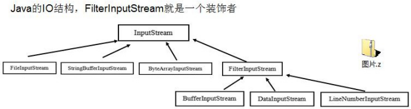</td></tr></table>&nbsp;

源码说明

 

    
&nbsp;

    <table class=MsoNormalTable border=1 cellspacing=0 style="border-collapse:collapse;margin-left:10.9000pt;mso-table-layout-alt:fixed;
border:none;mso-border-left-alt:0.5000pt solid rgb(0,0,0);mso-border-top-alt:0.5000pt solid rgb(0,0,0);
mso-border-right-alt:0.5000pt solid rgb(0,0,0);mso-border-bottom-alt:0.5000pt solid rgb(0,0,0);mso-border-insideh:0.5000pt solid rgb(0,0,0);
mso-border-insidev:0.5000pt solid rgb(0,0,0);mso-padding-alt:0.0000pt 0.0000pt 0.0000pt 0.0000pt ;">
        <tr style="height:608.4000pt;">
            <td width=808 valign=top style="width:606.0000pt;padding:0.0000pt 0.0000pt 0.0000pt 0.0000pt ;border-left:1.0000pt solid rgb(0,0,0);
mso-border-left-alt:0.5000pt solid rgb(0,0,0);border-right:1.0000pt solid rgb(0,0,0);mso-border-right-alt:0.5000pt solid rgb(0,0,0);
border-top:1.0000pt solid rgb(0,0,0);mso-border-top-alt:0.5000pt solid rgb(0,0,0);border-bottom:1.0000pt solid rgb(0,0,0);
mso-border-bottom-alt:0.5000pt solid rgb(0,0,0);">
package com.atguigu.jdk;

                
&nbsp;
                

                
&nbsp;

                
import java.io.DataInputStream; import java.io.FileInputStream; import java.io.InputStream;

                
&nbsp;
                

                
public class Decorator {

                
&nbsp;
                

                
&nbsp;

                
public static void main(String[] args) throws Exception{

                
// TODO Auto-generated method stub

                
&nbsp;
                

                
//说明

                
//1. InputStream &nbsp;是抽象类, &nbsp;类似我们前面讲的 Drink

                
//2.&nbsp;FileInputStream&nbsp;是&#9;InputStream &nbsp;子类，类似我们前面的&nbsp;DeCaf,&nbsp;LongBlack

                
//3.&nbsp;FilterInputStream&#9;是&#9;InputStream&nbsp;子类：类似我们前面&nbsp;的&nbsp;Decorator&nbsp;修饰者

                
//4. DataInputStream &nbsp;是 FilterInputStream &nbsp;子类，具体的修饰者，类似前面的 Milk, Soy&nbsp;等

                
//5. FilterInputStream&nbsp;类 &nbsp;有&#9;protected volatile&nbsp;InputStream in; &nbsp;即含被装饰者

                
//6.&nbsp;分析得出在 jdk 的 io 体系中，就是使用装饰者模式

                
&nbsp;
                

                
&nbsp;

                
DataInputStream dis = new DataInputStream(new FileInputStream("d:\\abc.txt")); System.out.println(dis.read());

                
dis.close();

                
}

                
&nbsp;
                

                
&nbsp;

                
}
</td>
        </tr>
    </table>

 

<h1 style="margin-left:219.4500pt;">第 12&#9;章组合模式</h1>
    <h2 style="margin-top:0.0000pt;margin-right:0.0000pt;margin-bottom:0.0000pt;
margin-left:46.9000pt;text-indent:-36.0000pt;text-align:left;
line-height:33.4500pt;mso-line-height-rule:exactly;mso-list:l104 level2 lfo131;">12.1&nbsp;看一个学校院系展示需求</h2>
    
&nbsp;
    

    
编写程序展示一个学校院系结构：需求是这样，要在一个页面中展示出学校的院系组成，一个学校有多个学院， 一个学院有多个系。如图：

    
<table cellpadding="0" cellspacing="0"><tr><td
            width="126.533" height="0"></td></tr><tr><td></td><td>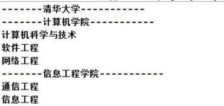</td></tr></table>&nbsp;
    

    
&nbsp;
    

    <h2 style="margin-top:0.0000pt;margin-right:0.0000pt;margin-bottom:0.0000pt;
margin-left:46.9000pt;text-indent:-36.0000pt;text-align:left;
mso-list:l104 level2 lfo131;">12.2&nbsp;<table cellpadding="0" cellspacing="0"><tr><td
            width="126.533" height="0"></td></tr><tr><td></td><td></td></tr></table>传统方案解决学校院系展示(类图)</h2>
    <h2 style="margin-top:0.6000pt;margin-right:0.0000pt;margin-bottom:0.0000pt;
margin-left:46.9000pt;text-indent:-36.0000pt;text-align:left;
mso-list:l104 level2 lfo131;">12.3&nbsp;传统方案解决学校院系展示存在的问题分析</h2>
    
&nbsp;
    

    
1)&nbsp;将学院看做是学校的子类，系是学院的子类，这样实际上是站在组织大小来进行分层次的

    
2)&nbsp;实际上我们的要求是 ：在一个页面中展示出学校的院系组成，一个学校有多个学院，一个学院有多个系， 因

 

此这种方案，不能很好实现的管理的操作，比如对学院、系的添加，删除，遍历等

    
3)&nbsp;解决方案：把学校、院、系都看做是组织结构，他们之间没有继承的关系，而是一个树形结构，可以更好的实现管理操作。 =&#62; 组合模式

    <h2 style="margin-top:0.0000pt;margin-right:0.0000pt;margin-bottom:0.0000pt;
margin-left:46.9000pt;text-indent:-36.0000pt;text-align:left;
line-height:30.8500pt;mso-line-height-rule:exactly;mso-list:l104 level2 lfo131;">12.4&nbsp;组合模式基本介绍</h2>
    
基本介绍

    
&nbsp;
    

    
1)&nbsp;组合模式（Composite&nbsp;Pattern），又叫部分整体模式，它创建了对象组的树形结构，将对象组合成树状结构以表示&#8220;整体<b>-</b>部分&#8221;的层次关系。

    
&nbsp;
    

    
2)&nbsp;组合模式依据树形结构来组合对象，用来表示部分以及整体层次。

    
3)&nbsp;这种类型的设计模式属于结构型模式。

    
4)&nbsp;组合模式使得用户对单个对象和组合对象的访问具有一致性，即：组合能让客户以一致的方式处理个别对象以及组合对象

    
&nbsp;
    

    <h2 style="margin-top:0.0000pt;margin-right:0.0000pt;margin-bottom:0.0000pt;
margin-left:46.9000pt;text-indent:-36.0000pt;text-align:left;
mso-list:l104 level2 lfo131;">12.5&nbsp;<table cellpadding="0" cellspacing="0"><tr><td
            width="99.1333" height="0"></td></tr><tr><td></td><td>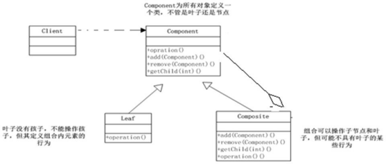</td></tr></table>组合模式原理类图</h2>
    
&nbsp;
    

    
对原理结构图的说明-即(组合模式的角色及职责)

 

1)&nbsp;<b>Component</b><b>&nbsp;</b>:这是组合中对象声明接口，在适当情况下，实现所有类共有的接口默认行为,用于访问和管理

    
Component&nbsp;子部件, Component &nbsp;可以是抽象类或者接口

    
2)&nbsp;<b>Leaf</b><b>&nbsp;: </b>在组合中表示叶子节点，叶子节点没有子节点

    
3)&nbsp;<b>Composite</b><b>&nbsp;</b>:非叶子节点， &nbsp;用于存储子部件， &nbsp;在&nbsp;Component&#9;接口中实现&nbsp;子部件的相关操作，比如增加(add), 删除。

    <h2 style="margin-top:0.0000pt;margin-right:0.0000pt;margin-bottom:0.0000pt;
margin-left:46.9000pt;text-indent:-36.0000pt;text-align:left;
line-height:30.8500pt;mso-line-height-rule:exactly;mso-list:l104 level2 lfo131;">12.6&nbsp;组合模式解决学校院系展示的 应用实例</h2>
    
应用实例要求

    
1)&nbsp;编写程序展示一个学校院系结构：需求是这样，要在一个页面中展示出学校的院系组成，一个学校有多个学院， 一个学院有多个系。

    
2)&nbsp;思路分析和图解(类图)

    
<table cellpadding="0" cellspacing="0"><tr><td width="94.5333"
                                                                                                         height="0"></td></tr><tr><td></td><td>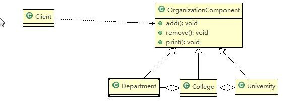</td></tr></table>&nbsp;

    
&nbsp;

    
&nbsp;

    
&nbsp;

    
3)&nbsp;代码实现

    
<table cellpadding="0" cellspacing="0"><tr><td
            width="161.533" height="0"></td></tr><tr><td></td><td></td></tr></table>&nbsp;
    

    
composite.zip

    
&nbsp;
    

    <table class=MsoNormalTable border=1 cellspacing=0 style="border-collapse:collapse;margin-left:10.9000pt;mso-table-layout-alt:fixed;
border:none;mso-border-left-alt:0.5000pt solid rgb(0,0,0);mso-border-top-alt:0.5000pt solid rgb(0,0,0);
mso-border-right-alt:0.5000pt solid rgb(0,0,0);mso-border-bottom-alt:0.5000pt solid rgb(0,0,0);mso-border-insideh:0.5000pt solid rgb(0,0,0);
mso-border-insidev:0.5000pt solid rgb(0,0,0);mso-padding-alt:0.0000pt 0.0000pt 0.0000pt 0.0000pt ;">
        <tr style="height:46.7000pt;">
            <td width=808 valign=top style="width:606.0000pt;padding:0.0000pt 0.0000pt 0.0000pt 0.0000pt ;border-left:1.0000pt solid rgb(0,0,0);
mso-border-left-alt:0.5000pt solid rgb(0,0,0);border-right:1.0000pt solid rgb(0,0,0);mso-border-right-alt:0.5000pt solid rgb(0,0,0);
border-top:1.0000pt solid rgb(0,0,0);mso-border-top-alt:0.5000pt solid rgb(0,0,0);border-bottom:1.0000pt solid rgb(0,0,0);
mso-border-bottom-alt:0.5000pt solid rgb(0,0,0);">
package com.atguigu.composite;
</td>
        </tr>
    </table>

 

    
&nbsp;

    <table class=MsoNormalTable border=1 cellspacing=0 style="border-collapse:collapse;margin-left:10.9000pt;mso-table-layout-alt:fixed;
border:none;mso-border-left-alt:0.5000pt solid rgb(0,0,0);mso-border-top-alt:0.5000pt solid rgb(0,0,0);
mso-border-right-alt:0.5000pt solid rgb(0,0,0);mso-border-bottom-alt:0.5000pt solid rgb(0,0,0);mso-border-insideh:0.5000pt solid rgb(0,0,0);
mso-border-insidev:0.5000pt solid rgb(0,0,0);mso-padding-alt:0.0000pt 0.0000pt 0.0000pt 0.0000pt ;">
        <tr style="height:608.3000pt;">
            <td width=808 valign=top style="width:606.0000pt;padding:0.0000pt 0.0000pt 0.0000pt 0.0000pt ;border-left:1.0000pt solid rgb(0,0,0);
mso-border-left-alt:0.5000pt solid rgb(0,0,0);border-right:1.0000pt solid rgb(0,0,0);mso-border-right-alt:0.5000pt solid rgb(0,0,0);
border-top:1.0000pt solid rgb(0,0,0);mso-border-top-alt:0.5000pt solid rgb(0,0,0);border-bottom:1.0000pt solid rgb(0,0,0);
mso-border-bottom-alt:0.5000pt solid rgb(0,0,0);">

                public class Client {

                
&nbsp;
                

                
&nbsp;

                
public static void main(String[] args) {

                
// TODO Auto-generated method stub

                
&nbsp;
                

                
//从大到小创建对象 学校

                
OrganizationComponent university = new University("清华大学", " 中国顶级大学 ");

                
&nbsp;

                
//创建 学院

                
OrganizationComponent computerCollege = new College(" 计 算 机 学 院 ", " 计 算 机 学 院 "); OrganizationComponent infoEngineercollege = new College("信息工程学院", " 信息工程学院 ");

                
&nbsp;
                

                
&nbsp;
                

                
&nbsp;

                
//创建各个学院下面的系(专业)

                
computerCollege.add(new Department("软件工程", " 软件工程不错 ")); computerCollege.add(new Department("网络工程", " 网络工程不错 "));

                
computerCollege.add(new Department("计算机科学与技术", " 计算机科学与技术是老牌的专业 "));

                
&nbsp;
                

                
&nbsp;

                
//

                
infoEngineercollege.add(new Department("通信工程", " 通信工程不好学 ")); infoEngineercollege.add(new Department("信息工程", " 信息工程好学 "));

                
&nbsp;

                
//将学院加入到 学校university.add(computerCollege); university.add(infoEngineercollege);
</td>
        </tr>
    </table>

 

    
&nbsp;

    <table class=MsoNormalTable border=1 cellspacing=0 style="border-collapse:collapse;margin-left:10.9000pt;mso-table-layout-alt:fixed;
border:none;mso-border-left-alt:0.5000pt solid rgb(0,0,0);mso-border-top-alt:0.5000pt solid rgb(0,0,0);
mso-border-right-alt:0.5000pt solid rgb(0,0,0);mso-border-bottom-alt:0.5000pt solid rgb(0,0,0);mso-border-insideh:0.5000pt solid rgb(0,0,0);
mso-border-insidev:0.5000pt solid rgb(0,0,0);mso-padding-alt:0.0000pt 0.0000pt 0.0000pt 0.0000pt ;">
        <tr style="height:140.4000pt;">
            <td width=808 valign=top style="width:606.0000pt;padding:0.0000pt 0.0000pt 0.0000pt 0.0000pt ;border-left:1.0000pt solid rgb(0,0,0);
mso-border-left-alt:0.5000pt solid rgb(0,0,0);border-right:1.0000pt solid rgb(0,0,0);mso-border-right-alt:0.5000pt solid rgb(0,0,0);
border-top:1.0000pt solid rgb(0,0,0);mso-border-top-alt:0.5000pt solid rgb(0,0,0);border-bottom:1.0000pt solid rgb(0,0,0);
mso-border-bottom-alt:0.5000pt solid rgb(0,0,0);">
//university.print(); infoEngineercollege.print();

                
}

                
&nbsp;
                

                
&nbsp;

                
}
</td>
        </tr>
        <tr style="height:467.9000pt;">
            <td width=808 valign=top style="width:606.0000pt;padding:0.0000pt 0.0000pt 0.0000pt 0.0000pt ;border-left:1.0000pt solid rgb(0,0,0);
mso-border-left-alt:0.5000pt solid rgb(0,0,0);border-right:1.0000pt solid rgb(0,0,0);mso-border-right-alt:0.5000pt solid rgb(0,0,0);
border-top:none;mso-border-top-alt:0.5000pt solid rgb(0,0,0);border-bottom:1.0000pt solid rgb(0,0,0);
mso-border-bottom-alt:0.5000pt solid rgb(0,0,0);">
package com.atguigu.composite;

                
&nbsp;
                

                
&nbsp;

                
import java.util.ArrayList; import java.util.List;

                
&nbsp;
                

                
public class College extends OrganizationComponent {

                
&nbsp;
                

                
//List&nbsp;中 存放的 Department

                
List&#60;OrganizationComponent&#62; organizationComponents = new ArrayList&#60;OrganizationComponent&#62;();

                
&nbsp;
                

                
//&nbsp;构造器

                
public College(String name, String des) { super(name, des);

                
// TODO Auto-generated constructor stub

                
}

                
&nbsp;
                

                
// 重 写 add @Override

                
protected void add(OrganizationComponent organizationComponent) {

                
// TODO Auto-generated method stub
</td>
        </tr>
    </table>

 

    
&nbsp;

    <table class=MsoNormalTable border=1 cellspacing=0 style="border-collapse:collapse;margin-left:10.9000pt;mso-table-layout-alt:fixed;
border:none;mso-border-left-alt:0.5000pt solid rgb(0,0,0);mso-border-top-alt:0.5000pt solid rgb(0,0,0);
mso-border-right-alt:0.5000pt solid rgb(0,0,0);mso-border-bottom-alt:0.5000pt solid rgb(0,0,0);mso-border-insideh:0.5000pt solid rgb(0,0,0);
mso-border-insidev:0.5000pt solid rgb(0,0,0);mso-padding-alt:0.0000pt 0.0000pt 0.0000pt 0.0000pt ;">
        <tr style="height:608.3000pt;">
            <td width=808 valign=top style="width:606.0000pt;padding:0.0000pt 0.0000pt 0.0000pt 0.0000pt ;border-left:1.0000pt solid rgb(0,0,0);
mso-border-left-alt:0.5000pt solid rgb(0,0,0);border-right:1.0000pt solid rgb(0,0,0);mso-border-right-alt:0.5000pt solid rgb(0,0,0);
border-top:1.0000pt solid rgb(0,0,0);mso-border-top-alt:0.5000pt solid rgb(0,0,0);border-bottom:1.0000pt solid rgb(0,0,0);
mso-border-bottom-alt:0.5000pt solid rgb(0,0,0);">

                //&#9;将来实际业务中，Colleage &nbsp;的 &nbsp;add &nbsp;和&#9;University add&nbsp;不一定完全一样

                
organizationComponents.add(organizationComponent);

                
}

                
&nbsp;
                

                
// 重 写 remove @Override

                
protected void remove(OrganizationComponent organizationComponent) {

                
// TODO Auto-generated method stub organizationComponents.remove(organizationComponent);

                
}

                
&nbsp;
                

                
&nbsp;

                
@Override

                
public String getName() {

                
// TODO Auto-generated method stub return super.getName();

                
}

                
&nbsp;
                

                
&nbsp;

                
@Override

                
public String getDes() {

                
// TODO Auto-generated method stub return super.getDes();

                
}

                
&nbsp;
                

                
// print 方法，就是输出 University &nbsp;包含的学院

                
@Override

                
protected void print() {
</td>
        </tr>
    </table>

 

    
&nbsp;

    <table class=MsoNormalTable border=1 cellspacing=0 style="border-collapse:collapse;margin-left:10.9000pt;mso-table-layout-alt:fixed;
border:none;mso-border-left-alt:0.5000pt solid rgb(0,0,0);mso-border-top-alt:0.5000pt solid rgb(0,0,0);
mso-border-right-alt:0.5000pt solid rgb(0,0,0);mso-border-bottom-alt:0.5000pt solid rgb(0,0,0);mso-border-insideh:0.5000pt solid rgb(0,0,0);
mso-border-insidev:0.5000pt solid rgb(0,0,0);mso-padding-alt:0.0000pt 0.0000pt 0.0000pt 0.0000pt ;">
        <tr style="height:257.4000pt;">
            <td width=808 valign=top style="width:606.0000pt;padding:0.0000pt 0.0000pt 0.0000pt 0.0000pt ;border-left:1.0000pt solid rgb(0,0,0);
mso-border-left-alt:0.5000pt solid rgb(0,0,0);border-right:1.0000pt solid rgb(0,0,0);mso-border-right-alt:0.5000pt solid rgb(0,0,0);
border-top:1.0000pt solid rgb(0,0,0);mso-border-top-alt:0.5000pt solid rgb(0,0,0);border-bottom:1.0000pt solid rgb(0,0,0);
mso-border-bottom-alt:0.5000pt solid rgb(0,0,0);">
// TODO Auto-generated method stub

                
System.out.println("--------------" + getName() + "--------------");

                
//遍历 organizationComponents

                
for (OrganizationComponent organizationComponent : organizationComponents) { organizationComponent.print();

                
}

                
}

                
&nbsp;
                

                
&nbsp;
                

                
&nbsp;
                

                
}
</td>
        </tr>
        <tr style="height:350.9000pt;">
            <td width=808 valign=top style="width:606.0000pt;padding:0.0000pt 0.0000pt 0.0000pt 0.0000pt ;border-left:1.0000pt solid rgb(0,0,0);
mso-border-left-alt:0.5000pt solid rgb(0,0,0);border-right:1.0000pt solid rgb(0,0,0);mso-border-right-alt:0.5000pt solid rgb(0,0,0);
border-top:none;mso-border-top-alt:0.5000pt solid rgb(0,0,0);border-bottom:1.0000pt solid rgb(0,0,0);
mso-border-bottom-alt:0.5000pt solid rgb(0,0,0);">
package com.atguigu.composite;

                
&nbsp;
                

                
&nbsp;

                
public class Department extends OrganizationComponent {

                
&nbsp;
                

                
//没有集合

                
&nbsp;
                

                
&nbsp;

                
public Department(String name, String des) { super(name, des);

                
// TODO Auto-generated constructor stub

                
}

                
&nbsp;
                

                
&nbsp;
                

                
&nbsp;

                
//add , remove 就不用写了，因为他是叶子节点

                
&nbsp;
                

                
&nbsp;

                
@Override
</td>
        </tr>
    </table>

 

    
&nbsp;

    <table class=MsoNormalTable border=1 cellspacing=0 style="border-collapse:collapse;margin-left:10.9000pt;mso-table-layout-alt:fixed;
border:none;mso-border-left-alt:0.5000pt solid rgb(0,0,0);mso-border-top-alt:0.5000pt solid rgb(0,0,0);
mso-border-right-alt:0.5000pt solid rgb(0,0,0);mso-border-bottom-alt:0.5000pt solid rgb(0,0,0);mso-border-insideh:0.5000pt solid rgb(0,0,0);
mso-border-insidev:0.5000pt solid rgb(0,0,0);mso-padding-alt:0.0000pt 0.0000pt 0.0000pt 0.0000pt ;">
        <tr style="height:444.6000pt;">
            <td width=808 valign=top style="width:606.0000pt;padding:0.0000pt 0.0000pt 0.0000pt 0.0000pt ;border-left:1.0000pt solid rgb(0,0,0);
mso-border-left-alt:0.5000pt solid rgb(0,0,0);border-right:1.0000pt solid rgb(0,0,0);mso-border-right-alt:0.5000pt solid rgb(0,0,0);
border-top:1.0000pt solid rgb(0,0,0);mso-border-top-alt:0.5000pt solid rgb(0,0,0);border-bottom:1.0000pt solid rgb(0,0,0);
mso-border-bottom-alt:0.5000pt solid rgb(0,0,0);">
public String getName() {

                
// TODO Auto-generated method stub return super.getName();

                
}

                
&nbsp;
                

                
&nbsp;

                
@Override

                
public String getDes() {

                
// TODO Auto-generated method stub return super.getDes();

                
}

                
&nbsp;
                

                
&nbsp;

                
@Override

                
protected void print() {

                
// TODO Auto-generated method stub System.out.println(getName());

                
}

                
&nbsp;
                

                
&nbsp;

                
}
</td>
        </tr>
        <tr style="height:163.7000pt;">
            <td width=808 valign=top style="width:606.0000pt;padding:0.0000pt 0.0000pt 0.0000pt 0.0000pt ;border-left:1.0000pt solid rgb(0,0,0);
mso-border-left-alt:0.5000pt solid rgb(0,0,0);border-right:1.0000pt solid rgb(0,0,0);mso-border-right-alt:0.5000pt solid rgb(0,0,0);
border-top:none;mso-border-top-alt:0.5000pt solid rgb(0,0,0);border-bottom:1.0000pt solid rgb(0,0,0);
mso-border-bottom-alt:0.5000pt solid rgb(0,0,0);">
package&nbsp;com.atguigu.composite;

                
public abstract class OrganizationComponent&nbsp;{ private String name; //&nbsp;名 字

                
private String des; // 说 明
</td>
        </tr>
    </table>

 

    
&nbsp;

    <table class=MsoNormalTable border=1 cellspacing=0 style="border-collapse:collapse;margin-left:10.9000pt;mso-table-layout-alt:fixed;
border:none;mso-border-left-alt:0.5000pt solid rgb(0,0,0);mso-border-top-alt:0.5000pt solid rgb(0,0,0);
mso-border-right-alt:0.5000pt solid rgb(0,0,0);mso-border-bottom-alt:0.5000pt solid rgb(0,0,0);mso-border-insideh:0.5000pt solid rgb(0,0,0);
mso-border-insidev:0.5000pt solid rgb(0,0,0);mso-padding-alt:0.0000pt 0.0000pt 0.0000pt 0.0000pt ;">
        <tr style="height:608.3000pt;">
            <td width=808 valign=top style="width:606.0000pt;padding:0.0000pt 0.0000pt 0.0000pt 0.0000pt ;border-left:1.0000pt solid rgb(0,0,0);
mso-border-left-alt:0.5000pt solid rgb(0,0,0);border-right:1.0000pt solid rgb(0,0,0);mso-border-right-alt:0.5000pt solid rgb(0,0,0);
border-top:1.0000pt solid rgb(0,0,0);mso-border-top-alt:0.5000pt solid rgb(0,0,0);border-bottom:1.0000pt solid rgb(0,0,0);
mso-border-bottom-alt:0.5000pt solid rgb(0,0,0);">
protected&#9;void add(OrganizationComponent organizationComponent)&nbsp;{

                
//默认实现

                
throw new UnsupportedOperationException();

                
}

                
&nbsp;
                

                
&nbsp;

                
protected&#9;void remove(OrganizationComponent organizationComponent)&nbsp;{

                
//默认实现

                
throw new UnsupportedOperationException();

                
}

                
&nbsp;
                

                
//构造器

                
public OrganizationComponent(String name, String des) { super();

                
this.name = name; this.des = des;

                
}

                
&nbsp;
                

                
&nbsp;

                
public String getName() { return name;

                
}

                
&nbsp;
                

                
&nbsp;

                
public void setName(String name) { this.name = name;

                
}

                
&nbsp;
                

                
&nbsp;

                
public String getDes() {
</td>
        </tr>
    </table>

 

    
&nbsp;

    <table class=MsoNormalTable border=1 cellspacing=0 style="border-collapse:collapse;margin-left:10.9000pt;mso-table-layout-alt:fixed;
border:none;mso-border-left-alt:0.5000pt solid rgb(0,0,0);mso-border-top-alt:0.5000pt solid rgb(0,0,0);
mso-border-right-alt:0.5000pt solid rgb(0,0,0);mso-border-bottom-alt:0.5000pt solid rgb(0,0,0);mso-border-insideh:0.5000pt solid rgb(0,0,0);
mso-border-insidev:0.5000pt solid rgb(0,0,0);mso-padding-alt:0.0000pt 0.0000pt 0.0000pt 0.0000pt ;">
        <tr style="height:304.2000pt;">
            <td width=808 valign=top style="width:606.0000pt;padding:0.0000pt 0.0000pt 0.0000pt 0.0000pt ;border-left:1.0000pt solid rgb(0,0,0);
mso-border-left-alt:0.5000pt solid rgb(0,0,0);border-right:1.0000pt solid rgb(0,0,0);mso-border-right-alt:0.5000pt solid rgb(0,0,0);
border-top:1.0000pt solid rgb(0,0,0);mso-border-top-alt:0.5000pt solid rgb(0,0,0);border-bottom:1.0000pt solid rgb(0,0,0);
mso-border-bottom-alt:0.5000pt solid rgb(0,0,0);">
return des;

                
}

                
&nbsp;
                

                
&nbsp;

                
public void setDes(String des) { this.des = des;

                
}

                
&nbsp;
                

                
//方法 print, &nbsp;做成抽象的, &nbsp;子类都需要实现

                
protected abstract void print();

                
&nbsp;
                

                
&nbsp;
                

                
&nbsp;
                

                
}
</td>
        </tr>
        <tr style="height:304.6000pt;">
            <td width=808 valign=top style="width:606.0000pt;padding:0.0000pt 0.0000pt 0.0000pt 0.0000pt ;border-left:1.0000pt solid rgb(0,0,0);
mso-border-left-alt:0.5000pt solid rgb(0,0,0);border-right:1.0000pt solid rgb(0,0,0);mso-border-right-alt:0.5000pt solid rgb(0,0,0);
border-top:none;mso-border-top-alt:0.5000pt solid rgb(0,0,0);border-bottom:1.0000pt solid rgb(0,0,0);
mso-border-bottom-alt:0.5000pt solid rgb(0,0,0);">
package com.atguigu.composite;

                
&nbsp;
                

                
&nbsp;

                
import java.util.ArrayList; import java.util.List;

                
&nbsp;

                
//University&nbsp;就是 Composite , &nbsp;可以管理 College

                
public class University extends OrganizationComponent {

                
&nbsp;
                

                
&nbsp;

                
List&#60;OrganizationComponent&#62; organizationComponents = new ArrayList&#60;OrganizationComponent&#62;();

                
&nbsp;
                

                
//&nbsp;构造器

                
public University(String name, String des) {

                
super(name, des);
</td>
        </tr>
    </table>

 

    
&nbsp;

    <table class=MsoNormalTable border=1 cellspacing=0 style="border-collapse:collapse;margin-left:10.9000pt;mso-table-layout-alt:fixed;
border:none;mso-border-left-alt:0.5000pt solid rgb(0,0,0);mso-border-top-alt:0.5000pt solid rgb(0,0,0);
mso-border-right-alt:0.5000pt solid rgb(0,0,0);mso-border-bottom-alt:0.5000pt solid rgb(0,0,0);mso-border-insideh:0.5000pt solid rgb(0,0,0);
mso-border-insidev:0.5000pt solid rgb(0,0,0);mso-padding-alt:0.0000pt 0.0000pt 0.0000pt 0.0000pt ;">
        <tr style="height:608.8000pt;">
            <td width=808 valign=top style="width:606.0000pt;padding:0.0000pt 0.0000pt 0.0000pt 0.0000pt ;border-left:1.0000pt solid rgb(0,0,0);
mso-border-left-alt:0.5000pt solid rgb(0,0,0);border-right:1.0000pt solid rgb(0,0,0);mso-border-right-alt:0.5000pt solid rgb(0,0,0);
border-top:1.0000pt solid rgb(0,0,0);mso-border-top-alt:0.5000pt solid rgb(0,0,0);border-bottom:1.0000pt solid rgb(0,0,0);
mso-border-bottom-alt:0.5000pt solid rgb(0,0,0);">
// TODO Auto-generated constructor stub

                
}

                
&nbsp;
                

                
// 重 写 add @Override

                
protected void add(OrganizationComponent organizationComponent) {

                
// TODO Auto-generated method stub organizationComponents.add(organizationComponent);

                
}

                
&nbsp;
                

                
// 重 写 remove @Override

                
protected void remove(OrganizationComponent organizationComponent) {

                
// TODO Auto-generated method stub organizationComponents.remove(organizationComponent);

                
}

                
&nbsp;
                

                
&nbsp;

                
@Override

                
public String getName() {

                
// TODO Auto-generated method stub return super.getName();

                
}

                
&nbsp;
                

                
&nbsp;

                
@Override

                
public String getDes() {

                
// TODO Auto-generated method stub
</td>
        </tr>
    </table>

 

    
&nbsp;

    <table class=MsoNormalTable border=1 cellspacing=0 style="border-collapse:collapse;margin-left:10.9000pt;mso-table-layout-alt:fixed;
border:none;mso-border-left-alt:0.5000pt solid rgb(0,0,0);mso-border-top-alt:0.5000pt solid rgb(0,0,0);
mso-border-right-alt:0.5000pt solid rgb(0,0,0);mso-border-bottom-alt:0.5000pt solid rgb(0,0,0);mso-border-insideh:0.5000pt solid rgb(0,0,0);
mso-border-insidev:0.5000pt solid rgb(0,0,0);mso-padding-alt:0.0000pt 0.0000pt 0.0000pt 0.0000pt ;">
        <tr style="height:374.4000pt;">
            <td width=808 valign=top style="width:606.0000pt;padding:0.0000pt 0.0000pt 0.0000pt 0.0000pt ;border-left:1.0000pt solid rgb(0,0,0);
mso-border-left-alt:0.5000pt solid rgb(0,0,0);border-right:1.0000pt solid rgb(0,0,0);mso-border-right-alt:0.5000pt solid rgb(0,0,0);
border-top:1.0000pt solid rgb(0,0,0);mso-border-top-alt:0.5000pt solid rgb(0,0,0);border-bottom:1.0000pt solid rgb(0,0,0);
mso-border-bottom-alt:0.5000pt solid rgb(0,0,0);">
return super.getDes();

                
}

                
&nbsp;
                

                
// print 方法，就是输出 University &nbsp;包含的学院

                
@Override

                
protected void print() {

                
// TODO Auto-generated method stub

                
System.out.println("--------------" + getName() + "--------------");

                
//遍历 organizationComponents

                
for (OrganizationComponent organizationComponent : organizationComponents) { organizationComponent.print();

                
}

                
}

                
&nbsp;
                

                
&nbsp;

                
}
</td>
        </tr>
    </table>
    
&nbsp;

    
&nbsp;

    
&nbsp;

    
&nbsp;

    
&nbsp;

    
&nbsp;

    <h2 style="margin-top:0.0000pt;margin-right:0.0000pt;margin-bottom:0.0000pt;
margin-left:46.9000pt;text-indent:-36.0000pt;text-align:left;
line-height:29.5000pt;mso-line-height-rule:exactly;mso-list:l104 level2 lfo131;">12.7&nbsp;组合模式在 JDK&nbsp;集合的源码分析</h2>
    
&nbsp;
    

    
1)&nbsp;Java&nbsp;的集合类-<b>HashMap </b>就使用了组合模式

    
2)&nbsp;代码分析+Debug&nbsp;源码

 

    
&nbsp;
    

    
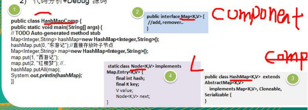&nbsp;
    

    
3)&nbsp;<table cellpadding="0" cellspacing="0"><tr><td
            width="126.533" height="0"></td></tr><tr><td></td><td>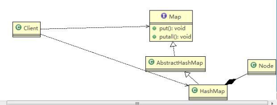</td></tr></table>类图

    <h2 style="margin-top:2.6000pt;margin-right:0.0000pt;margin-bottom:0.0000pt;
margin-left:46.9000pt;text-indent:-36.0000pt;text-align:left;
mso-list:l104 level2 lfo131;">12.8&nbsp;组合模式的注意事项和细节</h2>
    
&nbsp;
    

    
1)&nbsp;简化客户端操作。客户端只需要面对一致的对象而不用考虑整体部分或者节点叶子的问题。

    
2)&nbsp;具有较强的扩展性。当我们要更改组合对象时，我们只需要调整内部的层次关系，客户端不用做出任何改动.

    
3)&nbsp;方便创建出复杂的层次结构。客户端不用理会组合里面的组成细节，容易添加节点或者叶子从而创建出复杂的树形结构

    
4)&nbsp;需要遍历组织机构，或者处理的对象具有树形结构时, 非常适合使用组合模式.

    
5)&nbsp;要求较高的抽象性，如果节点和叶子有很多差异性的话，比如很多方法和属性都不一样，不适合使用组合模式

 

<h1 align=center style="margin-right:17.9500pt;text-align:center;line-height:42.3000pt;
mso-line-height-rule:exactly;">第 13&#9;章外观模式</h1>
    <h2 style="margin-top:0.0000pt;margin-right:0.0000pt;margin-bottom:0.0000pt;
margin-left:46.9000pt;text-indent:-36.0000pt;text-align:left;
line-height:31.9000pt;mso-line-height-rule:exactly;mso-list:l168 level2 lfo138;">13.1&nbsp;影院管理项目</h2>
    
组建一个家庭影院：

    
DVD 播放器、投影仪、自动屏幕、环绕立体声、爆米花机,要求完成使用家庭影院的功能，其过程为： 直接用遥控器：统筹各设备开关

    
开爆米花机放 下 屏 幕 开 投 影 仪 开音响

    
开 DVD，选 dvd

    
去拿爆米花调 暗 灯 光 播放

    
观影结束后，关闭各种设备

    <h2 style="margin-top:0.0000pt;margin-right:0.0000pt;margin-bottom:0.0000pt;
margin-left:46.9000pt;text-indent:-36.0000pt;text-align:left;
line-height:32.6500pt;mso-line-height-rule:exactly;mso-list:l168 level2 lfo138;">13.2&nbsp;传统方式解决影院管理</h2>
    
<table cellpadding="0" cellspacing="0"><tr><td
            width="126.533" height="0"></td></tr><tr><td></td><td></td></tr></table>&nbsp;
    

 

    
&nbsp;
    

    <h2 style="margin-top:0.0000pt;margin-right:0.0000pt;margin-bottom:0.0000pt;
margin-left:46.9000pt;text-indent:-36.0000pt;text-align:left;
line-height:28.4000pt;mso-line-height-rule:exactly;mso-list:l168 level2 lfo138;">13.3&nbsp;传统方式解决影院管理问题分析</h2>
    
1)&nbsp;在 ClientTest&nbsp;的 main&nbsp;方法中，创建各个子系统的对象，并直接去调用子系统(对象)相关方法，会造成调用过程混乱，没有清晰的过程

    
2)&nbsp;不利于在 ClientTest&nbsp;中，去维护对子系统的操作

    
3)&nbsp;解决思路：定义一个高层接口，给子系统中的一组接口提供一个一致的界面(比如在高层接口提供四个方法

    
ready, play, pause, end )，用来访问子系统中的一群接口

    
4)&nbsp;也就是说 就是通过定义一个一致的接口(界面类)，用以屏蔽内部子系统的细节，使得调用端只需跟这个接口发生调用，而无需关心这个子系统的内部细节 =&#62; 外观模式

    <h2 style="margin-top:0.0000pt;margin-right:0.0000pt;margin-bottom:0.0000pt;
margin-left:46.9000pt;text-indent:-36.0000pt;text-align:left;
line-height:30.8500pt;mso-line-height-rule:exactly;mso-list:l168 level2 lfo138;">13.4&nbsp;外观模式基本介绍</h2>
    
基本介绍

    
&nbsp;
    

    
1)&nbsp;外观模式（Facade），也叫&#8220;过程模式：外观模式为子系统中的一组接口提供一个一致的界面，此模式定义了一个高层接口，这个接口使得这一子系统更加容易使用

    
2)&nbsp;外观模式通过定义一个一致的接口，用以屏蔽内部子系统的细节，使得调用端只需跟这个接口发生调用，而无需关心这个子系统的内部细节

    
&nbsp;
    

    <h2 style="margin-top:0.0000pt;margin-right:0.0000pt;margin-bottom:0.0000pt;
margin-left:46.9000pt;text-indent:-36.0000pt;text-align:left;
mso-list:l168 level2 lfo138;">13.5&nbsp;<table cellpadding="0" cellspacing="0"><tr><td
            width="94.5333" height="0"></td></tr><tr><td></td><td>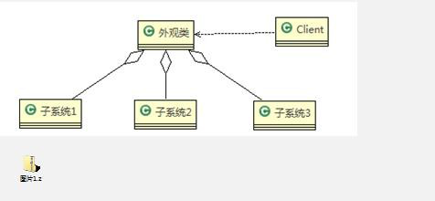</td></tr></table>外观模式原理类图</h2>

 

&#216;&nbsp;对类图说明(分类外观模式的角色)

    
1)&nbsp;外观类(Facade): 为调用端提供统一的调用接口, 外观类知道哪些子系统负责处理请求,从而将调用端的请求代理给适当子系统对象

    
2)&nbsp;调用者(Client): 外观接口的调用者

    
3)&nbsp;子系统的集合：指模块或者子系统，处理 Facade&nbsp;对象指派的任务，他是功能的实际提供者

    
&nbsp;
    

    <h2 style="margin-top:0.0500pt;margin-right:0.0000pt;margin-bottom:0.0000pt;
margin-left:46.9000pt;text-indent:-36.0000pt;text-align:left;
line-height:33.0500pt;mso-line-height-rule:exactly;mso-list:l168 level2 lfo138;">13.6&nbsp;外观模式解决影院管理</h2>
    <h3 style="margin-top:0.0000pt;margin-right:0.0000pt;margin-bottom:0.0000pt;
margin-left:73.9000pt;text-indent:-48.8500pt;text-align:left;
line-height:30.9500pt;mso-line-height-rule:exactly;mso-list:l168 level3 lfo138;">13.6.1&nbsp;传统方式解决影院管理说明</h3>
    
&nbsp;
    

    
1)&nbsp;外观模式可以理解为转换一群接口，客户只要调用一个接口，而不用调用多个接口才能达到目的。比如：在 pc 上安装软件的时候经常有一键安装选项（省去选择安装目录、安装的组件等等），还有就是手机的重启功能（把关机和启动合为一个操作）。

    
2)&nbsp;外观模式就是解决多个复杂接口带来的使用困难，起到简化用户操作的作用

    
3)&nbsp;示意图说明

    
<table cellpadding="0" cellspacing="0"><tr><td
            width="98.7333" height="0"></td></tr><tr><td></td><td>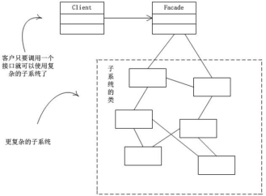</td></tr></table>&nbsp;
    

    <h3 style="margin-top:11.3000pt;margin-right:0.0000pt;margin-bottom:0.0000pt;
margin-left:73.9000pt;text-indent:-48.8500pt;text-align:left;
mso-list:l168 level3 lfo138;">13.6.2&nbsp;外观模式应用实例</h3>

 

1)&nbsp;应用实例要求

    
2)&nbsp;使用外观模式来完成家庭影院项目

    
3)&nbsp;<table cellpadding="0" cellspacing="0"><tr><td
            width="122.533" height="0"></td></tr><tr><td></td><td>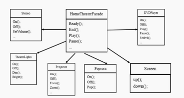</td></tr></table>思路分析和图解(类图)

    
4)&nbsp;代码实现

    
&nbsp;
    

    
facade.zip

    
&nbsp;
    

    <table class=MsoNormalTable border=1 cellspacing=0 style="border-collapse:collapse;margin-left:10.9000pt;mso-table-layout-alt:fixed;
border:none;mso-border-left-alt:0.5000pt solid rgb(0,0,0);mso-border-top-alt:0.5000pt solid rgb(0,0,0);
mso-border-right-alt:0.5000pt solid rgb(0,0,0);mso-border-bottom-alt:0.5000pt solid rgb(0,0,0);mso-border-insideh:0.5000pt solid rgb(0,0,0);
mso-border-insidev:0.5000pt solid rgb(0,0,0);mso-padding-alt:0.0000pt 0.0000pt 0.0000pt 0.0000pt ;">
        <tr style="height:304.0500pt;">
            <td width=808 valign=top style="width:606.0000pt;padding:0.0000pt 0.0000pt 0.0000pt 0.0000pt ;border-left:1.0000pt solid rgb(0,0,0);
mso-border-left-alt:0.5000pt solid rgb(0,0,0);border-right:1.0000pt solid rgb(0,0,0);mso-border-right-alt:0.5000pt solid rgb(0,0,0);
border-top:1.0000pt solid rgb(0,0,0);mso-border-top-alt:0.5000pt solid rgb(0,0,0);border-bottom:1.0000pt solid rgb(0,0,0);
mso-border-bottom-alt:0.5000pt solid rgb(0,0,0);">
package com.atguigu.facade;

                
&nbsp;

                
public class Client {

                
&nbsp;

                
public static void main(String[] args) {

                
// TODO Auto-generated method stub

                
//这里直接调用。。 很麻烦

                
HomeTheaterFacade homeTheaterFacade = new HomeTheaterFacade(); homeTheaterFacade.ready();

                
homeTheaterFacade.play();

                
&nbsp;

                
&nbsp;

                
homeTheaterFacade.end();
</td>
        </tr>
    </table>

 

    
&nbsp;

    <table class=MsoNormalTable border=1 cellspacing=0 style="border-collapse:collapse;margin-left:10.9000pt;mso-table-layout-alt:fixed;
border:none;mso-border-left-alt:0.5000pt solid rgb(0,0,0);mso-border-top-alt:0.5000pt solid rgb(0,0,0);
mso-border-right-alt:0.5000pt solid rgb(0,0,0);mso-border-bottom-alt:0.5000pt solid rgb(0,0,0);mso-border-insideh:0.5000pt solid rgb(0,0,0);
mso-border-insidev:0.5000pt solid rgb(0,0,0);mso-padding-alt:0.0000pt 0.0000pt 0.0000pt 0.0000pt ;">
        <tr style="height:93.6000pt;">
            <td width=808 valign=top style="width:606.0000pt;padding:0.0000pt 0.0000pt 0.0000pt 0.0000pt ;border-left:1.0000pt solid rgb(0,0,0);
mso-border-left-alt:0.5000pt solid rgb(0,0,0);border-right:1.0000pt solid rgb(0,0,0);mso-border-right-alt:0.5000pt solid rgb(0,0,0);
border-top:1.0000pt solid rgb(0,0,0);mso-border-top-alt:0.5000pt solid rgb(0,0,0);border-bottom:1.0000pt solid rgb(0,0,0);
mso-border-bottom-alt:0.5000pt solid rgb(0,0,0);">
}

                
&nbsp;
                

                
&nbsp;

                
}
</td>
        </tr>
        <tr style="height:514.7000pt;">
            <td width=808 valign=top style="width:606.0000pt;padding:0.0000pt 0.0000pt 0.0000pt 0.0000pt ;border-left:1.0000pt solid rgb(0,0,0);
mso-border-left-alt:0.5000pt solid rgb(0,0,0);border-right:1.0000pt solid rgb(0,0,0);mso-border-right-alt:0.5000pt solid rgb(0,0,0);
border-top:none;mso-border-top-alt:0.5000pt solid rgb(0,0,0);border-bottom:1.0000pt solid rgb(0,0,0);
mso-border-bottom-alt:0.5000pt solid rgb(0,0,0);">
package com.atguigu.facade;

                
&nbsp;
                

                
&nbsp;

                
public class DVDPlayer {

                
&nbsp;
                

                
//使用单例模式, 使用饿汉式

                
private static DVDPlayer instance = new DVDPlayer();

                
&nbsp;
                

                
&nbsp;

                
public static DVDPlayer getInstanc() { return instance;

                
}

                
&nbsp;
                

                
&nbsp;

                
public void on() { System.out.println(" dvd on&nbsp;");

                
}

                
public void off() { System.out.println(" dvd off&nbsp;");

                
}

                
&nbsp;
                

                
&nbsp;

                
public void play() {

                
System.out.println(" dvd is playing ");

                
}
</td>
        </tr>
    </table>

 

    
&nbsp;

    <table class=MsoNormalTable border=1 cellspacing=0 style="border-collapse:collapse;margin-left:10.9000pt;mso-table-layout-alt:fixed;
border:none;mso-border-left-alt:0.5000pt solid rgb(0,0,0);mso-border-top-alt:0.5000pt solid rgb(0,0,0);
mso-border-right-alt:0.5000pt solid rgb(0,0,0);mso-border-bottom-alt:0.5000pt solid rgb(0,0,0);mso-border-insideh:0.5000pt solid rgb(0,0,0);
mso-border-insidev:0.5000pt solid rgb(0,0,0);mso-padding-alt:0.0000pt 0.0000pt 0.0000pt 0.0000pt ;">
        <tr style="height:140.4000pt;">
            <td width=808 valign=top style="width:606.0000pt;padding:0.0000pt 0.0000pt 0.0000pt 0.0000pt ;border-left:1.0000pt solid rgb(0,0,0);
mso-border-left-alt:0.5000pt solid rgb(0,0,0);border-right:1.0000pt solid rgb(0,0,0);mso-border-right-alt:0.5000pt solid rgb(0,0,0);
border-top:1.0000pt solid rgb(0,0,0);mso-border-top-alt:0.5000pt solid rgb(0,0,0);border-bottom:1.0000pt solid rgb(0,0,0);
mso-border-bottom-alt:0.5000pt solid rgb(0,0,0);">
//....

                
public void pause() { System.out.println(" dvd pause ..");

                
}

                
}
</td>
        </tr>
        <tr style="height:467.9000pt;">
            <td width=808 valign=top style="width:606.0000pt;padding:0.0000pt 0.0000pt 0.0000pt 0.0000pt ;border-left:1.0000pt solid rgb(0,0,0);
mso-border-left-alt:0.5000pt solid rgb(0,0,0);border-right:1.0000pt solid rgb(0,0,0);mso-border-right-alt:0.5000pt solid rgb(0,0,0);
border-top:none;mso-border-top-alt:0.5000pt solid rgb(0,0,0);border-bottom:1.0000pt solid rgb(0,0,0);
mso-border-bottom-alt:0.5000pt solid rgb(0,0,0);">
package com.atguigu.facade;

                
&nbsp;
                

                
&nbsp;

                
public class HomeTheaterFacade {

                
&nbsp;
                

                
//定义各个子系统对象

                
private TheaterLight theaterLight; private Popcorn popcorn;

                
private Stereo stereo; private Projector projector; private Screen screen;

                
private DVDPlayer dVDPlayer;

                
&nbsp;
                

                
&nbsp;
                

                
&nbsp;

                
//构造器

                
public HomeTheaterFacade() { super();

                
this.theaterLight = TheaterLight.getInstance(); this.popcorn = Popcorn.getInstance(); this.stereo = Stereo.getInstance();

                
this.projector = Projector.getInstance();
</td>
        </tr>
    </table>

 

    
&nbsp;

    <table class=MsoNormalTable border=1 cellspacing=0 style="border-collapse:collapse;margin-left:10.9000pt;mso-table-layout-alt:fixed;
border:none;mso-border-left-alt:0.5000pt solid rgb(0,0,0);mso-border-top-alt:0.5000pt solid rgb(0,0,0);
mso-border-right-alt:0.5000pt solid rgb(0,0,0);mso-border-bottom-alt:0.5000pt solid rgb(0,0,0);mso-border-insideh:0.5000pt solid rgb(0,0,0);
mso-border-insidev:0.5000pt solid rgb(0,0,0);mso-padding-alt:0.0000pt 0.0000pt 0.0000pt 0.0000pt ;">
        <tr style="height:608.3000pt;">
            <td width=808 valign=top style="width:606.0000pt;padding:0.0000pt 0.0000pt 0.0000pt 0.0000pt ;border-left:1.0000pt solid rgb(0,0,0);
mso-border-left-alt:0.5000pt solid rgb(0,0,0);border-right:1.0000pt solid rgb(0,0,0);mso-border-right-alt:0.5000pt solid rgb(0,0,0);
border-top:1.0000pt solid rgb(0,0,0);mso-border-top-alt:0.5000pt solid rgb(0,0,0);border-bottom:1.0000pt solid rgb(0,0,0);
mso-border-bottom-alt:0.5000pt solid rgb(0,0,0);">
this.screen = Screen.getInstance(); this.dVDPlayer = DVDPlayer.getInstanc();

                
}

                
&nbsp;
                

                
//操作分成 4 &nbsp;步

                
&nbsp;
                

                
&nbsp;

                
public void ready() { popcorn.on(); popcorn.pop(); screen.down(); projector.on(); stereo.on(); dVDPlayer.on(); theaterLight.dim();

                
}

                
&nbsp;
                

                
&nbsp;

                
public void play() { dVDPlayer.play();

                
}

                
&nbsp;
                

                
&nbsp;

                
public void pause() { dVDPlayer.pause();

                
}

                
&nbsp;
                

                
public void end() { popcorn.off();
</td>
        </tr>
    </table>

 

    
&nbsp;

    <table class=MsoNormalTable border=1 cellspacing=0 style="border-collapse:collapse;margin-left:10.9000pt;mso-table-layout-alt:fixed;
border:none;mso-border-left-alt:0.5000pt solid rgb(0,0,0);mso-border-top-alt:0.5000pt solid rgb(0,0,0);
mso-border-right-alt:0.5000pt solid rgb(0,0,0);mso-border-bottom-alt:0.5000pt solid rgb(0,0,0);mso-border-insideh:0.5000pt solid rgb(0,0,0);
mso-border-insidev:0.5000pt solid rgb(0,0,0);mso-padding-alt:0.0000pt 0.0000pt 0.0000pt 0.0000pt ;">
        <tr style="height:304.2000pt;">
            <td width=808 valign=top style="width:606.0000pt;padding:0.0000pt 0.0000pt 0.0000pt 0.0000pt ;border-left:1.0000pt solid rgb(0,0,0);
mso-border-left-alt:0.5000pt solid rgb(0,0,0);border-right:1.0000pt solid rgb(0,0,0);mso-border-right-alt:0.5000pt solid rgb(0,0,0);
border-top:1.0000pt solid rgb(0,0,0);mso-border-top-alt:0.5000pt solid rgb(0,0,0);border-bottom:1.0000pt solid rgb(0,0,0);
mso-border-bottom-alt:0.5000pt solid rgb(0,0,0);">
theaterLight.bright(); screen.up(); projector.off(); stereo.off(); dVDPlayer.off();

                
}

                
&nbsp;
                

                
&nbsp;
                

                
&nbsp;
                

                
&nbsp;
                

                
&nbsp;
                

                
&nbsp;
                

                
&nbsp;
                

                
&nbsp;

                
}
</td>
        </tr>
        <tr style="height:304.1000pt;">
            <td width=808 valign=top style="width:606.0000pt;padding:0.0000pt 0.0000pt 0.0000pt 0.0000pt ;border-left:1.0000pt solid rgb(0,0,0);
mso-border-left-alt:0.5000pt solid rgb(0,0,0);border-right:1.0000pt solid rgb(0,0,0);mso-border-right-alt:0.5000pt solid rgb(0,0,0);
border-top:none;mso-border-top-alt:0.5000pt solid rgb(0,0,0);border-bottom:1.0000pt solid rgb(0,0,0);
mso-border-bottom-alt:0.5000pt solid rgb(0,0,0);">
package com.atguigu.facade;

                
&nbsp;
                

                
&nbsp;

                
public class Popcorn {

                
&nbsp;
                

                
&nbsp;

                
private static Popcorn instance = new Popcorn();

                
&nbsp;
                

                
&nbsp;

                
public static Popcorn getInstance() { return instance;

                
}

                
&nbsp;
                

                
&nbsp;

                
public void on() {

                
System.out.println(" popcorn on ");

                
}
</td>
        </tr>
    </table>

 

    
&nbsp;

    <table class=MsoNormalTable border=1 cellspacing=0 style="border-collapse:collapse;margin-left:10.9000pt;mso-table-layout-alt:fixed;
border:none;mso-border-left-alt:0.5000pt solid rgb(0,0,0);mso-border-top-alt:0.5000pt solid rgb(0,0,0);
mso-border-right-alt:0.5000pt solid rgb(0,0,0);mso-border-bottom-alt:0.5000pt solid rgb(0,0,0);mso-border-insideh:0.5000pt solid rgb(0,0,0);
mso-border-insidev:0.5000pt solid rgb(0,0,0);mso-padding-alt:0.0000pt 0.0000pt 0.0000pt 0.0000pt ;">
        <tr style="height:234.0000pt;">
            <td width=808 valign=top style="width:606.0000pt;padding:0.0000pt 0.0000pt 0.0000pt 0.0000pt ;border-left:1.0000pt solid rgb(0,0,0);
mso-border-left-alt:0.5000pt solid rgb(0,0,0);border-right:1.0000pt solid rgb(0,0,0);mso-border-right-alt:0.5000pt solid rgb(0,0,0);
border-top:1.0000pt solid rgb(0,0,0);mso-border-top-alt:0.5000pt solid rgb(0,0,0);border-bottom:1.0000pt solid rgb(0,0,0);
mso-border-bottom-alt:0.5000pt solid rgb(0,0,0);">
                
&nbsp;
                

                
&nbsp;
                

                
public void off() { System.out.println(" popcorn ff&nbsp;");

                
}

                
&nbsp;
                

                
&nbsp;

                
public void pop() {

                
System.out.println(" popcorn&nbsp;is&nbsp;poping&#9;");

                
}

                
}
</td>
        </tr>
        <tr style="height:374.3000pt;">
            <td width=808 valign=top style="width:606.0000pt;padding:0.0000pt 0.0000pt 0.0000pt 0.0000pt ;border-left:1.0000pt solid rgb(0,0,0);
mso-border-left-alt:0.5000pt solid rgb(0,0,0);border-right:1.0000pt solid rgb(0,0,0);mso-border-right-alt:0.5000pt solid rgb(0,0,0);
border-top:none;mso-border-top-alt:0.5000pt solid rgb(0,0,0);border-bottom:1.0000pt solid rgb(0,0,0);
mso-border-bottom-alt:0.5000pt solid rgb(0,0,0);">
package com.atguigu.facade;

                
&nbsp;
                

                
&nbsp;

                
public class Projector {

                
&nbsp;
                

                
&nbsp;

                
private static Projector instance = new Projector();

                
&nbsp;
                

                
&nbsp;

                
public static Projector getInstance() { return instance;

                
}

                
&nbsp;
                

                
&nbsp;

                
public void on() {

                
System.out.println(" Projector on ");

                
}

                
&nbsp;
                

                
&nbsp;

                
public void off() {

                
System.out.println(" Projector ff ");
</td>
        </tr>
    </table>

 

    
&nbsp;

    <table class=MsoNormalTable border=1 cellspacing=0 style="border-collapse:collapse;margin-left:10.9000pt;mso-table-layout-alt:fixed;
border:none;mso-border-left-alt:0.5000pt solid rgb(0,0,0);mso-border-top-alt:0.5000pt solid rgb(0,0,0);
mso-border-right-alt:0.5000pt solid rgb(0,0,0);mso-border-bottom-alt:0.5000pt solid rgb(0,0,0);mso-border-insideh:0.5000pt solid rgb(0,0,0);
mso-border-insidev:0.5000pt solid rgb(0,0,0);mso-padding-alt:0.0000pt 0.0000pt 0.0000pt 0.0000pt ;">
        <tr style="height:210.6000pt;">
            <td width=808 valign=top style="width:606.0000pt;padding:0.0000pt 0.0000pt 0.0000pt 0.0000pt ;border-left:1.0000pt solid rgb(0,0,0);
mso-border-left-alt:0.5000pt solid rgb(0,0,0);border-right:1.0000pt solid rgb(0,0,0);mso-border-right-alt:0.5000pt solid rgb(0,0,0);
border-top:1.0000pt solid rgb(0,0,0);mso-border-top-alt:0.5000pt solid rgb(0,0,0);border-bottom:1.0000pt solid rgb(0,0,0);
mso-border-bottom-alt:0.5000pt solid rgb(0,0,0);">
}

                
&nbsp;
                

                
&nbsp;

                
public void focus() {

                
System.out.println(" Projector&nbsp;is&nbsp;Projector&#9;");

                
}

                
&nbsp;
                

                
&nbsp;

                
//...

                
}
</td>
        </tr>
        <tr style="height:397.7000pt;">
            <td width=808 valign=top style="width:606.0000pt;padding:0.0000pt 0.0000pt 0.0000pt 0.0000pt ;border-left:1.0000pt solid rgb(0,0,0);
mso-border-left-alt:0.5000pt solid rgb(0,0,0);border-right:1.0000pt solid rgb(0,0,0);mso-border-right-alt:0.5000pt solid rgb(0,0,0);
border-top:none;mso-border-top-alt:0.5000pt solid rgb(0,0,0);border-bottom:1.0000pt solid rgb(0,0,0);
mso-border-bottom-alt:0.5000pt solid rgb(0,0,0);">
package com.atguigu.facade;

                
&nbsp;
                

                
&nbsp;

                
public class Screen {

                
&nbsp;
                

                
&nbsp;

                
private static Screen instance = new Screen();

                
&nbsp;
                

                
&nbsp;

                
public static Screen getInstance() { return instance;

                
}

                
&nbsp;
                

                
&nbsp;
                

                
&nbsp;
                

                
&nbsp;
                

                
&nbsp;
                

                
&nbsp;
                

                
&nbsp;

                
public void up() { System.out.println(" Screen up&nbsp;");

                
}
</td>
        </tr>
    </table>

 

    
&nbsp;

    <table class=MsoNormalTable border=1 cellspacing=0 style="border-collapse:collapse;margin-left:10.9000pt;mso-table-layout-alt:fixed;
border:none;mso-border-left-alt:0.5000pt solid rgb(0,0,0);mso-border-top-alt:0.5000pt solid rgb(0,0,0);
mso-border-right-alt:0.5000pt solid rgb(0,0,0);mso-border-bottom-alt:0.5000pt solid rgb(0,0,0);mso-border-insideh:0.5000pt solid rgb(0,0,0);
mso-border-insidev:0.5000pt solid rgb(0,0,0);mso-padding-alt:0.0000pt 0.0000pt 0.0000pt 0.0000pt ;">
        <tr style="height:163.7500pt;">
            <td width=808 valign=top style="width:606.0000pt;padding:0.0000pt 0.0000pt 0.0000pt 0.0000pt ;border-left:1.0000pt solid rgb(0,0,0);
mso-border-left-alt:0.5000pt solid rgb(0,0,0);border-right:1.0000pt solid rgb(0,0,0);mso-border-right-alt:0.5000pt solid rgb(0,0,0);
border-top:1.0000pt solid rgb(0,0,0);mso-border-top-alt:0.5000pt solid rgb(0,0,0);border-bottom:1.0000pt solid rgb(0,0,0);
mso-border-bottom-alt:0.5000pt solid rgb(0,0,0);">
public void down() { System.out.println(" Screen down&nbsp;");

                
}

                
&nbsp;
                

                
&nbsp;
                

                
&nbsp;
                

                
}
</td>
        </tr>
        <tr style="height:444.5000pt;">
            <td width=808 valign=top style="width:606.0000pt;padding:0.0000pt 0.0000pt 0.0000pt 0.0000pt ;border-left:1.0000pt solid rgb(0,0,0);
mso-border-left-alt:0.5000pt solid rgb(0,0,0);border-right:1.0000pt solid rgb(0,0,0);mso-border-right-alt:0.5000pt solid rgb(0,0,0);
border-top:none;mso-border-top-alt:0.5000pt solid rgb(0,0,0);border-bottom:1.0000pt solid rgb(0,0,0);
mso-border-bottom-alt:0.5000pt solid rgb(0,0,0);">
package com.atguigu.facade;

                
&nbsp;
                

                
&nbsp;

                
public class Stereo {

                
&nbsp;
                

                
&nbsp;

                
private static Stereo instance = new Stereo();

                
&nbsp;
                

                
&nbsp;

                
public static Stereo getInstance() { return instance;

                
}

                
&nbsp;
                

                
&nbsp;

                
public void on() { System.out.println(" Stereo on ");

                
}

                
&nbsp;
                

                
&nbsp;

                
public void off() { System.out.println(" Screen off&nbsp;");

                
}

                
&nbsp;
                

                
&nbsp;

                
public void up() {
</td>
        </tr>
    </table>

 

    
&nbsp;

    <table class=MsoNormalTable border=1 cellspacing=0 style="border-collapse:collapse;margin-left:10.9000pt;mso-table-layout-alt:fixed;
border:none;mso-border-left-alt:0.5000pt solid rgb(0,0,0);mso-border-top-alt:0.5000pt solid rgb(0,0,0);
mso-border-right-alt:0.5000pt solid rgb(0,0,0);mso-border-bottom-alt:0.5000pt solid rgb(0,0,0);mso-border-insideh:0.5000pt solid rgb(0,0,0);
mso-border-insidev:0.5000pt solid rgb(0,0,0);mso-padding-alt:0.0000pt 0.0000pt 0.0000pt 0.0000pt ;">
        <tr style="height:140.4000pt;">
            <td width=808 valign=top style="width:606.0000pt;padding:0.0000pt 0.0000pt 0.0000pt 0.0000pt ;border-left:1.0000pt solid rgb(0,0,0);
mso-border-left-alt:0.5000pt solid rgb(0,0,0);border-right:1.0000pt solid rgb(0,0,0);mso-border-right-alt:0.5000pt solid rgb(0,0,0);
border-top:1.0000pt solid rgb(0,0,0);mso-border-top-alt:0.5000pt solid rgb(0,0,0);border-bottom:1.0000pt solid rgb(0,0,0);
mso-border-bottom-alt:0.5000pt solid rgb(0,0,0);">
System.out.println(" Screen up.. ");

                
}

                
&nbsp;
                

                
&nbsp;

                
//...

                
}
</td>
        </tr>
        <tr style="height:468.4000pt;">
            <td width=808 valign=top style="width:606.0000pt;padding:0.0000pt 0.0000pt 0.0000pt 0.0000pt ;border-left:1.0000pt solid rgb(0,0,0);
mso-border-left-alt:0.5000pt solid rgb(0,0,0);border-right:1.0000pt solid rgb(0,0,0);mso-border-right-alt:0.5000pt solid rgb(0,0,0);
border-top:none;mso-border-top-alt:0.5000pt solid rgb(0,0,0);border-bottom:1.0000pt solid rgb(0,0,0);
mso-border-bottom-alt:0.5000pt solid rgb(0,0,0);">
package com.atguigu.facade;

                
&nbsp;
                

                
&nbsp;

                
public class TheaterLight {

                
&nbsp;
                

                
&nbsp;

                
private static TheaterLight instance = new TheaterLight();

                
&nbsp;
                

                
&nbsp;

                
public static TheaterLight getInstance() { return instance;

                
}

                
&nbsp;
                

                
&nbsp;

                
public void on() {

                
System.out.println(" TheaterLight on ");

                
}

                
&nbsp;
                

                
&nbsp;

                
public void off() {

                
System.out.println(" TheaterLight off ");

                
}

                
&nbsp;
                

                
&nbsp;

                
public void dim() {

                
System.out.println(" TheaterLight dim.. ");
</td>
        </tr>
    </table>

 

    
&nbsp;

    <table class=MsoNormalTable border=1 cellspacing=0 style="border-collapse:collapse;margin-left:10.9000pt;mso-table-layout-alt:fixed;
border:none;mso-border-left-alt:0.5000pt solid rgb(0,0,0);mso-border-top-alt:0.5000pt solid rgb(0,0,0);
mso-border-right-alt:0.5000pt solid rgb(0,0,0);mso-border-bottom-alt:0.5000pt solid rgb(0,0,0);mso-border-insideh:0.5000pt solid rgb(0,0,0);
mso-border-insidev:0.5000pt solid rgb(0,0,0);mso-padding-alt:0.0000pt 0.0000pt 0.0000pt 0.0000pt ;">
        <tr style="height:117.0000pt;">
            <td width=808 valign=top style="width:606.0000pt;padding:0.0000pt 0.0000pt 0.0000pt 0.0000pt ;border-left:1.0000pt solid rgb(0,0,0);
mso-border-left-alt:0.5000pt solid rgb(0,0,0);border-right:1.0000pt solid rgb(0,0,0);mso-border-right-alt:0.5000pt solid rgb(0,0,0);
border-top:1.0000pt solid rgb(0,0,0);mso-border-top-alt:0.5000pt solid rgb(0,0,0);border-bottom:1.0000pt solid rgb(0,0,0);
mso-border-bottom-alt:0.5000pt solid rgb(0,0,0);">
}

                
public void bright() {

                
System.out.println(" TheaterLight bright.. ");

                
}

                
}
</td>
        </tr>
    </table>
    
&nbsp;

    
&nbsp;

    <h2 style="margin-top:0.0000pt;margin-right:0.0000pt;margin-bottom:0.0000pt;
margin-left:46.9000pt;text-indent:-36.0000pt;text-align:left;
line-height:29.5000pt;mso-line-height-rule:exactly;mso-list:l168 level2 lfo138;">13.7&nbsp;外观模式在 MyBatis&nbsp;框架应用的源码分析</h2>
    
&nbsp;
    

    
1)&nbsp;<b>MyBatis</b><b>&nbsp;</b>中的&nbsp;<b>Configuration</b><b>&nbsp;</b>去创建&nbsp;<b>MetaObject</b><b>&#9;</b>对象使用到外观模式

    
2)&nbsp;<table cellpadding="0"
                                                                                                     cellspacing="0"><tr><td
            width="94.5333" height="0"></td></tr><tr><td></td><td>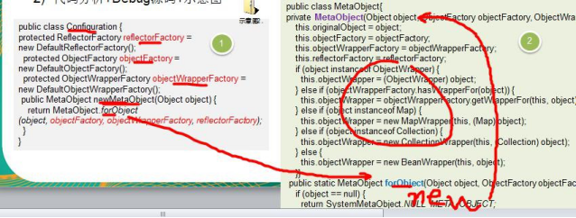</td></tr></table>代码分析<b>+Debug </b>源码<b>+</b>示意图

    
3)&nbsp;对源码中使用到的外观模式的角色类图

 

    
&nbsp;
    

    
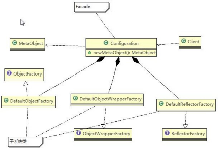&nbsp;
    

    
&nbsp;
    

    <h2 style="margin-top:0.0000pt;margin-right:0.0000pt;margin-bottom:0.0000pt;
margin-left:46.9000pt;text-indent:-36.0000pt;text-align:left;
line-height:28.3500pt;mso-line-height-rule:exactly;mso-list:l168 level2 lfo138;">13.8&nbsp;外观模式的注意事项和细节</h2>
    
1)&nbsp;外观模式对外屏蔽了子系统的细节，因此外观模式降低了客户端对子系统使用的复杂性

    
2)&nbsp;外观模式对客户端与子系统的耦合关系 - 解耦，让子系统内部的模块更易维护和扩展

    
3)&nbsp;通过合理的使用外观模式，可以帮我们更好的划分访问的层次

    
4)&nbsp;当系统需要进行分层设计时，可以考虑使用 Facade&nbsp;模式

    
5)&nbsp;在维护一个遗留的大型系统时，可能这个系统已经变得非常难以维护和扩展，此时可以考虑为新系统开发一个

    
Facade 类，来提供遗留系统的比较清晰简单的接口，让新系统与 Facade 类交互，提高复用性

    
6)&nbsp;不能过多的或者不合理的使用外观模式，使用外观模式好，还是直接调用模块好。要以让系统有层次，利于维护为目的。

 

<h1 align=center style="margin-right:17.9500pt;text-align:center;">第 14&#9;章享元模式</h1>
    <h2 style="margin-top:0.0000pt;margin-right:0.0000pt;margin-bottom:0.0000pt;
margin-left:46.9000pt;text-indent:-36.0000pt;text-align:left;
line-height:32.3500pt;mso-line-height-rule:exactly;mso-list:l113 level2 lfo146;">14.1&nbsp;展示网站项目需求</h2>
    
小型的外包项目，给客户 A 做一个产品展示网站，客户 A 的朋友感觉效果不错，也希望做这样的产品展示网站，但是要求都有些不同：

    
1)&nbsp;有客户要求以新闻的形式发布

    
2)&nbsp;有客户人要求以博客的形式发布

    
3)&nbsp;有客户希望以微信公众号的形式发布

    
&nbsp;
    

    <h2 style="margin-top:0.0000pt;margin-right:0.0000pt;margin-bottom:0.0000pt;
margin-left:46.9000pt;text-indent:-36.0000pt;text-align:left;
mso-list:l113 level2 lfo146;">14.2&nbsp;传统方案解决网站展现项目</h2>
    
&nbsp;
    

    
1)&nbsp;直接复制粘贴一份，然后根据客户不同要求，进行定制修改

    
2)&nbsp;给每个网站租用一个空间

    
3)&nbsp;<table cellpadding="0" cellspacing="0"><tr><td
            width="94.5333" height="0"></td></tr><tr><td></td><td>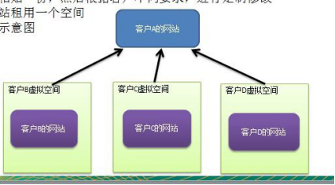</td></tr></table>方案设计示意图

    
&nbsp;
    

    <h2 style="margin-top:0.0000pt;margin-right:0.0000pt;margin-bottom:0.0000pt;
margin-left:46.9000pt;text-indent:-36.0000pt;text-align:left;
mso-list:l113 level2 lfo146;">14.3&nbsp;传统方案解决网站展现项目-问题分析</h2>

 

1)&nbsp;需要的网站结构相似度很高，而且都不是高访问量网站，如果分成多个虚拟空间来处理，相当于一个相同网站的实例对象很多，造成服务器的资源浪费

    
2)&nbsp;解决思路：整合到一个网站中，共享其相关的代码和数据，对于硬盘、内存、CPU、数据库空间等服务器资源都可以达成共享，减少服务器资源

    
3)&nbsp;对于代码来说，由于是一份实例，维护和扩展都更加容易

    
4)&nbsp;上面的解决思路就可以使用 享元模式 来解决

    <h2 style="margin-top:0.0000pt;margin-right:0.0000pt;margin-bottom:0.0000pt;
margin-left:46.9000pt;text-indent:-36.0000pt;text-align:left;
line-height:31.5500pt;mso-line-height-rule:exactly;mso-list:l113 level2 lfo146;">14.4&nbsp;享元模式基本介绍</h2>
    
基本介绍

    
1)&nbsp;享元模式（Flyweight&nbsp;Pattern）&nbsp;也叫 蝇量模式: 运用共享技术有效地支持大量细粒度的对象

    
2)&nbsp;常用于系统底层开发，解决系统的性能问题。像数据库连接池，里面都是创建好的连接对象，在这些连接对象中有我们需要的则直接拿来用，避免重新创建，如果没有我们需要的，则创建一个

    
3)&nbsp;享元模式能够解决重复对象的内存浪费的问题，当系统中有大量相似对象，需要缓冲池时。不需总是创建新对象，可以从缓冲池里拿。这样可以降低系统内存，同时提高效率

    
4)&nbsp;享元模式经典的应用场景就是池技术了，String&nbsp;常量池、数据库连接池、缓冲池等等都是享元模式的应用，享元模式是池技术的重要实现方式

    
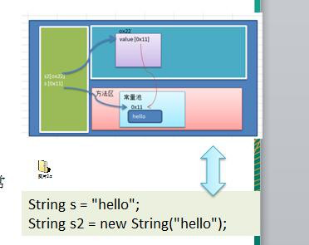&nbsp;
    

    <h2 style="margin-top:0.6500pt;margin-right:0.0000pt;margin-bottom:0.0000pt;
margin-left:46.9000pt;text-indent:-36.0000pt;text-align:left;
mso-list:l113 level2 lfo146;">14.5&nbsp;享元模式的原理类图</h2>

 

    
&nbsp;
    

    
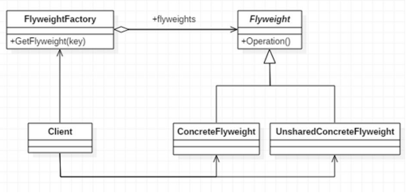&nbsp;
    

    
&#216;&nbsp;对类图的说明

    
对原理图的说明-即(模式的角色及职责)

    
1)&nbsp;FlyWeight&nbsp;是抽象的享元角色, 他是产品的抽象类, 同时定义出对象的外部状态和内部状态(后面介绍) &nbsp;的接口或实现

    
2)&nbsp;ConcreteFlyWeight&nbsp;是具体的享元角色，是具体的产品类，实现抽象角色定义相关业务

    
3)&nbsp;UnSharedConcreteFlyWeight&nbsp;是不可共享的角色，一般不会出现在享元工厂。

    
4)&nbsp;FlyWeightFactory&#9;享元工厂类，用于构建一个池容器(集合)， 同时提供从池中获取对象方法

    
&nbsp;
    

    <h2 style="margin-top:0.0000pt;margin-right:0.0000pt;margin-bottom:0.0000pt;
margin-left:46.9000pt;text-indent:-36.0000pt;text-align:left;
line-height:32.8000pt;mso-line-height-rule:exactly;mso-list:l113 level2 lfo146;">14.6&nbsp;内部状态和外部状态</h2>
    
比如围棋、五子棋、跳棋，它们都有大量的棋子对象，围棋和五子棋只有黑白两色，跳棋颜色多一点，所以棋子颜色就是棋子的内部状态；而各个棋子之间的差别就是位置的不同，当我们落子后，落子颜色是定的，但位置是变化的，所以棋子坐标就是棋子的外部状态

    
&nbsp;
    

    
1)&nbsp;享元模式提出了两个要求：细粒度和共享对象。这里就涉及到内部状态和外部状态了，即将对象的信息分为两个部分：内部状态和外部状态

    
2)&nbsp;内部状态指对象共享出来的信息，存储在享元对象内部且不会随环境的改变而改变

    
3)&nbsp;外部状态指对象得以依赖的一个标记，是随环境改变而改变的、不可共享的状态。

 

4)&nbsp;举个例子：围棋理论上有 361 个空位可以放棋子，每盘棋都有可能有两三百个棋子对象产生，因为内存空间有限，一台服务器很难支持更多的玩家玩围棋游戏，如果用享元模式来处理棋子，那么棋子对象就可以减少到只有两个实例，这样就很好的解决了对象的开销问题

    
&nbsp;
    

    <h2 style="margin-top:0.0000pt;margin-right:0.0000pt;margin-bottom:0.0000pt;
margin-left:46.9000pt;text-indent:-36.0000pt;text-align:left;
line-height:32.8000pt;mso-line-height-rule:exactly;mso-list:l113 level2 lfo146;">14.7&nbsp;享元模式解决网站展现项目</h2>
    
1)&nbsp;应用实例要求

    
使用享元模式完成，前面提出的网站外包问题

    
&nbsp;
    

    
2)&nbsp;思路分析和图解(类图)

    
<table cellpadding="0" cellspacing="0"><tr><td width="148.667"
                                                                                                         height="0"></td></tr><tr><td></td><td>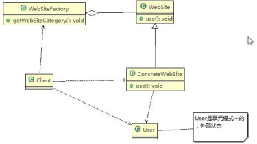</td></tr></table>&nbsp;

    
3)&nbsp;代码实现

    
&nbsp;
    

    
flyweight.zip

    
&nbsp;
    

    <table class=MsoNormalTable border=1 cellspacing=0 style="border-collapse:collapse;margin-left:10.9000pt;mso-table-layout-alt:fixed;
border:none;mso-border-left-alt:0.5000pt solid rgb(0,0,0);mso-border-top-alt:0.5000pt solid rgb(0,0,0);
mso-border-right-alt:0.5000pt solid rgb(0,0,0);mso-border-bottom-alt:0.5000pt solid rgb(0,0,0);mso-border-insideh:0.5000pt solid rgb(0,0,0);
mso-border-insidev:0.5000pt solid rgb(0,0,0);mso-padding-alt:0.0000pt 0.0000pt 0.0000pt 0.0000pt ;">
        <tr style="height:140.2500pt;">
            <td width=808 valign=top style="width:606.0000pt;padding:0.0000pt 0.0000pt 0.0000pt 0.0000pt ;border-left:1.0000pt solid rgb(0,0,0);
mso-border-left-alt:0.5000pt solid rgb(0,0,0);border-right:1.0000pt solid rgb(0,0,0);mso-border-right-alt:0.5000pt solid rgb(0,0,0);
border-top:1.0000pt solid rgb(0,0,0);mso-border-top-alt:0.5000pt solid rgb(0,0,0);border-bottom:1.0000pt solid rgb(0,0,0);
mso-border-bottom-alt:0.5000pt solid rgb(0,0,0);">
package com.atguigu.flyweight;

                
&nbsp;

                
public class Client {

                
&nbsp;

                
public static void main(String[] args) {

                
// TODO Auto-generated method stub
</td>
        </tr>
    </table>

 

    
&nbsp;

    <table class=MsoNormalTable border=1 cellspacing=0 style="border-collapse:collapse;margin-left:10.9000pt;mso-table-layout-alt:fixed;
border:none;mso-border-left-alt:0.5000pt solid rgb(0,0,0);mso-border-top-alt:0.5000pt solid rgb(0,0,0);
mso-border-right-alt:0.5000pt solid rgb(0,0,0);mso-border-bottom-alt:0.5000pt solid rgb(0,0,0);mso-border-insideh:0.5000pt solid rgb(0,0,0);
mso-border-insidev:0.5000pt solid rgb(0,0,0);mso-padding-alt:0.0000pt 0.0000pt 0.0000pt 0.0000pt ;">
        <tr style="height:608.3000pt;">
            <td width=808 valign=top style="width:606.0000pt;padding:0.0000pt 0.0000pt 0.0000pt 0.0000pt ;border-left:1.0000pt solid rgb(0,0,0);
mso-border-left-alt:0.5000pt solid rgb(0,0,0);border-right:1.0000pt solid rgb(0,0,0);mso-border-right-alt:0.5000pt solid rgb(0,0,0);
border-top:1.0000pt solid rgb(0,0,0);mso-border-top-alt:0.5000pt solid rgb(0,0,0);border-bottom:1.0000pt solid rgb(0,0,0);
mso-border-bottom-alt:0.5000pt solid rgb(0,0,0);">
                
&nbsp;

                
//&nbsp;创建一个工厂类

                
WebSiteFactory factory = new WebSiteFactory();

                
&nbsp;
                

                
//&nbsp;客户要一个以新闻形式发布的网站

                
WebSite webSite1 = factory.getWebSiteCategory("新闻");

                
&nbsp;
                

                
&nbsp;
                

                
&nbsp;

                
webSite1.use(new User("tom"));

                
&nbsp;
                

                
//&nbsp;客户要一个以博客形式发布的网站

                
WebSite webSite2 = factory.getWebSiteCategory("博客");

                
&nbsp;
                

                
&nbsp;

                
webSite2.use(new User("jack"));

                
&nbsp;
                

                
//&nbsp;客户要一个以博客形式发布的网站

                
WebSite webSite3 = factory.getWebSiteCategory("博客");

                
&nbsp;
                

                
&nbsp;

                
webSite3.use(new User("smith"));

                
&nbsp;
                

                
//&nbsp;客户要一个以博客形式发布的网站

                
WebSite webSite4 = factory.getWebSiteCategory("博客");

                
&nbsp;
                

                
&nbsp;

                
webSite4.use(new User("king"));

                
&nbsp;
                

                
System.out.println("网站的分类共=" + factory.getWebSiteCount());
</td>
        </tr>
    </table>

 

    
&nbsp;

    <table class=MsoNormalTable border=1 cellspacing=0 style="border-collapse:collapse;margin-left:10.9000pt;mso-table-layout-alt:fixed;
border:none;mso-border-left-alt:0.5000pt solid rgb(0,0,0);mso-border-top-alt:0.5000pt solid rgb(0,0,0);
mso-border-right-alt:0.5000pt solid rgb(0,0,0);mso-border-bottom-alt:0.5000pt solid rgb(0,0,0);mso-border-insideh:0.5000pt solid rgb(0,0,0);
mso-border-insidev:0.5000pt solid rgb(0,0,0);mso-padding-alt:0.0000pt 0.0000pt 0.0000pt 0.0000pt ;">
        <tr style="height:93.6000pt;">
            <td width=808 valign=top style="width:606.0000pt;padding:0.0000pt 0.0000pt 0.0000pt 0.0000pt ;border-left:1.0000pt solid rgb(0,0,0);
mso-border-left-alt:0.5000pt solid rgb(0,0,0);border-right:1.0000pt solid rgb(0,0,0);mso-border-right-alt:0.5000pt solid rgb(0,0,0);
border-top:1.0000pt solid rgb(0,0,0);mso-border-top-alt:0.5000pt solid rgb(0,0,0);border-bottom:1.0000pt solid rgb(0,0,0);
mso-border-bottom-alt:0.5000pt solid rgb(0,0,0);">
}

                
&nbsp;
                

                
&nbsp;

                
}
</td>
        </tr>
        <tr style="height:514.7000pt;">
            <td width=808 valign=top style="width:606.0000pt;padding:0.0000pt 0.0000pt 0.0000pt 0.0000pt ;border-left:1.0000pt solid rgb(0,0,0);
mso-border-left-alt:0.5000pt solid rgb(0,0,0);border-right:1.0000pt solid rgb(0,0,0);mso-border-right-alt:0.5000pt solid rgb(0,0,0);
border-top:none;mso-border-top-alt:0.5000pt solid rgb(0,0,0);border-bottom:1.0000pt solid rgb(0,0,0);
mso-border-bottom-alt:0.5000pt solid rgb(0,0,0);">
package com.atguigu.flyweight;

                
&nbsp;
                

                
//具体网站

                
public class ConcreteWebSite extends WebSite {

                
&nbsp;
                

                
//共享的部分，内部状态

                
private String type = ""; //网站发布的形式(类型)

                
&nbsp;
                

                
&nbsp;
                

                
&nbsp;

                
//构造器

                
public ConcreteWebSite(String type) {

                
&nbsp;
                

                
&nbsp;

                
this.type = type;

                
}

                
&nbsp;
                

                
&nbsp;
                

                
&nbsp;
                

                
@Override

                
public void use(User user) {

                
// TODO Auto-generated method stub

                
System.out.println("网站的发布形式为:" + type + " 在使用中 .. 使用者是" + user.getName());

                
}
</td>
        </tr>
    </table>

 

    
&nbsp;

    <table class=MsoNormalTable border=1 cellspacing=0 style="border-collapse:collapse;margin-left:10.9000pt;mso-table-layout-alt:fixed;
border:none;mso-border-left-alt:0.5000pt solid rgb(0,0,0);mso-border-top-alt:0.5000pt solid rgb(0,0,0);
mso-border-right-alt:0.5000pt solid rgb(0,0,0);mso-border-bottom-alt:0.5000pt solid rgb(0,0,0);mso-border-insideh:0.5000pt solid rgb(0,0,0);
mso-border-insidev:0.5000pt solid rgb(0,0,0);mso-padding-alt:0.0000pt 0.0000pt 0.0000pt 0.0000pt ;">
        <tr style="height:70.2000pt;">
            <td width=808 valign=top style="width:606.0000pt;padding:0.0000pt 0.0000pt 0.0000pt 0.0000pt ;border-left:1.0000pt solid rgb(0,0,0);
mso-border-left-alt:0.5000pt solid rgb(0,0,0);border-right:1.0000pt solid rgb(0,0,0);mso-border-right-alt:0.5000pt solid rgb(0,0,0);
border-top:1.0000pt solid rgb(0,0,0);mso-border-top-alt:0.5000pt solid rgb(0,0,0);border-bottom:1.0000pt solid rgb(0,0,0);
mso-border-bottom-alt:0.5000pt solid rgb(0,0,0);">
                
&nbsp;
                

                
&nbsp;
                

                
}
</td>
        </tr>
        <tr style="height:538.1000pt;">
            <td width=808 valign=top style="width:606.0000pt;padding:0.0000pt 0.0000pt 0.0000pt 0.0000pt ;border-left:1.0000pt solid rgb(0,0,0);
mso-border-left-alt:0.5000pt solid rgb(0,0,0);border-right:1.0000pt solid rgb(0,0,0);mso-border-right-alt:0.5000pt solid rgb(0,0,0);
border-top:none;mso-border-top-alt:0.5000pt solid rgb(0,0,0);border-bottom:1.0000pt solid rgb(0,0,0);
mso-border-bottom-alt:0.5000pt solid rgb(0,0,0);">
package com.atguigu.flyweight;

                
&nbsp;
                

                
&nbsp;

                
public class User {

                
&nbsp;
                

                
&nbsp;

                
private String name;

                
&nbsp;
                

                
&nbsp;
                

                
&nbsp;
                

                
public User(String name) { super();

                
this.name = name;

                
}

                
&nbsp;
                

                
&nbsp;

                
public String getName() { return name;

                
}

                
&nbsp;
                

                
&nbsp;

                
public void setName(String name) { this.name = name;

                
}

                
&nbsp;
                

                
&nbsp;
                

                
&nbsp;
                

                
}
</td>
        </tr>
    </table>

 

    
&nbsp;

    <table class=MsoNormalTable border=1 cellspacing=0 style="border-collapse:collapse;margin-left:10.9000pt;mso-table-layout-alt:fixed;
border:none;mso-border-left-alt:0.5000pt solid rgb(0,0,0);mso-border-top-alt:0.5000pt solid rgb(0,0,0);
mso-border-right-alt:0.5000pt solid rgb(0,0,0);mso-border-bottom-alt:0.5000pt solid rgb(0,0,0);mso-border-insideh:0.5000pt solid rgb(0,0,0);
mso-border-insidev:0.5000pt solid rgb(0,0,0);mso-padding-alt:0.0000pt 0.0000pt 0.0000pt 0.0000pt ;">
        <tr style="height:163.7500pt;">
            <td width=808 valign=top style="width:606.0000pt;padding:0.0000pt 0.0000pt 0.0000pt 0.0000pt ;border-left:1.0000pt solid rgb(0,0,0);
mso-border-left-alt:0.5000pt solid rgb(0,0,0);border-right:1.0000pt solid rgb(0,0,0);mso-border-right-alt:0.5000pt solid rgb(0,0,0);
border-top:1.0000pt solid rgb(0,0,0);mso-border-top-alt:0.5000pt solid rgb(0,0,0);border-bottom:1.0000pt solid rgb(0,0,0);
mso-border-bottom-alt:0.5000pt solid rgb(0,0,0);">
package com.atguigu.flyweight;

                
&nbsp;
                

                
&nbsp;

                
public abstract class WebSite {

                
&nbsp;
                

                
public abstract void use(User user);//抽象方法

                
}
</td>
        </tr>
        <tr style="height:445.0000pt;">
            <td width=808 valign=top style="width:606.0000pt;padding:0.0000pt 0.0000pt 0.0000pt 0.0000pt ;border-left:1.0000pt solid rgb(0,0,0);
mso-border-left-alt:0.5000pt solid rgb(0,0,0);border-right:1.0000pt solid rgb(0,0,0);mso-border-right-alt:0.5000pt solid rgb(0,0,0);
border-top:none;mso-border-top-alt:0.5000pt solid rgb(0,0,0);border-bottom:1.0000pt solid rgb(0,0,0);
mso-border-bottom-alt:0.5000pt solid rgb(0,0,0);">
package com.atguigu.flyweight;

                
&nbsp;
                

                
&nbsp;

                
import java.util.HashMap;

                
&nbsp;
                

                
//&nbsp;网站工厂类，根据需要返回压一个网站

                
public class WebSiteFactory {

                
&nbsp;
                

                
&nbsp;
                

                
&nbsp;

                
//集合， 充当池的作用

                
private HashMap&#60;String, ConcreteWebSite&#62; pool = new HashMap&#60;&#62;();

                
&nbsp;
                

                
//根据网站的类型，返回一个网站, 如果没有就创建一个网站，并放入到池中,并返回

                
public WebSite getWebSiteCategory(String type) { if(!pool.containsKey(type)) {

                
//就创建一个网站，并放入到池中

                
pool.put(type, new ConcreteWebSite(type));

                
}

                
&nbsp;
                

                
&nbsp;

                
return (WebSite)pool.get(type);
</td>
        </tr>
    </table>

 

    
&nbsp;

    <table class=MsoNormalTable border=1 cellspacing=0 style="border-collapse:collapse;margin-left:10.9000pt;mso-table-layout-alt:fixed;
border:none;mso-border-left-alt:0.5000pt solid rgb(0,0,0);mso-border-top-alt:0.5000pt solid rgb(0,0,0);
mso-border-right-alt:0.5000pt solid rgb(0,0,0);mso-border-bottom-alt:0.5000pt solid rgb(0,0,0);mso-border-insideh:0.5000pt solid rgb(0,0,0);
mso-border-insidev:0.5000pt solid rgb(0,0,0);mso-padding-alt:0.0000pt 0.0000pt 0.0000pt 0.0000pt ;">
        <tr style="height:187.2000pt;">
            <td width=808 valign=top style="width:606.0000pt;padding:0.0000pt 0.0000pt 0.0000pt 0.0000pt ;border-left:1.0000pt solid rgb(0,0,0);
mso-border-left-alt:0.5000pt solid rgb(0,0,0);border-right:1.0000pt solid rgb(0,0,0);mso-border-right-alt:0.5000pt solid rgb(0,0,0);
border-top:1.0000pt solid rgb(0,0,0);mso-border-top-alt:0.5000pt solid rgb(0,0,0);border-bottom:1.0000pt solid rgb(0,0,0);
mso-border-bottom-alt:0.5000pt solid rgb(0,0,0);">
}

                
&nbsp;
                

                
//获取网站分类的总数 (池中有多少个网站类型) public int getWebSiteCount() {

                
return pool.size();

                
}

                
}
</td>
        </tr>
    </table>
    
&nbsp;

    
&nbsp;

    <h2 style="margin-top:0.0000pt;margin-right:0.0000pt;margin-bottom:0.0000pt;
margin-left:46.9000pt;text-indent:-36.0000pt;text-align:left;
line-height:29.5000pt;mso-line-height-rule:exactly;mso-list:l113 level2 lfo146;">14.8&nbsp;享元模式在 JDK-Interger&nbsp;的应用源码分析</h2>
    
&nbsp;
    

    
1)&nbsp;Integer 中的享元模式

    
2)&nbsp;代码分析+Debug&nbsp;源码+说明

    
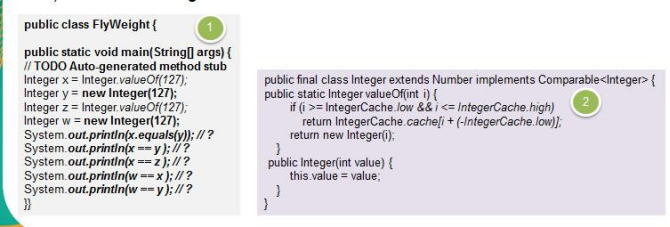&nbsp;
    

    
&#216;&nbsp;代码说明：

    <table class=MsoNormalTable border=1 cellspacing=0 style="border-collapse:collapse;margin-left:10.9000pt;mso-table-layout-alt:fixed;
border:none;mso-border-left-alt:0.5000pt solid rgb(0,0,0);mso-border-top-alt:0.5000pt solid rgb(0,0,0);
mso-border-right-alt:0.5000pt solid rgb(0,0,0);mso-border-bottom-alt:0.5000pt solid rgb(0,0,0);mso-border-insideh:0.5000pt solid rgb(0,0,0);
mso-border-insidev:0.5000pt solid rgb(0,0,0);mso-padding-alt:0.0000pt 0.0000pt 0.0000pt 0.0000pt ;">
        <tr style="height:94.0000pt;">
            <td width=808 valign=top style="width:606.0000pt;padding:0.0000pt 0.0000pt 0.0000pt 0.0000pt ;border-left:1.0000pt solid rgb(0,0,0);
mso-border-left-alt:0.5000pt solid rgb(0,0,0);border-right:1.0000pt solid rgb(0,0,0);mso-border-right-alt:0.5000pt solid rgb(0,0,0);
border-top:1.0000pt solid rgb(0,0,0);mso-border-top-alt:0.5000pt solid rgb(0,0,0);border-bottom:1.0000pt solid rgb(0,0,0);
mso-border-bottom-alt:0.5000pt solid rgb(0,0,0);">
package com.atguigu.jdk;

                
&nbsp;

                
public class FlyWeight {
</td>
        </tr>
    </table>

 

    
&nbsp;

    <table class=MsoNormalTable border=1 cellspacing=0 style="border-collapse:collapse;margin-left:10.9000pt;mso-table-layout-alt:fixed;
border:none;mso-border-left-alt:0.5000pt solid rgb(0,0,0);mso-border-top-alt:0.5000pt solid rgb(0,0,0);
mso-border-right-alt:0.5000pt solid rgb(0,0,0);mso-border-bottom-alt:0.5000pt solid rgb(0,0,0);mso-border-insideh:0.5000pt solid rgb(0,0,0);
mso-border-insidev:0.5000pt solid rgb(0,0,0);mso-padding-alt:0.0000pt 0.0000pt 0.0000pt 0.0000pt ;">
        <tr style="height:608.8000pt;">
            <td width=808 valign=top style="width:606.0000pt;padding:0.0000pt 0.0000pt 0.0000pt 0.0000pt ;border-left:1.0000pt solid rgb(0,0,0);
mso-border-left-alt:0.5000pt solid rgb(0,0,0);border-right:1.0000pt solid rgb(0,0,0);mso-border-right-alt:0.5000pt solid rgb(0,0,0);
border-top:1.0000pt solid rgb(0,0,0);mso-border-top-alt:0.5000pt solid rgb(0,0,0);border-bottom:1.0000pt solid rgb(0,0,0);
mso-border-bottom-alt:0.5000pt solid rgb(0,0,0);">

                public static void main(String[] args) {

                
// TODO Auto-generated method stub

                
//如果 &nbsp;Integer.valueOf(x)&nbsp;x&nbsp;在&#9;-128&nbsp;---&nbsp;127&nbsp;直接，就是使用享元模式返回,如果不在

                
//范围类，则仍然 new

                
&nbsp;

                
//小结:

                
//1.&nbsp;在 valueOf 方法中，先判断值是否在 IntegerCache 中，如果不在，就创建新的 Integer(new), &nbsp;否则，就直接从 缓存池返回

                
//2. valueOf 方法，就使用到享元模式

                
//3.&nbsp;如果使用 valueOf 方法得到一个 Integer 实例，范围在 -128 - 127 &nbsp;，执行速度比 new 快

                
&nbsp;
                

                
&nbsp;
                

                
&nbsp;

                
Integer x&nbsp;= Integer.valueOf(127); //&nbsp;得到 x 实例，类型 Integer Integer y = new Integer(127); // 得 到 y 实 例 ， 类 型 Integer Integer z&nbsp;= Integer.valueOf(127);//..

                
Integer w = new Integer(127);

                
&nbsp;
                

                
System.out.println(x.equals(y));&nbsp;//&nbsp;大小，true System.out.println(x == y&nbsp;);&nbsp;//&#9;false System.out.println(x == z ); // true System.out.println(w == x ); // false System.out.println(w == y ); //&nbsp;false

                
&nbsp;
                

                
&nbsp;
                

                
&nbsp;

                
Integer x1 = Integer.valueOf(200); Integer x2 = Integer.valueOf(200);
</td>
        </tr>
    </table>

 

    
&nbsp;

    <table class=MsoNormalTable border=1 cellspacing=0 style="border-collapse:collapse;margin-left:10.9000pt;mso-table-layout-alt:fixed;
border:none;mso-border-left-alt:0.5000pt solid rgb(0,0,0);mso-border-top-alt:0.5000pt solid rgb(0,0,0);
mso-border-right-alt:0.5000pt solid rgb(0,0,0);mso-border-bottom-alt:0.5000pt solid rgb(0,0,0);mso-border-insideh:0.5000pt solid rgb(0,0,0);
mso-border-insidev:0.5000pt solid rgb(0,0,0);mso-padding-alt:0.0000pt 0.0000pt 0.0000pt 0.0000pt ;">
        <tr style="height:70.2000pt;">
            <td width=808 valign=top style="width:606.0000pt;padding:0.0000pt 0.0000pt 0.0000pt 0.0000pt ;border-left:1.0000pt solid rgb(0,0,0);
mso-border-left-alt:0.5000pt solid rgb(0,0,0);border-right:1.0000pt solid rgb(0,0,0);mso-border-right-alt:0.5000pt solid rgb(0,0,0);
border-top:1.0000pt solid rgb(0,0,0);mso-border-top-alt:0.5000pt solid rgb(0,0,0);border-bottom:1.0000pt solid rgb(0,0,0);
mso-border-bottom-alt:0.5000pt solid rgb(0,0,0);">
System.out.println("x1==x2" + (x1 == x2)); // false

                
}

                
}
</td>
        </tr>
    </table>
    
&nbsp;

    
&nbsp;

    <h2 style="margin-top:0.0000pt;margin-right:0.0000pt;margin-bottom:0.0000pt;
margin-left:46.9000pt;text-indent:-36.0000pt;text-align:left;
line-height:29.5000pt;mso-line-height-rule:exactly;mso-list:l113 level2 lfo146;">14.9&nbsp;享元模式的注意事项和细节</h2>
    
&nbsp;
    

    
1)&nbsp;在享元模式这样理解，&#8220;享&#8221;就表示共享，&#8220;元&#8221;表示对象

    
2)&nbsp;系统中有大量对象，这些对象消耗大量内存，并且对象的状态大部分可以外部化时，我们就可以考虑选用享元模式

    
3)&nbsp;用唯一标识码判断，如果在内存中有，则返回这个唯一标识码所标识的对象，用 HashMap/HashTable&nbsp;存储

    
4)&nbsp;享元模式大大减少了对象的创建，降低了程序内存的占用，提高效率

    
5)&nbsp;享元模式提高了系统的复杂度。需要分离出内部状态和外部状态，而外部状态具有固化特性，不应该随着内部状态的改变而改变，这是我们使用享元模式需要注意的地方.

    
6)&nbsp;使用享元模式时，注意划分内部状态和外部状态，并且需要有一个工厂类加以控制。

    
7)&nbsp;享元模式经典的应用场景是需要缓冲池的场景，比如 String&nbsp;常量池、数据库连接池

 

<h1 align=center style="margin-right:17.9500pt;text-align:center;line-height:42.3000pt;
mso-line-height-rule:exactly;">第 15&#9;章代理模式</h1>
    <h2 style="margin-top:0.0000pt;margin-right:0.0000pt;margin-bottom:0.0000pt;
margin-left:46.9000pt;text-indent:-36.0000pt;text-align:left;
line-height:32.1500pt;mso-line-height-rule:exactly;mso-list:l55 level2 lfo156;">15.1&nbsp;代理模式(Proxy)</h2>
    <h3 style="margin-top:0.0000pt;margin-right:0.0000pt;margin-bottom:0.0000pt;
margin-left:73.9000pt;text-indent:-48.8500pt;text-align:left;
line-height:30.9500pt;mso-line-height-rule:exactly;mso-list:l55 level3 lfo156;">15.1.1&nbsp;代理模式的基本介绍</h3>
    
&nbsp;
    

    
1)&nbsp;代理模式：为一个对象提供一个替身，以控制对这个对象的访问。即通过代理对象访问目标对象.这样做的好处是:可以在目标对象实现的基础上,增强额外的功能操作,即扩展目标对象的功能。

    
2)&nbsp;被代理的对象可以是远程对象、创建开销大的对象或需要安全控制的对象

    
3)&nbsp;代理模式有不同的形式, 主要有三种 静态代理、动态代理 (JDK&nbsp;代理、接口代理)和 &nbsp;<b>Cglib</b><b>&nbsp;</b>代理 &nbsp;(可以在内存动态的创建对象，而不需要实现接口， 他是属于动态代理的范畴) 。

    
4)&nbsp;代理模式示意图

    
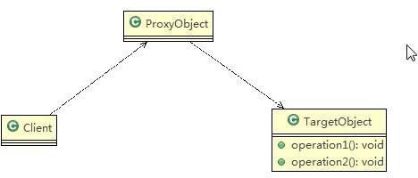&nbsp;
    

    
&nbsp;
    

    <h2 style="margin-top:0.0500pt;margin-right:0.0000pt;margin-bottom:0.0000pt;
margin-left:46.9000pt;text-indent:-36.0000pt;text-align:left;
mso-list:l55 level2 lfo156;">15.2&nbsp;静态代理</h2>
    
&nbsp;
    

    <h3 style="margin-top:0.0000pt;margin-right:0.0000pt;margin-bottom:0.0000pt;
margin-left:73.9000pt;text-indent:-48.8500pt;text-align:left;
mso-list:l55 level3 lfo156;">15.2.1&nbsp;静态代码模式的基本介绍</h3>
    
&nbsp;
    

    
静态代理在使用时,需要定义接口或者父类,被代理对象(即目标对象)与代理对象一起实现相同的接口或者是继承相同父类

 

<h3 style="margin-top:0.8500pt;margin-right:0.0000pt;margin-bottom:0.0000pt;
margin-left:73.9000pt;text-indent:-48.8500pt;text-align:left;
line-height:31.2500pt;mso-line-height-rule:exactly;mso-list:l55 level3 lfo156;">15.2.2&nbsp;应用实例</h3>
    
&#216;&nbsp;具体要求

    
1)&nbsp;定义一个接口:ITeacherDao

    
2)&nbsp;目标对象 TeacherDAO&nbsp;实现接口 ITeacherDAO

    
3)&nbsp;使用静态代理方式,就需要在代理对象 TeacherDAOProxy&nbsp;中也实现 ITeacherDAO

    
4)&nbsp;调用的时候通过调用代理对象的方法来调用目标对象.

    
5)&nbsp;特别提醒：代理对象与目标对象要实现相同的接口,然后通过调用相同的方法来调用目标对象的方法

    
&nbsp;
    

    
&#216;&nbsp;思路分析图解(类图)

    
&nbsp;

    
<table cellpadding="0" cellspacing="0"><tr><td width="143.267"
                                                                                                         height="0"></td></tr><tr><td></td><td>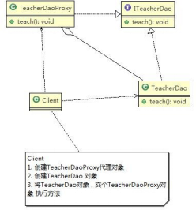</td></tr></table>&nbsp;

    
&nbsp;

    
&#216;&nbsp;代码实现

    
&nbsp;
    

    
staticproxy.zip

    
&nbsp;
    

    <table class=MsoNormalTable border=1 cellspacing=0 style="border-collapse:collapse;margin-left:10.9000pt;mso-table-layout-alt:fixed;
border:none;mso-border-left-alt:0.5000pt solid rgb(0,0,0);mso-border-top-alt:0.5000pt solid rgb(0,0,0);
mso-border-right-alt:0.5000pt solid rgb(0,0,0);mso-border-bottom-alt:0.5000pt solid rgb(0,0,0);mso-border-insideh:0.5000pt solid rgb(0,0,0);
mso-border-insidev:0.5000pt solid rgb(0,0,0);mso-padding-alt:0.0000pt 0.0000pt 0.0000pt 0.0000pt ;">
        <tr style="height:70.1000pt;">
            <td width=808 valign=top style="width:606.0000pt;padding:0.0000pt 0.0000pt 0.0000pt 0.0000pt ;border-left:1.0000pt solid rgb(0,0,0);
mso-border-left-alt:0.5000pt solid rgb(0,0,0);border-right:1.0000pt solid rgb(0,0,0);mso-border-right-alt:0.5000pt solid rgb(0,0,0);
border-top:1.0000pt solid rgb(0,0,0);mso-border-top-alt:0.5000pt solid rgb(0,0,0);border-bottom:1.0000pt solid rgb(0,0,0);
mso-border-bottom-alt:0.5000pt solid rgb(0,0,0);">
package com.atguigu.proxy.staticproxy;

                
&nbsp;

                
public class Client {
</td>
        </tr>
    </table>

 

    <table class=MsoNormalTable border=1 cellspacing=0 style="border-collapse:collapse;margin-left:10.9000pt;mso-table-layout-alt:fixed;
border:none;mso-border-left-alt:0.5000pt solid rgb(0,0,0);mso-border-top-alt:0.5000pt solid rgb(0,0,0);
mso-border-right-alt:0.5000pt solid rgb(0,0,0);mso-border-bottom-alt:0.5000pt solid rgb(0,0,0);mso-border-insideh:0.5000pt solid rgb(0,0,0);
mso-border-insidev:0.5000pt solid rgb(0,0,0);mso-padding-alt:0.0000pt 0.0000pt 0.0000pt 0.0000pt ;">
        <tr style="height:327.6000pt;">
            <td width=808 valign=top style="width:606.0000pt;padding:0.0000pt 0.0000pt 0.0000pt 0.0000pt ;border-left:1.0000pt solid rgb(0,0,0);
mso-border-left-alt:0.5000pt solid rgb(0,0,0);border-right:1.0000pt solid rgb(0,0,0);mso-border-right-alt:0.5000pt solid rgb(0,0,0);
border-top:1.0000pt solid rgb(0,0,0);mso-border-top-alt:0.5000pt solid rgb(0,0,0);border-bottom:1.0000pt solid rgb(0,0,0);
mso-border-bottom-alt:0.5000pt solid rgb(0,0,0);">
                
&nbsp;

                
public static void main(String[] args) {

                
// TODO Auto-generated method stub

                
//创建目标对象(被代理对象)

                
TeacherDao teacherDao = new TeacherDao();

                
&nbsp;

                
//创建代理对象, 同时将被代理对象传递给代理对象

                
TeacherDaoProxy teacherDaoProxy = new TeacherDaoProxy(teacherDao);

                
&nbsp;

                
//通过代理对象，调用到被代理对象的方法

                
//即：执行的是代理对象的方法，代理对象再去调用目标对象的方法

                
teacherDaoProxy.teach();

                
}

                
}
</td>
        </tr>
        <tr style="height:210.6000pt;">
            <td width=808 valign=top style="width:606.0000pt;padding:0.0000pt 0.0000pt 0.0000pt 0.0000pt ;border-left:1.0000pt solid rgb(0,0,0);
mso-border-left-alt:0.5000pt solid rgb(0,0,0);border-right:1.0000pt solid rgb(0,0,0);mso-border-right-alt:0.5000pt solid rgb(0,0,0);
border-top:none;mso-border-top-alt:0.5000pt solid rgb(0,0,0);border-bottom:1.0000pt solid rgb(0,0,0);
mso-border-bottom-alt:0.5000pt solid rgb(0,0,0);">
package com.atguigu.proxy.staticproxy;

                
&nbsp;

                
&nbsp;

                
//接口

                
public interface ITeacherDao {

                
&nbsp;

                
void teach(); //&nbsp;授课的方法

                
}
</td>
        </tr>
        <tr style="height:70.1000pt;">
            <td width=808 valign=top style="width:606.0000pt;padding:0.0000pt 0.0000pt 0.0000pt 0.0000pt ;border-left:1.0000pt solid rgb(0,0,0);
mso-border-left-alt:0.5000pt solid rgb(0,0,0);border-right:1.0000pt solid rgb(0,0,0);mso-border-right-alt:0.5000pt solid rgb(0,0,0);
border-top:none;mso-border-top-alt:0.5000pt solid rgb(0,0,0);border-bottom:1.0000pt solid rgb(0,0,0);
mso-border-bottom-alt:0.5000pt solid rgb(0,0,0);">
package com.atguigu.proxy.staticproxy;

                
&nbsp;

                
public class TeacherDao implements ITeacherDao {
</td>
        </tr>
    </table>

 

    
&nbsp;

    <table class=MsoNormalTable border=1 cellspacing=0 style="border-collapse:collapse;margin-left:10.9000pt;mso-table-layout-alt:fixed;
border:none;mso-border-left-alt:0.5000pt solid rgb(0,0,0);mso-border-top-alt:0.5000pt solid rgb(0,0,0);
mso-border-right-alt:0.5000pt solid rgb(0,0,0);mso-border-bottom-alt:0.5000pt solid rgb(0,0,0);mso-border-insideh:0.5000pt solid rgb(0,0,0);
mso-border-insidev:0.5000pt solid rgb(0,0,0);mso-padding-alt:0.0000pt 0.0000pt 0.0000pt 0.0000pt ;">
        <tr style="height:210.6000pt;">
            <td width=808 valign=top style="width:606.0000pt;padding:0.0000pt 0.0000pt 0.0000pt 0.0000pt ;border-left:1.0000pt solid rgb(0,0,0);
mso-border-left-alt:0.5000pt solid rgb(0,0,0);border-right:1.0000pt solid rgb(0,0,0);mso-border-right-alt:0.5000pt solid rgb(0,0,0);
border-top:1.0000pt solid rgb(0,0,0);mso-border-top-alt:0.5000pt solid rgb(0,0,0);border-bottom:1.0000pt solid rgb(0,0,0);
mso-border-bottom-alt:0.5000pt solid rgb(0,0,0);">
                
&nbsp;
                

                
&nbsp;
                

                
@Override

                
public void teach() {

                
// TODO Auto-generated method stub System.out.println("&nbsp;老师授课中&#9;。。。。。");

                
}

                
&nbsp;
                

                
&nbsp;

                
}
</td>
        </tr>
        <tr style="height:398.2000pt;">
            <td width=808 valign=top style="width:606.0000pt;padding:0.0000pt 0.0000pt 0.0000pt 0.0000pt ;border-left:1.0000pt solid rgb(0,0,0);
mso-border-left-alt:0.5000pt solid rgb(0,0,0);border-right:1.0000pt solid rgb(0,0,0);mso-border-right-alt:0.5000pt solid rgb(0,0,0);
border-top:none;mso-border-top-alt:0.5000pt solid rgb(0,0,0);border-bottom:1.0000pt solid rgb(0,0,0);
mso-border-bottom-alt:0.5000pt solid rgb(0,0,0);">
package com.atguigu.proxy.staticproxy;

                
&nbsp;
                

                
//代理对象,静态代理

                
public class TeacherDaoProxy implements ITeacherDao{

                
private ITeacherDao target; //&nbsp;目标对象，通过接口来聚合

                
&nbsp;

                
//构造器

                
public TeacherDaoProxy(ITeacherDao target) { this.target = target;

                
}

                
&nbsp;
                

                
&nbsp;

                
@Override

                
public void teach() {

                
// TODO Auto-generated method stub

                
System.out.println("开始代理&#9;完成某些操作。。。。。&nbsp;");//方法target.teach();

                
System.out.println("提交。。。。。");//方法
</td>
        </tr>
    </table>

 

    
&nbsp;

    <table class=MsoNormalTable border=1 cellspacing=0 style="border-collapse:collapse;margin-left:10.9000pt;mso-table-layout-alt:fixed;
border:none;mso-border-left-alt:0.5000pt solid rgb(0,0,0);mso-border-top-alt:0.5000pt solid rgb(0,0,0);
mso-border-right-alt:0.5000pt solid rgb(0,0,0);mso-border-bottom-alt:0.5000pt solid rgb(0,0,0);mso-border-insideh:0.5000pt solid rgb(0,0,0);
mso-border-insidev:0.5000pt solid rgb(0,0,0);mso-padding-alt:0.0000pt 0.0000pt 0.0000pt 0.0000pt ;">
        <tr style="height:46.8000pt;">
            <td width=808 valign=top style="width:606.0000pt;padding:0.0000pt 0.0000pt 0.0000pt 0.0000pt ;border-left:1.0000pt solid rgb(0,0,0);
mso-border-left-alt:0.5000pt solid rgb(0,0,0);border-right:1.0000pt solid rgb(0,0,0);mso-border-right-alt:0.5000pt solid rgb(0,0,0);
border-top:1.0000pt solid rgb(0,0,0);mso-border-top-alt:0.5000pt solid rgb(0,0,0);border-bottom:1.0000pt solid rgb(0,0,0);
mso-border-bottom-alt:0.5000pt solid rgb(0,0,0);">
}

                
}
</td>
        </tr>
    </table>
    
&nbsp;

    
&nbsp;

    <h3 style="margin-top:0.0000pt;margin-right:0.0000pt;margin-bottom:0.0000pt;
margin-left:73.9000pt;text-indent:-48.8500pt;text-align:left;
line-height:28.1000pt;mso-line-height-rule:exactly;mso-list:l55 level3 lfo156;">15.2.3&nbsp;静态代理优缺点</h3>
    
&nbsp;
    

    
1)&nbsp;优点：在不修改目标对象的功能前提下, 能通过代理对象对目标功能扩展

    
2)&nbsp;缺点：因为代理对象需要与目标对象实现一样的接口,所以会有很多代理类

    
3)&nbsp;一旦接口增加方法,目标对象与代理对象都要维护

    
&nbsp;
    

    <h2 style="margin-top:0.0000pt;margin-right:0.0000pt;margin-bottom:0.0000pt;
margin-left:46.9000pt;text-indent:-36.0000pt;text-align:left;
line-height:33.1000pt;mso-line-height-rule:exactly;mso-list:l55 level2 lfo156;">15.3&nbsp;动态代理</h2>
    <h3 style="margin-top:0.0000pt;margin-right:0.0000pt;margin-bottom:0.0000pt;
margin-left:73.9000pt;text-indent:-48.8500pt;text-align:left;
line-height:31.0000pt;mso-line-height-rule:exactly;mso-list:l55 level3 lfo156;">15.3.1&nbsp;动态代理模式的基本介绍</h3>
    
&nbsp;
    

    
1)&nbsp;代理对象,不需要实现接口，但是目标对象要实现接口，否则不能用动态代理

    
2)&nbsp;代理对象的生成，是利用 JDK&nbsp;的 API，动态的在内存中构建代理对象

    
3)&nbsp;动态代理也叫做：JDK&nbsp;代理、接口代理

    
&nbsp;
    

    <h3 style="margin-top:0.0500pt;margin-right:0.0000pt;margin-bottom:0.0000pt;
margin-left:73.9000pt;text-indent:-48.8500pt;text-align:left;
mso-list:l55 level3 lfo156;">15.3.2&nbsp;JDK&nbsp;中生成代理对象的 API</h3>
    
&nbsp;

    
1)&nbsp;代理类所在包:java.lang.reflect.Proxy

    
2)&nbsp;JDK&nbsp;实现代理只需要使用 <b>newProxyInstance</b><b>&nbsp;</b>方法,但是该方法需要接收三个参数,完整的写法是:

    
static Object newProxyInstance(ClassLoader loader, Class&#60;?&#62;[] interfaces,InvocationHandler h )
    

    
&nbsp;

    
&nbsp;

    <h3 style="margin-top:0.0000pt;margin-right:0.0000pt;margin-bottom:0.0000pt;
margin-left:73.9000pt;text-indent:-48.8500pt;text-align:left;
mso-list:l55 level3 lfo156;">15.3.3&nbsp;动态代理应用实例</h3>

 

&#216;&nbsp;应用实例要求

    
将前面的静态代理改进成动态代理模式(即：JDK 代理模式)

    
&#216;&nbsp;<table
            cellpadding="0" cellspacing="0"><tr><td width="122.533" height="0"></td></tr><tr><td></td><td>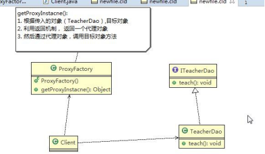</td></tr></table>思路图解(类图)

    
&nbsp;

    
&#216;&nbsp;代码实现

    
&nbsp;
    

    
dynamic.zip

    
&nbsp;
    

    <table class=MsoNormalTable border=1 cellspacing=0 style="border-collapse:collapse;margin-left:10.9000pt;mso-table-layout-alt:fixed;
border:none;mso-border-left-alt:0.5000pt solid rgb(0,0,0);mso-border-top-alt:0.5000pt solid rgb(0,0,0);
mso-border-right-alt:0.5000pt solid rgb(0,0,0);mso-border-bottom-alt:0.5000pt solid rgb(0,0,0);mso-border-insideh:0.5000pt solid rgb(0,0,0);
mso-border-insidev:0.5000pt solid rgb(0,0,0);mso-padding-alt:0.0000pt 0.0000pt 0.0000pt 0.0000pt ;">
        <tr style="height:233.9000pt;">
            <td width=808 valign=top style="width:606.0000pt;padding:0.0000pt 0.0000pt 0.0000pt 0.0000pt ;border-left:1.0000pt solid rgb(0,0,0);
mso-border-left-alt:0.5000pt solid rgb(0,0,0);border-right:1.0000pt solid rgb(0,0,0);mso-border-right-alt:0.5000pt solid rgb(0,0,0);
border-top:1.0000pt solid rgb(0,0,0);mso-border-top-alt:0.5000pt solid rgb(0,0,0);border-bottom:1.0000pt solid rgb(0,0,0);
mso-border-bottom-alt:0.5000pt solid rgb(0,0,0);">
package com.atguigu.proxy.dynamic;

                
&nbsp;

                
public class Client {

                
&nbsp;

                
public static void main(String[] args) {

                
// TODO Auto-generated method stub

                
//创建目标对象

                
ITeacherDao target = new TeacherDao();

                
&nbsp;

                
//给目标对象，创建代理对象, 可以转成 ITeacherDao
</td>
        </tr>
    </table>

 

    <table class=MsoNormalTable border=1 cellspacing=0 style="border-collapse:collapse;margin-left:10.9000pt;mso-table-layout-alt:fixed;
border:none;mso-border-left-alt:0.5000pt solid rgb(0,0,0);mso-border-top-alt:0.5000pt solid rgb(0,0,0);
mso-border-right-alt:0.5000pt solid rgb(0,0,0);mso-border-bottom-alt:0.5000pt solid rgb(0,0,0);mso-border-insideh:0.5000pt solid rgb(0,0,0);
mso-border-insidev:0.5000pt solid rgb(0,0,0);mso-padding-alt:0.0000pt 0.0000pt 0.0000pt 0.0000pt ;">
        <tr style="height:304.2000pt;">
            <td width=808 valign=top style="width:606.0000pt;padding:0.0000pt 0.0000pt 0.0000pt 0.0000pt ;border-left:1.0000pt solid rgb(0,0,0);
mso-border-left-alt:0.5000pt solid rgb(0,0,0);border-right:1.0000pt solid rgb(0,0,0);mso-border-right-alt:0.5000pt solid rgb(0,0,0);
border-top:1.0000pt solid rgb(0,0,0);mso-border-top-alt:0.5000pt solid rgb(0,0,0);border-bottom:1.0000pt solid rgb(0,0,0);
mso-border-bottom-alt:0.5000pt solid rgb(0,0,0);">
ITeacherDao proxyInstance = (ITeacherDao)new ProxyFactory(target).getProxyInstance();

                
&nbsp;

                
// proxyInstance=class com.sun.proxy.$Proxy0 内存中动态生成了代理对象

                
System.out.println("proxyInstance=" + proxyInstance.getClass());

                
&nbsp;

                
//通过代理对象，调用目标对象的方法

                
//proxyInstance.teach();

                
&nbsp;

                
proxyInstance.sayHello(" tom ");

                
}

                
&nbsp;

                
}
</td>
        </tr>
        <tr style="height:210.6000pt;">
            <td width=808 valign=top style="width:606.0000pt;padding:0.0000pt 0.0000pt 0.0000pt 0.0000pt ;border-left:1.0000pt solid rgb(0,0,0);
mso-border-left-alt:0.5000pt solid rgb(0,0,0);border-right:1.0000pt solid rgb(0,0,0);mso-border-right-alt:0.5000pt solid rgb(0,0,0);
border-top:none;mso-border-top-alt:0.5000pt solid rgb(0,0,0);border-bottom:1.0000pt solid rgb(0,0,0);
mso-border-bottom-alt:0.5000pt solid rgb(0,0,0);">
package com.atguigu.proxy.dynamic;

                
&nbsp;

                
//接口

                
public interface ITeacherDao {

                
&nbsp;

                
void teach(); //&nbsp;授课方法

                
void sayHello(String name);

                
}
</td>
        </tr>
        <tr style="height:93.5000pt;">
            <td width=808 valign=top style="width:606.0000pt;padding:0.0000pt 0.0000pt 0.0000pt 0.0000pt ;border-left:1.0000pt solid rgb(0,0,0);
mso-border-left-alt:0.5000pt solid rgb(0,0,0);border-right:1.0000pt solid rgb(0,0,0);mso-border-right-alt:0.5000pt solid rgb(0,0,0);
border-top:none;mso-border-top-alt:0.5000pt solid rgb(0,0,0);border-bottom:1.0000pt solid rgb(0,0,0);
mso-border-bottom-alt:0.5000pt solid rgb(0,0,0);">
package com.atguigu.proxy.dynamic;

                
&nbsp;

                
import java.lang.reflect.InvocationHandler; import java.lang.reflect.Method;
</td>
        </tr>
    </table>

 

    
&nbsp;

    <table class=MsoNormalTable border=1 cellspacing=0 style="border-collapse:collapse;margin-left:10.9000pt;mso-table-layout-alt:fixed;
border:none;mso-border-left-alt:0.5000pt solid rgb(0,0,0);mso-border-top-alt:0.5000pt solid rgb(0,0,0);
mso-border-right-alt:0.5000pt solid rgb(0,0,0);mso-border-bottom-alt:0.5000pt solid rgb(0,0,0);mso-border-insideh:0.5000pt solid rgb(0,0,0);
mso-border-insidev:0.5000pt solid rgb(0,0,0);mso-padding-alt:0.0000pt 0.0000pt 0.0000pt 0.0000pt ;">
        <tr style="height:608.3000pt;">
            <td width=808 valign=top style="width:606.0000pt;padding:0.0000pt 0.0000pt 0.0000pt 0.0000pt ;border-left:1.0000pt solid rgb(0,0,0);
mso-border-left-alt:0.5000pt solid rgb(0,0,0);border-right:1.0000pt solid rgb(0,0,0);mso-border-right-alt:0.5000pt solid rgb(0,0,0);
border-top:1.0000pt solid rgb(0,0,0);mso-border-top-alt:0.5000pt solid rgb(0,0,0);border-bottom:1.0000pt solid rgb(0,0,0);
mso-border-bottom-alt:0.5000pt solid rgb(0,0,0);">
import java.lang.reflect.Proxy;

                
&nbsp;
                

                
&nbsp;

                
public class ProxyFactory {

                
&nbsp;
                

                
//维护一个目标对象 , Object private Object target;

                
&nbsp;
                

                
//构造器 ， 对 target &nbsp;进行初始化

                
public ProxyFactory(Object target) {

                
&nbsp;
                

                
&nbsp;

                
this.target = target;

                
}

                
&nbsp;
                

                
//给目标对象 &nbsp;生成一个代理对象

                
public Object getProxyInstance()&nbsp;{

                
&nbsp;
                

                
//说明

                
/*

                
*&#9;public static Object newProxyInstance(ClassLoader&nbsp;loader,

                
Class&#60;?&#62;[] interfaces, InvocationHandler h)

                
&nbsp;

                
//1. ClassLoader loader ： 指定当前目标对象使用的类加载器, 获取加载器的方法固定

                
//2. Class&#60;?&#62;[] interfaces: &nbsp;目标对象实现的接口类型，使用泛型方法确认类型

                
//3. InvocationHandler h : 事情处理，执行目标对象的方法时，会触发事情处理器方法, 会把当前执行

                
的目标对象方法作为参数传入
</td>
        </tr>
    </table>

 

    
&nbsp;

    <table class=MsoNormalTable border=1 cellspacing=0 style="border-collapse:collapse;margin-left:10.9000pt;mso-table-layout-alt:fixed;
border:none;mso-border-left-alt:0.5000pt solid rgb(0,0,0);mso-border-top-alt:0.5000pt solid rgb(0,0,0);
mso-border-right-alt:0.5000pt solid rgb(0,0,0);mso-border-bottom-alt:0.5000pt solid rgb(0,0,0);mso-border-insideh:0.5000pt solid rgb(0,0,0);
mso-border-insidev:0.5000pt solid rgb(0,0,0);mso-padding-alt:0.0000pt 0.0000pt 0.0000pt 0.0000pt ;">
        <tr style="height:468.0000pt;">
            <td width=808 valign=top style="width:606.0000pt;padding:0.0000pt 0.0000pt 0.0000pt 0.0000pt ;border-left:1.0000pt solid rgb(0,0,0);
mso-border-left-alt:0.5000pt solid rgb(0,0,0);border-right:1.0000pt solid rgb(0,0,0);mso-border-right-alt:0.5000pt solid rgb(0,0,0);
border-top:1.0000pt solid rgb(0,0,0);mso-border-top-alt:0.5000pt solid rgb(0,0,0);border-bottom:1.0000pt solid rgb(0,0,0);
mso-border-bottom-alt:0.5000pt solid rgb(0,0,0);">
*/

                
return Proxy.newProxyInstance(target.getClass().getClassLoader(), target.getClass().getInterfaces(),

                
new InvocationHandler() {

                
&nbsp;
                

                
&nbsp;

                
@Override

                
public Object invoke(Object proxy, Method method, Object[] args) throws Throwable {

                
// TODO Auto-generated method stub

                
System.out.println("JDK 代理开始~~");

                
//反射机制调用目标对象的方法

                
Object returnVal = method.invoke(target, args);

                
System.out.println("JDK 代理提交"); return returnVal;

                
}

                
});

                
}

                
&nbsp;
                

                
&nbsp;
                

                
&nbsp;
                

                
}
</td>
        </tr>
        <tr style="height:140.8000pt;">
            <td width=808 valign=top style="width:606.0000pt;padding:0.0000pt 0.0000pt 0.0000pt 0.0000pt ;border-left:1.0000pt solid rgb(0,0,0);
mso-border-left-alt:0.5000pt solid rgb(0,0,0);border-right:1.0000pt solid rgb(0,0,0);mso-border-right-alt:0.5000pt solid rgb(0,0,0);
border-top:none;mso-border-top-alt:0.5000pt solid rgb(0,0,0);border-bottom:1.0000pt solid rgb(0,0,0);
mso-border-bottom-alt:0.5000pt solid rgb(0,0,0);">
package com.atguigu.proxy.dynamic;

                
&nbsp;
                

                
&nbsp;

                
public class TeacherDao implements ITeacherDao {

                
&nbsp;
                

                
&nbsp;

                
@Override

                
public void teach() {
</td>
        </tr>
    </table>

 

    
&nbsp;

    <table class=MsoNormalTable border=1 cellspacing=0 style="border-collapse:collapse;margin-left:10.9000pt;mso-table-layout-alt:fixed;
border:none;mso-border-left-alt:0.5000pt solid rgb(0,0,0);mso-border-top-alt:0.5000pt solid rgb(0,0,0);
mso-border-right-alt:0.5000pt solid rgb(0,0,0);mso-border-bottom-alt:0.5000pt solid rgb(0,0,0);mso-border-insideh:0.5000pt solid rgb(0,0,0);
mso-border-insidev:0.5000pt solid rgb(0,0,0);mso-padding-alt:0.0000pt 0.0000pt 0.0000pt 0.0000pt ;">
        <tr style="height:257.4000pt;">
            <td width=808 valign=top style="width:606.0000pt;padding:0.0000pt 0.0000pt 0.0000pt 0.0000pt ;border-left:1.0000pt solid rgb(0,0,0);
mso-border-left-alt:0.5000pt solid rgb(0,0,0);border-right:1.0000pt solid rgb(0,0,0);mso-border-right-alt:0.5000pt solid rgb(0,0,0);
border-top:1.0000pt solid rgb(0,0,0);mso-border-top-alt:0.5000pt solid rgb(0,0,0);border-bottom:1.0000pt solid rgb(0,0,0);
mso-border-bottom-alt:0.5000pt solid rgb(0,0,0);">
// TODO Auto-generated method stub System.out.println(" 老师授课中.... ");

                
}

                
&nbsp;
                

                
&nbsp;

                
@Override

                
public void sayHello(String name) {

                
// TODO Auto-generated method stub System.out.println("hello " + name);

                
}

                
&nbsp;
                

                
&nbsp;

                
}
</td>
        </tr>
    </table>
    
&nbsp;

    
&nbsp;

    <h2 style="margin-top:0.0000pt;margin-right:0.0000pt;margin-bottom:0.0000pt;
margin-left:46.9000pt;text-indent:-36.0000pt;text-align:left;
line-height:28.7000pt;mso-line-height-rule:exactly;mso-list:l55 level2 lfo156;">15.4&nbsp;Cglib&nbsp;代理</h2>
    <h3 style="margin-top:0.0000pt;margin-right:0.0000pt;margin-bottom:0.0000pt;
margin-left:73.9000pt;text-indent:-48.8500pt;text-align:left;
line-height:31.0000pt;mso-line-height-rule:exactly;mso-list:l55 level3 lfo156;">15.4.1&nbsp;Cglib&nbsp;代理模式的基本介绍</h3>
    
&nbsp;
    

    
1)&nbsp;静态代理和 JDK&nbsp;代理模式都要求目标对象是实现一个接口,但是有时候目标对象只是一个单独的对象,并没有实现任何的接口,这个时候可使用目标对象子类来实现代理-这就是 <b>Cglib </b>代理

    
2)&nbsp;Cglib&nbsp;代理也叫作子类代理<b>,</b>它是在内存中构建一个子类对象从而实现对目标对象功能扩展, 有些书也将Cglib&nbsp;代理归属到动态代理。

    
3)&nbsp;Cglib 是一个强大的高性能的代码生成包,它可以在运行期扩展 java&nbsp;类与实现 java 接口.它广泛的被许多 AOP 的框架使用,例如 Spring&nbsp;AOP，实现方法拦截

    
4)&nbsp;在 AOP 编程中如何选择代理模式：

    
1.&nbsp;目标对象需要实现接口，用 JDK&nbsp;代理

    
2.&nbsp;目标对象不需要实现接口，用 Cglib 代理

    
5)&nbsp;Cglib&nbsp;包的底层是通过使用字节码处理框架 ASM 来转换字节码并生成新的类

 

    
&nbsp;
    

    <h3 style="margin-top:0.0000pt;margin-right:0.0000pt;margin-bottom:0.0000pt;
margin-left:73.9000pt;text-indent:-48.8500pt;text-align:left;
line-height:27.4500pt;mso-line-height-rule:exactly;mso-list:l55 level3 lfo156;">15.4.2&nbsp;Cglib&nbsp;代理模式实现步骤</h3>
    
1)&nbsp;<table cellpadding="0" cellspacing="0"><tr><td
            width="122.533" height="0"></td></tr><tr><td></td><td></td></tr></table>需要引入 cglib&nbsp;的 jar&nbsp;文件

    
2)&nbsp;在内存中动态构建子类，注意代理的类不能为 final，否则报错java.lang.IllegalArgumentException:

    
3)&nbsp;目标对象的方法如果为 final/static,那么就不会被拦截,即不会执行目标对象额外的业务方法.

    <h3 style="margin-top:0.0000pt;margin-right:0.0000pt;margin-bottom:0.0000pt;
margin-left:73.9000pt;text-indent:-48.8500pt;text-align:left;
line-height:31.0000pt;mso-line-height-rule:exactly;mso-list:l55 level3 lfo156;">15.4.3&nbsp;Cglib&nbsp;代理模式应用实例</h3>
    
&nbsp;
    

    
&#216;&nbsp;应用实例要求

    
将前面的案例用 Cglib 代理模式实现

    
&#216;&nbsp;<table
            cellpadding="0" cellspacing="0"><tr><td width="148.2" height="0"></td></tr><tr><td></td><td>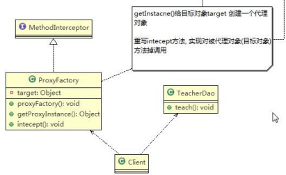</td></tr></table>思路图解(类图)

    
&#216;&nbsp;代码实现+Debug&nbsp;源码[待 debug]

 

    
&nbsp;

    
&nbsp;

    
cglib.zip

    
&nbsp;
    

    <table class=MsoNormalTable border=1 cellspacing=0 style="border-collapse:collapse;margin-left:10.9000pt;mso-table-layout-alt:fixed;
border:none;mso-border-left-alt:0.5000pt solid rgb(0,0,0);mso-border-top-alt:0.5000pt solid rgb(0,0,0);
mso-border-right-alt:0.5000pt solid rgb(0,0,0);mso-border-bottom-alt:0.5000pt solid rgb(0,0,0);mso-border-insideh:0.5000pt solid rgb(0,0,0);
mso-border-insidev:0.5000pt solid rgb(0,0,0);mso-padding-alt:0.0000pt 0.0000pt 0.0000pt 0.0000pt ;">
        <tr style="height:397.7500pt;">
            <td width=808 valign=top style="width:606.0000pt;padding:0.0000pt 0.0000pt 0.0000pt 0.0000pt ;border-left:1.0000pt solid rgb(0,0,0);
mso-border-left-alt:0.5000pt solid rgb(0,0,0);border-right:1.0000pt solid rgb(0,0,0);mso-border-right-alt:0.5000pt solid rgb(0,0,0);
border-top:1.0000pt solid rgb(0,0,0);mso-border-top-alt:0.5000pt solid rgb(0,0,0);border-bottom:1.0000pt solid rgb(0,0,0);
mso-border-bottom-alt:0.5000pt solid rgb(0,0,0);">
package com.atguigu.proxy.cglib;

                
&nbsp;

                
public class Client {

                
&nbsp;

                
public static void main(String[] args) {

                
// TODO Auto-generated method stub

                
//创建目标对象

                
TeacherDao target = new TeacherDao();

                
//获取到代理对象，并且将目标对象传递给代理对象

                
TeacherDao proxyInstance = (TeacherDao)new ProxyFactory(target).getProxyInstance();

                
&nbsp;

                
//执行代理对象的方法，触发 intecept &nbsp;方法，从而实现 对目标对象的调用

                
String res = proxyInstance.teach(); System.out.println("res=" + res);

                
}

                
&nbsp;

                
}
</td>
        </tr>
        <tr style="height:163.7000pt;">
            <td width=808 valign=top style="width:606.0000pt;padding:0.0000pt 0.0000pt 0.0000pt 0.0000pt ;border-left:1.0000pt solid rgb(0,0,0);
mso-border-left-alt:0.5000pt solid rgb(0,0,0);border-right:1.0000pt solid rgb(0,0,0);mso-border-right-alt:0.5000pt solid rgb(0,0,0);
border-top:none;mso-border-top-alt:0.5000pt solid rgb(0,0,0);border-bottom:1.0000pt solid rgb(0,0,0);
mso-border-bottom-alt:0.5000pt solid rgb(0,0,0);">
package com.atguigu.proxy.cglib;

                
&nbsp;

                
import java.lang.reflect.Method;

                
&nbsp;

                
import net.sf.cglib.proxy.Enhancer;

                
import net.sf.cglib.proxy.MethodInterceptor; import net.sf.cglib.proxy.MethodProxy;
</td>
        </tr>
    </table>

 

    
&nbsp;

    <table class=MsoNormalTable border=1 cellspacing=0 style="border-collapse:collapse;margin-left:10.9000pt;mso-table-layout-alt:fixed;
border:none;mso-border-left-alt:0.5000pt solid rgb(0,0,0);mso-border-top-alt:0.5000pt solid rgb(0,0,0);
mso-border-right-alt:0.5000pt solid rgb(0,0,0);mso-border-bottom-alt:0.5000pt solid rgb(0,0,0);mso-border-insideh:0.5000pt solid rgb(0,0,0);
mso-border-insidev:0.5000pt solid rgb(0,0,0);mso-padding-alt:0.0000pt 0.0000pt 0.0000pt 0.0000pt ;">
        <tr style="height:608.3000pt;">
            <td width=808 valign=top style="width:606.0000pt;padding:0.0000pt 0.0000pt 0.0000pt 0.0000pt ;border-left:1.0000pt solid rgb(0,0,0);
mso-border-left-alt:0.5000pt solid rgb(0,0,0);border-right:1.0000pt solid rgb(0,0,0);mso-border-right-alt:0.5000pt solid rgb(0,0,0);
border-top:1.0000pt solid rgb(0,0,0);mso-border-top-alt:0.5000pt solid rgb(0,0,0);border-bottom:1.0000pt solid rgb(0,0,0);
mso-border-bottom-alt:0.5000pt solid rgb(0,0,0);">
                
&nbsp;
                

                
&nbsp;
                

                
public class ProxyFactory implements MethodInterceptor {

                
&nbsp;
                

                
//维护一个目标对象 private Object target;

                
&nbsp;
                

                
//构造器，传入一个被代理的对象public ProxyFactory(Object target) {

                
this.target = target;

                
}

                
&nbsp;
                

                
//返回一个代理对象:&#9;是&nbsp;target &nbsp;对象的代理对象

                
public Object getProxyInstance() {

                
//1.&nbsp;创建一个工具类

                
Enhancer enhancer = new Enhancer();

                
//2.&nbsp;设置父类

                
enhancer.setSuperclass(target.getClass());

                
//3.&nbsp;设置回调函数

                
enhancer.setCallback(this);

                
//4.&nbsp;创建子类对象，即代理对象

                
return enhancer.create();

                
&nbsp;
                

                
&nbsp;

                
}

                
&nbsp;
                

                
&nbsp;
                

                
&nbsp;

                
//重写&#9;intercept&nbsp;方法，会调用目标对象的方法
</td>
        </tr>
    </table>

 

    
&nbsp;

    <table class=MsoNormalTable border=1 cellspacing=0 style="border-collapse:collapse;margin-left:10.9000pt;mso-table-layout-alt:fixed;
border:none;mso-border-left-alt:0.5000pt solid rgb(0,0,0);mso-border-top-alt:0.5000pt solid rgb(0,0,0);
mso-border-right-alt:0.5000pt solid rgb(0,0,0);mso-border-bottom-alt:0.5000pt solid rgb(0,0,0);mso-border-insideh:0.5000pt solid rgb(0,0,0);
mso-border-insidev:0.5000pt solid rgb(0,0,0);mso-padding-alt:0.0000pt 0.0000pt 0.0000pt 0.0000pt ;">
        <tr style="height:234.0000pt;">
            <td width=808 valign=top style="width:606.0000pt;padding:0.0000pt 0.0000pt 0.0000pt 0.0000pt ;border-left:1.0000pt solid rgb(0,0,0);
mso-border-left-alt:0.5000pt solid rgb(0,0,0);border-right:1.0000pt solid rgb(0,0,0);mso-border-right-alt:0.5000pt solid rgb(0,0,0);
border-top:1.0000pt solid rgb(0,0,0);mso-border-top-alt:0.5000pt solid rgb(0,0,0);border-bottom:1.0000pt solid rgb(0,0,0);
mso-border-bottom-alt:0.5000pt solid rgb(0,0,0);">
@Override

                
public Object intercept(Object arg0, Method method, Object[] args, MethodProxy arg3) throws Throwable {

                
// TODO Auto-generated method stub

                
System.out.println("Cglib 代理模式 ~~&nbsp;开始"); Object returnVal&nbsp;= method.invoke(target, args); System.out.println("Cglib 代理模式 ~~&nbsp;提交"); return returnVal;

                
}

                
&nbsp;
                

                
&nbsp;

                
}
</td>
        </tr>
        <tr style="height:210.5500pt;">
            <td width=808 valign=top style="width:606.0000pt;padding:0.0000pt 0.0000pt 0.0000pt 0.0000pt ;border-left:1.0000pt solid rgb(0,0,0);
mso-border-left-alt:0.5000pt solid rgb(0,0,0);border-right:1.0000pt solid rgb(0,0,0);mso-border-right-alt:0.5000pt solid rgb(0,0,0);
border-top:none;mso-border-top-alt:0.5000pt solid rgb(0,0,0);border-bottom:1.0000pt solid rgb(0,0,0);
mso-border-bottom-alt:0.5000pt solid rgb(0,0,0);">
package com.atguigu.proxy.cglib;

                
&nbsp;
                

                
&nbsp;

                
public class TeacherDao {

                
&nbsp;
                

                
&nbsp;

                
public String teach() {

                
System.out.println("&nbsp;老师授课中&#9;，&nbsp;我是&nbsp;cglib&nbsp;代理，不需要实现接口&nbsp;"); return&nbsp;"hello";

                
}

                
}
</td>
        </tr>
    </table>
    
&nbsp;

    
&nbsp;

    <h2 style="margin-top:0.0000pt;margin-right:0.0000pt;margin-bottom:0.0000pt;
margin-left:46.9000pt;text-indent:-36.0000pt;text-align:left;
line-height:28.4500pt;mso-line-height-rule:exactly;mso-list:l55 level2 lfo156;">15.5&nbsp;几种常见的代理模式介绍&#8212; 几种变体</h2>
    
1)&nbsp;防火墙代理

    
内网通过代理穿透防火墙，实现对公网的访问。

    
2)&nbsp;缓存代理

    
比如：当请求图片文件等资源时，先到缓存代理取，如果取到资源则 ok,如果取不到资源，再到公网或者数据库取，然后缓存。

 

3)&nbsp;远程代理

    
远程对象的本地代表，通过它可以把远程对象当本地对象来调用。远程代理通过网络和真正的远程对象沟通信息。

    
4)&nbsp;同步代理：主要使用在多线程编程中，完成多线程间同步工作同步代理：主要使用在多线程编程中，完成多线程间同步工作

 

<h1 style="margin-left:197.5000pt;">第 16&#9;章模板方法模式</h1>
    <h2 style="margin-top:0.0000pt;margin-right:0.0000pt;margin-bottom:0.0000pt;
margin-left:46.9000pt;text-indent:-36.0000pt;text-align:left;
line-height:32.3500pt;mso-line-height-rule:exactly;mso-list:l193 level2 lfo165;">16.1&nbsp;豆浆制作问题</h2>
    
编写制作豆浆的程序，说明如下:

    
&nbsp;

    
1)&nbsp;制作豆浆的流程 选材---&#62;添加配料---&#62;浸泡---&#62;放到豆浆机打碎

    
2)&nbsp;通过添加不同的配料，可以制作出不同口味的豆浆

    
3)&nbsp;选材、浸泡和放到豆浆机打碎这几个步骤对于制作每种口味的豆浆都是一样的

    
4)&nbsp;请使用 &nbsp;模板方法模式 &nbsp;完成&#9;(说明：因为模板方法模式，比较简单，很容易就想到这个方案，因此就直接使用，&nbsp;不再使用传统的方案来引出模板方法模式&#9;)

    
&nbsp;

    <h2 style="margin-top:0.0000pt;margin-right:0.0000pt;margin-bottom:0.0000pt;
margin-left:46.9000pt;text-indent:-36.0000pt;text-align:left;
line-height:32.8000pt;mso-line-height-rule:exactly;mso-list:l193 level2 lfo165;">16.2&nbsp;模板方法模式基本介绍</h2>
    
基本介绍

    
&nbsp;
    

    
1)&nbsp;模板方法模式（Template&nbsp;Method&nbsp;Pattern），又叫模板模式(Template&#9;Pattern)，z&nbsp;在一个抽象类公开定义了执行它的方法的模板。它的子类可以按需要重写方法实现，但调用将以抽象类中定义的方式进行。

    
2)&nbsp;简单说，模板方法模式 定义一个操作中的算法的骨架，而将一些步骤延迟到子类中，使得子类可以不改变一个算法的结构，就可以重定义该算法的某些特定步骤

    
3)&nbsp;这种类型的设计模式属于行为型模式。

    
&nbsp;
    

    <h2 style="margin-top:0.0000pt;margin-right:0.0000pt;margin-bottom:0.0000pt;
margin-left:46.9000pt;text-indent:-36.0000pt;text-align:left;
line-height:33.0500pt;mso-line-height-rule:exactly;mso-list:l193 level2 lfo165;">16.3&nbsp;模板方法模式原理类图</h2>
    <h3 style="margin-left:25.0500pt;text-indent:0.0000pt;line-height:30.9500pt;
mso-line-height-rule:exactly;">16.3.1&#9;模板方法模式的原理类图</h3>

 

    
&nbsp;
    

    
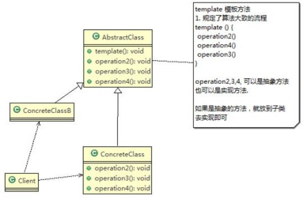&nbsp;
    

    
&nbsp;
    

    
&#216;&nbsp;对原理类图的说明-即(模板方法模式的角色及职责)

    
1)&nbsp;AbstractClass&nbsp;抽象类， 类中实现了模板方法(template)，定义了算法的骨架，具体子类需要去实现 其它的抽象方法 operationr2,3,4

    
2)&nbsp;ConcreteClass&nbsp;实现抽象方法 operationr2,3,4, &nbsp;以完成算法中特点子类的步骤

    
&nbsp;
    

    <h2 style="margin-top:0.0000pt;margin-right:0.0000pt;margin-bottom:0.0000pt;
margin-left:46.9000pt;text-indent:-36.0000pt;text-align:left;
line-height:32.8000pt;mso-line-height-rule:exactly;mso-list:l193 level2 lfo165;">16.4&nbsp;模板方法模式解决豆浆制作问题</h2>
    
1)&nbsp;应用实例要求

    
编写制作豆浆的程序，说明如下:

    
制作豆浆的流程 选材---&#62;添加配料---&#62;浸泡---&#62;放到豆浆机打碎通过添加不同的配料，可以制作出不同口味的豆浆

    
选材、浸泡和放到豆浆机打碎这几个步骤对于制作每种口味的豆浆都是一样的(红豆、花生豆浆。。。)

    
&nbsp;

    
2)&nbsp;思路分析和图解(类图)

 

    
&nbsp;

    
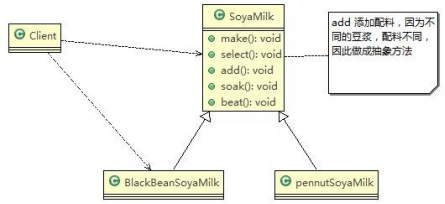&nbsp;

    
&nbsp;

    
&nbsp;

    
3)&nbsp;代码实现

    
&nbsp;
    

    
template.zip

    
&nbsp;
    

    <table class=MsoNormalTable border=1 cellspacing=0 style="border-collapse:collapse;margin-left:10.9000pt;mso-table-layout-alt:fixed;
border:none;mso-border-left-alt:0.5000pt solid rgb(0,0,0);mso-border-top-alt:0.5000pt solid rgb(0,0,0);
mso-border-right-alt:0.5000pt solid rgb(0,0,0);mso-border-bottom-alt:0.5000pt solid rgb(0,0,0);mso-border-insideh:0.5000pt solid rgb(0,0,0);
mso-border-insidev:0.5000pt solid rgb(0,0,0);mso-padding-alt:0.0000pt 0.0000pt 0.0000pt 0.0000pt ;">
        <tr style="height:350.9000pt;">
            <td width=808 valign=top style="width:606.0000pt;padding:0.0000pt 0.0000pt 0.0000pt 0.0000pt ;border-left:1.0000pt solid rgb(0,0,0);
mso-border-left-alt:0.5000pt solid rgb(0,0,0);border-right:1.0000pt solid rgb(0,0,0);mso-border-right-alt:0.5000pt solid rgb(0,0,0);
border-top:1.0000pt solid rgb(0,0,0);mso-border-top-alt:0.5000pt solid rgb(0,0,0);border-bottom:1.0000pt solid rgb(0,0,0);
mso-border-bottom-alt:0.5000pt solid rgb(0,0,0);">
package com.atguigu.template;

                
&nbsp;

                
public class Client {

                
&nbsp;

                
public static void main(String[] args) {

                
// TODO Auto-generated method stub

                
//制作红豆豆浆

                
&nbsp;

                
System.out.println("----制作红豆豆浆----");

                
SoyaMilk redBeanSoyaMilk = new RedBeanSoyaMilk(); redBeanSoyaMilk.make();

                
&nbsp;

                
System.out.println("---- 制 作 花 生 豆 浆 ----"); SoyaMilk peanutSoyaMilk = new PeanutSoyaMilk(); peanutSoyaMilk.make();
</td>
        </tr>
    </table>

 

    <table class=MsoNormalTable border=1 cellspacing=0 style="border-collapse:collapse;margin-left:10.9000pt;mso-table-layout-alt:fixed;
border:none;mso-border-left-alt:0.5000pt solid rgb(0,0,0);mso-border-top-alt:0.5000pt solid rgb(0,0,0);
mso-border-right-alt:0.5000pt solid rgb(0,0,0);mso-border-bottom-alt:0.5000pt solid rgb(0,0,0);mso-border-insideh:0.5000pt solid rgb(0,0,0);
mso-border-insidev:0.5000pt solid rgb(0,0,0);mso-padding-alt:0.0000pt 0.0000pt 0.0000pt 0.0000pt ;">
        <tr style="height:93.6000pt;">
            <td width=808 valign=top style="width:606.0000pt;padding:0.0000pt 0.0000pt 0.0000pt 0.0000pt ;border-left:1.0000pt solid rgb(0,0,0);
mso-border-left-alt:0.5000pt solid rgb(0,0,0);border-right:1.0000pt solid rgb(0,0,0);mso-border-right-alt:0.5000pt solid rgb(0,0,0);
border-top:1.0000pt solid rgb(0,0,0);mso-border-top-alt:0.5000pt solid rgb(0,0,0);border-bottom:1.0000pt solid rgb(0,0,0);
mso-border-bottom-alt:0.5000pt solid rgb(0,0,0);">
}

                
&nbsp;

                
}
</td>
        </tr>
        <tr style="height:280.8000pt;">
            <td width=808 valign=top style="width:606.0000pt;padding:0.0000pt 0.0000pt 0.0000pt 0.0000pt ;border-left:1.0000pt solid rgb(0,0,0);
mso-border-left-alt:0.5000pt solid rgb(0,0,0);border-right:1.0000pt solid rgb(0,0,0);mso-border-right-alt:0.5000pt solid rgb(0,0,0);
border-top:none;mso-border-top-alt:0.5000pt solid rgb(0,0,0);border-bottom:1.0000pt solid rgb(0,0,0);
mso-border-bottom-alt:0.5000pt solid rgb(0,0,0);">
package com.atguigu.template;

                
&nbsp;

                
public class PeanutSoyaMilk extends SoyaMilk {

                
&nbsp;

                
@Override

                
void addCondiments() {

                
// TODO Auto-generated method stub

                
System.out.println(" 加入上好的花生 ");

                
}

                
&nbsp;

                
}
</td>
        </tr>
        <tr style="height:233.9000pt;">
            <td width=808 valign=top style="width:606.0000pt;padding:0.0000pt 0.0000pt 0.0000pt 0.0000pt ;border-left:1.0000pt solid rgb(0,0,0);
mso-border-left-alt:0.5000pt solid rgb(0,0,0);border-right:1.0000pt solid rgb(0,0,0);mso-border-right-alt:0.5000pt solid rgb(0,0,0);
border-top:none;mso-border-top-alt:0.5000pt solid rgb(0,0,0);border-bottom:1.0000pt solid rgb(0,0,0);
mso-border-bottom-alt:0.5000pt solid rgb(0,0,0);">
package com.atguigu.template;

                
&nbsp;

                
public class RedBeanSoyaMilk extends SoyaMilk {

                
&nbsp;

                
@Override

                
void addCondiments() {

                
// TODO Auto-generated method stub

                
System.out.println(" 加入上好的红豆 ");

                
}
</td>
        </tr>
    </table>

 

    
&nbsp;

    <table class=MsoNormalTable border=1 cellspacing=0 style="border-collapse:collapse;margin-left:10.9000pt;mso-table-layout-alt:fixed;
border:none;mso-border-left-alt:0.5000pt solid rgb(0,0,0);mso-border-top-alt:0.5000pt solid rgb(0,0,0);
mso-border-right-alt:0.5000pt solid rgb(0,0,0);mso-border-bottom-alt:0.5000pt solid rgb(0,0,0);mso-border-insideh:0.5000pt solid rgb(0,0,0);
mso-border-insidev:0.5000pt solid rgb(0,0,0);mso-padding-alt:0.0000pt 0.0000pt 0.0000pt 0.0000pt ;">
        <tr style="height:46.8000pt;">
            <td width=808 valign=top style="width:606.0000pt;padding:0.0000pt 0.0000pt 0.0000pt 0.0000pt ;border-left:1.0000pt solid rgb(0,0,0);
mso-border-left-alt:0.5000pt solid rgb(0,0,0);border-right:1.0000pt solid rgb(0,0,0);mso-border-right-alt:0.5000pt solid rgb(0,0,0);
border-top:1.0000pt solid rgb(0,0,0);mso-border-top-alt:0.5000pt solid rgb(0,0,0);border-bottom:1.0000pt solid rgb(0,0,0);
mso-border-bottom-alt:0.5000pt solid rgb(0,0,0);">
}
</td>
        </tr>
        <tr style="height:562.0000pt;">
            <td width=808 valign=top style="width:606.0000pt;padding:0.0000pt 0.0000pt 0.0000pt 0.0000pt ;border-left:1.0000pt solid rgb(0,0,0);
mso-border-left-alt:0.5000pt solid rgb(0,0,0);border-right:1.0000pt solid rgb(0,0,0);mso-border-right-alt:0.5000pt solid rgb(0,0,0);
border-top:none;mso-border-top-alt:0.5000pt solid rgb(0,0,0);border-bottom:1.0000pt solid rgb(0,0,0);
mso-border-bottom-alt:0.5000pt solid rgb(0,0,0);">
package com.atguigu.template;

                
&nbsp;
                

                
//抽象类，表示豆浆

                
public abstract class SoyaMilk {

                
&nbsp;
                

                
//模板方法, make , 模板方法可以做成 final , 不让子类去覆盖. final void make() {

                
&nbsp;
                

                
&nbsp;

                
select(); addCondiments(); soak();

                
beat();

                
&nbsp;
                

                
&nbsp;

                
}

                
&nbsp;
                

                
//选材料

                
void select() {

                
System.out.println("第一步：选择好的新鲜黄豆&#9;");

                
}

                
&nbsp;
                

                
//添加不同的配料， 抽象方法, &nbsp;子类具体实现

                
abstract void addCondiments();

                
&nbsp;
                

                
//浸泡
</td>
        </tr>
    </table>

 

    
&nbsp;

    <table class=MsoNormalTable border=1 cellspacing=0 style="border-collapse:collapse;margin-left:10.9000pt;mso-table-layout-alt:fixed;
border:none;mso-border-left-alt:0.5000pt solid rgb(0,0,0);mso-border-top-alt:0.5000pt solid rgb(0,0,0);
mso-border-right-alt:0.5000pt solid rgb(0,0,0);mso-border-bottom-alt:0.5000pt solid rgb(0,0,0);mso-border-insideh:0.5000pt solid rgb(0,0,0);
mso-border-insidev:0.5000pt solid rgb(0,0,0);mso-padding-alt:0.0000pt 0.0000pt 0.0000pt 0.0000pt ;">
        <tr style="height:187.2000pt;">
            <td width=808 valign=top style="width:606.0000pt;padding:0.0000pt 0.0000pt 0.0000pt 0.0000pt ;border-left:1.0000pt solid rgb(0,0,0);
mso-border-left-alt:0.5000pt solid rgb(0,0,0);border-right:1.0000pt solid rgb(0,0,0);mso-border-right-alt:0.5000pt solid rgb(0,0,0);
border-top:1.0000pt solid rgb(0,0,0);mso-border-top-alt:0.5000pt solid rgb(0,0,0);border-bottom:1.0000pt solid rgb(0,0,0);
mso-border-bottom-alt:0.5000pt solid rgb(0,0,0);">
void soak() {

                
System.out.println("第三步， 黄豆和配料开始浸泡， 需要 3 小时 ");

                
}

                
&nbsp;
                

                
&nbsp;

                
void beat() {

                
System.out.println("第四步：黄豆和配料放到豆浆机去打碎&#9;");

                
}

                
}
</td>
        </tr>
    </table>
    
&nbsp;

    
&nbsp;

    <h2 style="margin-top:0.0000pt;margin-right:0.0000pt;margin-bottom:0.0000pt;
margin-left:46.9000pt;text-indent:-36.0000pt;text-align:left;
line-height:28.4500pt;mso-line-height-rule:exactly;mso-list:l193 level2 lfo165;">16.5&nbsp;模板方法模式的钩子方法</h2>
    
1)&nbsp;在模板方法模式的父类中，我们可以定义一个方法，它默认不做任何事，子类可以视情况要不要覆盖它，该方法称为&#8220;钩子&#8221;。

    
2)&nbsp;还是用上面做豆浆的例子来讲解，比如，我们还希望制作纯豆浆，不添加任何的配料，请使用钩子方法对前面的模板方法进行改造

    
3)&nbsp;看老师代码演示：

    
&nbsp;
    

    
improve.zip

    
&nbsp;
    

    <table class=MsoNormalTable border=1 cellspacing=0 style="border-collapse:collapse;margin-left:10.9000pt;mso-table-layout-alt:fixed;
border:none;mso-border-left-alt:0.5000pt solid rgb(0,0,0);mso-border-top-alt:0.5000pt solid rgb(0,0,0);
mso-border-right-alt:0.5000pt solid rgb(0,0,0);mso-border-bottom-alt:0.5000pt solid rgb(0,0,0);mso-border-insideh:0.5000pt solid rgb(0,0,0);
mso-border-insidev:0.5000pt solid rgb(0,0,0);mso-padding-alt:0.0000pt 0.0000pt 0.0000pt 0.0000pt ;">
        <tr style="height:187.6000pt;">
            <td width=808 valign=top style="width:606.0000pt;padding:0.0000pt 0.0000pt 0.0000pt 0.0000pt ;border-left:1.0000pt solid rgb(0,0,0);
mso-border-left-alt:0.5000pt solid rgb(0,0,0);border-right:1.0000pt solid rgb(0,0,0);mso-border-right-alt:0.5000pt solid rgb(0,0,0);
border-top:1.0000pt solid rgb(0,0,0);mso-border-top-alt:0.5000pt solid rgb(0,0,0);border-bottom:1.0000pt solid rgb(0,0,0);
mso-border-bottom-alt:0.5000pt solid rgb(0,0,0);">
package com.atguigu.template.improve;

                
&nbsp;

                
//抽象类，表示豆浆

                
public abstract class SoyaMilk {

                
&nbsp;

                
//模板方法, make , 模板方法可以做成 final , 不让子类去覆盖. final void make() {
</td>
        </tr>
    </table>

 

    
&nbsp;

    <table class=MsoNormalTable border=1 cellspacing=0 style="border-collapse:collapse;margin-left:10.9000pt;mso-table-layout-alt:fixed;
border:none;mso-border-left-alt:0.5000pt solid rgb(0,0,0);mso-border-top-alt:0.5000pt solid rgb(0,0,0);
mso-border-right-alt:0.5000pt solid rgb(0,0,0);mso-border-bottom-alt:0.5000pt solid rgb(0,0,0);mso-border-insideh:0.5000pt solid rgb(0,0,0);
mso-border-insidev:0.5000pt solid rgb(0,0,0);mso-padding-alt:0.0000pt 0.0000pt 0.0000pt 0.0000pt ;">
        <tr style="height:608.8000pt;">
            <td width=808 valign=top style="width:606.0000pt;padding:0.0000pt 0.0000pt 0.0000pt 0.0000pt ;border-left:1.0000pt solid rgb(0,0,0);
mso-border-left-alt:0.5000pt solid rgb(0,0,0);border-right:1.0000pt solid rgb(0,0,0);mso-border-right-alt:0.5000pt solid rgb(0,0,0);
border-top:1.0000pt solid rgb(0,0,0);mso-border-top-alt:0.5000pt solid rgb(0,0,0);border-bottom:1.0000pt solid rgb(0,0,0);
mso-border-bottom-alt:0.5000pt solid rgb(0,0,0);">
select(); if(customerWantCondiments()) {

                
addCondiments();

                
}

                
soak();

                
beat();

                
}

                
//选材料

                
void select() {

                
System.out.println("第一步：选择好的新鲜黄豆&#9;");

                
}

                
//添加不同的配料， 抽象方法, &nbsp;子类具体实现

                
abstract void addCondiments();

                
&nbsp;
                

                
//浸泡

                
void soak() {

                
System.out.println("第三步， 黄豆和配料开始浸泡， 需要 3 小时 ");

                
}

                
&nbsp;
                

                
&nbsp;

                
void beat() {

                
System.out.println("第四步：黄豆和配料放到豆浆机去打碎&#9;");

                
}

                
&nbsp;
                

                
//钩子方法，决定是否需要添加配料 boolean customerWantCondiments() {

                
return true;
</td>
        </tr>
    </table>

 

    
&nbsp;

    <table class=MsoNormalTable border=1 cellspacing=0 style="border-collapse:collapse;margin-left:10.9000pt;mso-table-layout-alt:fixed;
border:none;mso-border-left-alt:0.5000pt solid rgb(0,0,0);mso-border-top-alt:0.5000pt solid rgb(0,0,0);
mso-border-right-alt:0.5000pt solid rgb(0,0,0);mso-border-bottom-alt:0.5000pt solid rgb(0,0,0);mso-border-insideh:0.5000pt solid rgb(0,0,0);
mso-border-insidev:0.5000pt solid rgb(0,0,0);mso-padding-alt:0.0000pt 0.0000pt 0.0000pt 0.0000pt ;">
        <tr style="height:46.8000pt;">
            <td width=808 valign=top style="width:606.0000pt;padding:0.0000pt 0.0000pt 0.0000pt 0.0000pt ;border-left:1.0000pt solid rgb(0,0,0);
mso-border-left-alt:0.5000pt solid rgb(0,0,0);border-right:1.0000pt solid rgb(0,0,0);mso-border-right-alt:0.5000pt solid rgb(0,0,0);
border-top:1.0000pt solid rgb(0,0,0);mso-border-top-alt:0.5000pt solid rgb(0,0,0);border-bottom:1.0000pt solid rgb(0,0,0);
mso-border-bottom-alt:0.5000pt solid rgb(0,0,0);">
}

                
}
</td>
        </tr>
    </table>
    
&nbsp;

    
&nbsp;

    <h2 style="margin-top:0.0000pt;margin-right:0.0000pt;margin-bottom:0.0000pt;
margin-left:46.9000pt;text-indent:-36.0000pt;text-align:left;
line-height:29.5000pt;mso-line-height-rule:exactly;mso-list:l193 level2 lfo165;">16.6&nbsp;模板方法模式在 Spring 框架应用的源码分析</h2>
    
&nbsp;
    

    
1)&nbsp;Spring&nbsp;IOC&nbsp;容器初始化时运用到的模板方法模式

    
2)&nbsp;<table cellpadding="0" cellspacing="0"><tr><td
            width="94.5333" height="0"></td></tr><tr><td></td><td>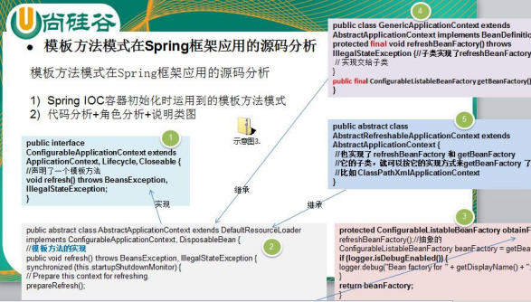</td></tr></table>代码分析+角色分析+说明类图

    
3)&nbsp;针对源码的类图(说明层次关系)

 

    
&nbsp;

    
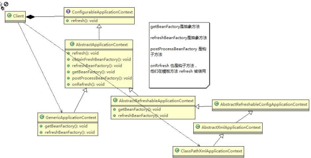&nbsp;

    
&nbsp;

    <h2 style="margin-top:0.0000pt;margin-right:0.0000pt;margin-bottom:0.0000pt;
margin-left:46.9000pt;text-indent:-36.0000pt;text-align:left;
line-height:29.4500pt;mso-line-height-rule:exactly;mso-list:l193 level2 lfo165;">16.7&nbsp;模板方法模式的注意事项和细节</h2>
    
&nbsp;
    

    
1)&nbsp;基本思想是：算法只存在于一个地方，也就是在父类中，容易修改。需要修改算法时，只要修改父类的模板方法或者已经实现的某些步骤，子类就会继承这些修改

    
2)&nbsp;实现了最大化代码复用。父类的模板方法和已实现的某些步骤会被子类继承而直接使用。

    
3)&nbsp;既统一了算法，也提供了很大的灵活性。父类的模板方法确保了算法的结构保持不变，同时由子类提供部分步骤的实现。

    
4)&nbsp;该模式的不足之处：每一个不同的实现都需要一个子类实现，导致类的个数增加，使得系统更加庞大

    
5)&nbsp;一般模板方法都加上 final 关键字， 防止子类重写模板方法.

    
6)&nbsp;模板方法模式使用场景：当要完成在某个过程，该过程要执行一系列步骤 ，这一系列的步骤基本相同，但其个别步骤在实现时 可能不同，通常考虑用模板方法模式来处理

 

<h1 align=center style="margin-right:17.9500pt;text-align:center;line-height:42.3000pt;
mso-line-height-rule:exactly;">第 17&#9;章命令模式</h1>
    <h2 style="margin-top:0.0000pt;margin-right:0.0000pt;margin-bottom:0.0000pt;
margin-left:46.9000pt;text-indent:-36.0000pt;text-align:left;
line-height:31.9000pt;mso-line-height-rule:exactly;mso-list:l178 level2 lfo173;">17.1&nbsp;智能生活项目需求</h2>
    
<table
            cellpadding="0" cellspacing="0"><tr><td width="126.533" height="0"></td></tr><tr><td></td><td></td></tr></table>看一个具体的需求

    
&nbsp;
    

    
1)&nbsp;我们买了一套智能家电，有照明灯、风扇、冰箱、洗衣机，我们只要在手机上安装 app&nbsp;就可以控制对这些家电工作。

    
2)&nbsp;这些智能家电来自不同的厂家，我们不想针对每一种家电都安装一个 App，分别控制，我们希望只要一个 app

    
就可以控制全部智能家电。

    
3)&nbsp;要实现一个 app 控制所有智能家电的需要，则每个智能家电厂家都要提供一个统一的接口给 app&nbsp;调用，这时 就可以考虑使用命令模式。

    
4)&nbsp;命令模式可将&#8220;动作的请求者&#8221;从&#8220;动作的执行者&#8221;对象中解耦出来.

    
5)&nbsp;在我们的例子中，动作的请求者是手机 app，动作的执行者是每个厂商的一个家电产品

    <h2 style="margin-top:0.0000pt;margin-right:0.0000pt;margin-bottom:0.0000pt;
margin-left:46.9000pt;text-indent:-36.0000pt;text-align:left;
line-height:31.5500pt;mso-line-height-rule:exactly;mso-list:l178 level2 lfo173;">17.2&nbsp;命令模式基本介绍</h2>
    
1)&nbsp;命令模式（Command&nbsp;Pattern）：在软件设计中，我们经常需要向某些对象发送请求，但是并不知道请求的接收者是谁，也不知道被请求的操作是哪个，

    
我们只需在程序运行时指定具体的请求接收者即可，此时，可以使用命令模式来进行设计

    
2)&nbsp;命名模式使得请求发送者与请求接收者消除彼此之间的耦合，让对象之间的调用关系更加灵活，实现解耦。

    
3)&nbsp;在命名模式中，会将一个请求封装为一个对象，以便使用不同参数来表示不同的请求(即命名)，同时命令模式也支持可撤销的操作。

 

4)&nbsp;通俗易懂的理解：将军发布命令，士兵去执行。其中有几个角色：将军（命令发布者）、士兵（命令的具体执行者）、命令(连接将军和士兵)。

    
Invoker 是调用者（将军），Receiver 是被调用者（士兵），MyCommand 是命令，实现了 Command 接口，持有接收对象

    <h2 style="margin-top:0.0000pt;margin-right:0.0000pt;margin-bottom:0.0000pt;
margin-left:46.9000pt;text-indent:-36.0000pt;text-align:left;
line-height:31.9500pt;mso-line-height-rule:exactly;mso-list:l178 level2 lfo173;">17.3&nbsp;命令模式的原理类图</h2>
    
<table cellpadding="0" cellspacing="0"><tr><td
            width="157.267" height="0"></td></tr><tr><td></td><td>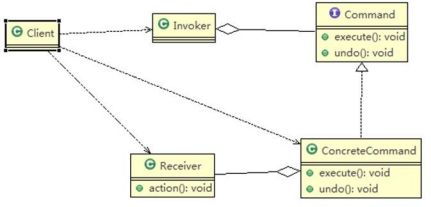</td></tr></table>&nbsp;
    

    
&nbsp;
    

    
&#216;&nbsp;对原理类图的说明-即(命名模式的角色及职责)

    
1)&nbsp;Invoker 是调用者角色

    
2)&nbsp;Command:&nbsp;是命令角色，需要执行的所有命令都在这里，可以是接口或抽象类

    
3)&nbsp;Receiver: 接受者角色，知道如何实施和执行一个请求相关的操作

    
4)&nbsp;ConcreteCommand:&nbsp;将一个接受者对象与一个动作绑定，调用接受者相应的操作，实现 execute

    <h2 style="margin-top:0.0000pt;margin-right:0.0000pt;margin-bottom:0.0000pt;
margin-left:46.9000pt;text-indent:-36.0000pt;text-align:left;
line-height:31.5500pt;mso-line-height-rule:exactly;mso-list:l178 level2 lfo173;">17.4&nbsp;命令模式解决智能生活项目</h2>
    
应用实例要求

    
1)&nbsp;编写程序，使用命令模式 完成前面的智能家电项目

    
2)&nbsp;思路分析和图解

 

    
&nbsp;
    

    
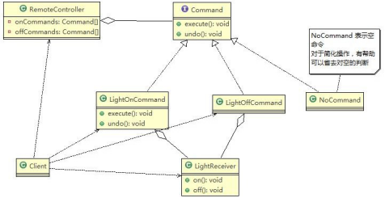&nbsp;
    

    
&nbsp;
    

    
3)&nbsp;代码实现

    
&nbsp;
    

    
command.zip

    
&nbsp;
    

    <table class=MsoNormalTable border=1 cellspacing=0 style="border-collapse:collapse;margin-left:10.9000pt;mso-table-layout-alt:fixed;
border:none;mso-border-left-alt:0.5000pt solid rgb(0,0,0);mso-border-top-alt:0.5000pt solid rgb(0,0,0);
mso-border-right-alt:0.5000pt solid rgb(0,0,0);mso-border-bottom-alt:0.5000pt solid rgb(0,0,0);mso-border-insideh:0.5000pt solid rgb(0,0,0);
mso-border-insidev:0.5000pt solid rgb(0,0,0);mso-padding-alt:0.0000pt 0.0000pt 0.0000pt 0.0000pt ;">
        <tr style="height:327.4500pt;">
            <td width=808 valign=top style="width:606.0000pt;padding:0.0000pt 0.0000pt 0.0000pt 0.0000pt ;border-left:1.0000pt solid rgb(0,0,0);
mso-border-left-alt:0.5000pt solid rgb(0,0,0);border-right:1.0000pt solid rgb(0,0,0);mso-border-right-alt:0.5000pt solid rgb(0,0,0);
border-top:1.0000pt solid rgb(0,0,0);mso-border-top-alt:0.5000pt solid rgb(0,0,0);border-bottom:1.0000pt solid rgb(0,0,0);
mso-border-bottom-alt:0.5000pt solid rgb(0,0,0);">
package com.atguigu.command;

                
&nbsp;

                
public class Client {

                
&nbsp;

                
public static void main(String[] args) {

                
// TODO Auto-generated method stub

                
&nbsp;

                
//使用命令设计模式，完成通过遥控器，对电灯的操作

                
&nbsp;

                
//创建电灯的对象(接受者)

                
LightReceiver lightReceiver = new LightReceiver();

                
&nbsp;

                
//创建电灯相关的开关命令

                
LightOnCommand lightOnCommand = new LightOnCommand(lightReceiver);
</td>
        </tr>
    </table>

 

    
&nbsp;

    <table class=MsoNormalTable border=1 cellspacing=0 style="border-collapse:collapse;margin-left:10.9000pt;mso-table-layout-alt:fixed;
border:none;mso-border-left-alt:0.5000pt solid rgb(0,0,0);mso-border-top-alt:0.5000pt solid rgb(0,0,0);
mso-border-right-alt:0.5000pt solid rgb(0,0,0);mso-border-bottom-alt:0.5000pt solid rgb(0,0,0);mso-border-insideh:0.5000pt solid rgb(0,0,0);
mso-border-insidev:0.5000pt solid rgb(0,0,0);mso-padding-alt:0.0000pt 0.0000pt 0.0000pt 0.0000pt ;">
        <tr style="height:608.3000pt;">
            <td width=808 valign=top style="width:606.0000pt;padding:0.0000pt 0.0000pt 0.0000pt 0.0000pt ;border-left:1.0000pt solid rgb(0,0,0);
mso-border-left-alt:0.5000pt solid rgb(0,0,0);border-right:1.0000pt solid rgb(0,0,0);mso-border-right-alt:0.5000pt solid rgb(0,0,0);
border-top:1.0000pt solid rgb(0,0,0);mso-border-top-alt:0.5000pt solid rgb(0,0,0);border-bottom:1.0000pt solid rgb(0,0,0);
mso-border-bottom-alt:0.5000pt solid rgb(0,0,0);">
LightOffCommand lightOffCommand = new LightOffCommand(lightReceiver);

                
&nbsp;
                

                
//需要一个遥控器

                
RemoteController remoteController = new RemoteController();

                
&nbsp;
                

                
//给我们的遥控器设置命令, 比如 no = 0 &nbsp;是电灯的开和关的操作

                
remoteController.setCommand(0, lightOnCommand, lightOffCommand);

                
&nbsp;
                

                
System.out.println("--------按下灯的开按钮-----------"); remoteController.onButtonWasPushed(0); System.out.println("--------按下灯的关按钮-----------"); remoteController.offButtonWasPushed(0); System.out.println("--------按下撤销按钮-----------"); remoteController.undoButtonWasPushed();

                
&nbsp;
                

                
&nbsp;
                

                
&nbsp;

                
System.out.println("=========使用遥控器操作电视机=========="); TVReceiver tvReceiver = new TVReceiver();

                
&nbsp;

                
TVOffCommand tvOffCommand = new TVOffCommand(tvReceiver); TVOnCommand tvOnCommand = new TVOnCommand(tvReceiver);

                
&nbsp;

                
//给我们的遥控器设置命令, 比如 no = 1 &nbsp;是电视机的开和关的操作

                
remoteController.setCommand(1, tvOnCommand, tvOffCommand);
</td>
        </tr>
    </table>

 

    <table class=MsoNormalTable border=1 cellspacing=0 style="border-collapse:collapse;margin-left:10.9000pt;mso-table-layout-alt:fixed;
border:none;mso-border-left-alt:0.5000pt solid rgb(0,0,0);mso-border-top-alt:0.5000pt solid rgb(0,0,0);
mso-border-right-alt:0.5000pt solid rgb(0,0,0);mso-border-bottom-alt:0.5000pt solid rgb(0,0,0);mso-border-insideh:0.5000pt solid rgb(0,0,0);
mso-border-insidev:0.5000pt solid rgb(0,0,0);mso-padding-alt:0.0000pt 0.0000pt 0.0000pt 0.0000pt ;">
        <tr style="height:257.4000pt;">
            <td width=808 valign=top style="width:606.0000pt;padding:0.0000pt 0.0000pt 0.0000pt 0.0000pt ;border-left:1.0000pt solid rgb(0,0,0);
mso-border-left-alt:0.5000pt solid rgb(0,0,0);border-right:1.0000pt solid rgb(0,0,0);mso-border-right-alt:0.5000pt solid rgb(0,0,0);
border-top:1.0000pt solid rgb(0,0,0);mso-border-top-alt:0.5000pt solid rgb(0,0,0);border-bottom:1.0000pt solid rgb(0,0,0);
mso-border-bottom-alt:0.5000pt solid rgb(0,0,0);">

                System.out.println("--------按下电视机的开按钮-----------");

                
remoteController.onButtonWasPushed(1); System.out.println("--------按下电视机的关按钮-----------"); remoteController.offButtonWasPushed(1); System.out.println("-------- 按 下 撤 销 按 钮 -----------"); remoteController.undoButtonWasPushed();

                
&nbsp;
                

                
&nbsp;

                
}

                
&nbsp;
                

                
&nbsp;

                
}
</td>
        </tr>
        <tr style="height:280.8000pt;">
            <td width=808 valign=top style="width:606.0000pt;padding:0.0000pt 0.0000pt 0.0000pt 0.0000pt ;border-left:1.0000pt solid rgb(0,0,0);
mso-border-left-alt:0.5000pt solid rgb(0,0,0);border-right:1.0000pt solid rgb(0,0,0);mso-border-right-alt:0.5000pt solid rgb(0,0,0);
border-top:none;mso-border-top-alt:0.5000pt solid rgb(0,0,0);border-bottom:1.0000pt solid rgb(0,0,0);
mso-border-bottom-alt:0.5000pt solid rgb(0,0,0);">
package com.atguigu.command;

                
&nbsp;
                

                
&nbsp;
                

                
&nbsp;

                
//创建命令接口

                
public interface Command {

                
&nbsp;
                

                
//执行动作(操作) public void execute();

                
//撤销动作(操作) public void undo();

                
}
</td>
        </tr>
        <tr style="height:70.1000pt;">
            <td width=808 valign=top style="width:606.0000pt;padding:0.0000pt 0.0000pt 0.0000pt 0.0000pt ;border-left:1.0000pt solid rgb(0,0,0);
mso-border-left-alt:0.5000pt solid rgb(0,0,0);border-right:1.0000pt solid rgb(0,0,0);mso-border-right-alt:0.5000pt solid rgb(0,0,0);
border-top:none;mso-border-top-alt:0.5000pt solid rgb(0,0,0);border-bottom:1.0000pt solid rgb(0,0,0);
mso-border-bottom-alt:0.5000pt solid rgb(0,0,0);">
package com.atguigu.command;

                
&nbsp;
                

                
&nbsp;

                
public class LightOffCommand implements Command {
</td>
        </tr>
    </table>

 

    
&nbsp;

    <table class=MsoNormalTable border=1 cellspacing=0 style="border-collapse:collapse;margin-left:10.9000pt;mso-table-layout-alt:fixed;
border:none;mso-border-left-alt:0.5000pt solid rgb(0,0,0);mso-border-top-alt:0.5000pt solid rgb(0,0,0);
mso-border-right-alt:0.5000pt solid rgb(0,0,0);mso-border-bottom-alt:0.5000pt solid rgb(0,0,0);mso-border-insideh:0.5000pt solid rgb(0,0,0);
mso-border-insidev:0.5000pt solid rgb(0,0,0);mso-padding-alt:0.0000pt 0.0000pt 0.0000pt 0.0000pt ;">
        <tr style="height:608.3000pt;">
            <td width=808 valign=top style="width:606.0000pt;padding:0.0000pt 0.0000pt 0.0000pt 0.0000pt ;border-left:1.0000pt solid rgb(0,0,0);
mso-border-left-alt:0.5000pt solid rgb(0,0,0);border-right:1.0000pt solid rgb(0,0,0);mso-border-right-alt:0.5000pt solid rgb(0,0,0);
border-top:1.0000pt solid rgb(0,0,0);mso-border-top-alt:0.5000pt solid rgb(0,0,0);border-bottom:1.0000pt solid rgb(0,0,0);
mso-border-bottom-alt:0.5000pt solid rgb(0,0,0);">
                
&nbsp;

                
// 聚 合 LightReceiver LightReceiver light;

                
//&nbsp;构造器

                
public LightOffCommand(LightReceiver light) { super();

                
this.light = light;

                
}

                
&nbsp;
                

                
&nbsp;

                
@Override

                
public void execute() {

                
// TODO Auto-generated method stub

                
//&nbsp;调用接收者的方法

                
light.off();

                
}

                
&nbsp;
                

                
&nbsp;

                
@Override

                
public void undo() {

                
// TODO Auto-generated method stub

                
//&nbsp;调用接收者的方法

                
light.on();

                
}

                
}
</td>
        </tr>
    </table>

 

    
&nbsp;

    <table class=MsoNormalTable border=1 cellspacing=0 style="border-collapse:collapse;margin-left:10.9000pt;mso-table-layout-alt:fixed;
border:none;mso-border-left-alt:0.5000pt solid rgb(0,0,0);mso-border-top-alt:0.5000pt solid rgb(0,0,0);
mso-border-right-alt:0.5000pt solid rgb(0,0,0);mso-border-bottom-alt:0.5000pt solid rgb(0,0,0);mso-border-insideh:0.5000pt solid rgb(0,0,0);
mso-border-insidev:0.5000pt solid rgb(0,0,0);mso-padding-alt:0.0000pt 0.0000pt 0.0000pt 0.0000pt ;">
        <tr style="height:608.3000pt;">
            <td width=808 valign=top style="width:606.0000pt;padding:0.0000pt 0.0000pt 0.0000pt 0.0000pt ;border-left:1.0000pt solid rgb(0,0,0);
mso-border-left-alt:0.5000pt solid rgb(0,0,0);border-right:1.0000pt solid rgb(0,0,0);mso-border-right-alt:0.5000pt solid rgb(0,0,0);
border-top:1.0000pt solid rgb(0,0,0);mso-border-top-alt:0.5000pt solid rgb(0,0,0);border-bottom:1.0000pt solid rgb(0,0,0);
mso-border-bottom-alt:0.5000pt solid rgb(0,0,0);">
package com.atguigu.command;

                
&nbsp;
                

                
&nbsp;

                
public class LightOnCommand implements Command {

                
&nbsp;
                

                
//聚合 LightReceiver LightReceiver light;

                
//构造器

                
public LightOnCommand(LightReceiver light) { super();

                
this.light = light;

                
}

                
&nbsp;
                

                
&nbsp;

                
@Override

                
public void execute() {

                
// TODO Auto-generated method stub

                
//调用接收者的方法 light.on();

                
}

                
&nbsp;
                

                
&nbsp;
                

                
&nbsp;
                

                
&nbsp;
                

                
&nbsp;

                
@Override

                
public void undo() {

                
// TODO Auto-generated method stub
</td>
        </tr>
    </table>

 

    <table class=MsoNormalTable border=1 cellspacing=0 style="border-collapse:collapse;margin-left:10.9000pt;mso-table-layout-alt:fixed;
border:none;mso-border-left-alt:0.5000pt solid rgb(0,0,0);mso-border-top-alt:0.5000pt solid rgb(0,0,0);
mso-border-right-alt:0.5000pt solid rgb(0,0,0);mso-border-bottom-alt:0.5000pt solid rgb(0,0,0);mso-border-insideh:0.5000pt solid rgb(0,0,0);
mso-border-insidev:0.5000pt solid rgb(0,0,0);mso-padding-alt:0.0000pt 0.0000pt 0.0000pt 0.0000pt ;">
        <tr style="height:140.4000pt;">
            <td width=808 valign=top style="width:606.0000pt;padding:0.0000pt 0.0000pt 0.0000pt 0.0000pt ;border-left:1.0000pt solid rgb(0,0,0);
mso-border-left-alt:0.5000pt solid rgb(0,0,0);border-right:1.0000pt solid rgb(0,0,0);mso-border-right-alt:0.5000pt solid rgb(0,0,0);
border-top:1.0000pt solid rgb(0,0,0);mso-border-top-alt:0.5000pt solid rgb(0,0,0);border-bottom:1.0000pt solid rgb(0,0,0);
mso-border-bottom-alt:0.5000pt solid rgb(0,0,0);">

                //调用接收者的方法

                
light.off();

                
}

                
&nbsp;
                

                
&nbsp;

                
}
</td>
        </tr>
        <tr style="height:304.1500pt;">
            <td width=808 valign=top style="width:606.0000pt;padding:0.0000pt 0.0000pt 0.0000pt 0.0000pt ;border-left:1.0000pt solid rgb(0,0,0);
mso-border-left-alt:0.5000pt solid rgb(0,0,0);border-right:1.0000pt solid rgb(0,0,0);mso-border-right-alt:0.5000pt solid rgb(0,0,0);
border-top:none;mso-border-top-alt:0.5000pt solid rgb(0,0,0);border-bottom:1.0000pt solid rgb(0,0,0);
mso-border-bottom-alt:0.5000pt solid rgb(0,0,0);">
package com.atguigu.command;

                
&nbsp;
                

                
&nbsp;

                
public class LightReceiver {

                
&nbsp;
                

                
&nbsp;

                
public void on() {

                
System.out.println(" 电灯打开了.. ");

                
}

                
&nbsp;
                

                
&nbsp;

                
public void off() {

                
System.out.println(" 电灯关闭了.. ");

                
}

                
}
</td>
        </tr>
        <tr style="height:163.7000pt;">
            <td width=808 valign=top style="width:606.0000pt;padding:0.0000pt 0.0000pt 0.0000pt 0.0000pt ;border-left:1.0000pt solid rgb(0,0,0);
mso-border-left-alt:0.5000pt solid rgb(0,0,0);border-right:1.0000pt solid rgb(0,0,0);mso-border-right-alt:0.5000pt solid rgb(0,0,0);
border-top:none;mso-border-top-alt:0.5000pt solid rgb(0,0,0);border-bottom:1.0000pt solid rgb(0,0,0);
mso-border-bottom-alt:0.5000pt solid rgb(0,0,0);">
package com.atguigu.command;

                
&nbsp;
                

                
&nbsp;

                
/**

                
*&nbsp;没有任何命令，即空执行: 用于初始化每个按钮, 当调用空命令时，对象什么都不做

                
*&nbsp;其实，这样是一种设计模式, 可以省掉对空判断

                
*&nbsp;@author&nbsp;Administrator

                
*
</td>
        </tr>
    </table>

 

    
&nbsp;

    <table class=MsoNormalTable border=1 cellspacing=0 style="border-collapse:collapse;margin-left:10.9000pt;mso-table-layout-alt:fixed;
border:none;mso-border-left-alt:0.5000pt solid rgb(0,0,0);mso-border-top-alt:0.5000pt solid rgb(0,0,0);
mso-border-right-alt:0.5000pt solid rgb(0,0,0);mso-border-bottom-alt:0.5000pt solid rgb(0,0,0);mso-border-insideh:0.5000pt solid rgb(0,0,0);
mso-border-insidev:0.5000pt solid rgb(0,0,0);mso-padding-alt:0.0000pt 0.0000pt 0.0000pt 0.0000pt ;">
        <tr style="height:397.8000pt;">
            <td width=808 valign=top style="width:606.0000pt;padding:0.0000pt 0.0000pt 0.0000pt 0.0000pt ;border-left:1.0000pt solid rgb(0,0,0);
mso-border-left-alt:0.5000pt solid rgb(0,0,0);border-right:1.0000pt solid rgb(0,0,0);mso-border-right-alt:0.5000pt solid rgb(0,0,0);
border-top:1.0000pt solid rgb(0,0,0);mso-border-top-alt:0.5000pt solid rgb(0,0,0);border-bottom:1.0000pt solid rgb(0,0,0);
mso-border-bottom-alt:0.5000pt solid rgb(0,0,0);">
*/

                
public class NoCommand implements Command {

                
&nbsp;
                

                
&nbsp;

                
@Override

                
public void execute() {

                
// TODO Auto-generated method stub

                
&nbsp;
                

                
&nbsp;

                
}

                
&nbsp;
                

                
&nbsp;

                
@Override

                
public void undo() {

                
// TODO Auto-generated method stub

                
&nbsp;
                

                
&nbsp;

                
}

                
&nbsp;
                

                
&nbsp;

                
}
</td>
        </tr>
        <tr style="height:210.5000pt;">
            <td width=808 valign=top style="width:606.0000pt;padding:0.0000pt 0.0000pt 0.0000pt 0.0000pt ;border-left:1.0000pt solid rgb(0,0,0);
mso-border-left-alt:0.5000pt solid rgb(0,0,0);border-right:1.0000pt solid rgb(0,0,0);mso-border-right-alt:0.5000pt solid rgb(0,0,0);
border-top:none;mso-border-top-alt:0.5000pt solid rgb(0,0,0);border-bottom:1.0000pt solid rgb(0,0,0);
mso-border-bottom-alt:0.5000pt solid rgb(0,0,0);">
package&nbsp;com.atguigu.command;

                
&nbsp;
                

                
&nbsp;

                
public class RemoteController&nbsp;{

                
&nbsp;
                

                
//&nbsp;开 按钮的命令数组

                
Command[] onCommands; Command[] offCommands;

                
&nbsp;

                
//&nbsp;执行撤销的命令
</td>
        </tr>
    </table>

 

    
&nbsp;

    <table class=MsoNormalTable border=1 cellspacing=0 style="border-collapse:collapse;margin-left:10.9000pt;mso-table-layout-alt:fixed;
border:none;mso-border-left-alt:0.5000pt solid rgb(0,0,0);mso-border-top-alt:0.5000pt solid rgb(0,0,0);
mso-border-right-alt:0.5000pt solid rgb(0,0,0);mso-border-bottom-alt:0.5000pt solid rgb(0,0,0);mso-border-insideh:0.5000pt solid rgb(0,0,0);
mso-border-insidev:0.5000pt solid rgb(0,0,0);mso-padding-alt:0.0000pt 0.0000pt 0.0000pt 0.0000pt ;">
        <tr style="height:608.3000pt;">
            <td width=808 valign=top style="width:606.0000pt;padding:0.0000pt 0.0000pt 0.0000pt 0.0000pt ;border-left:1.0000pt solid rgb(0,0,0);
mso-border-left-alt:0.5000pt solid rgb(0,0,0);border-right:1.0000pt solid rgb(0,0,0);mso-border-right-alt:0.5000pt solid rgb(0,0,0);
border-top:1.0000pt solid rgb(0,0,0);mso-border-top-alt:0.5000pt solid rgb(0,0,0);border-bottom:1.0000pt solid rgb(0,0,0);
mso-border-bottom-alt:0.5000pt solid rgb(0,0,0);">
Command undoCommand;

                
&nbsp;
                

                
//&nbsp;构造器，完成对按钮初始化

                
&nbsp;
                

                
&nbsp;

                
public RemoteController() {

                
&nbsp;
                

                
&nbsp;

                
onCommands = new Command[5]; offCommands = new Command[5];

                
&nbsp;
                

                
for (int i = 0; i &#60; 5; i++) {

                
onCommands[i] = new NoCommand(); offCommands[i] = new&nbsp;NoCommand();

                
}

                
}

                
&nbsp;
                

                
//&nbsp;给我们的按钮设置你需要的命令

                
public void setCommand(int no, Command onCommand, Command offCommand) { onCommands[no] = onCommand;

                
offCommands[no] = offCommand;

                
}

                
&nbsp;
                

                
//&nbsp;按下开按钮

                
public void onButtonWasPushed(int no) { // no 0

                
//&nbsp;找到你按下的开的按钮， 并调用对应方法

                
onCommands[no].execute();

                
//&nbsp;记录这次的操作，用于撤销
</td>
        </tr>
    </table>

 

    
&nbsp;

    <table class=MsoNormalTable border=1 cellspacing=0 style="border-collapse:collapse;margin-left:10.9000pt;mso-table-layout-alt:fixed;
border:none;mso-border-left-alt:0.5000pt solid rgb(0,0,0);mso-border-top-alt:0.5000pt solid rgb(0,0,0);
mso-border-right-alt:0.5000pt solid rgb(0,0,0);mso-border-bottom-alt:0.5000pt solid rgb(0,0,0);mso-border-insideh:0.5000pt solid rgb(0,0,0);
mso-border-insidev:0.5000pt solid rgb(0,0,0);mso-padding-alt:0.0000pt 0.0000pt 0.0000pt 0.0000pt ;">
        <tr style="height:468.0000pt;">
            <td width=808 valign=top style="width:606.0000pt;padding:0.0000pt 0.0000pt 0.0000pt 0.0000pt ;border-left:1.0000pt solid rgb(0,0,0);
mso-border-left-alt:0.5000pt solid rgb(0,0,0);border-right:1.0000pt solid rgb(0,0,0);mso-border-right-alt:0.5000pt solid rgb(0,0,0);
border-top:1.0000pt solid rgb(0,0,0);mso-border-top-alt:0.5000pt solid rgb(0,0,0);border-bottom:1.0000pt solid rgb(0,0,0);
mso-border-bottom-alt:0.5000pt solid rgb(0,0,0);">
undoCommand = onCommands[no];

                
&nbsp;
                

                
&nbsp;

                
}

                
&nbsp;
                

                
//&nbsp;按下开按钮

                
public void offButtonWasPushed(int no) { // no 0

                
//&nbsp;找到你按下的关的按钮， 并调用对应方法

                
offCommands[no].execute();

                
//&nbsp;记录这次的操作，用于撤销

                
undoCommand = offCommands[no];

                
&nbsp;
                

                
&nbsp;

                
}

                
&nbsp;
                

                
//&nbsp;按下撤销按钮

                
public void undoButtonWasPushed() { undoCommand.undo();

                
}

                
&nbsp;
                

                
&nbsp;

                
}
</td>
        </tr>
        <tr style="height:140.3000pt;">
            <td width=808 valign=top style="width:606.0000pt;padding:0.0000pt 0.0000pt 0.0000pt 0.0000pt ;border-left:1.0000pt solid rgb(0,0,0);
mso-border-left-alt:0.5000pt solid rgb(0,0,0);border-right:1.0000pt solid rgb(0,0,0);mso-border-right-alt:0.5000pt solid rgb(0,0,0);
border-top:none;mso-border-top-alt:0.5000pt solid rgb(0,0,0);border-bottom:1.0000pt solid rgb(0,0,0);
mso-border-bottom-alt:0.5000pt solid rgb(0,0,0);">
package com.atguigu.command;

                
&nbsp;
                

                
&nbsp;

                
public class TVOffCommand implements Command {

                
&nbsp;
                

                
// 聚 合 TVReceiver
</td>
        </tr>
    </table>

 

    
&nbsp;

    <table class=MsoNormalTable border=1 cellspacing=0 style="border-collapse:collapse;margin-left:10.9000pt;mso-table-layout-alt:fixed;
border:none;mso-border-left-alt:0.5000pt solid rgb(0,0,0);mso-border-top-alt:0.5000pt solid rgb(0,0,0);
mso-border-right-alt:0.5000pt solid rgb(0,0,0);mso-border-bottom-alt:0.5000pt solid rgb(0,0,0);mso-border-insideh:0.5000pt solid rgb(0,0,0);
mso-border-insidev:0.5000pt solid rgb(0,0,0);mso-padding-alt:0.0000pt 0.0000pt 0.0000pt 0.0000pt ;">
        <tr style="height:538.2000pt;">
            <td width=808 valign=top style="width:606.0000pt;padding:0.0000pt 0.0000pt 0.0000pt 0.0000pt ;border-left:1.0000pt solid rgb(0,0,0);
mso-border-left-alt:0.5000pt solid rgb(0,0,0);border-right:1.0000pt solid rgb(0,0,0);mso-border-right-alt:0.5000pt solid rgb(0,0,0);
border-top:1.0000pt solid rgb(0,0,0);mso-border-top-alt:0.5000pt solid rgb(0,0,0);border-bottom:1.0000pt solid rgb(0,0,0);
mso-border-bottom-alt:0.5000pt solid rgb(0,0,0);">
TVReceiver tv;

                
&nbsp;
                

                
//&nbsp;构造器

                
public TVOffCommand(TVReceiver tv) { super();

                
this.tv = tv;

                
}

                
&nbsp;
                

                
&nbsp;

                
@Override

                
public void execute() {

                
// TODO Auto-generated method stub

                
//&nbsp;调用接收者的方法

                
tv.off();

                
}

                
&nbsp;
                

                
&nbsp;

                
@Override

                
public void undo() {

                
// TODO Auto-generated method stub

                
//&nbsp;调用接收者的方法

                
tv.on();

                
}

                
}
</td>
        </tr>
        <tr style="height:70.1000pt;">
            <td width=808 valign=top style="width:606.0000pt;padding:0.0000pt 0.0000pt 0.0000pt 0.0000pt ;border-left:1.0000pt solid rgb(0,0,0);
mso-border-left-alt:0.5000pt solid rgb(0,0,0);border-right:1.0000pt solid rgb(0,0,0);mso-border-right-alt:0.5000pt solid rgb(0,0,0);
border-top:none;mso-border-top-alt:0.5000pt solid rgb(0,0,0);border-bottom:1.0000pt solid rgb(0,0,0);
mso-border-bottom-alt:0.5000pt solid rgb(0,0,0);">
package com.atguigu.command;

                
&nbsp;
                

                
&nbsp;

                
public class TVOnCommand implements Command {
</td>
        </tr>
    </table>

 

    
&nbsp;

    <table class=MsoNormalTable border=1 cellspacing=0 style="border-collapse:collapse;margin-left:10.9000pt;mso-table-layout-alt:fixed;
border:none;mso-border-left-alt:0.5000pt solid rgb(0,0,0);mso-border-top-alt:0.5000pt solid rgb(0,0,0);
mso-border-right-alt:0.5000pt solid rgb(0,0,0);mso-border-bottom-alt:0.5000pt solid rgb(0,0,0);mso-border-insideh:0.5000pt solid rgb(0,0,0);
mso-border-insidev:0.5000pt solid rgb(0,0,0);mso-padding-alt:0.0000pt 0.0000pt 0.0000pt 0.0000pt ;">
        <tr style="height:608.3000pt;">
            <td width=808 valign=top style="width:606.0000pt;padding:0.0000pt 0.0000pt 0.0000pt 0.0000pt ;border-left:1.0000pt solid rgb(0,0,0);
mso-border-left-alt:0.5000pt solid rgb(0,0,0);border-right:1.0000pt solid rgb(0,0,0);mso-border-right-alt:0.5000pt solid rgb(0,0,0);
border-top:1.0000pt solid rgb(0,0,0);mso-border-top-alt:0.5000pt solid rgb(0,0,0);border-bottom:1.0000pt solid rgb(0,0,0);
mso-border-bottom-alt:0.5000pt solid rgb(0,0,0);">
                
&nbsp;

                
// 聚 合 TVReceiver TVReceiver tv;

                
//&nbsp;构造器

                
public TVOnCommand(TVReceiver tv) { super();

                
this.tv = tv;

                
}

                
&nbsp;
                

                
&nbsp;

                
@Override

                
public void execute() {

                
// TODO Auto-generated method stub

                
//&nbsp;调用接收者的方法

                
tv.on();

                
}

                
&nbsp;
                

                
&nbsp;

                
@Override

                
public void undo() {

                
// TODO Auto-generated method stub

                
//&nbsp;调用接收者的方法

                
tv.off();

                
}

                
}
</td>
        </tr>
    </table>

 

    
&nbsp;

    <table class=MsoNormalTable border=1 cellspacing=0 style="border-collapse:collapse;margin-left:10.9000pt;mso-table-layout-alt:fixed;
border:none;mso-border-left-alt:0.5000pt solid rgb(0,0,0);mso-border-top-alt:0.5000pt solid rgb(0,0,0);
mso-border-right-alt:0.5000pt solid rgb(0,0,0);mso-border-bottom-alt:0.5000pt solid rgb(0,0,0);mso-border-insideh:0.5000pt solid rgb(0,0,0);
mso-border-insidev:0.5000pt solid rgb(0,0,0);mso-padding-alt:0.0000pt 0.0000pt 0.0000pt 0.0000pt ;">
        <tr style="height:280.8000pt;">
            <td width=808 valign=top style="width:606.0000pt;padding:0.0000pt 0.0000pt 0.0000pt 0.0000pt ;border-left:1.0000pt solid rgb(0,0,0);
mso-border-left-alt:0.5000pt solid rgb(0,0,0);border-right:1.0000pt solid rgb(0,0,0);mso-border-right-alt:0.5000pt solid rgb(0,0,0);
border-top:1.0000pt solid rgb(0,0,0);mso-border-top-alt:0.5000pt solid rgb(0,0,0);border-bottom:1.0000pt solid rgb(0,0,0);
mso-border-bottom-alt:0.5000pt solid rgb(0,0,0);">
package com.atguigu.command;

                
&nbsp;
                

                
&nbsp;

                
public class TVReceiver {

                
&nbsp;
                

                
&nbsp;

                
public void on() {

                
System.out.println(" 电视机打开了.. ");

                
}

                
&nbsp;
                

                
&nbsp;

                
public void off() {

                
System.out.println(" 电视机关闭了.. ");

                
}

                
}
</td>
        </tr>
    </table>
    
&nbsp;

    
&nbsp;

    <h2 style="margin-top:0.0000pt;margin-right:0.0000pt;margin-bottom:0.0000pt;
margin-left:46.9000pt;text-indent:-36.0000pt;text-align:left;
line-height:29.5000pt;mso-line-height-rule:exactly;mso-list:l178 level2 lfo173;">17.5&nbsp;命令模式在 Spring 框架 JdbcTemplate&nbsp;应用的源码分析</h2>
    
&nbsp;
    

    
1)&nbsp;Spring&nbsp;框架的 JdbcTemplate&nbsp;就使用到了命令模式

    
2)&nbsp;<table cellpadding="0" cellspacing="0"><tr><td
            width="94.5333" height="0"></td></tr><tr><td></td><td>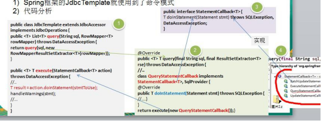</td></tr></table>代码分析

    
3)&nbsp;模式角色分析说明

 

&#108;&nbsp;StatementCallback&nbsp;接口 ,类似命令接口(Command)

    
&#108;&nbsp;class&nbsp;QueryStatementCallback&nbsp;implements&nbsp;StatementCallback&#60;T&#62;, SqlProvider&nbsp;, 匿名内部类， 实现了命令接口， 同时也充当命令接收者

    
&#108;&nbsp;命令调用者&nbsp;是&nbsp;JdbcTemplate&nbsp;,&nbsp;其中&nbsp;execute(StatementCallback&#60;T&#62;&nbsp;action)&nbsp;方法中，调用&nbsp;action.doInStatement&nbsp;方法.&#9;不同的&nbsp;实现&nbsp;StatementCallback&nbsp;接口的对象，对应不同的&nbsp;doInStatemnt &nbsp;实现逻辑

    
&#108;&nbsp;另外实现 &nbsp;StatementCallback&nbsp;命令接口的子类还有&#9;QueryStatementCallback、

    
<table cellpadding="0" cellspacing="0"><tr><td
            width="126.533" height="0"></td></tr><tr><td></td><td>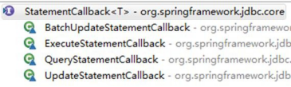</td></tr></table>&nbsp;
    

    
&nbsp;
    

    <h2 style="margin-top:0.0000pt;margin-right:0.0000pt;margin-bottom:0.0000pt;
margin-left:46.9000pt;text-indent:-36.0000pt;text-align:left;
line-height:29.4500pt;mso-line-height-rule:exactly;mso-list:l178 level2 lfo173;">17.6&nbsp;命令模式的注意事项和细节</h2>
    
&nbsp;
    

    
1)&nbsp;将发起请求的对象与执行请求的对象解耦。发起请求的对象是调用者，调用者只要调用命令对象的 execute()方法就可以让接收者工作，而不必知道具体的接收者对象是谁、是如何实现的，命令对象会负责让接收者执行请求的动作，也就是说：&#8221;请求发起者&#8221;和&#8220;请求执行者&#8221;之间的解耦是通过命令对象实现的，命令对象起到了纽带桥梁的作用。

    
2)&nbsp;容易设计一个命令队列。只要把命令对象放到列队，就可以多线程的执行命令

    
3)&nbsp;容易实现对请求的撤销和重做

    
4)&nbsp;命令模式不足：可能导致某些系统有过多的具体命令类，增加了系统的复杂度，这点在在使用的时候要注意

    
5)&nbsp;空命令也是一种设计模式，它为我们省去了判空的操作。在上面的实例中，如果没有用空命令，我们每按下一个按键都要判空，这给我们编码带来一定的麻烦。

    
6)&nbsp;命令模式经典的应用场景：界面的一个按钮都是一条命令、模拟 CMD（DOS&nbsp;命令）订单的撤销/恢复、触发- 反馈机制

 

<h1 style="margin-left:208.4000pt;line-height:42.3000pt;mso-line-height-rule:exactly;">第 18&#9;章访问者模式</h1>
    <h2 style="margin-top:0.0000pt;margin-right:0.0000pt;margin-bottom:0.0000pt;
margin-left:46.9000pt;text-indent:-36.0000pt;text-align:left;
line-height:31.9000pt;mso-line-height-rule:exactly;mso-list:l88 level2 lfo182;">18.1&nbsp;测评系统的需求</h2>
    
完成测评系统需求

    
1)&nbsp;<table cellpadding="0" cellspacing="0"><tr><td
            width="126.533" height="0"></td></tr><tr><td></td><td>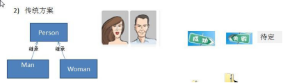</td></tr></table>将观众分为男人和女人，对歌手进行测评，当看完某个歌手表演后，得到他们对该歌手不同的评价(评价 有不同的种类，比如 成功、失败 等)

    
2)&nbsp;传统方案

    <h2 style="margin-top:0.0000pt;margin-right:0.0000pt;margin-bottom:0.0000pt;
margin-left:46.9000pt;text-indent:-36.0000pt;text-align:left;
line-height:32.6500pt;mso-line-height-rule:exactly;mso-list:l88 level2 lfo182;">18.2&nbsp;传统方式的问题分析</h2>
    
&nbsp;
    

    
1)&nbsp;如果系统比较小，还是 ok 的，但是考虑系统增加越来越多新的功能时，对代码改动较大，违反了 ocp&nbsp;原则， 不利于维护

    
2)&nbsp;扩展性不好，比如 增加了 新的人员类型，或者管理方法，都不好做

    
3)&nbsp;引出我们会使用新的设计模式 &#8211; 访问者模式

    <h2 style="margin-top:0.0000pt;margin-right:0.0000pt;margin-bottom:0.0000pt;
margin-left:46.9000pt;text-indent:-36.0000pt;text-align:left;
line-height:32.6500pt;mso-line-height-rule:exactly;mso-list:l88 level2 lfo182;">18.3&nbsp;访问者模式基本介绍</h2>
    
&nbsp;
    

    
1)&nbsp;访问者模式（Visitor&nbsp;Pattern），封装一些作用于某种数据结构的各元素的操作，它可以在不改变数据结构的前提下定义作用于这些元素的新的操作。

    
2)&nbsp;主要将数据结构与数据操作分离，解决 数据结构和操作耦合性问题

    
3)&nbsp;访问者模式的基本工作原理是：在被访问的类里面加一个对外提供接待访问者的接口

    
&nbsp;
    

    
4)&nbsp;访问者模式主要应用场景是：需要对一个对象结构中的对象进行很多不同操作(这些操作彼此没有关联)，同时

 

需要避免让这些操作"污染"这些对象的类，可以选用访问者模式解决

    
&nbsp;
    

    <h2 style="margin-top:0.0500pt;margin-right:0.0000pt;margin-bottom:0.0000pt;
margin-left:46.9000pt;text-indent:-36.0000pt;text-align:left;
mso-list:l88 level2 lfo182;">18.4&nbsp;访问者模式的原理类图</h2>
    
<table cellpadding="0" cellspacing="0"><tr><td
            width="147.667" height="0"></td></tr><tr><td></td><td>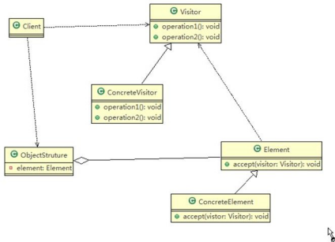</td></tr></table>&nbsp;
    

    
&nbsp;
    

    
&#216;&nbsp;对原理类图的说明-

    
即(访问者模式的角色及职责)

    
&nbsp;

    
1)&nbsp;Visitor&nbsp;是抽象访问者，为该对象结构中的 ConcreteElement&nbsp;的每一个类声明一个 visit&nbsp;操作

    
2)&nbsp;ConcreteVisitor&nbsp;：是一个具体的访问值 实现每个有 Visitor&nbsp;声明的操作，是每个操作实现的部分.

    
3)&nbsp;ObjectStructure 能枚举它的元素， 可以提供一个高层的接口，用来允许访问者访问元素

    
4)&nbsp;Element&nbsp;定义一个 accept &nbsp;方法，接收一个访问者对象

    
5)&nbsp;ConcreteElement&nbsp;为具体元素，实现了 accept &nbsp;方法

 

<h2 style="margin-top:0.0000pt;margin-right:0.0000pt;margin-bottom:0.0000pt;
margin-left:46.9000pt;text-indent:-36.0000pt;text-align:left;
line-height:32.7000pt;mso-line-height-rule:exactly;mso-list:l88 level2 lfo182;">18.5&nbsp;访问者模式应用实例</h2>
    
应用实例要求

    
1)&nbsp;将人分为男人和女人，对歌手进行测评，当看完某个歌手表演后，得到他们对该歌手不同的评价(评价 有不同的种类，比如 成功、失败 等)，请使用访问者模式来说实现

    
&nbsp;
    

    
2)&nbsp;思路分析和图解(类图)

    
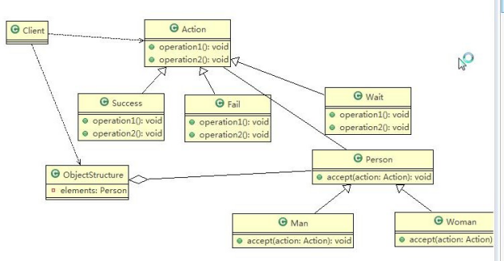&nbsp;

    
3)&nbsp;代码实现

    
&nbsp;
    

    
visitor.zip

    
&nbsp;
    

    <table class=MsoNormalTable border=1 cellspacing=0 style="border-collapse:collapse;margin-left:10.9000pt;mso-table-layout-alt:fixed;
border:none;mso-border-left-alt:0.5000pt solid rgb(0,0,0);mso-border-top-alt:0.5000pt solid rgb(0,0,0);
mso-border-right-alt:0.5000pt solid rgb(0,0,0);mso-border-bottom-alt:0.5000pt solid rgb(0,0,0);mso-border-insideh:0.5000pt solid rgb(0,0,0);
mso-border-insidev:0.5000pt solid rgb(0,0,0);mso-padding-alt:0.0000pt 0.0000pt 0.0000pt 0.0000pt ;">
        <tr style="height:140.3000pt;">
            <td width=808 valign=top style="width:606.0000pt;padding:0.0000pt 0.0000pt 0.0000pt 0.0000pt ;border-left:1.0000pt solid rgb(0,0,0);
mso-border-left-alt:0.5000pt solid rgb(0,0,0);border-right:1.0000pt solid rgb(0,0,0);mso-border-right-alt:0.5000pt solid rgb(0,0,0);
border-top:1.0000pt solid rgb(0,0,0);mso-border-top-alt:0.5000pt solid rgb(0,0,0);border-bottom:1.0000pt solid rgb(0,0,0);
mso-border-bottom-alt:0.5000pt solid rgb(0,0,0);">

                package&nbsp;com.atguigu.visitor;

                
&nbsp;

                
public abstract class Action&nbsp;{

                
&nbsp;

                
//得到男性 的测评

                
public abstract void getManResult(Man man);
</td>
        </tr>
    </table>

 

    
&nbsp;

    <table class=MsoNormalTable border=1 cellspacing=0 style="border-collapse:collapse;margin-left:10.9000pt;mso-table-layout-alt:fixed;
border:none;mso-border-left-alt:0.5000pt solid rgb(0,0,0);mso-border-top-alt:0.5000pt solid rgb(0,0,0);
mso-border-right-alt:0.5000pt solid rgb(0,0,0);mso-border-bottom-alt:0.5000pt solid rgb(0,0,0);mso-border-insideh:0.5000pt solid rgb(0,0,0);
mso-border-insidev:0.5000pt solid rgb(0,0,0);mso-padding-alt:0.0000pt 0.0000pt 0.0000pt 0.0000pt ;">
        <tr style="height:117.0000pt;">
            <td width=808 valign=top style="width:606.0000pt;padding:0.0000pt 0.0000pt 0.0000pt 0.0000pt ;border-left:1.0000pt solid rgb(0,0,0);
mso-border-left-alt:0.5000pt solid rgb(0,0,0);border-right:1.0000pt solid rgb(0,0,0);mso-border-right-alt:0.5000pt solid rgb(0,0,0);
border-top:1.0000pt solid rgb(0,0,0);mso-border-top-alt:0.5000pt solid rgb(0,0,0);border-bottom:1.0000pt solid rgb(0,0,0);
mso-border-bottom-alt:0.5000pt solid rgb(0,0,0);">
                
&nbsp;

                
//得到女的 测评

                
public abstract void getWomanResult(Woman woman);

                
}
</td>
        </tr>
        <tr style="height:491.3000pt;">
            <td width=808 valign=top style="width:606.0000pt;padding:0.0000pt 0.0000pt 0.0000pt 0.0000pt ;border-left:1.0000pt solid rgb(0,0,0);
mso-border-left-alt:0.5000pt solid rgb(0,0,0);border-right:1.0000pt solid rgb(0,0,0);mso-border-right-alt:0.5000pt solid rgb(0,0,0);
border-top:none;mso-border-top-alt:0.5000pt solid rgb(0,0,0);border-bottom:1.0000pt solid rgb(0,0,0);
mso-border-bottom-alt:0.5000pt solid rgb(0,0,0);">
package com.atguigu.visitor;

                
&nbsp;
                

                
&nbsp;

                
public class Client {

                
&nbsp;
                

                
&nbsp;

                
public static void main(String[] args) {

                
// TODO Auto-generated method stub

                
//创建 ObjectStructure

                
ObjectStructure objectStructure = new ObjectStructure();

                
&nbsp;
                

                
&nbsp;

                
objectStructure.attach(new Man()); objectStructure.attach(new Woman());

                
&nbsp;
                

                
&nbsp;
                

                
//成功

                
Success success = new Success(); objectStructure.display(success);

                
&nbsp;
                

                
System.out.println("==============="); Fail fail = new Fail(); objectStructure.display(fail);
</td>
        </tr>
    </table>

 

    
&nbsp;

    <table class=MsoNormalTable border=1 cellspacing=0 style="border-collapse:collapse;margin-left:10.9000pt;mso-table-layout-alt:fixed;
border:none;mso-border-left-alt:0.5000pt solid rgb(0,0,0);mso-border-top-alt:0.5000pt solid rgb(0,0,0);
mso-border-right-alt:0.5000pt solid rgb(0,0,0);mso-border-bottom-alt:0.5000pt solid rgb(0,0,0);mso-border-insideh:0.5000pt solid rgb(0,0,0);
mso-border-insidev:0.5000pt solid rgb(0,0,0);mso-padding-alt:0.0000pt 0.0000pt 0.0000pt 0.0000pt ;">
        <tr style="height:187.2000pt;">
            <td width=808 valign=top style="width:606.0000pt;padding:0.0000pt 0.0000pt 0.0000pt 0.0000pt ;border-left:1.0000pt solid rgb(0,0,0);
mso-border-left-alt:0.5000pt solid rgb(0,0,0);border-right:1.0000pt solid rgb(0,0,0);mso-border-right-alt:0.5000pt solid rgb(0,0,0);
border-top:1.0000pt solid rgb(0,0,0);mso-border-top-alt:0.5000pt solid rgb(0,0,0);border-bottom:1.0000pt solid rgb(0,0,0);
mso-border-bottom-alt:0.5000pt solid rgb(0,0,0);">

                System.out.println("=======给的是待定的测评========");

                
&nbsp;
                

                
&nbsp;

                
Wait wait = new Wait(); objectStructure.display(wait);

                
}

                
&nbsp;
                

                
&nbsp;

                
}
</td>
        </tr>
        <tr style="height:421.1000pt;">
            <td width=808 valign=top style="width:606.0000pt;padding:0.0000pt 0.0000pt 0.0000pt 0.0000pt ;border-left:1.0000pt solid rgb(0,0,0);
mso-border-left-alt:0.5000pt solid rgb(0,0,0);border-right:1.0000pt solid rgb(0,0,0);mso-border-right-alt:0.5000pt solid rgb(0,0,0);
border-top:none;mso-border-top-alt:0.5000pt solid rgb(0,0,0);border-bottom:1.0000pt solid rgb(0,0,0);
mso-border-bottom-alt:0.5000pt solid rgb(0,0,0);">
package com.atguigu.visitor;

                
&nbsp;
                

                
&nbsp;

                
public class Fail extends Action {

                
&nbsp;
                

                
&nbsp;

                
@Override

                
public void getManResult(Man man) {

                
// TODO Auto-generated method stub

                
System.out.println(" 男人给的评价该歌手失败 !");

                
}

                
&nbsp;
                

                
&nbsp;

                
@Override

                
public void getWomanResult(Woman woman) {

                
// TODO Auto-generated method stub

                
System.out.println(" 女人给的评价该歌手失败 !");

                
}

                
&nbsp;
                

                
&nbsp;

                
}
</td>
        </tr>
    </table>

 

    
&nbsp;

    <table class=MsoNormalTable border=1 cellspacing=0 style="border-collapse:collapse;margin-left:10.9000pt;mso-table-layout-alt:fixed;
border:none;mso-border-left-alt:0.5000pt solid rgb(0,0,0);mso-border-top-alt:0.5000pt solid rgb(0,0,0);
mso-border-right-alt:0.5000pt solid rgb(0,0,0);mso-border-bottom-alt:0.5000pt solid rgb(0,0,0);mso-border-insideh:0.5000pt solid rgb(0,0,0);
mso-border-insidev:0.5000pt solid rgb(0,0,0);mso-padding-alt:0.0000pt 0.0000pt 0.0000pt 0.0000pt ;">
        <tr style="height:280.8000pt;">
            <td width=808 valign=top style="width:606.0000pt;padding:0.0000pt 0.0000pt 0.0000pt 0.0000pt ;border-left:1.0000pt solid rgb(0,0,0);
mso-border-left-alt:0.5000pt solid rgb(0,0,0);border-right:1.0000pt solid rgb(0,0,0);mso-border-right-alt:0.5000pt solid rgb(0,0,0);
border-top:1.0000pt solid rgb(0,0,0);mso-border-top-alt:0.5000pt solid rgb(0,0,0);border-bottom:1.0000pt solid rgb(0,0,0);
mso-border-bottom-alt:0.5000pt solid rgb(0,0,0);">
package com.atguigu.visitor;

                
&nbsp;
                

                
&nbsp;

                
public class Man extends Person {

                
&nbsp;
                

                
&nbsp;

                
@Override

                
public void accept(Action action) {

                
// TODO Auto-generated method stub action.getManResult(this);

                
}

                
&nbsp;
                

                
&nbsp;

                
}
</td>
        </tr>
        <tr style="height:327.5000pt;">
            <td width=808 valign=top style="width:606.0000pt;padding:0.0000pt 0.0000pt 0.0000pt 0.0000pt ;border-left:1.0000pt solid rgb(0,0,0);
mso-border-left-alt:0.5000pt solid rgb(0,0,0);border-right:1.0000pt solid rgb(0,0,0);mso-border-right-alt:0.5000pt solid rgb(0,0,0);
border-top:none;mso-border-top-alt:0.5000pt solid rgb(0,0,0);border-bottom:1.0000pt solid rgb(0,0,0);
mso-border-bottom-alt:0.5000pt solid rgb(0,0,0);">
package com.atguigu.visitor;

                
&nbsp;
                

                
&nbsp;

                
import java.util.LinkedList; import java.util.List;

                
&nbsp;

                
//数据结构，管理很多人（Man , Woman） public class ObjectStructure {

                
&nbsp;
                

                
//维护了一个集合

                
private List&#60;Person&#62; persons = new LinkedList&#60;&#62;();

                
&nbsp;
                

                
//增加到 list

                
public void attach(Person p) {

                
persons.add(p);
</td>
        </tr>
    </table>

 

    <table class=MsoNormalTable border=1 cellspacing=0 style="border-collapse:collapse;margin-left:10.9000pt;mso-table-layout-alt:fixed;
border:none;mso-border-left-alt:0.5000pt solid rgb(0,0,0);mso-border-top-alt:0.5000pt solid rgb(0,0,0);
mso-border-right-alt:0.5000pt solid rgb(0,0,0);mso-border-bottom-alt:0.5000pt solid rgb(0,0,0);mso-border-insideh:0.5000pt solid rgb(0,0,0);
mso-border-insidev:0.5000pt solid rgb(0,0,0);mso-padding-alt:0.0000pt 0.0000pt 0.0000pt 0.0000pt ;">
        <tr style="height:327.6000pt;">
            <td width=808 valign=top style="width:606.0000pt;padding:0.0000pt 0.0000pt 0.0000pt 0.0000pt ;border-left:1.0000pt solid rgb(0,0,0);
mso-border-left-alt:0.5000pt solid rgb(0,0,0);border-right:1.0000pt solid rgb(0,0,0);mso-border-right-alt:0.5000pt solid rgb(0,0,0);
border-top:1.0000pt solid rgb(0,0,0);mso-border-top-alt:0.5000pt solid rgb(0,0,0);border-bottom:1.0000pt solid rgb(0,0,0);
mso-border-bottom-alt:0.5000pt solid rgb(0,0,0);">
}

                
//移除

                
public void detach(Person p) { persons.remove(p);

                
}

                
&nbsp;
                

                
//显示测评情况

                
public void display(Action action) { for(Person p: persons) {

                
p.accept(action);

                
}

                
}

                
}
</td>
        </tr>
        <tr style="height:187.2000pt;">
            <td width=808 valign=top style="width:606.0000pt;padding:0.0000pt 0.0000pt 0.0000pt 0.0000pt ;border-left:1.0000pt solid rgb(0,0,0);
mso-border-left-alt:0.5000pt solid rgb(0,0,0);border-right:1.0000pt solid rgb(0,0,0);mso-border-right-alt:0.5000pt solid rgb(0,0,0);
border-top:none;mso-border-top-alt:0.5000pt solid rgb(0,0,0);border-bottom:1.0000pt solid rgb(0,0,0);
mso-border-bottom-alt:0.5000pt solid rgb(0,0,0);">
package&nbsp;com.atguigu.visitor;

                
&nbsp;
                

                
&nbsp;

                
public abstract class Person&nbsp;{

                
&nbsp;
                

                
//提供一个方法，让访问者可以访问public abstract void accept(Action action);

                
}
</td>
        </tr>
        <tr style="height:93.5000pt;">
            <td width=808 valign=top style="width:606.0000pt;padding:0.0000pt 0.0000pt 0.0000pt 0.0000pt ;border-left:1.0000pt solid rgb(0,0,0);
mso-border-left-alt:0.5000pt solid rgb(0,0,0);border-right:1.0000pt solid rgb(0,0,0);mso-border-right-alt:0.5000pt solid rgb(0,0,0);
border-top:none;mso-border-top-alt:0.5000pt solid rgb(0,0,0);border-bottom:1.0000pt solid rgb(0,0,0);
mso-border-bottom-alt:0.5000pt solid rgb(0,0,0);">
package com.atguigu.visitor;

                
&nbsp;
                

                
&nbsp;

                
public class Success extends Action {
</td>
        </tr>
    </table>

 

    
&nbsp;

    <table class=MsoNormalTable border=1 cellspacing=0 style="border-collapse:collapse;margin-left:10.9000pt;mso-table-layout-alt:fixed;
border:none;mso-border-left-alt:0.5000pt solid rgb(0,0,0);mso-border-top-alt:0.5000pt solid rgb(0,0,0);
mso-border-right-alt:0.5000pt solid rgb(0,0,0);mso-border-bottom-alt:0.5000pt solid rgb(0,0,0);mso-border-insideh:0.5000pt solid rgb(0,0,0);
mso-border-insidev:0.5000pt solid rgb(0,0,0);mso-padding-alt:0.0000pt 0.0000pt 0.0000pt 0.0000pt ;">
        <tr style="height:327.6000pt;">
            <td width=808 valign=top style="width:606.0000pt;padding:0.0000pt 0.0000pt 0.0000pt 0.0000pt ;border-left:1.0000pt solid rgb(0,0,0);
mso-border-left-alt:0.5000pt solid rgb(0,0,0);border-right:1.0000pt solid rgb(0,0,0);mso-border-right-alt:0.5000pt solid rgb(0,0,0);
border-top:1.0000pt solid rgb(0,0,0);mso-border-top-alt:0.5000pt solid rgb(0,0,0);border-bottom:1.0000pt solid rgb(0,0,0);
mso-border-bottom-alt:0.5000pt solid rgb(0,0,0);">
@Override

                
public void getManResult(Man man) {

                
// TODO Auto-generated method stub

                
System.out.println(" 男人给的评价该歌手很成功 !");

                
}

                
&nbsp;
                

                
&nbsp;

                
@Override

                
public void getWomanResult(Woman woman) {

                
// TODO Auto-generated method stub System.out.println(" 女人给的评价该歌手很成功 !");

                
}

                
&nbsp;
                

                
&nbsp;

                
}
</td>
        </tr>
        <tr style="height:280.7000pt;">
            <td width=808 valign=top style="width:606.0000pt;padding:0.0000pt 0.0000pt 0.0000pt 0.0000pt ;border-left:1.0000pt solid rgb(0,0,0);
mso-border-left-alt:0.5000pt solid rgb(0,0,0);border-right:1.0000pt solid rgb(0,0,0);mso-border-right-alt:0.5000pt solid rgb(0,0,0);
border-top:none;mso-border-top-alt:0.5000pt solid rgb(0,0,0);border-bottom:1.0000pt solid rgb(0,0,0);
mso-border-bottom-alt:0.5000pt solid rgb(0,0,0);">
package com.atguigu.visitor;

                
&nbsp;
                

                
&nbsp;

                
public class Wait extends Action {

                
&nbsp;
                

                
&nbsp;

                
@Override

                
public void getManResult(Man man) {

                
// TODO Auto-generated method stub

                
System.out.println(" 男人给的评价是该歌手待定 ..");

                
}

                
&nbsp;
                

                
&nbsp;

                
@Override

                
public void getWomanResult(Woman woman) {
</td>
        </tr>
    </table>

 

    
&nbsp;

    <table class=MsoNormalTable border=1 cellspacing=0 style="border-collapse:collapse;margin-left:10.9000pt;mso-table-layout-alt:fixed;
border:none;mso-border-left-alt:0.5000pt solid rgb(0,0,0);mso-border-top-alt:0.5000pt solid rgb(0,0,0);
mso-border-right-alt:0.5000pt solid rgb(0,0,0);mso-border-bottom-alt:0.5000pt solid rgb(0,0,0);mso-border-insideh:0.5000pt solid rgb(0,0,0);
mso-border-insidev:0.5000pt solid rgb(0,0,0);mso-padding-alt:0.0000pt 0.0000pt 0.0000pt 0.0000pt ;">
        <tr style="height:140.4000pt;">
            <td width=808 valign=top style="width:606.0000pt;padding:0.0000pt 0.0000pt 0.0000pt 0.0000pt ;border-left:1.0000pt solid rgb(0,0,0);
mso-border-left-alt:0.5000pt solid rgb(0,0,0);border-right:1.0000pt solid rgb(0,0,0);mso-border-right-alt:0.5000pt solid rgb(0,0,0);
border-top:1.0000pt solid rgb(0,0,0);mso-border-top-alt:0.5000pt solid rgb(0,0,0);border-bottom:1.0000pt solid rgb(0,0,0);
mso-border-bottom-alt:0.5000pt solid rgb(0,0,0);">
// TODO Auto-generated method stub

                
System.out.println(" 女人给的评价是该歌手待定 ..");

                
}

                
&nbsp;
                

                
&nbsp;

                
}
</td>
        </tr>
        <tr style="height:351.0000pt;">
            <td width=808 valign=top style="width:606.0000pt;padding:0.0000pt 0.0000pt 0.0000pt 0.0000pt ;border-left:1.0000pt solid rgb(0,0,0);
mso-border-left-alt:0.5000pt solid rgb(0,0,0);border-right:1.0000pt solid rgb(0,0,0);mso-border-right-alt:0.5000pt solid rgb(0,0,0);
border-top:none;mso-border-top-alt:0.5000pt solid rgb(0,0,0);border-bottom:1.0000pt solid rgb(0,0,0);
mso-border-bottom-alt:0.5000pt solid rgb(0,0,0);">
package com.atguigu.visitor;

                
&nbsp;
                

                
//说明

                
//1.&nbsp;这里我们使用到了双分派, &nbsp;即首先在客户端程序中，将具体状态作为参数传递 Woman 中(第一次分派)

                
//2.&nbsp;然后 Woman 类调用作为参数的 "具体方法" 中方法 getWomanResult,&nbsp;同时将自己(this)作为参数

                
//&#9;传入，完成第二次的分派

                
public class Woman extends Person{

                
&nbsp;
                

                
&nbsp;

                
@Override

                
public void accept(Action action) {

                
// TODO Auto-generated method stub action.getWomanResult(this);

                
}

                
&nbsp;
                

                
&nbsp;

                
}
</td>
        </tr>
    </table>
    
&nbsp;

    
&nbsp;

    
4)&nbsp;应用案例的小结-双分派

    
&nbsp;
    

    
-上面提到了双分派，所谓双分派是指不管类怎么变化，我们都能找到期望的方法运行。双分派意味着得到执行的操作取决于请求的种类和两个接收者的类型

 

    
&nbsp;
    

    
- 以上述实例为例，假设我们要添加一个 <b>Wait </b>的状态类，考察 <b>Man </b>类和 <b>Woman </b>类的反应，由于使用了双分派，只需增加一个 Action 子类即可在客户端调用即可，不需要改动任何其他类的代码。

    <h2 style="margin-top:0.0000pt;margin-right:0.0000pt;margin-bottom:0.0000pt;
margin-left:46.9000pt;text-indent:-36.0000pt;text-align:left;
line-height:30.8500pt;mso-line-height-rule:exactly;mso-list:l88 level2 lfo182;">18.6&nbsp;访问者模式的注意事项和细节</h2>
    
&#216;&nbsp;优点

    
1)&nbsp;访问者模式符合单一职责原则、让程序具有优秀的扩展性、灵活性非常高

    
2)&nbsp;访问者模式可以对功能进行统一，可以做报表、UI、拦截器与过滤器，适用于数据结构相对稳定的系统

    
&#216;&nbsp;缺点

    
1)&nbsp;具体元素对访问者公布细节，也就是说访问者关注了其他类的内部细节，这是迪米特法则所不建议的, 这样造成了具体元素变更比较困难

    
2)&nbsp;违背了依赖倒转原则。访问者依赖的是具体元素，而不是抽象元素

    
3)&nbsp;因此，如果一个系统有比较稳定的数据结构，又有经常变化的功能需求，那么访问者模式就是比较合适的.

 

<h1 style="margin-left:208.4000pt;line-height:42.3000pt;mso-line-height-rule:exactly;">第 19&#9;章迭代器模式</h1>
    <h2 style="margin-top:0.0000pt;margin-right:0.0000pt;margin-bottom:0.0000pt;
margin-left:46.9000pt;text-indent:-36.0000pt;text-align:left;
line-height:31.9000pt;mso-line-height-rule:exactly;mso-list:l219 level2 lfo190;">19.1&nbsp;看一个具体的需求</h2>
    
<table cellpadding="0" cellspacing="0"><tr><td width="126.533" height="0"></td></tr><tr><td></td><td>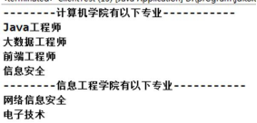</td></tr></table>编写程序展示一个学校院系结构：需求是这样，要在一个页面中展示出学校的院系组成，一个学校有多个学院， 一个学院有多个系。如图：

    <h2 style="margin-top:2.6000pt;margin-right:0.0000pt;margin-bottom:0.0000pt;
margin-left:46.9000pt;text-indent:-36.0000pt;text-align:left;
mso-list:l219 level2 lfo190;">19.2&nbsp;传统的设计方案(类图)</h2>
    
<table cellpadding="0" cellspacing="0"><tr><td width="126.533"
                                                                                                         height="0"></td></tr><tr><td></td><td></td></tr></table>&nbsp;

    <h2 style="margin-top:0.4000pt;margin-right:0.0000pt;margin-bottom:0.0000pt;
margin-left:46.9000pt;text-indent:-36.0000pt;text-align:left;
mso-list:l219 level2 lfo190;">19.3&nbsp;传统的方式的问题分析</h2>
    
&nbsp;
    

    
1)&nbsp;将学院看做是学校的子类，系是学院的子类，这样实际上是站在组织大小来进行分层次的

    
2)&nbsp;实际上我们的要求是 ：在一个页面中展示出学校的院系组成，一个学校有多个学院，一个学院有多个系， 因此这种方案，不能很好实现的遍历的操作

    
&nbsp;
    

    
3)&nbsp;解决方案：=&#62; 迭代器模式

    <h2 style="margin-top:0.0000pt;margin-right:0.0000pt;margin-bottom:0.0000pt;
margin-left:46.9000pt;text-indent:-36.0000pt;text-align:left;
line-height:31.5500pt;mso-line-height-rule:exactly;mso-list:l219 level2 lfo190;">19.4&nbsp;迭代器模式基本介绍</h2>
    
基本介绍

 

1)&nbsp;迭代器模式（Iterator Pattern）是常用的设计模式，属于行为型模式

    
2)&nbsp;如果我们的集合元素是用不同的方式实现的，有数组，还有 java&nbsp;的集合类，或者还有其他方式，当客户端要遍历这些集合元素的时候就要使用多种遍历方式，而且还会暴露元素的内部结构，可以考虑使用迭代器模式解决。

    
3)&nbsp;迭代器模式，提供一种遍历集合元素的统一接口，用一致的方法遍历集合元素，不需要知道集合对象的底层表示，即：不暴露其内部的结构。

    <h2 style="margin-top:0.0000pt;margin-right:0.0000pt;margin-bottom:0.0000pt;
margin-left:46.9000pt;text-indent:-36.0000pt;text-align:left;
line-height:31.9500pt;mso-line-height-rule:exactly;mso-list:l219 level2 lfo190;">19.5&nbsp;<table cellpadding="0" cellspacing="0"><tr><td
            width="132.733" height="0"></td></tr><tr><td></td><td>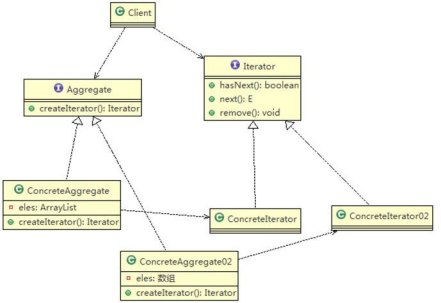</td></tr></table>迭代器模式的原理类图</h2>
    
&nbsp;
    

    
&#216;&nbsp;对原理类图的说明-即(迭代器模式的角色及职责)

    
1)&nbsp;Iterator ： 迭代器接口，是系统提供，含义 hasNext,&nbsp;next, remove

    
2)&nbsp;ConcreteIterator : &nbsp;具体的迭代器类，管理迭代

    
3)&nbsp;Aggregate&nbsp;:一个统一的聚合接口， 将客户端和具体聚合解耦

    
4)&nbsp;ConcreteAggreage&nbsp;: 具体的聚合持有对象集合， 并提供一个方法，返回一个迭代器， 该迭代器可以正确遍历集合

    
5)&nbsp;Client&nbsp;:客户端， &nbsp;通过&nbsp;Iterator&nbsp;和&#9;Aggregate&nbsp;依赖子类

    <h2 style="margin-top:0.0000pt;margin-right:0.0000pt;margin-bottom:0.0000pt;
margin-left:46.9000pt;text-indent:-36.0000pt;text-align:left;
line-height:32.6500pt;mso-line-height-rule:exactly;mso-list:l219 level2 lfo190;">19.6&nbsp;迭代器模式应用实例</h2>

 

    
&nbsp;
    

    
1)&nbsp;应用实例要求

    
编写程序展示一个学校院系结构：需求是这样，要在一个页面中展示出学校的院系组成，一个学校有多个学院， 一个学院有多个系。

    
&nbsp;
    

    
2)&nbsp;设计思路分析

    
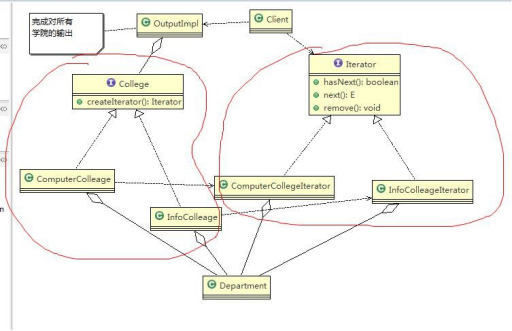&nbsp;
    

    
&nbsp;
    

    
3)&nbsp;代码实现

    
&nbsp;
    

    
iterator.zip

    
&nbsp;
    

    <table class=MsoNormalTable border=1 cellspacing=0 style="border-collapse:collapse;margin-left:10.9000pt;mso-table-layout-alt:fixed;
border:none;mso-border-left-alt:0.5000pt solid rgb(0,0,0);mso-border-top-alt:0.5000pt solid rgb(0,0,0);
mso-border-right-alt:0.5000pt solid rgb(0,0,0);mso-border-bottom-alt:0.5000pt solid rgb(0,0,0);mso-border-insideh:0.5000pt solid rgb(0,0,0);
mso-border-insidev:0.5000pt solid rgb(0,0,0);mso-padding-alt:0.0000pt 0.0000pt 0.0000pt 0.0000pt ;">
        <tr style="height:93.5000pt;">
            <td width=808 valign=top style="width:606.0000pt;padding:0.0000pt 0.0000pt 0.0000pt 0.0000pt ;border-left:1.0000pt solid rgb(0,0,0);
mso-border-left-alt:0.5000pt solid rgb(0,0,0);border-right:1.0000pt solid rgb(0,0,0);mso-border-right-alt:0.5000pt solid rgb(0,0,0);
border-top:1.0000pt solid rgb(0,0,0);mso-border-top-alt:0.5000pt solid rgb(0,0,0);border-bottom:1.0000pt solid rgb(0,0,0);
mso-border-bottom-alt:0.5000pt solid rgb(0,0,0);">
package com.atguigu.iterator;

                
&nbsp;

                
import java.util.ArrayList; import java.util.List;
</td>
        </tr>
    </table>

 

    
&nbsp;

    <table class=MsoNormalTable border=1 cellspacing=0 style="border-collapse:collapse;margin-left:10.9000pt;mso-table-layout-alt:fixed;
border:none;mso-border-left-alt:0.5000pt solid rgb(0,0,0);mso-border-top-alt:0.5000pt solid rgb(0,0,0);
mso-border-right-alt:0.5000pt solid rgb(0,0,0);mso-border-bottom-alt:0.5000pt solid rgb(0,0,0);mso-border-insideh:0.5000pt solid rgb(0,0,0);
mso-border-insidev:0.5000pt solid rgb(0,0,0);mso-padding-alt:0.0000pt 0.0000pt 0.0000pt 0.0000pt ;">
        <tr style="height:468.0000pt;">
            <td width=808 valign=top style="width:606.0000pt;padding:0.0000pt 0.0000pt 0.0000pt 0.0000pt ;border-left:1.0000pt solid rgb(0,0,0);
mso-border-left-alt:0.5000pt solid rgb(0,0,0);border-right:1.0000pt solid rgb(0,0,0);mso-border-right-alt:0.5000pt solid rgb(0,0,0);
border-top:1.0000pt solid rgb(0,0,0);mso-border-top-alt:0.5000pt solid rgb(0,0,0);border-bottom:1.0000pt solid rgb(0,0,0);
mso-border-bottom-alt:0.5000pt solid rgb(0,0,0);">
                
&nbsp;
                

                
&nbsp;
                

                
public class Client {

                
&nbsp;
                

                
&nbsp;

                
public static void main(String[] args) {

                
// TODO Auto-generated method stub

                
//创建学院

                
List&#60;College&#62; collegeList = new ArrayList&#60;College&#62;();

                
&nbsp;
                

                
&nbsp;

                
ComputerCollege computerCollege = new ComputerCollege(); InfoCollege infoCollege = new InfoCollege();

                
&nbsp;
                

                
collegeList.add(computerCollege);

                
//collegeList.add(infoCollege);

                
&nbsp;
                

                
&nbsp;

                
OutPutImpl outPutImpl = new OutPutImpl(collegeList); outPutImpl.printCollege();

                
}

                
&nbsp;
                

                
&nbsp;

                
}
</td>
        </tr>
        <tr style="height:140.3000pt;">
            <td width=808 valign=top style="width:606.0000pt;padding:0.0000pt 0.0000pt 0.0000pt 0.0000pt ;border-left:1.0000pt solid rgb(0,0,0);
mso-border-left-alt:0.5000pt solid rgb(0,0,0);border-right:1.0000pt solid rgb(0,0,0);mso-border-right-alt:0.5000pt solid rgb(0,0,0);
border-top:none;mso-border-top-alt:0.5000pt solid rgb(0,0,0);border-bottom:1.0000pt solid rgb(0,0,0);
mso-border-bottom-alt:0.5000pt solid rgb(0,0,0);">
package com.atguigu.iterator;

                
&nbsp;
                

                
&nbsp;

                
import java.util.Iterator;

                
&nbsp;
                

                
&nbsp;

                
public interface College {
</td>
        </tr>
    </table>

 

    
&nbsp;

    <table class=MsoNormalTable border=1 cellspacing=0 style="border-collapse:collapse;margin-left:10.9000pt;mso-table-layout-alt:fixed;
border:none;mso-border-left-alt:0.5000pt solid rgb(0,0,0);mso-border-top-alt:0.5000pt solid rgb(0,0,0);
mso-border-right-alt:0.5000pt solid rgb(0,0,0);mso-border-bottom-alt:0.5000pt solid rgb(0,0,0);mso-border-insideh:0.5000pt solid rgb(0,0,0);
mso-border-insidev:0.5000pt solid rgb(0,0,0);mso-padding-alt:0.0000pt 0.0000pt 0.0000pt 0.0000pt ;">
        <tr style="height:210.6000pt;">
            <td width=808 valign=top style="width:606.0000pt;padding:0.0000pt 0.0000pt 0.0000pt 0.0000pt ;border-left:1.0000pt solid rgb(0,0,0);
mso-border-left-alt:0.5000pt solid rgb(0,0,0);border-right:1.0000pt solid rgb(0,0,0);mso-border-right-alt:0.5000pt solid rgb(0,0,0);
border-top:1.0000pt solid rgb(0,0,0);mso-border-top-alt:0.5000pt solid rgb(0,0,0);border-bottom:1.0000pt solid rgb(0,0,0);
mso-border-bottom-alt:0.5000pt solid rgb(0,0,0);">
public String getName();

                
&nbsp;
                

                
//增加系的方法

                
public void addDepartment(String name, String desc);

                
&nbsp;
                

                
//返回一个迭代器,遍历

                
public&nbsp;Iterator&#9;createIterator();

                
}
</td>
        </tr>
        <tr style="height:397.7000pt;">
            <td width=808 valign=top style="width:606.0000pt;padding:0.0000pt 0.0000pt 0.0000pt 0.0000pt ;border-left:1.0000pt solid rgb(0,0,0);
mso-border-left-alt:0.5000pt solid rgb(0,0,0);border-right:1.0000pt solid rgb(0,0,0);mso-border-right-alt:0.5000pt solid rgb(0,0,0);
border-top:none;mso-border-top-alt:0.5000pt solid rgb(0,0,0);border-bottom:1.0000pt solid rgb(0,0,0);
mso-border-bottom-alt:0.5000pt solid rgb(0,0,0);">
package com.atguigu.iterator;

                
&nbsp;
                

                
&nbsp;

                
import java.util.Iterator;

                
&nbsp;
                

                
&nbsp;

                
public class ComputerCollege implements College {

                
&nbsp;
                

                
&nbsp;

                
Department[] departments;

                
int numOfDepartment = 0 ;//&nbsp;保存当前数组的对象个数

                
&nbsp;
                

                
&nbsp;
                

                
&nbsp;

                
public ComputerCollege() { departments = new Department[5];

                
addDepartment("Java&nbsp;专业", " Java&nbsp;专业 &nbsp;");

                
addDepartment("PHP&nbsp;专业", " PHP&nbsp;专业 &nbsp;");

                
addDepartment("大数据专业", " &nbsp;大数据专业 ");

                
&nbsp;
                

                
&nbsp;

                
}
</td>
        </tr>
    </table>

 

    
&nbsp;

    <table class=MsoNormalTable border=1 cellspacing=0 style="border-collapse:collapse;margin-left:10.9000pt;mso-table-layout-alt:fixed;
border:none;mso-border-left-alt:0.5000pt solid rgb(0,0,0);mso-border-top-alt:0.5000pt solid rgb(0,0,0);
mso-border-right-alt:0.5000pt solid rgb(0,0,0);mso-border-bottom-alt:0.5000pt solid rgb(0,0,0);mso-border-insideh:0.5000pt solid rgb(0,0,0);
mso-border-insidev:0.5000pt solid rgb(0,0,0);mso-padding-alt:0.0000pt 0.0000pt 0.0000pt 0.0000pt ;">
        <tr style="height:561.6000pt;">
            <td width=808 valign=top style="width:606.0000pt;padding:0.0000pt 0.0000pt 0.0000pt 0.0000pt ;border-left:1.0000pt solid rgb(0,0,0);
mso-border-left-alt:0.5000pt solid rgb(0,0,0);border-right:1.0000pt solid rgb(0,0,0);mso-border-right-alt:0.5000pt solid rgb(0,0,0);
border-top:1.0000pt solid rgb(0,0,0);mso-border-top-alt:0.5000pt solid rgb(0,0,0);border-bottom:1.0000pt solid rgb(0,0,0);
mso-border-bottom-alt:0.5000pt solid rgb(0,0,0);">
                
&nbsp;
                

                
&nbsp;
                

                
&nbsp;

                
@Override

                
public String getName()&nbsp;{

                
// TODO Auto-generated method&nbsp;stub return "计算机学院";

                
}

                
&nbsp;
                

                
&nbsp;

                
@Override

                
public void addDepartment(String name, String desc) {

                
// TODO Auto-generated method stub

                
Department department = new Department(name, desc); departments[numOfDepartment] = department; numOfDepartment += 1;

                
}

                
&nbsp;
                

                
&nbsp;

                
@Override

                
public Iterator createIterator() {

                
// TODO Auto-generated method stub

                
return new ComputerCollegeIterator(departments);

                
}

                
&nbsp;
                

                
&nbsp;

                
}
</td>
        </tr>
        <tr style="height:46.7000pt;">
            <td width=808 valign=top style="width:606.0000pt;padding:0.0000pt 0.0000pt 0.0000pt 0.0000pt ;border-left:1.0000pt solid rgb(0,0,0);
mso-border-left-alt:0.5000pt solid rgb(0,0,0);border-right:1.0000pt solid rgb(0,0,0);mso-border-right-alt:0.5000pt solid rgb(0,0,0);
border-top:none;mso-border-top-alt:0.5000pt solid rgb(0,0,0);border-bottom:1.0000pt solid rgb(0,0,0);
mso-border-bottom-alt:0.5000pt solid rgb(0,0,0);">
package com.atguigu.iterator;
</td>
        </tr>
    </table>

 

    
&nbsp;

    <table class=MsoNormalTable border=1 cellspacing=0 style="border-collapse:collapse;margin-left:10.9000pt;mso-table-layout-alt:fixed;
border:none;mso-border-left-alt:0.5000pt solid rgb(0,0,0);mso-border-top-alt:0.5000pt solid rgb(0,0,0);
mso-border-right-alt:0.5000pt solid rgb(0,0,0);mso-border-bottom-alt:0.5000pt solid rgb(0,0,0);mso-border-insideh:0.5000pt solid rgb(0,0,0);
mso-border-insidev:0.5000pt solid rgb(0,0,0);mso-padding-alt:0.0000pt 0.0000pt 0.0000pt 0.0000pt ;">
        <tr style="height:608.3000pt;">
            <td width=808 valign=top style="width:606.0000pt;padding:0.0000pt 0.0000pt 0.0000pt 0.0000pt ;border-left:1.0000pt solid rgb(0,0,0);
mso-border-left-alt:0.5000pt solid rgb(0,0,0);border-right:1.0000pt solid rgb(0,0,0);mso-border-right-alt:0.5000pt solid rgb(0,0,0);
border-top:1.0000pt solid rgb(0,0,0);mso-border-top-alt:0.5000pt solid rgb(0,0,0);border-bottom:1.0000pt solid rgb(0,0,0);
mso-border-bottom-alt:0.5000pt solid rgb(0,0,0);">
import java.util.Iterator;

                
&nbsp;
                

                
&nbsp;
                

                
&nbsp;
                

                
public class ComputerCollegeIterator implements Iterator {

                
&nbsp;
                

                
//这里我们需要 Department &nbsp;是以怎样的方式存放=&#62;数组

                
Department[] departments;

                
int position = 0; //遍历的位置

                
&nbsp;
                

                
&nbsp;
                

                
&nbsp;
                

                
&nbsp;
                

                
&nbsp;
                

                
&nbsp;
                

                
public ComputerCollegeIterator(Department[] departments) { this.departments = departments;

                
}

                
&nbsp;
                

                
//判断是否还有下一个元素 @Override

                
public boolean hasNext() {

                
// TODO Auto-generated method stub

                
if(position &#62;= departments.length || departments[position] == null) { return false;

                
}else {

                
&nbsp;
                

                
&nbsp;

                
return true;

                
}
</td>
        </tr>
    </table>

 

    
&nbsp;

    <table class=MsoNormalTable border=1 cellspacing=0 style="border-collapse:collapse;margin-left:10.9000pt;mso-table-layout-alt:fixed;
border:none;mso-border-left-alt:0.5000pt solid rgb(0,0,0);mso-border-top-alt:0.5000pt solid rgb(0,0,0);
mso-border-right-alt:0.5000pt solid rgb(0,0,0);mso-border-bottom-alt:0.5000pt solid rgb(0,0,0);mso-border-insideh:0.5000pt solid rgb(0,0,0);
mso-border-insidev:0.5000pt solid rgb(0,0,0);mso-padding-alt:0.0000pt 0.0000pt 0.0000pt 0.0000pt ;">
        <tr style="height:397.8000pt;">
            <td width=808 valign=top style="width:606.0000pt;padding:0.0000pt 0.0000pt 0.0000pt 0.0000pt ;border-left:1.0000pt solid rgb(0,0,0);
mso-border-left-alt:0.5000pt solid rgb(0,0,0);border-right:1.0000pt solid rgb(0,0,0);mso-border-right-alt:0.5000pt solid rgb(0,0,0);
border-top:1.0000pt solid rgb(0,0,0);mso-border-top-alt:0.5000pt solid rgb(0,0,0);border-bottom:1.0000pt solid rgb(0,0,0);
mso-border-bottom-alt:0.5000pt solid rgb(0,0,0);">
}

                
&nbsp;
                

                
&nbsp;

                
@Override

                
public Object next() {

                
// TODO Auto-generated method stub Department department = departments[position]; position += 1;

                
return&nbsp;department;

                
}

                
&nbsp;
                

                
//删除的方法，默认空实现 public void remove() {

                
&nbsp;
                

                
&nbsp;
                

                
}

                
&nbsp;
                

                
&nbsp;

                
}
</td>
        </tr>
        <tr style="height:210.5000pt;">
            <td width=808 valign=top style="width:606.0000pt;padding:0.0000pt 0.0000pt 0.0000pt 0.0000pt ;border-left:1.0000pt solid rgb(0,0,0);
mso-border-left-alt:0.5000pt solid rgb(0,0,0);border-right:1.0000pt solid rgb(0,0,0);mso-border-right-alt:0.5000pt solid rgb(0,0,0);
border-top:none;mso-border-top-alt:0.5000pt solid rgb(0,0,0);border-bottom:1.0000pt solid rgb(0,0,0);
mso-border-bottom-alt:0.5000pt solid rgb(0,0,0);">
package com.atguigu.iterator;

                
&nbsp;
                

                
//系

                
public class Department {

                
&nbsp;
                

                
&nbsp;

                
private String name; private String desc;

                
public Department(String name, String desc) {

                
super();
</td>
        </tr>
    </table>

 

    
&nbsp;

    <table class=MsoNormalTable border=1 cellspacing=0 style="border-collapse:collapse;margin-left:10.9000pt;mso-table-layout-alt:fixed;
border:none;mso-border-left-alt:0.5000pt solid rgb(0,0,0);mso-border-top-alt:0.5000pt solid rgb(0,0,0);
mso-border-right-alt:0.5000pt solid rgb(0,0,0);mso-border-bottom-alt:0.5000pt solid rgb(0,0,0);mso-border-insideh:0.5000pt solid rgb(0,0,0);
mso-border-insidev:0.5000pt solid rgb(0,0,0);mso-padding-alt:0.0000pt 0.0000pt 0.0000pt 0.0000pt ;">
        <tr style="height:468.0000pt;">
            <td width=808 valign=top style="width:606.0000pt;padding:0.0000pt 0.0000pt 0.0000pt 0.0000pt ;border-left:1.0000pt solid rgb(0,0,0);
mso-border-left-alt:0.5000pt solid rgb(0,0,0);border-right:1.0000pt solid rgb(0,0,0);mso-border-right-alt:0.5000pt solid rgb(0,0,0);
border-top:1.0000pt solid rgb(0,0,0);mso-border-top-alt:0.5000pt solid rgb(0,0,0);border-bottom:1.0000pt solid rgb(0,0,0);
mso-border-bottom-alt:0.5000pt solid rgb(0,0,0);">
this.name = name; this.desc = desc;

                
}

                
public String getName() { return name;

                
}

                
public void setName(String name) { this.name = name;

                
}

                
public String getDesc() { return desc;

                
}

                
public void setDesc(String desc) { this.desc = desc;

                
}

                
&nbsp;
                

                
&nbsp;
                

                
&nbsp;
                

                
&nbsp;
                

                
&nbsp;

                
}
</td>
        </tr>
        <tr style="height:140.3000pt;">
            <td width=808 valign=top style="width:606.0000pt;padding:0.0000pt 0.0000pt 0.0000pt 0.0000pt ;border-left:1.0000pt solid rgb(0,0,0);
mso-border-left-alt:0.5000pt solid rgb(0,0,0);border-right:1.0000pt solid rgb(0,0,0);mso-border-right-alt:0.5000pt solid rgb(0,0,0);
border-top:none;mso-border-top-alt:0.5000pt solid rgb(0,0,0);border-bottom:1.0000pt solid rgb(0,0,0);
mso-border-bottom-alt:0.5000pt solid rgb(0,0,0);">
package com.atguigu.iterator;

                
&nbsp;
                

                
&nbsp;

                
import java.util.Iterator; import java.util.List;

                
&nbsp;
                

                
public class InfoColleageIterator implements Iterator {
</td>
        </tr>
    </table>

 

    
&nbsp;

    <table class=MsoNormalTable border=1 cellspacing=0 style="border-collapse:collapse;margin-left:10.9000pt;mso-table-layout-alt:fixed;
border:none;mso-border-left-alt:0.5000pt solid rgb(0,0,0);mso-border-top-alt:0.5000pt solid rgb(0,0,0);
mso-border-right-alt:0.5000pt solid rgb(0,0,0);mso-border-bottom-alt:0.5000pt solid rgb(0,0,0);mso-border-insideh:0.5000pt solid rgb(0,0,0);
mso-border-insidev:0.5000pt solid rgb(0,0,0);mso-padding-alt:0.0000pt 0.0000pt 0.0000pt 0.0000pt ;">
        <tr style="height:608.3000pt;">
            <td width=808 valign=top style="width:606.0000pt;padding:0.0000pt 0.0000pt 0.0000pt 0.0000pt ;border-left:1.0000pt solid rgb(0,0,0);
mso-border-left-alt:0.5000pt solid rgb(0,0,0);border-right:1.0000pt solid rgb(0,0,0);mso-border-right-alt:0.5000pt solid rgb(0,0,0);
border-top:1.0000pt solid rgb(0,0,0);mso-border-top-alt:0.5000pt solid rgb(0,0,0);border-bottom:1.0000pt solid rgb(0,0,0);
mso-border-bottom-alt:0.5000pt solid rgb(0,0,0);">
                
&nbsp;
                

                
&nbsp;
                

                
&nbsp;

                
List&#60;Department&#62; departmentList; // &nbsp;信息工程学院是以 List 方式存放系

                
int index = -1;//索引

                
&nbsp;
                

                
&nbsp;
                

                
&nbsp;

                
public InfoColleageIterator(List&#60;Department&#62; departmentList) { this.departmentList = departmentList;

                
}

                
&nbsp;
                

                
//判断 list 中还有没有下一个元素

                
@Override

                
public boolean hasNext() {

                
// TODO Auto-generated method stub if(index &#62;= departmentList.size() - 1) {

                
return false;

                
} else {

                
index += 1; return true;

                
}

                
}

                
&nbsp;
                

                
&nbsp;

                
@Override

                
public Object next() {

                
// TODO Auto-generated method stub return departmentList.get(index);
</td>
        </tr>
    </table>

 

    
&nbsp;

    <table class=MsoNormalTable border=1 cellspacing=0 style="border-collapse:collapse;margin-left:10.9000pt;mso-table-layout-alt:fixed;
border:none;mso-border-left-alt:0.5000pt solid rgb(0,0,0);mso-border-top-alt:0.5000pt solid rgb(0,0,0);
mso-border-right-alt:0.5000pt solid rgb(0,0,0);mso-border-bottom-alt:0.5000pt solid rgb(0,0,0);mso-border-insideh:0.5000pt solid rgb(0,0,0);
mso-border-insidev:0.5000pt solid rgb(0,0,0);mso-padding-alt:0.0000pt 0.0000pt 0.0000pt 0.0000pt ;">
        <tr style="height:210.6000pt;">
            <td width=808 valign=top style="width:606.0000pt;padding:0.0000pt 0.0000pt 0.0000pt 0.0000pt ;border-left:1.0000pt solid rgb(0,0,0);
mso-border-left-alt:0.5000pt solid rgb(0,0,0);border-right:1.0000pt solid rgb(0,0,0);mso-border-right-alt:0.5000pt solid rgb(0,0,0);
border-top:1.0000pt solid rgb(0,0,0);mso-border-top-alt:0.5000pt solid rgb(0,0,0);border-bottom:1.0000pt solid rgb(0,0,0);
mso-border-bottom-alt:0.5000pt solid rgb(0,0,0);">
}

                
&nbsp;
                

                
// 空 实 现 remove public void remove() {

                
&nbsp;
                

                
&nbsp;

                
}

                
&nbsp;
                

                
&nbsp;

                
}
</td>
        </tr>
        <tr style="height:397.7000pt;">
            <td width=808 valign=top style="width:606.0000pt;padding:0.0000pt 0.0000pt 0.0000pt 0.0000pt ;border-left:1.0000pt solid rgb(0,0,0);
mso-border-left-alt:0.5000pt solid rgb(0,0,0);border-right:1.0000pt solid rgb(0,0,0);mso-border-right-alt:0.5000pt solid rgb(0,0,0);
border-top:none;mso-border-top-alt:0.5000pt solid rgb(0,0,0);border-bottom:1.0000pt solid rgb(0,0,0);
mso-border-bottom-alt:0.5000pt solid rgb(0,0,0);">
package com.atguigu.iterator;

                
&nbsp;
                

                
&nbsp;

                
import java.util.ArrayList; import java.util.Iterator; import java.util.List;

                
&nbsp;
                

                
public class InfoCollege implements College {

                
&nbsp;
                

                
&nbsp;

                
List&#60;Department&#62; departmentList;

                
&nbsp;
                

                
&nbsp;
                

                
&nbsp;
                

                
public InfoCollege() {

                
departmentList = new ArrayList&#60;Department&#62;();

                
addDepartment("信息安全专业", " 信息安全专业 "); addDepartment("网络安全专业", " 网络安全专业 ");

                
addDepartment("服务器安全专业", " &nbsp;服务器安全专业 ");

                
}
</td>
        </tr>
    </table>

 

    
&nbsp;

    <table class=MsoNormalTable border=1 cellspacing=0 style="border-collapse:collapse;margin-left:10.9000pt;mso-table-layout-alt:fixed;
border:none;mso-border-left-alt:0.5000pt solid rgb(0,0,0);mso-border-top-alt:0.5000pt solid rgb(0,0,0);
mso-border-right-alt:0.5000pt solid rgb(0,0,0);mso-border-bottom-alt:0.5000pt solid rgb(0,0,0);mso-border-insideh:0.5000pt solid rgb(0,0,0);
mso-border-insidev:0.5000pt solid rgb(0,0,0);mso-padding-alt:0.0000pt 0.0000pt 0.0000pt 0.0000pt ;">
        <tr style="height:514.8000pt;">
            <td width=808 valign=top style="width:606.0000pt;padding:0.0000pt 0.0000pt 0.0000pt 0.0000pt ;border-left:1.0000pt solid rgb(0,0,0);
mso-border-left-alt:0.5000pt solid rgb(0,0,0);border-right:1.0000pt solid rgb(0,0,0);mso-border-right-alt:0.5000pt solid rgb(0,0,0);
border-top:1.0000pt solid rgb(0,0,0);mso-border-top-alt:0.5000pt solid rgb(0,0,0);border-bottom:1.0000pt solid rgb(0,0,0);
mso-border-bottom-alt:0.5000pt solid rgb(0,0,0);">
                
&nbsp;
                

                
&nbsp;
                

                
@Override

                
public String getName() {

                
// TODO Auto-generated method stub return "信息工程学院";

                
}

                
&nbsp;
                

                
&nbsp;

                
@Override

                
public void addDepartment(String name, String desc) {

                
// TODO Auto-generated method stub

                
Department department = new Department(name, desc); departmentList.add(department);

                
}

                
&nbsp;
                

                
&nbsp;

                
@Override

                
public Iterator createIterator() {

                
// TODO Auto-generated method stub

                
return new InfoColleageIterator(departmentList);

                
}

                
&nbsp;
                

                
&nbsp;

                
}
</td>
        </tr>
        <tr style="height:94.0000pt;">
            <td width=808 valign=top style="width:606.0000pt;padding:0.0000pt 0.0000pt 0.0000pt 0.0000pt ;border-left:1.0000pt solid rgb(0,0,0);
mso-border-left-alt:0.5000pt solid rgb(0,0,0);border-right:1.0000pt solid rgb(0,0,0);mso-border-right-alt:0.5000pt solid rgb(0,0,0);
border-top:none;mso-border-top-alt:0.5000pt solid rgb(0,0,0);border-bottom:1.0000pt solid rgb(0,0,0);
mso-border-bottom-alt:0.5000pt solid rgb(0,0,0);">
package com.atguigu.iterator;

                
&nbsp;
                

                
import java.util.Iterator; import java.util.List;
</td>
        </tr>
    </table>

 

    
&nbsp;

    <table class=MsoNormalTable border=1 cellspacing=0 style="border-collapse:collapse;margin-left:10.9000pt;mso-table-layout-alt:fixed;
border:none;mso-border-left-alt:0.5000pt solid rgb(0,0,0);mso-border-top-alt:0.5000pt solid rgb(0,0,0);
mso-border-right-alt:0.5000pt solid rgb(0,0,0);mso-border-bottom-alt:0.5000pt solid rgb(0,0,0);mso-border-insideh:0.5000pt solid rgb(0,0,0);
mso-border-insidev:0.5000pt solid rgb(0,0,0);mso-padding-alt:0.0000pt 0.0000pt 0.0000pt 0.0000pt ;">
        <tr style="height:608.8000pt;">
            <td width=808 valign=top style="width:606.0000pt;padding:0.0000pt 0.0000pt 0.0000pt 0.0000pt ;border-left:1.0000pt solid rgb(0,0,0);
mso-border-left-alt:0.5000pt solid rgb(0,0,0);border-right:1.0000pt solid rgb(0,0,0);mso-border-right-alt:0.5000pt solid rgb(0,0,0);
border-top:1.0000pt solid rgb(0,0,0);mso-border-top-alt:0.5000pt solid rgb(0,0,0);border-bottom:1.0000pt solid rgb(0,0,0);
mso-border-bottom-alt:0.5000pt solid rgb(0,0,0);">
                
&nbsp;
                

                
&nbsp;
                

                
public class OutPutImpl {

                
&nbsp;
                

                
//学院集合

                
List&#60;College&#62; collegeList;

                
&nbsp;
                

                
&nbsp;

                
public OutPutImpl(List&#60;College&#62; collegeList) {

                
&nbsp;
                

                
&nbsp;

                
this.collegeList = collegeList;

                
}

                
//遍历所有学院,然后调用 printDepartment &nbsp;输出各个学院的系

                
public void printCollege() {

                
&nbsp;
                

                
//从 collegeList&nbsp;取出所有学院, Java&nbsp;中的 List&nbsp;已经实现 Iterator Iterator&#60;College&#62; iterator&nbsp;= collegeList.iterator();

                
&nbsp;
                

                
&nbsp;

                
while(iterator.hasNext()) {

                
//取出一个学院

                
College college = iterator.next();

                
System.out.println("=== "+college.getName() +"=====" ); printDepartment(college.createIterator()); //得到对应迭代器

                
}

                
}

                
&nbsp;
                

                
&nbsp;
                

                
&nbsp;

                
//输出 学院输出 系
</td>
        </tr>
    </table>

 

    
&nbsp;

    <table class=MsoNormalTable border=1 cellspacing=0 style="border-collapse:collapse;margin-left:10.9000pt;mso-table-layout-alt:fixed;
border:none;mso-border-left-alt:0.5000pt solid rgb(0,0,0);mso-border-top-alt:0.5000pt solid rgb(0,0,0);
mso-border-right-alt:0.5000pt solid rgb(0,0,0);mso-border-bottom-alt:0.5000pt solid rgb(0,0,0);mso-border-insideh:0.5000pt solid rgb(0,0,0);
mso-border-insidev:0.5000pt solid rgb(0,0,0);mso-padding-alt:0.0000pt 0.0000pt 0.0000pt 0.0000pt ;">
        <tr style="height:187.2000pt;">
            <td width=808 valign=top style="width:606.0000pt;padding:0.0000pt 0.0000pt 0.0000pt 0.0000pt ;border-left:1.0000pt solid rgb(0,0,0);
mso-border-left-alt:0.5000pt solid rgb(0,0,0);border-right:1.0000pt solid rgb(0,0,0);mso-border-right-alt:0.5000pt solid rgb(0,0,0);
border-top:1.0000pt solid rgb(0,0,0);mso-border-top-alt:0.5000pt solid rgb(0,0,0);border-bottom:1.0000pt solid rgb(0,0,0);
mso-border-bottom-alt:0.5000pt solid rgb(0,0,0);">
                
&nbsp;
                

                
&nbsp;
                

                
public void printDepartment(Iterator iterator) { while(iterator.hasNext()) {

                
Department d = (Department)iterator.next(); System.out.println(d.getName());

                
}

                
}

                
}
</td>
        </tr>
    </table>
    
&nbsp;

    
&nbsp;

    <h2 style="margin-top:0.0000pt;margin-right:0.0000pt;margin-bottom:0.0000pt;
margin-left:46.9000pt;text-indent:-36.0000pt;text-align:left;
line-height:28.4500pt;mso-line-height-rule:exactly;mso-list:l219 level2 lfo190;">19.7&nbsp;迭代器模式在 JDK-ArrayList&nbsp;集合应用的源码分析</h2>
    
1)&nbsp;JDK&nbsp;的 ArrayList &nbsp;集合中就使用了迭代器模式

    
2)&nbsp;<table cellpadding="0" cellspacing="0"><tr><td
            width="126.533" height="0"></td></tr><tr><td></td><td>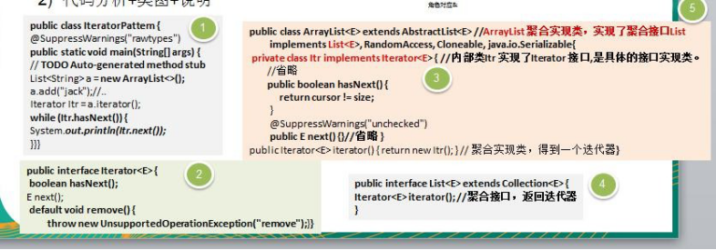</td></tr></table>代码分析+类图+说明

 

    
&nbsp;
    

    
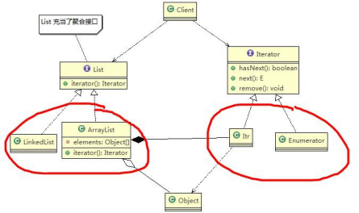&nbsp;
    

    
&nbsp;
    

    
3)&nbsp;对类图的角色分析和说明

    
&#252;&nbsp;内部类 Itr&nbsp;充当具体实现迭代器 Iterator&nbsp;的类， 作为 ArrayList &nbsp;内部类

    
&#252;&nbsp;List&nbsp;就是充当了聚合接口，含有一个 iterator() 方法，返回一个迭代器对象

    
&#252;&nbsp;ArrayList&nbsp;是实现聚合接口 List &nbsp;的子类，实现了 iterator()

    
&#252;&nbsp;Iterator 接口系统提供

    
&#252;&nbsp;迭代器模式解决了 不同集合(ArrayList&nbsp;,LinkedList)&nbsp;统一遍历问题

    
&nbsp;
    

    <h2 style="margin-top:0.0000pt;margin-right:0.0000pt;margin-bottom:0.0000pt;
margin-left:46.9000pt;text-indent:-36.0000pt;text-align:left;
mso-list:l219 level2 lfo190;">19.8&nbsp;迭代器模式的注意事项和细节</h2>
    
&nbsp;
    

    
&#216;&nbsp;优点

    
1)&nbsp;提供一个统一的方法遍历对象，客户不用再考虑聚合的类型，使用一种方法就可以遍历对象了。

    
2)&nbsp;隐藏了聚合的内部结构，客户端要遍历聚合的时候只能取到迭代器，而不会知道聚合的具体组成。

    
3)&nbsp;提供了一种设计思想，就是一个类应该只有一个引起变化的原因（叫做单一责任原则）。在聚合类中，我们把迭代器分开，就是要把管理对象集合和遍历对象集合的责任分开，这样一来集合改变的话，只影响到聚合对象。而如果遍历方式改变的话，只影响到了迭代器。

    
4)&nbsp;当要展示一组相似对象，或者遍历一组相同对象时使用, 适合使用迭代器模式

 

&#216;&nbsp;缺点

    
每个聚合对象都要一个迭代器，会生成多个迭代器不好管理类

 

<h1 style="margin-left:208.4000pt;">第 20&#9;章观察者模式</h1>
    <h2 style="margin-top:0.0000pt;margin-right:0.0000pt;margin-bottom:0.0000pt;
margin-left:46.9000pt;text-indent:-36.0000pt;text-align:left;
line-height:33.4500pt;mso-line-height-rule:exactly;mso-list:l48 level2 lfo197;">20.1&nbsp;天气预报项目需求,具体要求如下：</h2>
    
&nbsp;
    

    
1)&nbsp;气象站可以将每天测量到的温度，湿度，气压等等以公告的形式发布出去(比如发布到自己的网站或第三方)。

    
2)&nbsp;需要设计开放型 <b>API</b>，便于其他第三方也能接入气象站获取数据。

    
3)&nbsp;提供温度、气压和湿度的接口

    
4)&nbsp;测量数据更新时，要能实时的通知给第三方

    
&nbsp;
    

    <h2 style="margin-top:0.0500pt;margin-right:0.0000pt;margin-bottom:0.0000pt;
margin-left:46.9000pt;text-indent:-36.0000pt;text-align:left;
line-height:33.0500pt;mso-line-height-rule:exactly;mso-list:l48 level2 lfo197;">20.2&nbsp;天气预报设计方案 1-普通方案</h2>
    <h3 style="margin-top:0.0000pt;margin-right:0.0000pt;margin-bottom:0.0000pt;
margin-left:73.9000pt;text-indent:-48.8500pt;text-align:left;
line-height:30.4000pt;mso-line-height-rule:exactly;mso-list:l48 level3 lfo197;">20.2.1&nbsp;WeatherData&nbsp;类</h3>
    
&#216;&nbsp;传统的设计方案

    
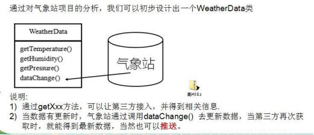&nbsp;
    

    
<table cellpadding="0" cellspacing="0"><tr><td
            width="145.333" height="0"></td></tr><tr><td></td><td>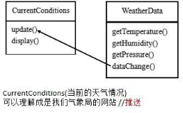</td></tr></table>&nbsp;
    

 

&#216;&nbsp;代码实现

    
&nbsp;
    

    
observer.zip

    
&nbsp;
    

    <table class=MsoNormalTable border=1 cellspacing=0 style="border-collapse:collapse;margin-left:10.9000pt;mso-table-layout-alt:fixed;
border:none;mso-border-left-alt:0.5000pt solid rgb(0,0,0);mso-border-top-alt:0.5000pt solid rgb(0,0,0);
mso-border-right-alt:0.5000pt solid rgb(0,0,0);mso-border-bottom-alt:0.5000pt solid rgb(0,0,0);mso-border-insideh:0.5000pt solid rgb(0,0,0);
mso-border-insidev:0.5000pt solid rgb(0,0,0);mso-padding-alt:0.0000pt 0.0000pt 0.0000pt 0.0000pt ;">
        <tr style="height:468.0000pt;">
            <td width=808 valign=top style="width:606.0000pt;padding:0.0000pt 0.0000pt 0.0000pt 0.0000pt ;border-left:1.0000pt solid rgb(0,0,0);
mso-border-left-alt:0.5000pt solid rgb(0,0,0);border-right:1.0000pt solid rgb(0,0,0);mso-border-right-alt:0.5000pt solid rgb(0,0,0);
border-top:1.0000pt solid rgb(0,0,0);mso-border-top-alt:0.5000pt solid rgb(0,0,0);border-bottom:1.0000pt solid rgb(0,0,0);
mso-border-bottom-alt:0.5000pt solid rgb(0,0,0);">
package com.atguigu.observer;

                
&nbsp;

                
public class Client {

                
public static void main(String[] args) {

                
//创建接入方 currentConditions

                
CurrentConditions currentConditions = new CurrentConditions();

                
//创建 WeatherData 并将 接入方 currentConditions 传递到 WeatherData 中

                
WeatherData weatherData = new WeatherData(currentConditions);

                
&nbsp;

                
//更新天气情况weatherData.setData(30, 150, 40);

                
&nbsp;

                
//天气情况变化

                
System.out.println("============天气情况变化=============");

                
weatherData.setData(40, 160, 20);

                
&nbsp;

                
&nbsp;

                
}

                
}
</td>
        </tr>
        <tr style="height:70.1000pt;">
            <td width=808 valign=top style="width:606.0000pt;padding:0.0000pt 0.0000pt 0.0000pt 0.0000pt ;border-left:1.0000pt solid rgb(0,0,0);
mso-border-left-alt:0.5000pt solid rgb(0,0,0);border-right:1.0000pt solid rgb(0,0,0);mso-border-right-alt:0.5000pt solid rgb(0,0,0);
border-top:none;mso-border-top-alt:0.5000pt solid rgb(0,0,0);border-bottom:1.0000pt solid rgb(0,0,0);
mso-border-bottom-alt:0.5000pt solid rgb(0,0,0);">
package com.atguigu.observer;

                
&nbsp;

                
/**
</td>
        </tr>
    </table>

 

    
&nbsp;

    <table class=MsoNormalTable border=1 cellspacing=0 style="border-collapse:collapse;margin-left:10.9000pt;mso-table-layout-alt:fixed;
border:none;mso-border-left-alt:0.5000pt solid rgb(0,0,0);mso-border-top-alt:0.5000pt solid rgb(0,0,0);
mso-border-right-alt:0.5000pt solid rgb(0,0,0);mso-border-bottom-alt:0.5000pt solid rgb(0,0,0);mso-border-insideh:0.5000pt solid rgb(0,0,0);
mso-border-insidev:0.5000pt solid rgb(0,0,0);mso-padding-alt:0.0000pt 0.0000pt 0.0000pt 0.0000pt ;">
        <tr style="height:608.3000pt;">
            <td width=808 valign=top style="width:606.0000pt;padding:0.0000pt 0.0000pt 0.0000pt 0.0000pt ;border-left:1.0000pt solid rgb(0,0,0);
mso-border-left-alt:0.5000pt solid rgb(0,0,0);border-right:1.0000pt solid rgb(0,0,0);mso-border-right-alt:0.5000pt solid rgb(0,0,0);
border-top:1.0000pt solid rgb(0,0,0);mso-border-top-alt:0.5000pt solid rgb(0,0,0);border-bottom:1.0000pt solid rgb(0,0,0);
mso-border-bottom-alt:0.5000pt solid rgb(0,0,0);">
*&nbsp;显示当前天气情况（可以理解成是气象站自己的网站）

                
*&nbsp;@author&nbsp;Administrator

                
*

                
*/

                
public class CurrentConditions {

                
//&nbsp;温度，气压，湿度private float temperature; private float pressure; private float humidity;

                
&nbsp;
                

                
//更新 天气情况，是由 WeatherData 来调用，我使用推送模式

                
public void update(float temperature, float pressure, float humidity) { this.temperature = temperature;

                
this.pressure = pressure; this.humidity = humidity; display();

                
}

                
&nbsp;
                

                
//显示

                
public void display() {

                
System.out.println("***Today mTemperature: " + temperature + "***"); System.out.println("***Today mPressure: " + pressure + "***"); System.out.println("***Today mHumidity: " + humidity + "***");

                
}

                
}
</td>
        </tr>
    </table>

 

    
&nbsp;

    <table class=MsoNormalTable border=1 cellspacing=0 style="border-collapse:collapse;margin-left:10.9000pt;mso-table-layout-alt:fixed;
border:none;mso-border-left-alt:0.5000pt solid rgb(0,0,0);mso-border-top-alt:0.5000pt solid rgb(0,0,0);
mso-border-right-alt:0.5000pt solid rgb(0,0,0);mso-border-bottom-alt:0.5000pt solid rgb(0,0,0);mso-border-insideh:0.5000pt solid rgb(0,0,0);
mso-border-insidev:0.5000pt solid rgb(0,0,0);mso-padding-alt:0.0000pt 0.0000pt 0.0000pt 0.0000pt ;">
        <tr style="height:608.8000pt;">
            <td width=808 valign=top style="width:606.0000pt;padding:0.0000pt 0.0000pt 0.0000pt 0.0000pt ;border-left:1.0000pt solid rgb(0,0,0);
mso-border-left-alt:0.5000pt solid rgb(0,0,0);border-right:1.0000pt solid rgb(0,0,0);mso-border-right-alt:0.5000pt solid rgb(0,0,0);
border-top:1.0000pt solid rgb(0,0,0);mso-border-top-alt:0.5000pt solid rgb(0,0,0);border-bottom:1.0000pt solid rgb(0,0,0);
mso-border-bottom-alt:0.5000pt solid rgb(0,0,0);">
package com.atguigu.observer;

                
&nbsp;
                

                
&nbsp;

                
/**

                
*&nbsp;类是核心

                
*&nbsp;1. 包含最新的天气情况信息

                
*&nbsp;2.&nbsp;含有 CurrentConditions&nbsp;对象

                
*&nbsp;3. &nbsp;当数据有更新时，就主动的调用&#9;CurrentConditions&nbsp;对象&nbsp;update 方法(含&nbsp;display), &nbsp;这样他们（接入方）就看到最新的信息

                
*&nbsp;@author&nbsp;Administrator

                
*

                
*/

                
public class WeatherData { private float temperatrue; private float pressure; private float humidity;

                
private CurrentConditions currentConditions;

                
//加入新的第三方

                
&nbsp;
                

                
&nbsp;

                
public WeatherData(CurrentConditions currentConditions) { this.currentConditions = currentConditions;

                
}

                
&nbsp;
                

                
&nbsp;

                
public float getTemperature() { return temperatrue;

                
}
</td>
        </tr>
    </table>

 

    
&nbsp;

    <table class=MsoNormalTable border=1 cellspacing=0 style="border-collapse:collapse;margin-left:10.9000pt;mso-table-layout-alt:fixed;
border:none;mso-border-left-alt:0.5000pt solid rgb(0,0,0);mso-border-top-alt:0.5000pt solid rgb(0,0,0);
mso-border-right-alt:0.5000pt solid rgb(0,0,0);mso-border-bottom-alt:0.5000pt solid rgb(0,0,0);mso-border-insideh:0.5000pt solid rgb(0,0,0);
mso-border-insidev:0.5000pt solid rgb(0,0,0);mso-padding-alt:0.0000pt 0.0000pt 0.0000pt 0.0000pt ;">
        <tr style="height:538.2000pt;">
            <td width=808 valign=top style="width:606.0000pt;padding:0.0000pt 0.0000pt 0.0000pt 0.0000pt ;border-left:1.0000pt solid rgb(0,0,0);
mso-border-left-alt:0.5000pt solid rgb(0,0,0);border-right:1.0000pt solid rgb(0,0,0);mso-border-right-alt:0.5000pt solid rgb(0,0,0);
border-top:1.0000pt solid rgb(0,0,0);mso-border-top-alt:0.5000pt solid rgb(0,0,0);border-bottom:1.0000pt solid rgb(0,0,0);
mso-border-bottom-alt:0.5000pt solid rgb(0,0,0);">
public float getPressure() { return pressure;

                
}

                
&nbsp;
                

                
&nbsp;

                
public float getHumidity() { return humidity;

                
}

                
&nbsp;
                

                
&nbsp;

                
public void dataChange() {

                
//调用 接入方的 update

                
currentConditions.update(getTemperature(), getPressure(), getHumidity());

                
}

                
&nbsp;
                

                
//当数据有更新时，就调用 setData

                
public void setData(float temperature, float pressure, float humidity) { this.temperatrue = temperature;

                
this.pressure = pressure; this.humidity = humidity;

                
//调用 dataChange， 将最新的信息 推送给 接入方 currentConditions

                
dataChange();

                
}

                
}
</td>
        </tr>
    </table>
    
&nbsp;

    
&nbsp;

    
&#216;&nbsp;问题分析

    
1)&nbsp;其他第三方接入气象站获取数据的问题

 

2)&nbsp;无法在运行时动态的添加第三方 (新浪网站)

    
3)&nbsp;违反 ocp&nbsp;原则=&#62;观察者模式

    
//在 WeatherData 中，当增加一个第三方，都需要创建一个对应的第三方的公告板对象，并加入到 dataChange, 不利于维护，也不是动态加入

    
public void dataChange() {
    

    
currentConditions.update(getTemperature(), getPressure(), getHumidity());
    

    
}
    

    <h2 style="margin-top:2.5500pt;margin-right:0.0000pt;margin-bottom:0.0000pt;
margin-left:46.9000pt;text-indent:-36.0000pt;text-align:left;
mso-list:l48 level2 lfo197;">20.3&nbsp;观察者模式原理</h2>
    
&nbsp;
    

    
1)&nbsp;观察者模式类似订牛奶业务

    
2)&nbsp;奶站/气象局：Subject

    
3)&nbsp;用户/第三方网站：Observer

    
&nbsp;

    
&#216;&nbsp;Subject：登记注册、移除和通知

    
1)&nbsp;registerObserver&nbsp;注 册

    
2)&nbsp;removeObserver&nbsp;移 除

    
3)&nbsp;notifyObservers() 通知所有的注册的用户，根据不同需求，可以是更新数据，让用户来取，也可能是实施推送， 看具体需求定

    
&#216;&nbsp;Observer：接收输入

    
&nbsp;
    

    
&#216;&nbsp;观察者模式：对象之间多对一依赖的一种设计方案，被依赖的对象为 Subject，依赖的对象为 Observer，Subject

    
通知 Observer 变化,比如这里的奶站是 Subject，是 1 的一方。用户时 Observer，是多的一方。

    <h2 style="margin-top:0.0000pt;margin-right:0.0000pt;margin-bottom:0.0000pt;
margin-left:46.9000pt;text-indent:-36.0000pt;text-align:left;
line-height:31.8000pt;mso-line-height-rule:exactly;mso-list:l48 level2 lfo197;">20.4&nbsp;观察者模式解决天气预报需求</h2>
    <h3 style="margin-top:0.0000pt;margin-right:0.0000pt;margin-bottom:0.0000pt;
margin-left:73.9000pt;text-indent:-48.8500pt;text-align:left;
line-height:30.9500pt;mso-line-height-rule:exactly;mso-list:l48 level3 lfo197;">20.4.1&nbsp;类图说明</h3>

 

    
&nbsp;
    

    
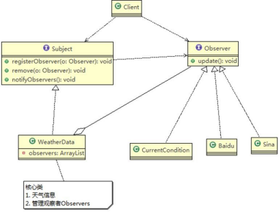&nbsp;
    

    
&nbsp;
    

    <h3 style="margin-top:0.0000pt;margin-right:0.0000pt;margin-bottom:0.0000pt;
margin-left:73.9000pt;text-indent:-48.8500pt;text-align:left;
line-height:27.9500pt;mso-line-height-rule:exactly;mso-list:l48 level3 lfo197;">20.4.2&nbsp;代码实现</h3>
    
&nbsp;
    

    
improve.zip

    
&nbsp;
    

    <table class=MsoNormalTable border=1 cellspacing=0 style="border-collapse:collapse;margin-left:10.9000pt;mso-table-layout-alt:fixed;
border:none;mso-border-left-alt:0.5000pt solid rgb(0,0,0);mso-border-top-alt:0.5000pt solid rgb(0,0,0);
mso-border-right-alt:0.5000pt solid rgb(0,0,0);mso-border-bottom-alt:0.5000pt solid rgb(0,0,0);mso-border-insideh:0.5000pt solid rgb(0,0,0);
mso-border-insidev:0.5000pt solid rgb(0,0,0);mso-padding-alt:0.0000pt 0.0000pt 0.0000pt 0.0000pt ;">
        <tr style="height:280.7000pt;">
            <td width=808 valign=top style="width:606.0000pt;padding:0.0000pt 0.0000pt 0.0000pt 0.0000pt ;border-left:1.0000pt solid rgb(0,0,0);
mso-border-left-alt:0.5000pt solid rgb(0,0,0);border-right:1.0000pt solid rgb(0,0,0);mso-border-right-alt:0.5000pt solid rgb(0,0,0);
border-top:1.0000pt solid rgb(0,0,0);mso-border-top-alt:0.5000pt solid rgb(0,0,0);border-bottom:1.0000pt solid rgb(0,0,0);
mso-border-bottom-alt:0.5000pt solid rgb(0,0,0);">
package com.atguigu.observer.improve;

                
&nbsp;

                
public class BaiduSite implements Observer {

                
&nbsp;

                
//&nbsp;温度，气压，湿度private float temperature; private float pressure; private float humidity;

                
&nbsp;

                
// &nbsp;更新 &nbsp;天气情况，是由 &nbsp;WeatherData&nbsp;&nbsp;来调用，我使用推送模式

                
public void update(float temperature, float pressure, float humidity)&nbsp;{

                
this.temperature = temperature;
</td>
        </tr>
    </table>

 

    
&nbsp;

    <table class=MsoNormalTable border=1 cellspacing=0 style="border-collapse:collapse;margin-left:10.9000pt;mso-table-layout-alt:fixed;
border:none;mso-border-left-alt:0.5000pt solid rgb(0,0,0);mso-border-top-alt:0.5000pt solid rgb(0,0,0);
mso-border-right-alt:0.5000pt solid rgb(0,0,0);mso-border-bottom-alt:0.5000pt solid rgb(0,0,0);mso-border-insideh:0.5000pt solid rgb(0,0,0);
mso-border-insidev:0.5000pt solid rgb(0,0,0);mso-padding-alt:0.0000pt 0.0000pt 0.0000pt 0.0000pt ;">
        <tr style="height:351.0000pt;">
            <td width=808 valign=top style="width:606.0000pt;padding:0.0000pt 0.0000pt 0.0000pt 0.0000pt ;border-left:1.0000pt solid rgb(0,0,0);
mso-border-left-alt:0.5000pt solid rgb(0,0,0);border-right:1.0000pt solid rgb(0,0,0);mso-border-right-alt:0.5000pt solid rgb(0,0,0);
border-top:1.0000pt solid rgb(0,0,0);mso-border-top-alt:0.5000pt solid rgb(0,0,0);border-bottom:1.0000pt solid rgb(0,0,0);
mso-border-bottom-alt:0.5000pt solid rgb(0,0,0);">
this.pressure = pressure; this.humidity = humidity; display();

                
}

                
&nbsp;
                

                
// 显 示

                
public void display() {

                
System.out.println("===百度网站====");

                
System.out.println("***百度网站 气温 : " + temperature + "***");

                
System.out.println("***百度网站 气压: " + pressure + "***");

                
System.out.println("***百度网站 湿度: " + humidity + "***");

                
}

                
&nbsp;
                

                
&nbsp;

                
}
</td>
        </tr>
        <tr style="height:257.3000pt;">
            <td width=808 valign=top style="width:606.0000pt;padding:0.0000pt 0.0000pt 0.0000pt 0.0000pt ;border-left:1.0000pt solid rgb(0,0,0);
mso-border-left-alt:0.5000pt solid rgb(0,0,0);border-right:1.0000pt solid rgb(0,0,0);mso-border-right-alt:0.5000pt solid rgb(0,0,0);
border-top:none;mso-border-top-alt:0.5000pt solid rgb(0,0,0);border-bottom:1.0000pt solid rgb(0,0,0);
mso-border-bottom-alt:0.5000pt solid rgb(0,0,0);">
package com.atguigu.observer.improve;

                
&nbsp;
                

                
&nbsp;

                
public class Client {

                
&nbsp;
                

                
&nbsp;

                
public static void main(String[] args) {

                
// TODO Auto-generated method stub

                
//创建一个 WeatherData

                
WeatherData weatherData = new WeatherData();

                
&nbsp;
                

                
//创建观察者

                
CurrentConditions currentConditions = new CurrentConditions();
</td>
        </tr>
    </table>

 

    
&nbsp;

    <table class=MsoNormalTable border=1 cellspacing=0 style="border-collapse:collapse;margin-left:10.9000pt;mso-table-layout-alt:fixed;
border:none;mso-border-left-alt:0.5000pt solid rgb(0,0,0);mso-border-top-alt:0.5000pt solid rgb(0,0,0);
mso-border-right-alt:0.5000pt solid rgb(0,0,0);mso-border-bottom-alt:0.5000pt solid rgb(0,0,0);mso-border-insideh:0.5000pt solid rgb(0,0,0);
mso-border-insidev:0.5000pt solid rgb(0,0,0);mso-padding-alt:0.0000pt 0.0000pt 0.0000pt 0.0000pt ;">
        <tr style="height:468.0000pt;">
            <td width=808 valign=top style="width:606.0000pt;padding:0.0000pt 0.0000pt 0.0000pt 0.0000pt ;border-left:1.0000pt solid rgb(0,0,0);
mso-border-left-alt:0.5000pt solid rgb(0,0,0);border-right:1.0000pt solid rgb(0,0,0);mso-border-right-alt:0.5000pt solid rgb(0,0,0);
border-top:1.0000pt solid rgb(0,0,0);mso-border-top-alt:0.5000pt solid rgb(0,0,0);border-bottom:1.0000pt solid rgb(0,0,0);
mso-border-bottom-alt:0.5000pt solid rgb(0,0,0);">
BaiduSite baiduSite = new BaiduSite();

                
&nbsp;
                

                
// 注 册 到 weatherData weatherData.registerObserver(currentConditions); weatherData.registerObserver(baiduSite);

                
&nbsp;
                

                
// 测 试 &nbsp;&nbsp;&nbsp;&nbsp;&nbsp;&nbsp;&nbsp;&nbsp;&nbsp;&nbsp;&nbsp;&nbsp;&nbsp;&nbsp;&nbsp;&nbsp;&nbsp;&nbsp;&nbsp;&nbsp;&nbsp;&nbsp;&nbsp;&nbsp;&nbsp;&nbsp;&nbsp;&nbsp;&nbsp;&nbsp;&nbsp;&nbsp;&nbsp;&nbsp;&nbsp;&nbsp;&nbsp;&nbsp;&nbsp;&nbsp;&nbsp;&nbsp;&nbsp;&nbsp;&nbsp;&nbsp;&nbsp;&nbsp;&nbsp;&nbsp;&nbsp;&nbsp;&nbsp;&nbsp;&nbsp;&nbsp;System.out.println("通知各个注册的观察者, 看看信息"); weatherData.setData(10f, 100f, 30.3f);

                
&nbsp;
                

                
&nbsp;
                

                
&nbsp;
                

                
weatherData.removeObserver(currentConditions);

                
//测试System.out.println();

                
System.out.println("通知各个注册的观察者, 看看信息"); weatherData.setData(10f, 100f, 30.3f);

                
}

                
&nbsp;
                

                
&nbsp;

                
}
</td>
        </tr>
        <tr style="height:140.3000pt;">
            <td width=808 valign=top style="width:606.0000pt;padding:0.0000pt 0.0000pt 0.0000pt 0.0000pt ;border-left:1.0000pt solid rgb(0,0,0);
mso-border-left-alt:0.5000pt solid rgb(0,0,0);border-right:1.0000pt solid rgb(0,0,0);mso-border-right-alt:0.5000pt solid rgb(0,0,0);
border-top:none;mso-border-top-alt:0.5000pt solid rgb(0,0,0);border-bottom:1.0000pt solid rgb(0,0,0);
mso-border-bottom-alt:0.5000pt solid rgb(0,0,0);">
package com.atguigu.observer.improve;

                
&nbsp;
                

                
&nbsp;

                
public class CurrentConditions implements Observer {

                
&nbsp;
                

                
//&nbsp;温度，气压，湿度

                
private float temperature;
</td>
        </tr>
    </table>

 

    
&nbsp;

    <table class=MsoNormalTable border=1 cellspacing=0 style="border-collapse:collapse;margin-left:10.9000pt;mso-table-layout-alt:fixed;
border:none;mso-border-left-alt:0.5000pt solid rgb(0,0,0);mso-border-top-alt:0.5000pt solid rgb(0,0,0);
mso-border-right-alt:0.5000pt solid rgb(0,0,0);mso-border-bottom-alt:0.5000pt solid rgb(0,0,0);mso-border-insideh:0.5000pt solid rgb(0,0,0);
mso-border-insidev:0.5000pt solid rgb(0,0,0);mso-padding-alt:0.0000pt 0.0000pt 0.0000pt 0.0000pt ;">
        <tr style="height:444.6000pt;">
            <td width=808 valign=top style="width:606.0000pt;padding:0.0000pt 0.0000pt 0.0000pt 0.0000pt ;border-left:1.0000pt solid rgb(0,0,0);
mso-border-left-alt:0.5000pt solid rgb(0,0,0);border-right:1.0000pt solid rgb(0,0,0);mso-border-right-alt:0.5000pt solid rgb(0,0,0);
border-top:1.0000pt solid rgb(0,0,0);mso-border-top-alt:0.5000pt solid rgb(0,0,0);border-bottom:1.0000pt solid rgb(0,0,0);
mso-border-bottom-alt:0.5000pt solid rgb(0,0,0);">
private float pressure; private float humidity;

                
&nbsp;

                
//&nbsp;更新 天气情况，是由 WeatherData 来调用，我使用推送模式

                
public void update(float temperature, float pressure, float humidity) { this.temperature = temperature;

                
this.pressure = pressure; this.humidity = humidity; display();

                
}

                
&nbsp;
                

                
// 显 示

                
public void display() {

                
System.out.println("***Today mTemperature: " + temperature + "***"); System.out.println("***Today mPressure: " + pressure + "***"); System.out.println("***Today mHumidity: " + humidity + "***");

                
}

                
}
</td>
        </tr>
        <tr style="height:163.7000pt;">
            <td width=808 valign=top style="width:606.0000pt;padding:0.0000pt 0.0000pt 0.0000pt 0.0000pt ;border-left:1.0000pt solid rgb(0,0,0);
mso-border-left-alt:0.5000pt solid rgb(0,0,0);border-right:1.0000pt solid rgb(0,0,0);mso-border-right-alt:0.5000pt solid rgb(0,0,0);
border-top:none;mso-border-top-alt:0.5000pt solid rgb(0,0,0);border-bottom:1.0000pt solid rgb(0,0,0);
mso-border-bottom-alt:0.5000pt solid rgb(0,0,0);">
package com.atguigu.observer.improve;

                
&nbsp;
                

                
//观察者接口，有观察者来实现 public interface Observer {

                
&nbsp;
                

                
&nbsp;

                
public void update(float temperature, float pressure, float humidity);

                
}
</td>
        </tr>
    </table>

 

    <table class=MsoNormalTable border=1 cellspacing=0 style="border-collapse:collapse;margin-left:10.9000pt;mso-table-layout-alt:fixed;
border:none;mso-border-left-alt:0.5000pt solid rgb(0,0,0);mso-border-top-alt:0.5000pt solid rgb(0,0,0);
mso-border-right-alt:0.5000pt solid rgb(0,0,0);mso-border-bottom-alt:0.5000pt solid rgb(0,0,0);mso-border-insideh:0.5000pt solid rgb(0,0,0);
mso-border-insidev:0.5000pt solid rgb(0,0,0);mso-padding-alt:0.0000pt 0.0000pt 0.0000pt 0.0000pt ;">
        <tr style="height:23.4000pt;">
            <td width=808 valign=top style="width:606.0000pt;padding:0.0000pt 0.0000pt 0.0000pt 0.0000pt ;border-left:1.0000pt solid rgb(0,0,0);
mso-border-left-alt:0.5000pt solid rgb(0,0,0);border-right:1.0000pt solid rgb(0,0,0);mso-border-right-alt:0.5000pt solid rgb(0,0,0);
border-top:1.0000pt solid rgb(0,0,0);mso-border-top-alt:0.5000pt solid rgb(0,0,0);border-bottom:1.0000pt solid rgb(0,0,0);
mso-border-bottom-alt:0.5000pt solid rgb(0,0,0);">
                
&nbsp;
                

            </td>
        </tr>
        <tr style="height:233.9500pt;">
            <td width=808 valign=top style="width:606.0000pt;padding:0.0000pt 0.0000pt 0.0000pt 0.0000pt ;border-left:1.0000pt solid rgb(0,0,0);
mso-border-left-alt:0.5000pt solid rgb(0,0,0);border-right:1.0000pt solid rgb(0,0,0);mso-border-right-alt:0.5000pt solid rgb(0,0,0);
border-top:none;mso-border-top-alt:0.5000pt solid rgb(0,0,0);border-bottom:1.0000pt solid rgb(0,0,0);
mso-border-bottom-alt:0.5000pt solid rgb(0,0,0);">
package com.atguigu.observer.improve;

                
&nbsp;
                

                
//接口, 让 WeatherData 来实现

                
public interface Subject {

                
&nbsp;
                

                
&nbsp;

                
public void registerObserver(Observer o); public void removeObserver(Observer o); public void notifyObservers();

                
}
</td>
        </tr>
        <tr style="height:351.4000pt;">
            <td width=808 valign=top style="width:606.0000pt;padding:0.0000pt 0.0000pt 0.0000pt 0.0000pt ;border-left:1.0000pt solid rgb(0,0,0);
mso-border-left-alt:0.5000pt solid rgb(0,0,0);border-right:1.0000pt solid rgb(0,0,0);mso-border-right-alt:0.5000pt solid rgb(0,0,0);
border-top:none;mso-border-top-alt:0.5000pt solid rgb(0,0,0);border-bottom:1.0000pt solid rgb(0,0,0);
mso-border-bottom-alt:0.5000pt solid rgb(0,0,0);">
package com.atguigu.observer.improve;

                
&nbsp;
                

                
&nbsp;

                
import java.util.ArrayList;

                
&nbsp;
                

                
&nbsp;

                
/**

                
*&nbsp;类是核心

                
*&nbsp;1. 包含最新的天气情况信息

                
*&nbsp;2.&nbsp;含有 观察者集合，使用 ArrayList&nbsp;管理

                
*&nbsp;3. &nbsp;当数据有更新时，就主动的调用&#9;ArrayList,&nbsp;通知所有的（接入方）就看到最新的信息

                
*&nbsp;@author&nbsp;Administrator

                
*

                
*/

                
public class WeatherData implements Subject { private float temperatrue;

                
private float pressure;
</td>
        </tr>
    </table>

 

    
&nbsp;

    <table class=MsoNormalTable border=1 cellspacing=0 style="border-collapse:collapse;margin-left:10.9000pt;mso-table-layout-alt:fixed;
border:none;mso-border-left-alt:0.5000pt solid rgb(0,0,0);mso-border-top-alt:0.5000pt solid rgb(0,0,0);
mso-border-right-alt:0.5000pt solid rgb(0,0,0);mso-border-bottom-alt:0.5000pt solid rgb(0,0,0);mso-border-insideh:0.5000pt solid rgb(0,0,0);
mso-border-insidev:0.5000pt solid rgb(0,0,0);mso-padding-alt:0.0000pt 0.0000pt 0.0000pt 0.0000pt ;">
        <tr style="height:608.8000pt;">
            <td width=808 valign=top style="width:606.0000pt;padding:0.0000pt 0.0000pt 0.0000pt 0.0000pt ;border-left:1.0000pt solid rgb(0,0,0);
mso-border-left-alt:0.5000pt solid rgb(0,0,0);border-right:1.0000pt solid rgb(0,0,0);mso-border-right-alt:0.5000pt solid rgb(0,0,0);
border-top:1.0000pt solid rgb(0,0,0);mso-border-top-alt:0.5000pt solid rgb(0,0,0);border-bottom:1.0000pt solid rgb(0,0,0);
mso-border-bottom-alt:0.5000pt solid rgb(0,0,0);">
private float humidity;

                
//观察者集合

                
private ArrayList&#60;Observer&#62; observers;

                
//加入新的第三方public WeatherData() {

                
observers = new ArrayList&#60;Observer&#62;();

                
}

                
&nbsp;
                

                
&nbsp;

                
public float getTemperature() { return temperatrue;

                
}

                
&nbsp;
                

                
&nbsp;

                
public float getPressure() { return pressure;

                
}

                
&nbsp;
                

                
&nbsp;

                
public float getHumidity() { return humidity;

                
}

                
&nbsp;
                

                
&nbsp;

                
public void dataChange() {

                
//调用 接入方的 update

                
&nbsp;
                

                
&nbsp;

                
notifyObservers();
</td>
        </tr>
    </table>

 

    
&nbsp;

    <table class=MsoNormalTable border=1 cellspacing=0 style="border-collapse:collapse;margin-left:10.9000pt;mso-table-layout-alt:fixed;
border:none;mso-border-left-alt:0.5000pt solid rgb(0,0,0);mso-border-top-alt:0.5000pt solid rgb(0,0,0);
mso-border-right-alt:0.5000pt solid rgb(0,0,0);mso-border-bottom-alt:0.5000pt solid rgb(0,0,0);mso-border-insideh:0.5000pt solid rgb(0,0,0);
mso-border-insidev:0.5000pt solid rgb(0,0,0);mso-padding-alt:0.0000pt 0.0000pt 0.0000pt 0.0000pt ;">
        <tr style="height:608.8000pt;">
            <td width=808 valign=top style="width:606.0000pt;padding:0.0000pt 0.0000pt 0.0000pt 0.0000pt ;border-left:1.0000pt solid rgb(0,0,0);
mso-border-left-alt:0.5000pt solid rgb(0,0,0);border-right:1.0000pt solid rgb(0,0,0);mso-border-right-alt:0.5000pt solid rgb(0,0,0);
border-top:1.0000pt solid rgb(0,0,0);mso-border-top-alt:0.5000pt solid rgb(0,0,0);border-bottom:1.0000pt solid rgb(0,0,0);
mso-border-bottom-alt:0.5000pt solid rgb(0,0,0);">
}

                
&nbsp;
                

                
//当数据有更新时，就调用 setData

                
public void setData(float temperature, float pressure, float humidity) { this.temperatrue = temperature;

                
this.pressure = pressure; this.humidity = humidity;

                
//调用 dataChange， 将最新的信息 推送给 接入方 currentConditions

                
dataChange();

                
}

                
&nbsp;
                

                
//注册一个观察者 @Override

                
public void registerObserver(Observer o) {

                
// TODO Auto-generated method stub observers.add(o);

                
}

                
&nbsp;
                

                
//移除一个观察者 @Override

                
public void removeObserver(Observer o) {

                
// TODO Auto-generated method stub if(observers.contains(o)) {

                
observers.remove(o);

                
}

                
}
</td>
        </tr>
    </table>

 

    
&nbsp;

    <table class=MsoNormalTable border=1 cellspacing=0 style="border-collapse:collapse;margin-left:10.9000pt;mso-table-layout-alt:fixed;
border:none;mso-border-left-alt:0.5000pt solid rgb(0,0,0);mso-border-top-alt:0.5000pt solid rgb(0,0,0);
mso-border-right-alt:0.5000pt solid rgb(0,0,0);mso-border-bottom-alt:0.5000pt solid rgb(0,0,0);mso-border-insideh:0.5000pt solid rgb(0,0,0);
mso-border-insidev:0.5000pt solid rgb(0,0,0);mso-padding-alt:0.0000pt 0.0000pt 0.0000pt 0.0000pt ;">
        <tr style="height:257.4000pt;">
            <td width=808 valign=top style="width:606.0000pt;padding:0.0000pt 0.0000pt 0.0000pt 0.0000pt ;border-left:1.0000pt solid rgb(0,0,0);
mso-border-left-alt:0.5000pt solid rgb(0,0,0);border-right:1.0000pt solid rgb(0,0,0);mso-border-right-alt:0.5000pt solid rgb(0,0,0);
border-top:1.0000pt solid rgb(0,0,0);mso-border-top-alt:0.5000pt solid rgb(0,0,0);border-bottom:1.0000pt solid rgb(0,0,0);
mso-border-bottom-alt:0.5000pt solid rgb(0,0,0);">
                
&nbsp;

                
//遍历所有的观察者，并通知 @Override

                
public void notifyObservers() {

                
// TODO Auto-generated method stub for(int i = 0; i &#60; observers.size(); i++) {

                
observers.get(i).update(this.temperatrue, this.pressure, this.humidity);

                
}

                
}

                
}
</td>
        </tr>
    </table>
    
&nbsp;

    
&nbsp;

    <h3 style="margin-top:0.0000pt;margin-right:0.0000pt;margin-bottom:0.0000pt;
margin-left:73.9000pt;text-indent:-48.8500pt;text-align:left;
line-height:28.1000pt;mso-line-height-rule:exactly;mso-list:l48 level3 lfo197;">20.4.3&nbsp;观察者模式的好处</h3>
    
&nbsp;
    

    
1)&nbsp;观察者模式设计后，会以集合的方式来管理用户(Observer)，包括注册，移除和通知。

    
2)&nbsp;这样，我们增加观察者(这里可以理解成一个新的公告板)，就不需要去修改核心类 WeatherData&nbsp;不会修改代码， 遵守了 ocp&nbsp;原则。

    <h2 style="margin-top:0.0000pt;margin-right:0.0000pt;margin-bottom:0.0000pt;
margin-left:46.9000pt;text-indent:-36.0000pt;text-align:left;
line-height:31.8500pt;mso-line-height-rule:exactly;mso-list:l48 level2 lfo197;">20.5&nbsp;观察者模式在 Jdk&nbsp;应用的源码分析</h2>
    
&nbsp;
    

    
1)&nbsp;Jdk&nbsp;的 Observable&nbsp;类就使用了观察者模式

    
2)&nbsp;代码分析+模式角色分析

 

    
&nbsp;
    

    
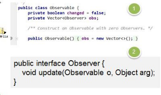&nbsp;
    

    
&nbsp;
    

    
3)&nbsp;模式角色分析

    
&#252;&nbsp;Observable&#9;的作用和地位等价于 我们前面讲过 Subject

    
&#252;&nbsp;Observable&nbsp;是类，不是接口，类中已经实现了核心的方法 ,即管理 Observer&nbsp;的方法 add..&nbsp;delete&nbsp;.. notify...

    
&#252;&nbsp;Observer&nbsp;的作用和地位等价于我们前面讲过的 Observer, 有 update

    
&#252;&nbsp;Observable&nbsp;和 Observer&nbsp;的使用方法和前面讲过的一样，只是 Observable 是类，通过继承来实现观察者模式

 

<h1 style="margin-left:208.4000pt;line-height:42.3000pt;mso-line-height-rule:exactly;">第 21&#9;章中介者模式</h1>
    <h2 style="margin-top:0.0000pt;margin-right:0.0000pt;margin-bottom:0.0000pt;
margin-left:46.9000pt;text-indent:-36.0000pt;text-align:left;
line-height:33.0000pt;mso-line-height-rule:exactly;mso-list:l145 level2 lfo207;">21.1&nbsp;<table cellpadding="0" cellspacing="0"><tr><td
            width="126.533" height="0"></td></tr><tr><td></td><td></td></tr></table>智能家庭项目</h2>
    
智能家庭项目：

    
1)&nbsp;智能家庭包括各种设备，闹钟、咖啡机、电视机、窗帘 等

    
2)&nbsp;主人要看电视时，各个设备可以协同工作，自动完成看电视的准备工作，比如流程为：闹铃响起-&#62;咖啡机开始做咖啡-&#62;窗帘自动落下-&#62;电视机开始播放

    <h2 style="margin-top:0.0000pt;margin-right:0.0000pt;margin-bottom:0.0000pt;
margin-left:46.9000pt;text-indent:-36.0000pt;text-align:left;
line-height:31.9500pt;mso-line-height-rule:exactly;mso-list:l145 level2 lfo207;">21.2&nbsp;传统方案解决智能家庭管理问题</h2>
    
<table cellpadding="0" cellspacing="0"><tr><td
            width="126.533" height="0"></td></tr><tr><td></td><td>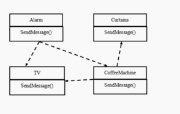</td></tr></table>&nbsp;
    

    <h2 style="margin-top:4.8000pt;margin-right:0.0000pt;margin-bottom:0.0000pt;
margin-left:46.9000pt;text-indent:-36.0000pt;text-align:left;
mso-list:l145 level2 lfo207;">21.3&nbsp;传统的方式的问题分析</h2>
    
&nbsp;
    

    
1)&nbsp;当各电器对象有多种状态改变时，相互之间的调用关系会比较复杂

    
2)&nbsp;各个电器对象彼此联系，你中有我，我中有你，不利于松耦合.

    
3)&nbsp;各个电器对象之间所传递的消息(参数)，容易混乱

    
4)&nbsp;当系统增加一个新的电器对象时，或者执行流程改变时，代码的可维护性、扩展性都不理想&#9;考虑中介者模式

 

<h2 style="margin-top:0.0000pt;margin-right:0.0000pt;margin-bottom:0.0000pt;
margin-left:46.9000pt;text-indent:-36.0000pt;text-align:left;
line-height:32.7000pt;mso-line-height-rule:exactly;mso-list:l145 level2 lfo207;">21.4&nbsp;中介者模式基本介绍</h2>
    
基本介绍

    
&nbsp;
    

    
1)&nbsp;中介者模式（Mediator&nbsp;Pattern），用一个中介对象来封装一系列的对象交互。中介者使各个对象不需要显式地相互引用，从而使其耦合松散，而且可以独立地改变它们之间的交互

    
2)&nbsp;中介者模式属于行为型模式，使代码易于维护

    
3)&nbsp;比如 MVC&nbsp;模式，C（Controller&nbsp;控制器）是 M（Model 模型）和 V（View&nbsp;视图）的中介者，在前后端交互时起到了中间人的作用

    <h2 style="margin-top:0.0000pt;margin-right:0.0000pt;margin-bottom:0.0000pt;
margin-left:46.9000pt;text-indent:-36.0000pt;text-align:left;
line-height:31.9500pt;mso-line-height-rule:exactly;mso-list:l145 level2 lfo207;">21.5&nbsp;中介者模式的原理类图</h2>
    
<table cellpadding="0" cellspacing="0"><tr><td
            width="150.067" height="0"></td></tr><tr><td></td><td>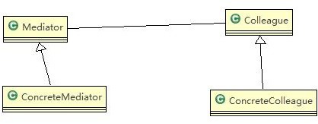</td></tr></table>&nbsp;
    

    
&nbsp;
    

    
&nbsp;
    

    
&#216;&nbsp;对原理类图的说明-即(中介者模式的角色及职责)

    
1)&nbsp;Mediator&nbsp;就是抽象中介者,定义了同事对象到中介者对象的接口

    
2)&nbsp;Colleague 是抽象同事类

    
3)&nbsp;ConcreteMediator&nbsp;具体的中介者对象, 实现抽象方法, 他需要知道所有的具体的同事类,即以一个集合来管理

    
HashMap,并接受某个同事对象消息，完成相应的任务

    
4)&nbsp;ConcreteColleague&nbsp;具体的同事类，会有很多, 每个同事只知道自己的行为，&nbsp;而不了解其他同事类的行为(方法)， 但&#9;是他们都依赖中介者对象

    <h2 style="margin-top:0.0000pt;margin-right:0.0000pt;margin-bottom:0.0000pt;
margin-left:46.9000pt;text-indent:-36.0000pt;text-align:left;
line-height:30.8500pt;mso-line-height-rule:exactly;mso-list:l145 level2 lfo207;">21.6&nbsp;中介者模式应用实例-智能家庭管理</h2>
    
1)&nbsp;应用实例要求

    
完成前面的智能家庭的项目，使用中介者模式

 

    
&nbsp;
    

    
2)&nbsp;<table cellpadding="0" cellspacing="0"><tr><td
            width="153.133" height="0"></td></tr><tr><td></td><td>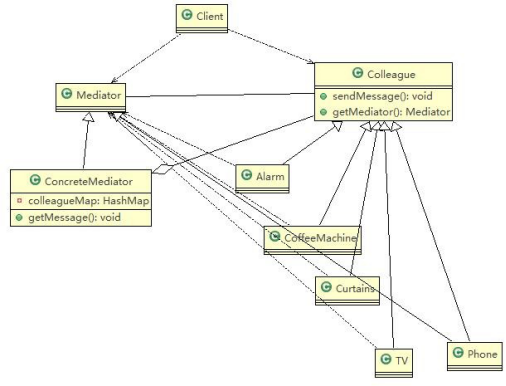</td></tr></table>思路分析和图解(类图)

    
&nbsp;

    
3)&nbsp;代码实现

    
&nbsp;
    

    
smarthouse.zip

    
&nbsp;
    

    <table class=MsoNormalTable border=1 cellspacing=0 style="border-collapse:collapse;margin-left:10.9000pt;mso-table-layout-alt:fixed;
border:none;mso-border-left-alt:0.5000pt solid rgb(0,0,0);mso-border-top-alt:0.5000pt solid rgb(0,0,0);
mso-border-right-alt:0.5000pt solid rgb(0,0,0);mso-border-bottom-alt:0.5000pt solid rgb(0,0,0);mso-border-insideh:0.5000pt solid rgb(0,0,0);
mso-border-insidev:0.5000pt solid rgb(0,0,0);mso-padding-alt:0.0000pt 0.0000pt 0.0000pt 0.0000pt ;">
        <tr style="height:163.7000pt;">
            <td width=808 valign=top style="width:606.0000pt;padding:0.0000pt 0.0000pt 0.0000pt 0.0000pt ;border-left:1.0000pt solid rgb(0,0,0);
mso-border-left-alt:0.5000pt solid rgb(0,0,0);border-right:1.0000pt solid rgb(0,0,0);mso-border-right-alt:0.5000pt solid rgb(0,0,0);
border-top:1.0000pt solid rgb(0,0,0);mso-border-top-alt:0.5000pt solid rgb(0,0,0);border-bottom:1.0000pt solid rgb(0,0,0);
mso-border-bottom-alt:0.5000pt solid rgb(0,0,0);">
package com.atguigu.mediator.smarthouse;

                
&nbsp;

                
//具体的同事类

                
public class Alarm extends Colleague {

                
&nbsp;

                
//构造器

                
public Alarm(Mediator mediator, String name) {
</td>
        </tr>
    </table>

 

    
&nbsp;

    <table class=MsoNormalTable border=1 cellspacing=0 style="border-collapse:collapse;margin-left:10.9000pt;mso-table-layout-alt:fixed;
border:none;mso-border-left-alt:0.5000pt solid rgb(0,0,0);mso-border-top-alt:0.5000pt solid rgb(0,0,0);
mso-border-right-alt:0.5000pt solid rgb(0,0,0);mso-border-bottom-alt:0.5000pt solid rgb(0,0,0);mso-border-insideh:0.5000pt solid rgb(0,0,0);
mso-border-insidev:0.5000pt solid rgb(0,0,0);mso-padding-alt:0.0000pt 0.0000pt 0.0000pt 0.0000pt ;">
        <tr style="height:444.6000pt;">
            <td width=808 valign=top style="width:606.0000pt;padding:0.0000pt 0.0000pt 0.0000pt 0.0000pt ;border-left:1.0000pt solid rgb(0,0,0);
mso-border-left-alt:0.5000pt solid rgb(0,0,0);border-right:1.0000pt solid rgb(0,0,0);mso-border-right-alt:0.5000pt solid rgb(0,0,0);
border-top:1.0000pt solid rgb(0,0,0);mso-border-top-alt:0.5000pt solid rgb(0,0,0);border-bottom:1.0000pt solid rgb(0,0,0);
mso-border-bottom-alt:0.5000pt solid rgb(0,0,0);">
super(mediator, name);

                
// TODO Auto-generated constructor stub

                
//在创建 Alarm&nbsp;同事对象时，将自己放入到 ConcreteMediator&nbsp;对象中[集合] mediator.Register(name, this);

                
}

                
&nbsp;
                

                
&nbsp;

                
public void SendAlarm(int stateChange) { SendMessage(stateChange);

                
}

                
&nbsp;
                

                
&nbsp;

                
@Override

                
public void SendMessage(int stateChange) {

                
// TODO Auto-generated method stub

                
// 调 用 的 中 介 者 对 象 的 getMessage this.GetMediator().GetMessage(stateChange, this.name);

                
}

                
&nbsp;
                

                
&nbsp;

                
}
</td>
        </tr>
        <tr style="height:163.7000pt;">
            <td width=808 valign=top style="width:606.0000pt;padding:0.0000pt 0.0000pt 0.0000pt 0.0000pt ;border-left:1.0000pt solid rgb(0,0,0);
mso-border-left-alt:0.5000pt solid rgb(0,0,0);border-right:1.0000pt solid rgb(0,0,0);mso-border-right-alt:0.5000pt solid rgb(0,0,0);
border-top:none;mso-border-top-alt:0.5000pt solid rgb(0,0,0);border-bottom:1.0000pt solid rgb(0,0,0);
mso-border-bottom-alt:0.5000pt solid rgb(0,0,0);">
package com.atguigu.mediator.smarthouse;

                
&nbsp;
                

                
&nbsp;

                
public class ClientTest {

                
&nbsp;
                

                
&nbsp;

                
public static void main(String[] args) {

                
//创建一个中介者对象

                
Mediator mediator = new ConcreteMediator();
</td>
        </tr>
    </table>

 

    
&nbsp;

    <table class=MsoNormalTable border=1 cellspacing=0 style="border-collapse:collapse;margin-left:10.9000pt;mso-table-layout-alt:fixed;
border:none;mso-border-left-alt:0.5000pt solid rgb(0,0,0);mso-border-top-alt:0.5000pt solid rgb(0,0,0);
mso-border-right-alt:0.5000pt solid rgb(0,0,0);mso-border-bottom-alt:0.5000pt solid rgb(0,0,0);mso-border-insideh:0.5000pt solid rgb(0,0,0);
mso-border-insidev:0.5000pt solid rgb(0,0,0);mso-padding-alt:0.0000pt 0.0000pt 0.0000pt 0.0000pt ;">
        <tr style="height:468.0000pt;">
            <td width=808 valign=top style="width:606.0000pt;padding:0.0000pt 0.0000pt 0.0000pt 0.0000pt ;border-left:1.0000pt solid rgb(0,0,0);
mso-border-left-alt:0.5000pt solid rgb(0,0,0);border-right:1.0000pt solid rgb(0,0,0);mso-border-right-alt:0.5000pt solid rgb(0,0,0);
border-top:1.0000pt solid rgb(0,0,0);mso-border-top-alt:0.5000pt solid rgb(0,0,0);border-bottom:1.0000pt solid rgb(0,0,0);
mso-border-bottom-alt:0.5000pt solid rgb(0,0,0);">
                
&nbsp;

                
//创建&nbsp;Alarm &nbsp;并且加入到&#9;ConcreteMediator&nbsp;对象的&nbsp;HashMap Alarm alarm = new Alarm(mediator,&nbsp;"alarm");

                
&nbsp;
                

                
//创建了&nbsp;CoffeeMachine&nbsp;对象，并&#9;且加入到&#9;ConcreteMediator&nbsp;对象的&nbsp;HashMap CoffeeMachine coffeeMachine = new&nbsp;CoffeeMachine(mediator,

                
"coffeeMachine");

                
&nbsp;
                

                
//创建 &nbsp;Curtains&nbsp;,&nbsp;并&#9;且加入到&#9;ConcreteMediator&nbsp;对象的&nbsp;HashMap Curtains curtains = new Curtains(mediator,&nbsp;"curtains");

                
TV tV = new TV(mediator, "TV");

                
&nbsp;
                

                
//让闹钟发出消息alarm.SendAlarm(0); coffeeMachine.FinishCoffee(); alarm.SendAlarm(1);

                
}

                
&nbsp;
                

                
&nbsp;

                
}
</td>
        </tr>
        <tr style="height:140.3000pt;">
            <td width=808 valign=top style="width:606.0000pt;padding:0.0000pt 0.0000pt 0.0000pt 0.0000pt ;border-left:1.0000pt solid rgb(0,0,0);
mso-border-left-alt:0.5000pt solid rgb(0,0,0);border-right:1.0000pt solid rgb(0,0,0);mso-border-right-alt:0.5000pt solid rgb(0,0,0);
border-top:none;mso-border-top-alt:0.5000pt solid rgb(0,0,0);border-bottom:1.0000pt solid rgb(0,0,0);
mso-border-bottom-alt:0.5000pt solid rgb(0,0,0);">
package com.atguigu.mediator.smarthouse;

                
&nbsp;
                

                
&nbsp;

                
public class CoffeeMachine extends Colleague {

                
&nbsp;
                

                
public CoffeeMachine(Mediator mediator, String name) { super(mediator, name);
</td>
        </tr>
    </table>

 

    
&nbsp;

    <table class=MsoNormalTable border=1 cellspacing=0 style="border-collapse:collapse;margin-left:10.9000pt;mso-table-layout-alt:fixed;
border:none;mso-border-left-alt:0.5000pt solid rgb(0,0,0);mso-border-top-alt:0.5000pt solid rgb(0,0,0);
mso-border-right-alt:0.5000pt solid rgb(0,0,0);mso-border-bottom-alt:0.5000pt solid rgb(0,0,0);mso-border-insideh:0.5000pt solid rgb(0,0,0);
mso-border-insidev:0.5000pt solid rgb(0,0,0);mso-padding-alt:0.0000pt 0.0000pt 0.0000pt 0.0000pt ;">
        <tr style="height:514.8000pt;">
            <td width=808 valign=top style="width:606.0000pt;padding:0.0000pt 0.0000pt 0.0000pt 0.0000pt ;border-left:1.0000pt solid rgb(0,0,0);
mso-border-left-alt:0.5000pt solid rgb(0,0,0);border-right:1.0000pt solid rgb(0,0,0);mso-border-right-alt:0.5000pt solid rgb(0,0,0);
border-top:1.0000pt solid rgb(0,0,0);mso-border-top-alt:0.5000pt solid rgb(0,0,0);border-bottom:1.0000pt solid rgb(0,0,0);
mso-border-bottom-alt:0.5000pt solid rgb(0,0,0);">
// TODO Auto-generated constructor stub mediator.Register(name, this);

                
}

                
&nbsp;
                

                
&nbsp;

                
@Override

                
public void SendMessage(int stateChange) {

                
// TODO Auto-generated method stub this.GetMediator().GetMessage(stateChange, this.name);

                
}

                
&nbsp;
                

                
&nbsp;

                
public void StartCoffee() { System.out.println("It's time to startcoffee!");

                
}

                
&nbsp;
                

                
&nbsp;

                
public void FinishCoffee() {

                
&nbsp;
                

                
&nbsp;

                
System.out.println("After 5 minutes!"); System.out.println("Coffee is ok!"); SendMessage(0);

                
}

                
}
</td>
        </tr>
        <tr style="height:93.5000pt;">
            <td width=808 valign=top style="width:606.0000pt;padding:0.0000pt 0.0000pt 0.0000pt 0.0000pt ;border-left:1.0000pt solid rgb(0,0,0);
mso-border-left-alt:0.5000pt solid rgb(0,0,0);border-right:1.0000pt solid rgb(0,0,0);mso-border-right-alt:0.5000pt solid rgb(0,0,0);
border-top:none;mso-border-top-alt:0.5000pt solid rgb(0,0,0);border-bottom:1.0000pt solid rgb(0,0,0);
mso-border-bottom-alt:0.5000pt solid rgb(0,0,0);">
package com.atguigu.mediator.smarthouse;

                
&nbsp;
                

                
//同事抽象类

                
public abstract class Colleague {
</td>
        </tr>
    </table>

 

    
&nbsp;

    <table class=MsoNormalTable border=1 cellspacing=0 style="border-collapse:collapse;margin-left:10.9000pt;mso-table-layout-alt:fixed;
border:none;mso-border-left-alt:0.5000pt solid rgb(0,0,0);mso-border-top-alt:0.5000pt solid rgb(0,0,0);
mso-border-right-alt:0.5000pt solid rgb(0,0,0);mso-border-bottom-alt:0.5000pt solid rgb(0,0,0);mso-border-insideh:0.5000pt solid rgb(0,0,0);
mso-border-insidev:0.5000pt solid rgb(0,0,0);mso-padding-alt:0.0000pt 0.0000pt 0.0000pt 0.0000pt ;">
        <tr style="height:397.8000pt;">
            <td width=808 valign=top style="width:606.0000pt;padding:0.0000pt 0.0000pt 0.0000pt 0.0000pt ;border-left:1.0000pt solid rgb(0,0,0);
mso-border-left-alt:0.5000pt solid rgb(0,0,0);border-right:1.0000pt solid rgb(0,0,0);mso-border-right-alt:0.5000pt solid rgb(0,0,0);
border-top:1.0000pt solid rgb(0,0,0);mso-border-top-alt:0.5000pt solid rgb(0,0,0);border-bottom:1.0000pt solid rgb(0,0,0);
mso-border-bottom-alt:0.5000pt solid rgb(0,0,0);">
private Mediator mediator; public String name;

                
&nbsp;
                

                
public Colleague(Mediator mediator, String name) {

                
&nbsp;
                

                
&nbsp;

                
this.mediator = mediator; this.name = name;

                
&nbsp;
                

                
}

                
&nbsp;
                

                
&nbsp;

                
public Mediator GetMediator() { return this.mediator;

                
}

                
&nbsp;
                

                
&nbsp;

                
public abstract void SendMessage(int stateChange);

                
}
</td>
        </tr>
        <tr style="height:210.5000pt;">
            <td width=808 valign=top style="width:606.0000pt;padding:0.0000pt 0.0000pt 0.0000pt 0.0000pt ;border-left:1.0000pt solid rgb(0,0,0);
mso-border-left-alt:0.5000pt solid rgb(0,0,0);border-right:1.0000pt solid rgb(0,0,0);mso-border-right-alt:0.5000pt solid rgb(0,0,0);
border-top:none;mso-border-top-alt:0.5000pt solid rgb(0,0,0);border-bottom:1.0000pt solid rgb(0,0,0);
mso-border-bottom-alt:0.5000pt solid rgb(0,0,0);">
package com.atguigu.mediator.smarthouse;

                
&nbsp;
                

                
&nbsp;

                
import java.util.HashMap;

                
&nbsp;
                

                
//具体的中介者类

                
public class ConcreteMediator extends Mediator {

                
//集合，放入所有的同事对象

                
private HashMap&#60;String, Colleague&#62; colleagueMap;

                
private HashMap&#60;String, String&#62; interMap;
</td>
        </tr>
    </table>

 

    
&nbsp;

    <table class=MsoNormalTable border=1 cellspacing=0 style="border-collapse:collapse;margin-left:10.9000pt;mso-table-layout-alt:fixed;
border:none;mso-border-left-alt:0.5000pt solid rgb(0,0,0);mso-border-top-alt:0.5000pt solid rgb(0,0,0);
mso-border-right-alt:0.5000pt solid rgb(0,0,0);mso-border-bottom-alt:0.5000pt solid rgb(0,0,0);mso-border-insideh:0.5000pt solid rgb(0,0,0);
mso-border-insidev:0.5000pt solid rgb(0,0,0);mso-padding-alt:0.0000pt 0.0000pt 0.0000pt 0.0000pt ;">
        <tr style="height:608.3000pt;">
            <td width=808 valign=top style="width:606.0000pt;padding:0.0000pt 0.0000pt 0.0000pt 0.0000pt ;border-left:1.0000pt solid rgb(0,0,0);
mso-border-left-alt:0.5000pt solid rgb(0,0,0);border-right:1.0000pt solid rgb(0,0,0);mso-border-right-alt:0.5000pt solid rgb(0,0,0);
border-top:1.0000pt solid rgb(0,0,0);mso-border-top-alt:0.5000pt solid rgb(0,0,0);border-bottom:1.0000pt solid rgb(0,0,0);
mso-border-bottom-alt:0.5000pt solid rgb(0,0,0);">
                
&nbsp;
                

                
&nbsp;
                

                
public ConcreteMediator() {

                
colleagueMap = new HashMap&#60;String, Colleague&#62;(); interMap = new HashMap&#60;String, String&#62;();

                
}

                
&nbsp;
                

                
&nbsp;

                
@Override

                
public void Register(String colleagueName, Colleague colleague) {

                
// TODO Auto-generated method stub colleagueMap.put(colleagueName, colleague);

                
&nbsp;
                

                
// TODO Auto-generated method stub

                
&nbsp;
                

                
&nbsp;

                
if (colleague instanceof Alarm) { interMap.put("Alarm", colleagueName);

                
} else if (colleague instanceof CoffeeMachine) { interMap.put("CoffeeMachine", colleagueName);

                
} else if (colleague instanceof TV) { interMap.put("TV", colleagueName);

                
} else if (colleague instanceof Curtains) { interMap.put("Curtains", colleagueName);

                
}

                
&nbsp;
                

                
&nbsp;

                
}

                
&nbsp;
                

                
//具体中介者的核心方法
</td>
        </tr>
    </table>

 

    
&nbsp;

    <table class=MsoNormalTable border=1 cellspacing=0 style="border-collapse:collapse;margin-left:10.9000pt;mso-table-layout-alt:fixed;
border:none;mso-border-left-alt:0.5000pt solid rgb(0,0,0);mso-border-top-alt:0.5000pt solid rgb(0,0,0);
mso-border-right-alt:0.5000pt solid rgb(0,0,0);mso-border-bottom-alt:0.5000pt solid rgb(0,0,0);mso-border-insideh:0.5000pt solid rgb(0,0,0);
mso-border-insidev:0.5000pt solid rgb(0,0,0);mso-padding-alt:0.0000pt 0.0000pt 0.0000pt 0.0000pt ;">
        <tr style="height:608.3000pt;">
            <td width=808 valign=top style="width:606.0000pt;padding:0.0000pt 0.0000pt 0.0000pt 0.0000pt ;border-left:1.0000pt solid rgb(0,0,0);
mso-border-left-alt:0.5000pt solid rgb(0,0,0);border-right:1.0000pt solid rgb(0,0,0);mso-border-right-alt:0.5000pt solid rgb(0,0,0);
border-top:1.0000pt solid rgb(0,0,0);mso-border-top-alt:0.5000pt solid rgb(0,0,0);border-bottom:1.0000pt solid rgb(0,0,0);
mso-border-bottom-alt:0.5000pt solid rgb(0,0,0);">

                //1.&nbsp;根据得到消息，完成对应任务

                
//2.&nbsp;中介者在这个方法，协调各个具体的同事对象，完成任务

                
@Override

                
public void GetMessage(int stateChange, String colleagueName) {

                
// TODO Auto-generated method stub

                
&nbsp;
                

                
//处理闹钟发出的消息

                
if (colleagueMap.get(colleagueName) instanceof Alarm) { if (stateChange == 0) {

                
((CoffeeMachine) (colleagueMap.get(interMap

                
.get("CoffeeMachine")))).StartCoffee();

                
((TV) (colleagueMap.get(interMap.get("TV")))).StartTv();

                
} else if (stateChange == 1) {

                
((TV) (colleagueMap.get(interMap.get("TV")))).StopTv();

                
}

                
&nbsp;
                

                
&nbsp;

                
} else if (colleagueMap.get(colleagueName) instanceof CoffeeMachine) { ((Curtains) (colleagueMap.get(interMap.get("Curtains"))))

                
.UpCurtains();

                
&nbsp;
                

                
} else if (colleagueMap.get(colleagueName) instanceof TV) {//如果 TV 发现消息

                
&nbsp;
                

                
&nbsp;

                
} else if (colleagueMap.get(colleagueName) instanceof Curtains) {

                
//如果是以窗帘发出的消息，这里处理...

                
}
</td>
        </tr>
    </table>

 

    
&nbsp;

    <table class=MsoNormalTable border=1 cellspacing=0 style="border-collapse:collapse;margin-left:10.9000pt;mso-table-layout-alt:fixed;
border:none;mso-border-left-alt:0.5000pt solid rgb(0,0,0);mso-border-top-alt:0.5000pt solid rgb(0,0,0);
mso-border-right-alt:0.5000pt solid rgb(0,0,0);mso-border-bottom-alt:0.5000pt solid rgb(0,0,0);mso-border-insideh:0.5000pt solid rgb(0,0,0);
mso-border-insidev:0.5000pt solid rgb(0,0,0);mso-padding-alt:0.0000pt 0.0000pt 0.0000pt 0.0000pt ;">
        <tr style="height:234.0000pt;">
            <td width=808 valign=top style="width:606.0000pt;padding:0.0000pt 0.0000pt 0.0000pt 0.0000pt ;border-left:1.0000pt solid rgb(0,0,0);
mso-border-left-alt:0.5000pt solid rgb(0,0,0);border-right:1.0000pt solid rgb(0,0,0);mso-border-right-alt:0.5000pt solid rgb(0,0,0);
border-top:1.0000pt solid rgb(0,0,0);mso-border-top-alt:0.5000pt solid rgb(0,0,0);border-bottom:1.0000pt solid rgb(0,0,0);
mso-border-bottom-alt:0.5000pt solid rgb(0,0,0);">
}

                
&nbsp;
                

                
&nbsp;

                
@Override

                
public void SendMessage() {

                
// TODO Auto-generated method stub

                
&nbsp;
                

                
&nbsp;

                
}

                
&nbsp;
                

                
&nbsp;

                
}
</td>
        </tr>
        <tr style="height:374.3000pt;">
            <td width=808 valign=top style="width:606.0000pt;padding:0.0000pt 0.0000pt 0.0000pt 0.0000pt ;border-left:1.0000pt solid rgb(0,0,0);
mso-border-left-alt:0.5000pt solid rgb(0,0,0);border-right:1.0000pt solid rgb(0,0,0);mso-border-right-alt:0.5000pt solid rgb(0,0,0);
border-top:none;mso-border-top-alt:0.5000pt solid rgb(0,0,0);border-bottom:1.0000pt solid rgb(0,0,0);
mso-border-bottom-alt:0.5000pt solid rgb(0,0,0);">
package com.atguigu.mediator.smarthouse;

                
&nbsp;
                

                
&nbsp;

                
public class Curtains extends Colleague {

                
&nbsp;
                

                
&nbsp;

                
public Curtains(Mediator mediator, String name) { super(mediator, name);

                
// TODO Auto-generated constructor stub mediator.Register(name, this);

                
}

                
&nbsp;
                

                
&nbsp;

                
@Override

                
public void SendMessage(int stateChange) {

                
// TODO Auto-generated method stub this.GetMediator().GetMessage(stateChange, this.name);

                
}
</td>
        </tr>
    </table>

 

    <table class=MsoNormalTable border=1 cellspacing=0 style="border-collapse:collapse;margin-left:10.9000pt;mso-table-layout-alt:fixed;
border:none;mso-border-left-alt:0.5000pt solid rgb(0,0,0);mso-border-top-alt:0.5000pt solid rgb(0,0,0);
mso-border-right-alt:0.5000pt solid rgb(0,0,0);mso-border-bottom-alt:0.5000pt solid rgb(0,0,0);mso-border-insideh:0.5000pt solid rgb(0,0,0);
mso-border-insidev:0.5000pt solid rgb(0,0,0);mso-padding-alt:0.0000pt 0.0000pt 0.0000pt 0.0000pt ;">
        <tr style="height:140.4000pt;">
            <td width=808 valign=top style="width:606.0000pt;padding:0.0000pt 0.0000pt 0.0000pt 0.0000pt ;border-left:1.0000pt solid rgb(0,0,0);
mso-border-left-alt:0.5000pt solid rgb(0,0,0);border-right:1.0000pt solid rgb(0,0,0);mso-border-right-alt:0.5000pt solid rgb(0,0,0);
border-top:1.0000pt solid rgb(0,0,0);mso-border-top-alt:0.5000pt solid rgb(0,0,0);border-bottom:1.0000pt solid rgb(0,0,0);
mso-border-bottom-alt:0.5000pt solid rgb(0,0,0);">
public void UpCurtains() {

                
System.out.println("I am holding Up Curtains!");

                
}

                
&nbsp;
                

                
&nbsp;

                
}
</td>
        </tr>
        <tr style="height:280.7500pt;">
            <td width=808 valign=top style="width:606.0000pt;padding:0.0000pt 0.0000pt 0.0000pt 0.0000pt ;border-left:1.0000pt solid rgb(0,0,0);
mso-border-left-alt:0.5000pt solid rgb(0,0,0);border-right:1.0000pt solid rgb(0,0,0);mso-border-right-alt:0.5000pt solid rgb(0,0,0);
border-top:none;mso-border-top-alt:0.5000pt solid rgb(0,0,0);border-bottom:1.0000pt solid rgb(0,0,0);
mso-border-bottom-alt:0.5000pt solid rgb(0,0,0);">

                package com.atguigu.mediator.smarthouse;

                
&nbsp;
                

                
&nbsp;

                
public abstract class Mediator {

                
//将给中介者对象，加入到集合中

                
public abstract void Register(String colleagueName, Colleague colleague);

                
&nbsp;
                

                
//接收消息, 具体的同事对象发出

                
public abstract void GetMessage(int stateChange, String colleagueName);

                
&nbsp;
                

                
&nbsp;

                
public abstract void SendMessage();

                
}
</td>
        </tr>
        <tr style="height:187.6000pt;">
            <td width=808 valign=top style="width:606.0000pt;padding:0.0000pt 0.0000pt 0.0000pt 0.0000pt ;border-left:1.0000pt solid rgb(0,0,0);
mso-border-left-alt:0.5000pt solid rgb(0,0,0);border-right:1.0000pt solid rgb(0,0,0);mso-border-right-alt:0.5000pt solid rgb(0,0,0);
border-top:none;mso-border-top-alt:0.5000pt solid rgb(0,0,0);border-bottom:1.0000pt solid rgb(0,0,0);
mso-border-bottom-alt:0.5000pt solid rgb(0,0,0);">
package com.atguigu.mediator.smarthouse;

                
&nbsp;
                

                
&nbsp;

                
public class TV extends Colleague {

                
&nbsp;
                

                
&nbsp;

                
public TV(Mediator mediator, String name) { super(mediator, name);

                
// TODO Auto-generated constructor stub

                
mediator.Register(name, this);
</td>
        </tr>
    </table>

 

    
&nbsp;

    <table class=MsoNormalTable border=1 cellspacing=0 style="border-collapse:collapse;margin-left:10.9000pt;mso-table-layout-alt:fixed;
border:none;mso-border-left-alt:0.5000pt solid rgb(0,0,0);mso-border-top-alt:0.5000pt solid rgb(0,0,0);
mso-border-right-alt:0.5000pt solid rgb(0,0,0);mso-border-bottom-alt:0.5000pt solid rgb(0,0,0);mso-border-insideh:0.5000pt solid rgb(0,0,0);
mso-border-insidev:0.5000pt solid rgb(0,0,0);mso-padding-alt:0.0000pt 0.0000pt 0.0000pt 0.0000pt ;">
        <tr style="height:444.6000pt;">
            <td width=808 valign=top style="width:606.0000pt;padding:0.0000pt 0.0000pt 0.0000pt 0.0000pt ;border-left:1.0000pt solid rgb(0,0,0);
mso-border-left-alt:0.5000pt solid rgb(0,0,0);border-right:1.0000pt solid rgb(0,0,0);mso-border-right-alt:0.5000pt solid rgb(0,0,0);
border-top:1.0000pt solid rgb(0,0,0);mso-border-top-alt:0.5000pt solid rgb(0,0,0);border-bottom:1.0000pt solid rgb(0,0,0);
mso-border-bottom-alt:0.5000pt solid rgb(0,0,0);">
}

                
&nbsp;
                

                
&nbsp;

                
@Override

                
public void SendMessage(int stateChange) {

                
// TODO Auto-generated method stub this.GetMediator().GetMessage(stateChange, this.name);

                
}

                
&nbsp;
                

                
&nbsp;

                
public void StartTv() {

                
// TODO Auto-generated method stub System.out.println("It's time to StartTv!");

                
}

                
&nbsp;
                

                
&nbsp;

                
public void StopTv() {

                
// TODO Auto-generated method stub System.out.println("StopTv!");

                
}

                
}
</td>
        </tr>
    </table>
    
&nbsp;

    
&nbsp;

    <h2 style="margin-top:0.0000pt;margin-right:0.0000pt;margin-bottom:0.0000pt;
margin-left:46.9000pt;text-indent:-36.0000pt;text-align:left;
line-height:29.5000pt;mso-line-height-rule:exactly;mso-list:l145 level2 lfo207;">21.7&nbsp;中介者模式的注意事项和细节</h2>
    
&nbsp;
    

    
1)&nbsp;多个类相互耦合，会形成网状结构, 使用中介者模式将网状结构分离为星型结构，进行解耦

    
2)&nbsp;减少类间依赖，降低了耦合，符合迪米特原则

    
3)&nbsp;中介者承担了较多的责任，一旦中介者出现了问题，整个系统就会受到影响

    
4)&nbsp;如果设计不当，中介者对象本身变得过于复杂，这点在实际使用时，要特别注意

 

<h1 style="margin-left:208.4000pt;">第 22&#9;章备忘录模式</h1>
    <h2 style="margin-top:0.0000pt;margin-right:0.0000pt;margin-bottom:0.0000pt;
margin-left:46.9000pt;text-indent:-36.0000pt;text-align:left;
line-height:32.3500pt;mso-line-height-rule:exactly;mso-list:l10 level2 lfo214;">22.1&nbsp;游戏角色状态恢复问题</h2>
    
游戏角色有攻击力和防御力，在大战 Boss 前保存自身的状态(攻击力和防御力)，当大战 Boss 后攻击力和防御力下降，从备忘录对象恢复到大战前的状态

    <h2 style="margin-top:0.0000pt;margin-right:0.0000pt;margin-bottom:0.0000pt;
margin-left:46.9000pt;text-indent:-36.0000pt;text-align:left;
line-height:31.9500pt;mso-line-height-rule:exactly;mso-list:l10 level2 lfo214;">22.2&nbsp;传统方案解决游戏角色恢复</h2>
    
<table cellpadding="0" cellspacing="0"><tr><td
            width="138.667" height="0"></td></tr><tr><td></td><td></td></tr></table>&nbsp;
    

    
&nbsp;
    

    <h2 style="margin-top:0.0000pt;margin-right:0.0000pt;margin-bottom:0.0000pt;
margin-left:46.9000pt;text-indent:-36.0000pt;text-align:left;
line-height:29.5000pt;mso-line-height-rule:exactly;mso-list:l10 level2 lfo214;">22.3&nbsp;传统的方式的问题分析</h2>
    
&nbsp;
    

    
1)&nbsp;一个对象，就对应一个保存对象状态的对象， 这样当我们游戏的对象很多时，不利于管理，开销也很大.

    
2)&nbsp;传统的方式是简单地做备份，new&nbsp;出另外一个对象出来，再把需要备份的数据放到这个新对象，但这就暴露了对象内部的细节

    
3)&nbsp;解决方案： =&#62; 备忘录模式

    
&nbsp;
    

    <h2 style="margin-top:0.0000pt;margin-right:0.0000pt;margin-bottom:0.0000pt;
margin-left:46.9000pt;text-indent:-36.0000pt;text-align:left;
mso-list:l10 level2 lfo214;">22.4&nbsp;备忘录模式基本介绍</h2>
    
&nbsp;
    

    
基本介绍

    
&nbsp;
    

    
1)&nbsp;备忘录模式（Memento&nbsp;Pattern）在不破坏封装性的前提下，捕获一个对象的内部状态，并在该对象之外保存这个状态。这样以后就可将该对象恢复到原先保存的状态

 

    
&nbsp;
    

    
2)&nbsp;可以这里理解备忘录模式：现实生活中的备忘录是用来记录某些要去做的事情，或者是记录已经达成的共同意见的事情，以防忘记了。而在软件层面，备忘录模式有着相同的含义，备忘录对象主要用来记录一个对象的某种状态，或者某些数据，当要做回退时，可以从备忘录对象里获取原来的数据进行恢复操作

    
3)&nbsp;备忘录模式属于行为型模式

    
&nbsp;
    

    <h2 style="margin-top:0.0000pt;margin-right:0.0000pt;margin-bottom:0.0000pt;
margin-left:46.9000pt;text-indent:-36.0000pt;text-align:left;
mso-list:l10 level2 lfo214;">22.5&nbsp;备忘录模式的原理类图</h2>
    
<table cellpadding="0" cellspacing="0"><tr><td width="146.4"
                                                                                                           height="0"></td></tr><tr><td></td><td>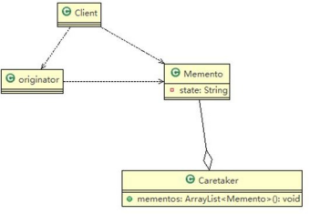</td></tr></table>&nbsp;
    

    
&nbsp;
    

    
&#216;&nbsp;对原理类图的说明-即(备忘录模式的角色及职责)

    
1)&nbsp;originator&nbsp;: &nbsp;对象(需要保存状态的对象)

    
2)&nbsp;Memento&nbsp;： 备忘录对象,负责保存好记录，即 Originator&nbsp;内部状态

    
3)&nbsp;Caretaker: 守护者对象,负责保存多个备忘录对象， 使用集合管理，提高效率

    
4)&nbsp;说明：如果希望保存多个 originator&nbsp;对象的不同时间的状态，也可以，只需要要 HashMap&nbsp;&#60;String, 集合&#62;

    
&#216;&nbsp;代码实现

    
&nbsp;
    

    
theory.zip

    
&nbsp;
    

    <table class=MsoNormalTable border=1 cellspacing=0 style="border-collapse:collapse;margin-left:10.9000pt;mso-table-layout-alt:fixed;
border:none;mso-border-left-alt:0.5000pt solid rgb(0,0,0);mso-border-top-alt:0.5000pt solid rgb(0,0,0);
mso-border-right-alt:0.5000pt solid rgb(0,0,0);mso-border-bottom-alt:0.5000pt solid rgb(0,0,0);mso-border-insideh:0.5000pt solid rgb(0,0,0);
mso-border-insidev:0.5000pt solid rgb(0,0,0);mso-padding-alt:0.0000pt 0.0000pt 0.0000pt 0.0000pt ;">
        <tr style="height:23.3000pt;">
            <td width=808 valign=top style="width:606.0000pt;padding:0.0000pt 0.0000pt 0.0000pt 0.0000pt ;border-left:1.0000pt solid rgb(0,0,0);
mso-border-left-alt:0.5000pt solid rgb(0,0,0);border-right:1.0000pt solid rgb(0,0,0);mso-border-right-alt:0.5000pt solid rgb(0,0,0);
border-top:1.0000pt solid rgb(0,0,0);mso-border-top-alt:0.5000pt solid rgb(0,0,0);border-bottom:1.0000pt solid rgb(0,0,0);
mso-border-bottom-alt:0.5000pt solid rgb(0,0,0);">
package com.atguigu.memento.theory;
</td>
        </tr>
    </table>

 

    
&nbsp;

    <table class=MsoNormalTable border=1 cellspacing=0 style="border-collapse:collapse;margin-left:10.9000pt;mso-table-layout-alt:fixed;
border:none;mso-border-left-alt:0.5000pt solid rgb(0,0,0);mso-border-top-alt:0.5000pt solid rgb(0,0,0);
mso-border-right-alt:0.5000pt solid rgb(0,0,0);mso-border-bottom-alt:0.5000pt solid rgb(0,0,0);mso-border-insideh:0.5000pt solid rgb(0,0,0);
mso-border-insidev:0.5000pt solid rgb(0,0,0);mso-padding-alt:0.0000pt 0.0000pt 0.0000pt 0.0000pt ;">
        <tr style="height:444.6000pt;">
            <td width=808 valign=top style="width:606.0000pt;padding:0.0000pt 0.0000pt 0.0000pt 0.0000pt ;border-left:1.0000pt solid rgb(0,0,0);
mso-border-left-alt:0.5000pt solid rgb(0,0,0);border-right:1.0000pt solid rgb(0,0,0);mso-border-right-alt:0.5000pt solid rgb(0,0,0);
border-top:1.0000pt solid rgb(0,0,0);mso-border-top-alt:0.5000pt solid rgb(0,0,0);border-bottom:1.0000pt solid rgb(0,0,0);
mso-border-bottom-alt:0.5000pt solid rgb(0,0,0);">
                
&nbsp;
                

                
&nbsp;
                

                
import java.util.ArrayList; import java.util.List;

                
&nbsp;
                

                
public class Caretaker {

                
&nbsp;
                

                
//在 List 集合中会有很多的备忘录对象

                
private List&#60;Memento&#62; mementoList = new ArrayList&#60;Memento&#62;();

                
&nbsp;
                

                
&nbsp;

                
public void add(Memento memento) { mementoList.add(memento);

                
}

                
&nbsp;
                

                
//获取到第 index 个 Originator&nbsp;的 备忘录对象(即保存状态) public Memento get(int index) {

                
return mementoList.get(index);

                
}

                
}
</td>
        </tr>
        <tr style="height:163.7000pt;">
            <td width=808 valign=top style="width:606.0000pt;padding:0.0000pt 0.0000pt 0.0000pt 0.0000pt ;border-left:1.0000pt solid rgb(0,0,0);
mso-border-left-alt:0.5000pt solid rgb(0,0,0);border-right:1.0000pt solid rgb(0,0,0);mso-border-right-alt:0.5000pt solid rgb(0,0,0);
border-top:none;mso-border-top-alt:0.5000pt solid rgb(0,0,0);border-bottom:1.0000pt solid rgb(0,0,0);
mso-border-bottom-alt:0.5000pt solid rgb(0,0,0);">
package com.atguigu.memento.theory;

                
&nbsp;
                

                
&nbsp;

                
import java.util.ArrayList; import java.util.HashMap;

                
&nbsp;
                

                
public class Client {
</td>
        </tr>
    </table>

 

    
&nbsp;

    <table class=MsoNormalTable border=1 cellspacing=0 style="border-collapse:collapse;margin-left:10.9000pt;mso-table-layout-alt:fixed;
border:none;mso-border-left-alt:0.5000pt solid rgb(0,0,0);mso-border-top-alt:0.5000pt solid rgb(0,0,0);
mso-border-right-alt:0.5000pt solid rgb(0,0,0);mso-border-bottom-alt:0.5000pt solid rgb(0,0,0);mso-border-insideh:0.5000pt solid rgb(0,0,0);
mso-border-insidev:0.5000pt solid rgb(0,0,0);mso-padding-alt:0.0000pt 0.0000pt 0.0000pt 0.0000pt ;">
        <tr style="height:608.3000pt;">
            <td width=808 valign=top style="width:606.0000pt;padding:0.0000pt 0.0000pt 0.0000pt 0.0000pt ;border-left:1.0000pt solid rgb(0,0,0);
mso-border-left-alt:0.5000pt solid rgb(0,0,0);border-right:1.0000pt solid rgb(0,0,0);mso-border-right-alt:0.5000pt solid rgb(0,0,0);
border-top:1.0000pt solid rgb(0,0,0);mso-border-top-alt:0.5000pt solid rgb(0,0,0);border-bottom:1.0000pt solid rgb(0,0,0);
mso-border-bottom-alt:0.5000pt solid rgb(0,0,0);">
public static void main(String[] args) {

                
// TODO Auto-generated method stub

                
&nbsp;
                

                
&nbsp;

                
Originator originator = new Originator(); Caretaker caretaker = new Caretaker();

                
&nbsp;

                
originator.setState(" 状态#1 &nbsp;攻击力 100 ");

                
&nbsp;

                
//保存了当前的状态caretaker.add(originator.saveStateMemento());

                
&nbsp;
                

                
originator.setState(" 状 态 #2 攻 击 力 80 "); caretaker.add(originator.saveStateMemento());

                
originator.setState(" 状 态 #3 攻 击 力 50 "); caretaker.add(originator.saveStateMemento());

                
&nbsp;
                

                
&nbsp;
                

                
&nbsp;
                

                
&nbsp;
                

                
System.out.println("当前的状态是 =" + originator.getState());

                
//希望得到状态 1,&nbsp;将 originator&nbsp;恢复到状态 1 originator.getStateFromMemento(caretaker.get(0));

                
System.out.println("恢复到状态 1 , &nbsp;当前的状态是");
</td>
        </tr>
    </table>

 

    
&nbsp;

    <table class=MsoNormalTable border=1 cellspacing=0 style="border-collapse:collapse;margin-left:10.9000pt;mso-table-layout-alt:fixed;
border:none;mso-border-left-alt:0.5000pt solid rgb(0,0,0);mso-border-top-alt:0.5000pt solid rgb(0,0,0);
mso-border-right-alt:0.5000pt solid rgb(0,0,0);mso-border-bottom-alt:0.5000pt solid rgb(0,0,0);mso-border-insideh:0.5000pt solid rgb(0,0,0);
mso-border-insidev:0.5000pt solid rgb(0,0,0);mso-padding-alt:0.0000pt 0.0000pt 0.0000pt 0.0000pt ;">
        <tr style="height:187.2000pt;">
            <td width=808 valign=top style="width:606.0000pt;padding:0.0000pt 0.0000pt 0.0000pt 0.0000pt ;border-left:1.0000pt solid rgb(0,0,0);
mso-border-left-alt:0.5000pt solid rgb(0,0,0);border-right:1.0000pt solid rgb(0,0,0);mso-border-right-alt:0.5000pt solid rgb(0,0,0);
border-top:1.0000pt solid rgb(0,0,0);mso-border-top-alt:0.5000pt solid rgb(0,0,0);border-bottom:1.0000pt solid rgb(0,0,0);
mso-border-bottom-alt:0.5000pt solid rgb(0,0,0);">

                System.out.println("当前的状态是 =" + originator.getState());

                
&nbsp;
                

                
&nbsp;
                

                
&nbsp;
                

                
&nbsp;
                

                
&nbsp;

                
}

                
&nbsp;
                

                
&nbsp;

                
}
</td>
        </tr>
        <tr style="height:421.1000pt;">
            <td width=808 valign=top style="width:606.0000pt;padding:0.0000pt 0.0000pt 0.0000pt 0.0000pt ;border-left:1.0000pt solid rgb(0,0,0);
mso-border-left-alt:0.5000pt solid rgb(0,0,0);border-right:1.0000pt solid rgb(0,0,0);mso-border-right-alt:0.5000pt solid rgb(0,0,0);
border-top:none;mso-border-top-alt:0.5000pt solid rgb(0,0,0);border-bottom:1.0000pt solid rgb(0,0,0);
mso-border-bottom-alt:0.5000pt solid rgb(0,0,0);">
package com.atguigu.memento.theory;

                
&nbsp;
                

                
&nbsp;

                
public class Memento { private String state;

                
&nbsp;

                
//构造器

                
public Memento(String state) { super();

                
this.state = state;

                
}

                
&nbsp;
                

                
&nbsp;

                
public String getState() { return state;

                
}

                
&nbsp;
                

                
&nbsp;
                

                
&nbsp;
                

                
&nbsp;
                

                
&nbsp;

                
}
</td>
        </tr>
    </table>

 

    
&nbsp;

    <table class=MsoNormalTable border=1 cellspacing=0 style="border-collapse:collapse;margin-left:10.9000pt;mso-table-layout-alt:fixed;
border:none;mso-border-left-alt:0.5000pt solid rgb(0,0,0);mso-border-top-alt:0.5000pt solid rgb(0,0,0);
mso-border-right-alt:0.5000pt solid rgb(0,0,0);mso-border-bottom-alt:0.5000pt solid rgb(0,0,0);mso-border-insideh:0.5000pt solid rgb(0,0,0);
mso-border-insidev:0.5000pt solid rgb(0,0,0);mso-padding-alt:0.0000pt 0.0000pt 0.0000pt 0.0000pt ;">
        <tr style="height:23.4000pt;">
            <td width=808 valign=top style="width:606.0000pt;padding:0.0000pt 0.0000pt 0.0000pt 0.0000pt ;border-left:1.0000pt solid rgb(0,0,0);
mso-border-left-alt:0.5000pt solid rgb(0,0,0);border-right:1.0000pt solid rgb(0,0,0);mso-border-right-alt:0.5000pt solid rgb(0,0,0);
border-top:1.0000pt solid rgb(0,0,0);mso-border-top-alt:0.5000pt solid rgb(0,0,0);border-bottom:1.0000pt solid rgb(0,0,0);
mso-border-bottom-alt:0.5000pt solid rgb(0,0,0);">
                
&nbsp;
                

            </td>
        </tr>
        <tr style="height:585.4000pt;">
            <td width=808 valign=top style="width:606.0000pt;padding:0.0000pt 0.0000pt 0.0000pt 0.0000pt ;border-left:1.0000pt solid rgb(0,0,0);
mso-border-left-alt:0.5000pt solid rgb(0,0,0);border-right:1.0000pt solid rgb(0,0,0);mso-border-right-alt:0.5000pt solid rgb(0,0,0);
border-top:none;mso-border-top-alt:0.5000pt solid rgb(0,0,0);border-bottom:1.0000pt solid rgb(0,0,0);
mso-border-bottom-alt:0.5000pt solid rgb(0,0,0);">
package com.atguigu.memento.theory;

                
&nbsp;
                

                
&nbsp;

                
public class Originator {

                
private String state;//状态信息public String getState() {

                
return state;

                
}

                
&nbsp;
                

                
&nbsp;

                
public void setState(String state) { this.state = state;

                
}

                
&nbsp;
                

                
//编写一个方法，可以保存一个状态对象 Memento

                
//因此编写一个方法，返回 Memento

                
public Memento saveStateMemento() { return new Memento(state);

                
}

                
&nbsp;
                

                
//通过备忘录对象，恢复状态

                
public void getStateFromMemento(Memento memento) { state = memento.getState();

                
}

                
}
</td>
        </tr>
    </table>

 

    
&nbsp;

    <table class=MsoNormalTable border=1 cellspacing=0 style="border-collapse:collapse;margin-left:10.9000pt;mso-table-layout-alt:fixed;
border:none;mso-border-left-alt:0.5000pt solid rgb(0,0,0);mso-border-top-alt:0.5000pt solid rgb(0,0,0);
mso-border-right-alt:0.5000pt solid rgb(0,0,0);mso-border-bottom-alt:0.5000pt solid rgb(0,0,0);mso-border-insideh:0.5000pt solid rgb(0,0,0);
mso-border-insidev:0.5000pt solid rgb(0,0,0);mso-padding-alt:0.0000pt 0.0000pt 0.0000pt 0.0000pt ;">
        <tr style="height:23.4000pt;">
            <td width=808 valign=top style="width:606.0000pt;padding:0.0000pt 0.0000pt 0.0000pt 0.0000pt ;border-left:1.0000pt solid rgb(0,0,0);
mso-border-left-alt:0.5000pt solid rgb(0,0,0);border-right:1.0000pt solid rgb(0,0,0);mso-border-right-alt:0.5000pt solid rgb(0,0,0);
border-top:1.0000pt solid rgb(0,0,0);mso-border-top-alt:0.5000pt solid rgb(0,0,0);border-bottom:1.0000pt solid rgb(0,0,0);
mso-border-bottom-alt:0.5000pt solid rgb(0,0,0);">
                
&nbsp;
                

            </td>
        </tr>
    </table>
    
&nbsp;

    
&nbsp;

    <h2 style="margin-top:0.0000pt;margin-right:0.0000pt;margin-bottom:0.0000pt;
margin-left:46.9000pt;text-indent:-36.0000pt;text-align:left;
line-height:29.5000pt;mso-line-height-rule:exactly;mso-list:l10 level2 lfo214;">22.6&nbsp;游戏角色恢复状态实例</h2>
    
&nbsp;
    

    
1)&nbsp;应用实例要求

    
游戏角色有攻击力和防御力，在大战 Boss 前保存自身的状态(攻击力和防御力)，当大战 Boss 后攻击力和防御力下降，从备忘录对象恢复到大战前的状态

    
&nbsp;
    

    
2)&nbsp;思路分析和图解(类图)

    
<table cellpadding="0" cellspacing="0"><tr><td width="162.333"
                                                                                                         height="0"></td></tr><tr><td></td><td>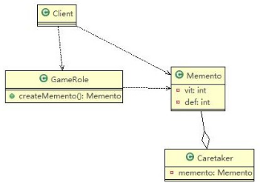</td></tr></table>&nbsp;

    
&nbsp;

    
3)&nbsp;代码实现

    
&nbsp;
    

    
game.zip

    
&nbsp;
    

    <table class=MsoNormalTable border=1 cellspacing=0 style="border-collapse:collapse;margin-left:10.9000pt;mso-table-layout-alt:fixed;
border:none;mso-border-left-alt:0.5000pt solid rgb(0,0,0);mso-border-top-alt:0.5000pt solid rgb(0,0,0);
mso-border-right-alt:0.5000pt solid rgb(0,0,0);mso-border-bottom-alt:0.5000pt solid rgb(0,0,0);mso-border-insideh:0.5000pt solid rgb(0,0,0);
mso-border-insidev:0.5000pt solid rgb(0,0,0);mso-padding-alt:0.0000pt 0.0000pt 0.0000pt 0.0000pt ;">
        <tr style="height:116.8500pt;">
            <td width=808 valign=top style="width:606.0000pt;padding:0.0000pt 0.0000pt 0.0000pt 0.0000pt ;border-left:1.0000pt solid rgb(0,0,0);
mso-border-left-alt:0.5000pt solid rgb(0,0,0);border-right:1.0000pt solid rgb(0,0,0);mso-border-right-alt:0.5000pt solid rgb(0,0,0);
border-top:1.0000pt solid rgb(0,0,0);mso-border-top-alt:0.5000pt solid rgb(0,0,0);border-bottom:1.0000pt solid rgb(0,0,0);
mso-border-bottom-alt:0.5000pt solid rgb(0,0,0);">
package com.atguigu.memento.game;

                
&nbsp;

                
import java.util.ArrayList; import java.util.HashMap;
</td>
        </tr>
    </table>

 

    
&nbsp;

    <table class=MsoNormalTable border=1 cellspacing=0 style="border-collapse:collapse;margin-left:10.9000pt;mso-table-layout-alt:fixed;
border:none;mso-border-left-alt:0.5000pt solid rgb(0,0,0);mso-border-top-alt:0.5000pt solid rgb(0,0,0);
mso-border-right-alt:0.5000pt solid rgb(0,0,0);mso-border-bottom-alt:0.5000pt solid rgb(0,0,0);mso-border-insideh:0.5000pt solid rgb(0,0,0);
mso-border-insidev:0.5000pt solid rgb(0,0,0);mso-padding-alt:0.0000pt 0.0000pt 0.0000pt 0.0000pt ;">
        <tr style="height:491.4000pt;">
            <td width=808 valign=top style="width:606.0000pt;padding:0.0000pt 0.0000pt 0.0000pt 0.0000pt ;border-left:1.0000pt solid rgb(0,0,0);
mso-border-left-alt:0.5000pt solid rgb(0,0,0);border-right:1.0000pt solid rgb(0,0,0);mso-border-right-alt:0.5000pt solid rgb(0,0,0);
border-top:1.0000pt solid rgb(0,0,0);mso-border-top-alt:0.5000pt solid rgb(0,0,0);border-bottom:1.0000pt solid rgb(0,0,0);
mso-border-bottom-alt:0.5000pt solid rgb(0,0,0);">

                //守护者对象, 保存游戏角色的状态

                
public class Caretaker {

                
&nbsp;
                

                
//如果只保存一次状态private&nbsp;Memento&#9;memento;

                
//对 GameRole 保存多次状态

                
//private ArrayList&#60;Memento&#62; mementos;

                
//对多个游戏角色保存多个状态

                
//private HashMap&#60;String, ArrayList&#60;Memento&#62;&#62; rolesMementos;

                
&nbsp;
                

                
&nbsp;

                
public Memento getMemento() { return memento;

                
}

                
&nbsp;
                

                
&nbsp;

                
public void setMemento(Memento memento) { this.memento = memento;

                
}

                
&nbsp;
                

                
&nbsp;
                

                
&nbsp;
                

                
}
</td>
        </tr>
        <tr style="height:116.8500pt;">
            <td width=808 valign=top style="width:606.0000pt;padding:0.0000pt 0.0000pt 0.0000pt 0.0000pt ;border-left:1.0000pt solid rgb(0,0,0);
mso-border-left-alt:0.5000pt solid rgb(0,0,0);border-right:1.0000pt solid rgb(0,0,0);mso-border-right-alt:0.5000pt solid rgb(0,0,0);
border-top:none;mso-border-top-alt:0.5000pt solid rgb(0,0,0);border-bottom:1.0000pt solid rgb(0,0,0);
mso-border-bottom-alt:0.5000pt solid rgb(0,0,0);">
package com.atguigu.memento.game;

                
&nbsp;
                

                
&nbsp;

                
public class Client {

                
&nbsp;
                

                
&nbsp;

                
public static void main(String[] args) {
</td>
        </tr>
    </table>

 

    
&nbsp;

    <table class=MsoNormalTable border=1 cellspacing=0 style="border-collapse:collapse;margin-left:10.9000pt;mso-table-layout-alt:fixed;
border:none;mso-border-left-alt:0.5000pt solid rgb(0,0,0);mso-border-top-alt:0.5000pt solid rgb(0,0,0);
mso-border-right-alt:0.5000pt solid rgb(0,0,0);mso-border-bottom-alt:0.5000pt solid rgb(0,0,0);mso-border-insideh:0.5000pt solid rgb(0,0,0);
mso-border-insidev:0.5000pt solid rgb(0,0,0);mso-padding-alt:0.0000pt 0.0000pt 0.0000pt 0.0000pt ;">
        <tr style="height:608.3000pt;">
            <td width=808 valign=top style="width:606.0000pt;padding:0.0000pt 0.0000pt 0.0000pt 0.0000pt ;border-left:1.0000pt solid rgb(0,0,0);
mso-border-left-alt:0.5000pt solid rgb(0,0,0);border-right:1.0000pt solid rgb(0,0,0);mso-border-right-alt:0.5000pt solid rgb(0,0,0);
border-top:1.0000pt solid rgb(0,0,0);mso-border-top-alt:0.5000pt solid rgb(0,0,0);border-bottom:1.0000pt solid rgb(0,0,0);
mso-border-bottom-alt:0.5000pt solid rgb(0,0,0);">
// TODO Auto-generated method stub

                
//创建游戏角色

                
GameRole gameRole = new GameRole(); gameRole.setVit(100); gameRole.setDef(100);

                
&nbsp;
                

                
System.out.println("和 boss 大战前的状态"); gameRole.display();

                
&nbsp;
                

                
//把当前状态保存 caretaker

                
Caretaker caretaker = new Caretaker(); caretaker.setMemento(gameRole.createMemento());

                
&nbsp;

                
System.out.println("和 boss 大战~~~"); gameRole.setDef(30); gameRole.setVit(30);

                
&nbsp;
                

                
&nbsp;

                
gameRole.display();

                
System.out.println("大战后，使用备忘录对象恢复到站前"); gameRole.recoverGameRoleFromMemento(caretaker.getMemento());

                
System.out.println("恢复后的状态"); gameRole.display();

                
}
</td>
        </tr>
    </table>

 

    
&nbsp;

    <table class=MsoNormalTable border=1 cellspacing=0 style="border-collapse:collapse;margin-left:10.9000pt;mso-table-layout-alt:fixed;
border:none;mso-border-left-alt:0.5000pt solid rgb(0,0,0);mso-border-top-alt:0.5000pt solid rgb(0,0,0);
mso-border-right-alt:0.5000pt solid rgb(0,0,0);mso-border-bottom-alt:0.5000pt solid rgb(0,0,0);mso-border-insideh:0.5000pt solid rgb(0,0,0);
mso-border-insidev:0.5000pt solid rgb(0,0,0);mso-padding-alt:0.0000pt 0.0000pt 0.0000pt 0.0000pt ;">
        <tr style="height:46.8000pt;">
            <td width=808 valign=top style="width:606.0000pt;padding:0.0000pt 0.0000pt 0.0000pt 0.0000pt ;border-left:1.0000pt solid rgb(0,0,0);
mso-border-left-alt:0.5000pt solid rgb(0,0,0);border-right:1.0000pt solid rgb(0,0,0);mso-border-right-alt:0.5000pt solid rgb(0,0,0);
border-top:1.0000pt solid rgb(0,0,0);mso-border-top-alt:0.5000pt solid rgb(0,0,0);border-bottom:1.0000pt solid rgb(0,0,0);
mso-border-bottom-alt:0.5000pt solid rgb(0,0,0);">
}
</td>
        </tr>
        <tr style="height:561.5000pt;">
            <td width=808 valign=top style="width:606.0000pt;padding:0.0000pt 0.0000pt 0.0000pt 0.0000pt ;border-left:1.0000pt solid rgb(0,0,0);
mso-border-left-alt:0.5000pt solid rgb(0,0,0);border-right:1.0000pt solid rgb(0,0,0);mso-border-right-alt:0.5000pt solid rgb(0,0,0);
border-top:none;mso-border-top-alt:0.5000pt solid rgb(0,0,0);border-bottom:1.0000pt solid rgb(0,0,0);
mso-border-bottom-alt:0.5000pt solid rgb(0,0,0);">
package com.atguigu.memento.game;

                
&nbsp;
                

                
&nbsp;

                
public class GameRole {

                
&nbsp;
                

                
&nbsp;

                
private int vit; private int def;

                
&nbsp;

                
//创建 Memento ,即根据当前的状态得到 Memento public Memento createMemento() {

                
return new Memento(vit, def);

                
}

                
&nbsp;
                

                
//从备忘录对象，恢复 GameRole 的状态

                
public void recoverGameRoleFromMemento(Memento memento) { this.vit = memento.getVit();

                
this.def = memento.getDef();

                
}

                
&nbsp;
                

                
//显示当前游戏角色的状态 public void display() {

                
System.out.println("游戏角色当前的攻击力：" + this.vit + " &nbsp;防御力: " + this.def);

                
}

                
&nbsp;
                

                
&nbsp;

                
public int getVit() {
</td>
        </tr>
    </table>

 

    
&nbsp;

    <table class=MsoNormalTable border=1 cellspacing=0 style="border-collapse:collapse;margin-left:10.9000pt;mso-table-layout-alt:fixed;
border:none;mso-border-left-alt:0.5000pt solid rgb(0,0,0);mso-border-top-alt:0.5000pt solid rgb(0,0,0);
mso-border-right-alt:0.5000pt solid rgb(0,0,0);mso-border-bottom-alt:0.5000pt solid rgb(0,0,0);mso-border-insideh:0.5000pt solid rgb(0,0,0);
mso-border-insidev:0.5000pt solid rgb(0,0,0);mso-padding-alt:0.0000pt 0.0000pt 0.0000pt 0.0000pt ;">
        <tr style="height:421.2000pt;">
            <td width=808 valign=top style="width:606.0000pt;padding:0.0000pt 0.0000pt 0.0000pt 0.0000pt ;border-left:1.0000pt solid rgb(0,0,0);
mso-border-left-alt:0.5000pt solid rgb(0,0,0);border-right:1.0000pt solid rgb(0,0,0);mso-border-right-alt:0.5000pt solid rgb(0,0,0);
border-top:1.0000pt solid rgb(0,0,0);mso-border-top-alt:0.5000pt solid rgb(0,0,0);border-bottom:1.0000pt solid rgb(0,0,0);
mso-border-bottom-alt:0.5000pt solid rgb(0,0,0);">

                return vit;

                
}

                
&nbsp;
                

                
&nbsp;

                
public void setVit(int vit) { this.vit = vit;

                
}

                
&nbsp;
                

                
&nbsp;

                
public int getDef() { return def;

                
}

                
&nbsp;
                

                
&nbsp;

                
public void setDef(int def) { this.def = def;

                
}

                
&nbsp;
                

                
&nbsp;
                

                
&nbsp;
                

                
}
</td>
        </tr>
        <tr style="height:187.6000pt;">
            <td width=808 valign=top style="width:606.0000pt;padding:0.0000pt 0.0000pt 0.0000pt 0.0000pt ;border-left:1.0000pt solid rgb(0,0,0);
mso-border-left-alt:0.5000pt solid rgb(0,0,0);border-right:1.0000pt solid rgb(0,0,0);mso-border-right-alt:0.5000pt solid rgb(0,0,0);
border-top:none;mso-border-top-alt:0.5000pt solid rgb(0,0,0);border-bottom:1.0000pt solid rgb(0,0,0);
mso-border-bottom-alt:0.5000pt solid rgb(0,0,0);">
package com.atguigu.memento.game;

                
&nbsp;
                

                
&nbsp;

                
public class Memento {

                
&nbsp;
                

                
//攻击力private int vit;

                
//防御力private int def;
</td>
        </tr>
    </table>

 

    
&nbsp;

    <table class=MsoNormalTable border=1 cellspacing=0 style="border-collapse:collapse;margin-left:10.9000pt;mso-table-layout-alt:fixed;
border:none;mso-border-left-alt:0.5000pt solid rgb(0,0,0);mso-border-top-alt:0.5000pt solid rgb(0,0,0);
mso-border-right-alt:0.5000pt solid rgb(0,0,0);mso-border-bottom-alt:0.5000pt solid rgb(0,0,0);mso-border-insideh:0.5000pt solid rgb(0,0,0);
mso-border-insidev:0.5000pt solid rgb(0,0,0);mso-padding-alt:0.0000pt 0.0000pt 0.0000pt 0.0000pt ;">
        <tr style="height:444.6000pt;">
            <td width=808 valign=top style="width:606.0000pt;padding:0.0000pt 0.0000pt 0.0000pt 0.0000pt ;border-left:1.0000pt solid rgb(0,0,0);
mso-border-left-alt:0.5000pt solid rgb(0,0,0);border-right:1.0000pt solid rgb(0,0,0);mso-border-right-alt:0.5000pt solid rgb(0,0,0);
border-top:1.0000pt solid rgb(0,0,0);mso-border-top-alt:0.5000pt solid rgb(0,0,0);border-bottom:1.0000pt solid rgb(0,0,0);
mso-border-bottom-alt:0.5000pt solid rgb(0,0,0);">
public Memento(int vit, int def) { super();

                
this.vit = vit; this.def = def;

                
}

                
public int getVit() { return vit;

                
}

                
public void setVit(int vit) { this.vit = vit;

                
}

                
public int getDef() { return def;

                
}

                
public void setDef(int def) { this.def = def;

                
}

                
}
</td>
        </tr>
    </table>
    
&nbsp;

    
&nbsp;

    <h2 style="margin-top:0.0000pt;margin-right:0.0000pt;margin-bottom:0.0000pt;
margin-left:46.9000pt;text-indent:-36.0000pt;text-align:left;
line-height:28.4500pt;mso-line-height-rule:exactly;mso-list:l10 level2 lfo214;">22.7&nbsp;备忘录模式的注意事项和细节</h2>
    
1)&nbsp;给用户提供了一种可以恢复状态的机制，可以使用户能够比较方便地回到某个历史的状态

    
2)&nbsp;实现了信息的封装，使得用户不需要关心状态的保存细节

    
3)&nbsp;如果类的成员变量过多，势必会占用比较大的资源，而且每一次保存都会消耗一定的内存, 这个需要注意

    
4)&nbsp;适用的应用场景：1、后悔药。 2、打游戏时的存档。 3、Windows&nbsp;里的 &nbsp;ctri&nbsp;+ z。 &nbsp;4、IE&nbsp;&nbsp;中的后退。 &nbsp;4、数据库的事务管理

 

5)&nbsp;为了节约内存，备忘录模式可以和原型模式配合使用

 

<h1 style="margin-left:208.4000pt;">第 23&#9;章解释器模式</h1>
    <h2 style="margin-top:0.0000pt;margin-right:0.0000pt;margin-bottom:0.0000pt;
margin-left:46.9000pt;text-indent:-36.0000pt;text-align:left;
line-height:32.3500pt;mso-line-height-rule:exactly;mso-list:l29 level2 lfo219;">23.1&nbsp;四则运算问题</h2>
    
通过解释器模式来实现四则运算，如计算 a+b-c 的值，具体要求

    
1)&nbsp;先输入表达式的形式，比如 a+b+c-d+e, &nbsp;要求表达式的字母不能重复

    
2)&nbsp;在分别输入 a&nbsp;,b, c, d, e&nbsp;的值

    
3)&nbsp;<table cellpadding="0" cellspacing="0"><tr><td
            width="126.533" height="0"></td></tr><tr><td></td><td>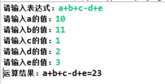</td></tr></table>最后求出结果：如图

    <h2 style="margin-top:0.0000pt;margin-right:0.0000pt;margin-bottom:0.0000pt;
margin-left:46.9000pt;text-indent:-36.0000pt;text-align:left;
line-height:32.4000pt;mso-line-height-rule:exactly;mso-list:l29 level2 lfo219;">23.2&nbsp;传统方案解决四则运算问题分析</h2>
    
1)&nbsp;编写一个方法，接收表达式的形式，然后根据用户输入的数值进行解析，得到结果

    
2)&nbsp;问题分析：如果加入新的运算符，比如 * / ( 等等，不利于扩展，另外让一个方法来解析会造成程序结构混乱， 不够清晰.

    
3)&nbsp;解决方案：可以考虑使用解释器模式， &nbsp;即： &nbsp;表达式 &nbsp;-&#62;&#9;解释器(可以有多种)&#9;-&#62;&#9;结果

    <h2 style="margin-top:0.0000pt;margin-right:0.0000pt;margin-bottom:0.0000pt;
margin-left:46.9000pt;text-indent:-36.0000pt;text-align:left;
line-height:31.5500pt;mso-line-height-rule:exactly;mso-list:l29 level2 lfo219;">23.3&nbsp;解释器模式基本介绍</h2>
    
基本介绍

    
1)&nbsp;在编译原理中，一个算术表达式通过词法分析器形成词法单元，而后这些词法单元再通过语法分析器构建语法分析树，最终形成一颗抽象的语法分析树。这里的词法分析器和语法分析器都可以看做是解释器

    
2)&nbsp;解释器模式（Interpreter&nbsp;Pattern）：是指给定一个语言<b>(</b>表达式<b>)</b>，定义它的文法的一种表示，并定义一个解释器， 使用该解释器来解释语言中的句子<b>(</b>表达式)

    
3)&nbsp;应用场景

    
-应用可以将一个需要解释执行的语言中的句子表示为一个抽象语法树

    
-一些重复出现的问题可以用一种简单的语言来表达

 

-一个简单语法需要解释的场景

    
4)&nbsp;这样的例子还有，比如编译器、运算表达式计算、正则表达式、机器人等

    
&nbsp;
    

    <h2 style="margin-top:0.0500pt;margin-right:0.0000pt;margin-bottom:0.0000pt;
margin-left:46.9000pt;text-indent:-36.0000pt;text-align:left;
mso-list:l29 level2 lfo219;">23.4&nbsp;解释器模式的原理类图</h2>
    
<table cellpadding="0" cellspacing="0"><tr><td width="110"
                                                                                                           height="0"></td></tr><tr><td></td><td>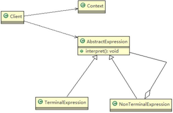</td></tr></table>&nbsp;
    

    
&#216;&nbsp;对原理类图的说明-即(解释器模式的角色及职责)

    
1)&nbsp;Context:&nbsp;是环境角色,含有解释器之外的全局信息.

    
2)&nbsp;AbstractExpression:&nbsp;抽象表达式， 声明一个抽象的解释操作,这个方法为抽象语法树中所有的节点所共享

    
3)&nbsp;TerminalExpression:&nbsp;为终结符表达式, 实现与文法中的终结符相关的解释操作

    
4)&nbsp;NonTermialExpression:&nbsp;为非终结符表达式，为文法中的非终结符实现解释操作.

    
5)&nbsp;说明： 输入 Context&nbsp;he&nbsp;TerminalExpression &nbsp;信息通过 Client&nbsp;输入即可

    
&nbsp;
    

    <h2 style="margin-top:0.0000pt;margin-right:0.0000pt;margin-bottom:0.0000pt;
margin-left:46.9000pt;text-indent:-36.0000pt;text-align:left;
mso-list:l29 level2 lfo219;">23.5&nbsp;解释器模式来实现四则</h2>
    
&nbsp;
    

    
1)&nbsp;应用实例要求

    
通过解释器模式来实现四则运算， 如计算 a+b-c 的值

 

2)&nbsp;思路分析和图解(类图)

    
<table cellpadding="0" cellspacing="0"><tr><td width="132.467"
                                                                                                         height="0"></td></tr><tr><td></td><td>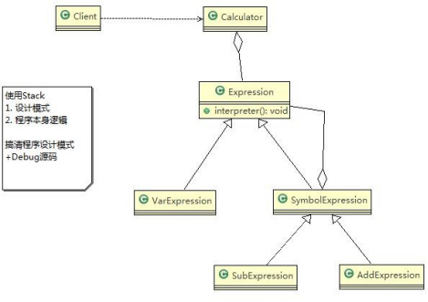</td></tr></table>&nbsp;

    
&nbsp;

    
3)&nbsp;代码实现

    
&nbsp;
    

    
interpreter.zip

    
&nbsp;
    

    <table class=MsoNormalTable border=1 cellspacing=0 style="border-collapse:collapse;margin-left:10.9000pt;mso-table-layout-alt:fixed;
border:none;mso-border-left-alt:0.5000pt solid rgb(0,0,0);mso-border-top-alt:0.5000pt solid rgb(0,0,0);
mso-border-right-alt:0.5000pt solid rgb(0,0,0);mso-border-bottom-alt:0.5000pt solid rgb(0,0,0);mso-border-insideh:0.5000pt solid rgb(0,0,0);
mso-border-insidev:0.5000pt solid rgb(0,0,0);mso-padding-alt:0.0000pt 0.0000pt 0.0000pt 0.0000pt ;">
        <tr style="height:233.9000pt;">
            <td width=808 valign=top style="width:606.0000pt;padding:0.0000pt 0.0000pt 0.0000pt 0.0000pt ;border-left:1.0000pt solid rgb(0,0,0);
mso-border-left-alt:0.5000pt solid rgb(0,0,0);border-right:1.0000pt solid rgb(0,0,0);mso-border-right-alt:0.5000pt solid rgb(0,0,0);
border-top:1.0000pt solid rgb(0,0,0);mso-border-top-alt:0.5000pt solid rgb(0,0,0);border-bottom:1.0000pt solid rgb(0,0,0);
mso-border-bottom-alt:0.5000pt solid rgb(0,0,0);">
package com.atguigu.interpreter;

                
&nbsp;

                
import java.util.HashMap;

                
&nbsp;

                
/**

                
*&nbsp;加法解释器

                
*&nbsp;@author&nbsp;Administrator

                
*

                
*/

                
public class AddExpression&nbsp;extends&nbsp;SymbolExpression&#9;{
</td>
        </tr>
    </table>

 

    
&nbsp;

    <table class=MsoNormalTable border=1 cellspacing=0 style="border-collapse:collapse;margin-left:10.9000pt;mso-table-layout-alt:fixed;
border:none;mso-border-left-alt:0.5000pt solid rgb(0,0,0);mso-border-top-alt:0.5000pt solid rgb(0,0,0);
mso-border-right-alt:0.5000pt solid rgb(0,0,0);mso-border-bottom-alt:0.5000pt solid rgb(0,0,0);mso-border-insideh:0.5000pt solid rgb(0,0,0);
mso-border-insidev:0.5000pt solid rgb(0,0,0);mso-padding-alt:0.0000pt 0.0000pt 0.0000pt 0.0000pt ;">
        <tr style="height:351.0000pt;">
            <td width=808 valign=top style="width:606.0000pt;padding:0.0000pt 0.0000pt 0.0000pt 0.0000pt ;border-left:1.0000pt solid rgb(0,0,0);
mso-border-left-alt:0.5000pt solid rgb(0,0,0);border-right:1.0000pt solid rgb(0,0,0);mso-border-right-alt:0.5000pt solid rgb(0,0,0);
border-top:1.0000pt solid rgb(0,0,0);mso-border-top-alt:0.5000pt solid rgb(0,0,0);border-bottom:1.0000pt solid rgb(0,0,0);
mso-border-bottom-alt:0.5000pt solid rgb(0,0,0);">
                
&nbsp;
                

                
&nbsp;
                

                
public AddExpression(Expression left, Expression right) { super(left, right);

                
}

                
&nbsp;
                

                
//处理相加

                
//var&nbsp;仍然是 {a=10,b=20}..

                
//一会我们 debug &nbsp;源码,就 ok

                
public int interpreter(HashMap&#60;String, Integer&#62; var) {

                
//super.left.interpreter(var) ： 返回 left 表达式对应的值 a = 10

                
//super.right.interpreter(var): 返回 right&nbsp;表达式对应值 b = 20

                
return super.left.interpreter(var) + super.right.interpreter(var);

                
}

                
}
</td>
        </tr>
        <tr style="height:257.3000pt;">
            <td width=808 valign=top style="width:606.0000pt;padding:0.0000pt 0.0000pt 0.0000pt 0.0000pt ;border-left:1.0000pt solid rgb(0,0,0);
mso-border-left-alt:0.5000pt solid rgb(0,0,0);border-right:1.0000pt solid rgb(0,0,0);mso-border-right-alt:0.5000pt solid rgb(0,0,0);
border-top:none;mso-border-top-alt:0.5000pt solid rgb(0,0,0);border-bottom:1.0000pt solid rgb(0,0,0);
mso-border-bottom-alt:0.5000pt solid rgb(0,0,0);">
package com.atguigu.interpreter;

                
&nbsp;
                

                
&nbsp;

                
import java.util.HashMap; import java.util.Stack;

                
&nbsp;
                

                
public class Calculator {

                
&nbsp;
                

                
//&nbsp;定义表达式

                
private Expression expression;

                
&nbsp;
                

                
//&nbsp;构造函数传参，并解析
</td>
        </tr>
    </table>

 

    
&nbsp;

    <table class=MsoNormalTable border=1 cellspacing=0 style="border-collapse:collapse;margin-left:10.9000pt;mso-table-layout-alt:fixed;
border:none;mso-border-left-alt:0.5000pt solid rgb(0,0,0);mso-border-top-alt:0.5000pt solid rgb(0,0,0);
mso-border-right-alt:0.5000pt solid rgb(0,0,0);mso-border-bottom-alt:0.5000pt solid rgb(0,0,0);mso-border-insideh:0.5000pt solid rgb(0,0,0);
mso-border-insidev:0.5000pt solid rgb(0,0,0);mso-padding-alt:0.0000pt 0.0000pt 0.0000pt 0.0000pt ;">
        <tr style="height:608.3000pt;">
            <td width=808 valign=top style="width:606.0000pt;padding:0.0000pt 0.0000pt 0.0000pt 0.0000pt ;border-left:1.0000pt solid rgb(0,0,0);
mso-border-left-alt:0.5000pt solid rgb(0,0,0);border-right:1.0000pt solid rgb(0,0,0);mso-border-right-alt:0.5000pt solid rgb(0,0,0);
border-top:1.0000pt solid rgb(0,0,0);mso-border-top-alt:0.5000pt solid rgb(0,0,0);border-bottom:1.0000pt solid rgb(0,0,0);
mso-border-bottom-alt:0.5000pt solid rgb(0,0,0);">
public Calculator(String expStr) { // expStr = a+b

                
//&nbsp;安排运算先后顺序

                
Stack&#60;Expression&#62; stack = new Stack&#60;&#62;();

                
//&nbsp;表达式拆分成字符数组

                
char[] charArray = expStr.toCharArray();// [a, +, b]

                
&nbsp;
                

                
&nbsp;

                
Expression left = null; Expression right = null;

                
//遍历我们的字符数组， &nbsp;即遍历&#9;[a, +, b]

                
//针对不同的情况，做处理

                
for (int i = 0; i &#60; charArray.length; i++) { switch (charArray[i]) {

                
case '+': //

                
left = stack.pop();// 从 stack 取 出 left =&#62; "a"

                
right&nbsp;= new VarExpression(String.valueOf(charArray[++i]));//&nbsp;取出右表达式 "b"

                
stack.push(new AddExpression(left, right));// 然后根据得到 left 和 right 构建 AddExpresson 加入

                
stack

                
break; case '-': //

                
left = stack.pop();

                
right = new VarExpression(String.valueOf(charArray[++i])); stack.push(new SubExpression(left, right));

                
break; default:

                
//如果是一个 Var 就创建要给 VarExpression 对象，并 push 到 stack

                
stack.push(new VarExpression(String.valueOf(charArray[i])));
</td>
        </tr>
    </table>

 

    
&nbsp;

    <table class=MsoNormalTable border=1 cellspacing=0 style="border-collapse:collapse;margin-left:10.9000pt;mso-table-layout-alt:fixed;
border:none;mso-border-left-alt:0.5000pt solid rgb(0,0,0);mso-border-top-alt:0.5000pt solid rgb(0,0,0);
mso-border-right-alt:0.5000pt solid rgb(0,0,0);mso-border-bottom-alt:0.5000pt solid rgb(0,0,0);mso-border-insideh:0.5000pt solid rgb(0,0,0);
mso-border-insidev:0.5000pt solid rgb(0,0,0);mso-padding-alt:0.0000pt 0.0000pt 0.0000pt 0.0000pt ;">
        <tr style="height:304.2000pt;">
            <td width=808 valign=top style="width:606.0000pt;padding:0.0000pt 0.0000pt 0.0000pt 0.0000pt ;border-left:1.0000pt solid rgb(0,0,0);
mso-border-left-alt:0.5000pt solid rgb(0,0,0);border-right:1.0000pt solid rgb(0,0,0);mso-border-right-alt:0.5000pt solid rgb(0,0,0);
border-top:1.0000pt solid rgb(0,0,0);mso-border-top-alt:0.5000pt solid rgb(0,0,0);border-bottom:1.0000pt solid rgb(0,0,0);
mso-border-bottom-alt:0.5000pt solid rgb(0,0,0);">
break;

                
}

                
}

                
//当遍历完整个 charArray &nbsp;数组后，stack&nbsp;就得到最后 Expression this.expression&nbsp;= stack.pop();

                
}

                
&nbsp;
                

                
&nbsp;

                
public int run(HashMap&#60;String, Integer&#62; var) {

                
//最后将表达式 a+b 和 var = {a=10,b=20}

                
//然后传递给 expression 的 interpreter 进行解释执行

                
return this.expression.interpreter(var);

                
}

                
}
</td>
        </tr>
        <tr style="height:304.1000pt;">
            <td width=808 valign=top style="width:606.0000pt;padding:0.0000pt 0.0000pt 0.0000pt 0.0000pt ;border-left:1.0000pt solid rgb(0,0,0);
mso-border-left-alt:0.5000pt solid rgb(0,0,0);border-right:1.0000pt solid rgb(0,0,0);mso-border-right-alt:0.5000pt solid rgb(0,0,0);
border-top:none;mso-border-top-alt:0.5000pt solid rgb(0,0,0);border-bottom:1.0000pt solid rgb(0,0,0);
mso-border-bottom-alt:0.5000pt solid rgb(0,0,0);">
package com.atguigu.interpreter;

                
&nbsp;
                

                
&nbsp;

                
import java.io.BufferedReader; import java.io.IOException; import&nbsp;java.io.InputStreamReader; import&nbsp;java.util.HashMap;

                
&nbsp;
                

                
public class ClientTest {

                
&nbsp;
                

                
&nbsp;

                
public static void main(String[] args) throws IOException {

                
// TODO Auto-generated method stub String expStr = getExpStr(); // a+b

                
HashMap&#60;String, Integer&#62; var = getValue(expStr);// var {a=10, b=20}
</td>
        </tr>
    </table>

 

    
&nbsp;

    <table class=MsoNormalTable border=1 cellspacing=0 style="border-collapse:collapse;margin-left:10.9000pt;mso-table-layout-alt:fixed;
border:none;mso-border-left-alt:0.5000pt solid rgb(0,0,0);mso-border-top-alt:0.5000pt solid rgb(0,0,0);
mso-border-right-alt:0.5000pt solid rgb(0,0,0);mso-border-bottom-alt:0.5000pt solid rgb(0,0,0);mso-border-insideh:0.5000pt solid rgb(0,0,0);
mso-border-insidev:0.5000pt solid rgb(0,0,0);mso-padding-alt:0.0000pt 0.0000pt 0.0000pt 0.0000pt ;">
        <tr style="height:608.3000pt;">
            <td width=808 valign=top style="width:606.0000pt;padding:0.0000pt 0.0000pt 0.0000pt 0.0000pt ;border-left:1.0000pt solid rgb(0,0,0);
mso-border-left-alt:0.5000pt solid rgb(0,0,0);border-right:1.0000pt solid rgb(0,0,0);mso-border-right-alt:0.5000pt solid rgb(0,0,0);
border-top:1.0000pt solid rgb(0,0,0);mso-border-top-alt:0.5000pt solid rgb(0,0,0);border-bottom:1.0000pt solid rgb(0,0,0);
mso-border-bottom-alt:0.5000pt solid rgb(0,0,0);">
Calculator calculator = new Calculator(expStr);

                
System.out.println("运算结果：" + expStr + "=" + calculator.run(var));

                
}

                
&nbsp;
                

                
//&nbsp;获得表达式

                
public static String getExpStr() throws IOException {

                
System.out.print("请输入表达式：");

                
return (new BufferedReader(new InputStreamReader(System.in))).readLine();

                
}

                
&nbsp;
                

                
//&nbsp;获得值映射

                
public static HashMap&#60;String, Integer&#62; getValue(String expStr) throws IOException { HashMap&#60;String, Integer&#62; map = new HashMap&#60;&#62;();

                
&nbsp;
                

                
for (char ch : expStr.toCharArray()) { if (ch != '+' && ch != '-') {

                
if (!map.containsKey(String.valueOf(ch))) {

                
System.out.print("请输入" + String.valueOf(ch) + "的值：");

                
String in = (new BufferedReader(new InputStreamReader(System.in))).readLine(); map.put(String.valueOf(ch), Integer.valueOf(in));

                
}

                
}

                
}

                
&nbsp;
                

                
&nbsp;

                
return map;

                
}
</td>
        </tr>
    </table>

 

    <table class=MsoNormalTable border=1 cellspacing=0 style="border-collapse:collapse;margin-left:10.9000pt;mso-table-layout-alt:fixed;
border:none;mso-border-left-alt:0.5000pt solid rgb(0,0,0);mso-border-top-alt:0.5000pt solid rgb(0,0,0);
mso-border-right-alt:0.5000pt solid rgb(0,0,0);mso-border-bottom-alt:0.5000pt solid rgb(0,0,0);mso-border-insideh:0.5000pt solid rgb(0,0,0);
mso-border-insidev:0.5000pt solid rgb(0,0,0);mso-padding-alt:0.0000pt 0.0000pt 0.0000pt 0.0000pt ;">
        <tr style="height:46.8000pt;">
            <td width=808 valign=top style="width:606.0000pt;padding:0.0000pt 0.0000pt 0.0000pt 0.0000pt ;border-left:1.0000pt solid rgb(0,0,0);
mso-border-left-alt:0.5000pt solid rgb(0,0,0);border-right:1.0000pt solid rgb(0,0,0);mso-border-right-alt:0.5000pt solid rgb(0,0,0);
border-top:1.0000pt solid rgb(0,0,0);mso-border-top-alt:0.5000pt solid rgb(0,0,0);border-bottom:1.0000pt solid rgb(0,0,0);
mso-border-bottom-alt:0.5000pt solid rgb(0,0,0);">
}
</td>
        </tr>
        <tr style="height:397.7500pt;">
            <td width=808 valign=top style="width:606.0000pt;padding:0.0000pt 0.0000pt 0.0000pt 0.0000pt ;border-left:1.0000pt solid rgb(0,0,0);
mso-border-left-alt:0.5000pt solid rgb(0,0,0);border-right:1.0000pt solid rgb(0,0,0);mso-border-right-alt:0.5000pt solid rgb(0,0,0);
border-top:none;mso-border-top-alt:0.5000pt solid rgb(0,0,0);border-bottom:1.0000pt solid rgb(0,0,0);
mso-border-bottom-alt:0.5000pt solid rgb(0,0,0);">
package com.atguigu.interpreter;

                
&nbsp;
                

                
&nbsp;

                
import java.util.HashMap;

                
&nbsp;
                

                
&nbsp;

                
/**

                
*&nbsp;抽象类表达式，通过 HashMap&nbsp;键值对, &nbsp;可以获取到变量的值

                
*

                
*&nbsp;@author&nbsp;Administrator

                
*

                
*/

                
public abstract class Expression {

                
// a + b - c

                
//&nbsp;解释公式和数值, key &nbsp;就是公式(表达式) 参数[a,b,c], value 就是就是具体值

                
// HashMap {a=10, b=20}

                
public abstract int interpreter(HashMap&#60;String, Integer&#62; var);

                
}
</td>
        </tr>
        <tr style="height:163.7000pt;">
            <td width=808 valign=top style="width:606.0000pt;padding:0.0000pt 0.0000pt 0.0000pt 0.0000pt ;border-left:1.0000pt solid rgb(0,0,0);
mso-border-left-alt:0.5000pt solid rgb(0,0,0);border-right:1.0000pt solid rgb(0,0,0);mso-border-right-alt:0.5000pt solid rgb(0,0,0);
border-top:none;mso-border-top-alt:0.5000pt solid rgb(0,0,0);border-bottom:1.0000pt solid rgb(0,0,0);
mso-border-bottom-alt:0.5000pt solid rgb(0,0,0);">
package com.atguigu.interpreter;

                
&nbsp;
                

                
&nbsp;

                
import java.util.HashMap;

                
&nbsp;
                

                
&nbsp;

                
public class SubExpression extends SymbolExpression {

                
&nbsp;
                

                
&nbsp;

                
public SubExpression(Expression left, Expression right) {
</td>
        </tr>
    </table>

 

    
&nbsp;

    <table class=MsoNormalTable border=1 cellspacing=0 style="border-collapse:collapse;margin-left:10.9000pt;mso-table-layout-alt:fixed;
border:none;mso-border-left-alt:0.5000pt solid rgb(0,0,0);mso-border-top-alt:0.5000pt solid rgb(0,0,0);
mso-border-right-alt:0.5000pt solid rgb(0,0,0);mso-border-bottom-alt:0.5000pt solid rgb(0,0,0);mso-border-insideh:0.5000pt solid rgb(0,0,0);
mso-border-insidev:0.5000pt solid rgb(0,0,0);mso-padding-alt:0.0000pt 0.0000pt 0.0000pt 0.0000pt ;">
        <tr style="height:210.6000pt;">
            <td width=808 valign=top style="width:606.0000pt;padding:0.0000pt 0.0000pt 0.0000pt 0.0000pt ;border-left:1.0000pt solid rgb(0,0,0);
mso-border-left-alt:0.5000pt solid rgb(0,0,0);border-right:1.0000pt solid rgb(0,0,0);mso-border-right-alt:0.5000pt solid rgb(0,0,0);
border-top:1.0000pt solid rgb(0,0,0);mso-border-top-alt:0.5000pt solid rgb(0,0,0);border-bottom:1.0000pt solid rgb(0,0,0);
mso-border-bottom-alt:0.5000pt solid rgb(0,0,0);">
super(left, right);

                
}

                
&nbsp;
                

                
//求出 left 和 right &nbsp;表达式相减后的结果

                
public int interpreter(HashMap&#60;String, Integer&#62; var) {

                
return super.left.interpreter(var) - super.right.interpreter(var);

                
}

                
}
</td>
        </tr>
        <tr style="height:397.7000pt;">
            <td width=808 valign=top style="width:606.0000pt;padding:0.0000pt 0.0000pt 0.0000pt 0.0000pt ;border-left:1.0000pt solid rgb(0,0,0);
mso-border-left-alt:0.5000pt solid rgb(0,0,0);border-right:1.0000pt solid rgb(0,0,0);mso-border-right-alt:0.5000pt solid rgb(0,0,0);
border-top:none;mso-border-top-alt:0.5000pt solid rgb(0,0,0);border-bottom:1.0000pt solid rgb(0,0,0);
mso-border-bottom-alt:0.5000pt solid rgb(0,0,0);">
package com.atguigu.interpreter;

                
&nbsp;
                

                
&nbsp;

                
import java.util.HashMap;

                
&nbsp;
                

                
&nbsp;

                
/**

                
*&nbsp;抽象运算符号解析器 这里，每个运算符号，都只和自己左右两个数字有关系，

                
*&nbsp;但左右两个数字有可能也是一个解析的结果，无论何种类型，都是 Expression 类的实现类

                
*

                
*&nbsp;@author&nbsp;Administrator

                
*

                
*/

                
public class SymbolExpression extends Expression {

                
&nbsp;
                

                
&nbsp;

                
protected Expression left; protected Expression right;

                
&nbsp;
                

                
public SymbolExpression(Expression left, Expression right) {
</td>
        </tr>
    </table>

 

    
&nbsp;

    <table class=MsoNormalTable border=1 cellspacing=0 style="border-collapse:collapse;margin-left:10.9000pt;mso-table-layout-alt:fixed;
border:none;mso-border-left-alt:0.5000pt solid rgb(0,0,0);mso-border-top-alt:0.5000pt solid rgb(0,0,0);
mso-border-right-alt:0.5000pt solid rgb(0,0,0);mso-border-bottom-alt:0.5000pt solid rgb(0,0,0);mso-border-insideh:0.5000pt solid rgb(0,0,0);
mso-border-insidev:0.5000pt solid rgb(0,0,0);mso-padding-alt:0.0000pt 0.0000pt 0.0000pt 0.0000pt ;">
        <tr style="height:280.8000pt;">
            <td width=808 valign=top style="width:606.0000pt;padding:0.0000pt 0.0000pt 0.0000pt 0.0000pt ;border-left:1.0000pt solid rgb(0,0,0);
mso-border-left-alt:0.5000pt solid rgb(0,0,0);border-right:1.0000pt solid rgb(0,0,0);mso-border-right-alt:0.5000pt solid rgb(0,0,0);
border-top:1.0000pt solid rgb(0,0,0);mso-border-top-alt:0.5000pt solid rgb(0,0,0);border-bottom:1.0000pt solid rgb(0,0,0);
mso-border-bottom-alt:0.5000pt solid rgb(0,0,0);">
this.left = left; this.right = right;

                
}

                
&nbsp;
                

                
//因为 SymbolExpression &nbsp;是让其子类来实现，因此 interpreter 是一个默认实现

                
@Override

                
public int interpreter(HashMap&#60;String, Integer&#62; var) {

                
// TODO Auto-generated method stub return 0;

                
}

                
}
</td>
        </tr>
        <tr style="height:328.0000pt;">
            <td width=808 valign=top style="width:606.0000pt;padding:0.0000pt 0.0000pt 0.0000pt 0.0000pt ;border-left:1.0000pt solid rgb(0,0,0);
mso-border-left-alt:0.5000pt solid rgb(0,0,0);border-right:1.0000pt solid rgb(0,0,0);mso-border-right-alt:0.5000pt solid rgb(0,0,0);
border-top:none;mso-border-top-alt:0.5000pt solid rgb(0,0,0);border-bottom:1.0000pt solid rgb(0,0,0);
mso-border-bottom-alt:0.5000pt solid rgb(0,0,0);">
package com.atguigu.interpreter;

                
&nbsp;
                

                
&nbsp;

                
import java.util.HashMap;

                
&nbsp;
                

                
&nbsp;
                

                
&nbsp;
                

                
/**

                
*&nbsp;变量的解释器

                
*&nbsp;@author&nbsp;Administrator

                
*

                
*/

                
public class VarExpression extends Expression {

                
&nbsp;
                

                
&nbsp;

                
private String key; // key=a,key=b,key=c
</td>
        </tr>
    </table>

 

    
&nbsp;

    <table class=MsoNormalTable border=1 cellspacing=0 style="border-collapse:collapse;margin-left:10.9000pt;mso-table-layout-alt:fixed;
border:none;mso-border-left-alt:0.5000pt solid rgb(0,0,0);mso-border-top-alt:0.5000pt solid rgb(0,0,0);
mso-border-right-alt:0.5000pt solid rgb(0,0,0);mso-border-bottom-alt:0.5000pt solid rgb(0,0,0);mso-border-insideh:0.5000pt solid rgb(0,0,0);
mso-border-insidev:0.5000pt solid rgb(0,0,0);mso-padding-alt:0.0000pt 0.0000pt 0.0000pt 0.0000pt ;">
        <tr style="height:280.8000pt;">
            <td width=808 valign=top style="width:606.0000pt;padding:0.0000pt 0.0000pt 0.0000pt 0.0000pt ;border-left:1.0000pt solid rgb(0,0,0);
mso-border-left-alt:0.5000pt solid rgb(0,0,0);border-right:1.0000pt solid rgb(0,0,0);mso-border-right-alt:0.5000pt solid rgb(0,0,0);
border-top:1.0000pt solid rgb(0,0,0);mso-border-top-alt:0.5000pt solid rgb(0,0,0);border-bottom:1.0000pt solid rgb(0,0,0);
mso-border-bottom-alt:0.5000pt solid rgb(0,0,0);">
public VarExpression(String key) { this.key = key;

                
}

                
&nbsp;
                

                
// var 就是{a=10, b=20}

                
// interpreter&nbsp;根据 变量名称，返回对应值

                
@Override

                
public int interpreter(HashMap&#60;String, Integer&#62; var) { return var.get(this.key);

                
}

                
}
</td>
        </tr>
    </table>
    
&nbsp;

    
&nbsp;

    <h2 style="margin-top:0.0000pt;margin-right:0.0000pt;margin-bottom:0.0000pt;
margin-left:46.9000pt;text-indent:-36.0000pt;text-align:left;
line-height:29.5000pt;mso-line-height-rule:exactly;mso-list:l29 level2 lfo219;">23.6&nbsp;解释器模式在 Spring 框架应用的源码剖析</h2>
    
&nbsp;
    

    
1)&nbsp;Spring&nbsp;框架中 SpelExpressionParser&nbsp;就使用到解释器模式

    
2)&nbsp;<table cellpadding="0" cellspacing="0"><tr><td
            width="94.5333" height="0"></td></tr><tr><td></td><td>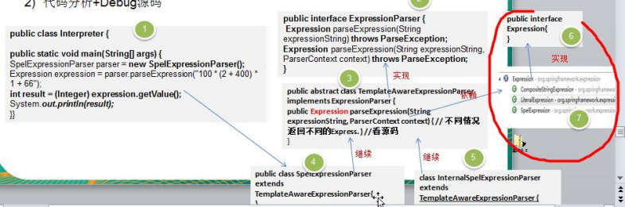</td></tr></table>代码分析+Debug&nbsp;源码

 

    
&nbsp;
    

    
3)&nbsp;<table cellpadding="0" cellspacing="0"><tr><td
            width="94.5333" height="0"></td></tr><tr><td></td><td>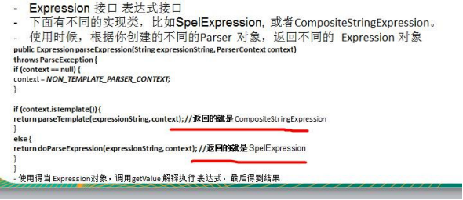</td></tr></table>说明

    
&nbsp;
    

    <h2 style="margin-top:0.0000pt;margin-right:0.0000pt;margin-bottom:0.0000pt;
margin-left:46.9000pt;text-indent:-36.0000pt;text-align:left;
line-height:32.8000pt;mso-line-height-rule:exactly;mso-list:l29 level2 lfo219;">23.7&nbsp;解释器模式的注意事项和细节</h2>
    
1)&nbsp;当有一个语言需要解释执行，可将该语言中的句子表示为一个抽象语法树，就可以考虑使用解释器模式，让程序具有良好的扩展性

    
2)&nbsp;应用场景：编译器、运算表达式计算、正则表达式、机器人等

    
3)&nbsp;使用解释器可能带来的问题：解释器模式会引起类膨胀、解释器模式采用递归调用方法，将会导致调试非常复杂、效率可能降低.

 

<h1 align=center style="margin-right:17.9500pt;text-align:center;">第 24&#9;章状态模式</h1>
    <h2 style="margin-top:0.0000pt;margin-right:0.0000pt;margin-bottom:0.0000pt;
margin-left:46.9000pt;text-indent:-36.0000pt;text-align:left;
line-height:32.3500pt;mso-line-height-rule:exactly;mso-list:l39 level2 lfo231;">24.1&nbsp;APP 抽奖活动问题</h2>
    
请编写程序完成 APP 抽奖活动 具体要求如下:

    
1)&nbsp;假如每参加一次这个活动要扣除用户 50 积分，中奖概率是 10%

    
2)&nbsp;奖品数量固定，抽完就不能抽奖

    
3)&nbsp;活动有四个状态: 可以抽奖、不能抽奖、发放奖品和奖品领完

    
4)&nbsp;活动的四个状态转换关系图(右图)

    
<table cellpadding="0" cellspacing="0"><tr><td width="133.533"
                                                                                                         height="0"></td></tr><tr><td></td><td></td></tr></table>&nbsp;

    
&nbsp;

    
&nbsp;

    <h2 style="margin-top:0.0500pt;margin-right:0.0000pt;margin-bottom:0.0000pt;
margin-left:46.9000pt;text-indent:-36.0000pt;text-align:left;
line-height:32.8000pt;mso-line-height-rule:exactly;mso-list:l39 level2 lfo231;">24.2&nbsp;状态模式基本介绍</h2>
    
基本介绍

    
1)&nbsp;状态模式（<b>State</b><b>&nbsp;</b><b>Pattern</b>）：它主要用来解决对象在多种状态转换时，需要对外输出不同的行为的问题。状态和行为是一一对应的，状态之间可以相互转换

    
2)&nbsp;当一个对象的内在状态改变时，允许改变其行为，这个对象看起来像是改变了其类

    <h2 style="margin-top:0.0000pt;margin-right:0.0000pt;margin-bottom:0.0000pt;
margin-left:46.9000pt;text-indent:-36.0000pt;text-align:left;
line-height:32.6500pt;mso-line-height-rule:exactly;mso-list:l39 level2 lfo231;">24.3&nbsp;状态模式的原理类图</h2>

 

    
&nbsp;
    

    
&nbsp;
    

    
&nbsp;
    

    
&#216;&nbsp;对原理类图的说明-即(状态模式的角色及职责)

    
1)&nbsp;Context&nbsp;类为环境角色, &nbsp;用于维护 State&nbsp;实例,这个实例定义当前状态

    
2)&nbsp;State&nbsp;是抽象状态角色,定义一个接口封装与 Context &nbsp;的一个特点接口相关行为

    
3)&nbsp;ConcreteState 具体的状态角色，每个子类实现一个与 Context&nbsp;的一个状态相关行为

    <h2 style="margin-top:0.0000pt;margin-right:0.0000pt;margin-bottom:0.0000pt;
margin-left:46.9000pt;text-indent:-36.0000pt;text-align:left;
line-height:31.5500pt;mso-line-height-rule:exactly;mso-list:l39 level2 lfo231;">24.4&nbsp;状态模式解决 APP&nbsp;抽奖问</h2>
    
1)&nbsp;应用实例要求

    
完成 APP 抽奖活动项目，使用状态模式.

    
2)&nbsp;思路分析和图解(类图)

    
-定义出一个接口叫状态接口，每个状态都实现它。

    
-接口有扣除积分方法、抽奖方法、发放奖品方法

    
<table cellpadding="0" cellspacing="0"><tr><td width="146.8"
                                                                                                           height="0"></td></tr><tr><td></td><td></td></tr></table>&nbsp;
    

 

3)&nbsp;代码实现

    
&nbsp;
    

    
state.zip

    
&nbsp;
    

    <table class=MsoNormalTable border=1 cellspacing=0 style="border-collapse:collapse;margin-left:10.9000pt;mso-table-layout-alt:fixed;
border:none;mso-border-left-alt:0.5000pt solid rgb(0,0,0);mso-border-top-alt:0.5000pt solid rgb(0,0,0);
mso-border-right-alt:0.5000pt solid rgb(0,0,0);mso-border-bottom-alt:0.5000pt solid rgb(0,0,0);mso-border-insideh:0.5000pt solid rgb(0,0,0);
mso-border-insidev:0.5000pt solid rgb(0,0,0);mso-padding-alt:0.0000pt 0.0000pt 0.0000pt 0.0000pt ;">
        <tr style="height:538.1000pt;">
            <td width=808 valign=top style="width:606.0000pt;padding:0.0000pt 0.0000pt 0.0000pt 0.0000pt ;border-left:1.0000pt solid rgb(0,0,0);
mso-border-left-alt:0.5000pt solid rgb(0,0,0);border-right:1.0000pt solid rgb(0,0,0);mso-border-right-alt:0.5000pt solid rgb(0,0,0);
border-top:1.0000pt solid rgb(0,0,0);mso-border-top-alt:0.5000pt solid rgb(0,0,0);border-bottom:1.0000pt solid rgb(0,0,0);
mso-border-bottom-alt:0.5000pt solid rgb(0,0,0);">
package com.atguigu.state;

                
&nbsp;

                
import java.util.Random;

                
&nbsp;

                
/**

                
*&nbsp;可以抽奖的状态

                
*&nbsp;@author&nbsp;Administrator

                
*

                
*/

                
public class CanRaffleState extends State {

                
&nbsp;

                
RaffleActivity activity;

                
&nbsp;

                
public CanRaffleState(RaffleActivity activity) { this.activity = activity;

                
}

                
&nbsp;

                
//已经扣除了积分，不能再扣 @Override

                
public void deductMoney() {

                
System.out.println("已经扣取过了积分");

                
}
</td>
        </tr>
    </table>

 

    
&nbsp;

    <table class=MsoNormalTable border=1 cellspacing=0 style="border-collapse:collapse;margin-left:10.9000pt;mso-table-layout-alt:fixed;
border:none;mso-border-left-alt:0.5000pt solid rgb(0,0,0);mso-border-top-alt:0.5000pt solid rgb(0,0,0);
mso-border-right-alt:0.5000pt solid rgb(0,0,0);mso-border-bottom-alt:0.5000pt solid rgb(0,0,0);mso-border-insideh:0.5000pt solid rgb(0,0,0);
mso-border-insidev:0.5000pt solid rgb(0,0,0);mso-padding-alt:0.0000pt 0.0000pt 0.0000pt 0.0000pt ;">
        <tr style="height:608.3000pt;">
            <td width=808 valign=top style="width:606.0000pt;padding:0.0000pt 0.0000pt 0.0000pt 0.0000pt ;border-left:1.0000pt solid rgb(0,0,0);
mso-border-left-alt:0.5000pt solid rgb(0,0,0);border-right:1.0000pt solid rgb(0,0,0);mso-border-right-alt:0.5000pt solid rgb(0,0,0);
border-top:1.0000pt solid rgb(0,0,0);mso-border-top-alt:0.5000pt solid rgb(0,0,0);border-bottom:1.0000pt solid rgb(0,0,0);
mso-border-bottom-alt:0.5000pt solid rgb(0,0,0);">

                //可以抽奖, 抽完奖后，根据实际情况，改成新的状态

                
@Override

                
public &nbsp;&nbsp;&nbsp;boolean &nbsp;&nbsp;&nbsp;raffle() &nbsp;&nbsp;&nbsp;{ System.out.println("正在抽奖，请稍等！"); Random r = new&nbsp;Random();

                
int num = r.nextInt(10);

                
// 10%中奖机会if(num == 0){

                
// 改 变 活 动 状 态 为 发 放 奖 品 context activity.setState(activity.getDispenseState());

                
return true;

                
}else{

                
System.out.println("很遗憾没有抽中奖品！");

                
//&nbsp;改变状态为不能抽奖

                
activity.setState(activity.getNoRafflleState()); return false;

                
}

                
}

                
&nbsp;
                

                
//&nbsp;不能发放奖品

                
@Override

                
public void dispensePrize() {

                
System.out.println("没中奖，不能发放奖品");

                
}

                
}
</td>
        </tr>
    </table>

 

    
&nbsp;

    <table class=MsoNormalTable border=1 cellspacing=0 style="border-collapse:collapse;margin-left:10.9000pt;mso-table-layout-alt:fixed;
border:none;mso-border-left-alt:0.5000pt solid rgb(0,0,0);mso-border-top-alt:0.5000pt solid rgb(0,0,0);
mso-border-right-alt:0.5000pt solid rgb(0,0,0);mso-border-bottom-alt:0.5000pt solid rgb(0,0,0);mso-border-insideh:0.5000pt solid rgb(0,0,0);
mso-border-insidev:0.5000pt solid rgb(0,0,0);mso-padding-alt:0.0000pt 0.0000pt 0.0000pt 0.0000pt ;">
        <tr style="height:608.3000pt;">
            <td width=808 valign=top style="width:606.0000pt;padding:0.0000pt 0.0000pt 0.0000pt 0.0000pt ;border-left:1.0000pt solid rgb(0,0,0);
mso-border-left-alt:0.5000pt solid rgb(0,0,0);border-right:1.0000pt solid rgb(0,0,0);mso-border-right-alt:0.5000pt solid rgb(0,0,0);
border-top:1.0000pt solid rgb(0,0,0);mso-border-top-alt:0.5000pt solid rgb(0,0,0);border-bottom:1.0000pt solid rgb(0,0,0);
mso-border-bottom-alt:0.5000pt solid rgb(0,0,0);">
package com.atguigu.state;

                
&nbsp;
                

                
&nbsp;

                
/**

                
*&nbsp;状态模式测试类

                
*&nbsp;@author&nbsp;Administrator

                
*

                
*/

                
public class ClientTest {

                
&nbsp;
                

                
&nbsp;

                
public static void main(String[] args) {

                
// TODO Auto-generated method&nbsp;stub

                
//&nbsp;创建活动对象，奖品有 1 个奖品

                
RaffleActivity activity = new RaffleActivity(1);

                
&nbsp;
                

                
//&nbsp;我们连续抽 300 次奖

                
for (int i = 0; i &#60; 30; i++) {

                
System.out.println("--------第" + (i + 1) + "次抽奖----------");

                
//&nbsp;参加抽奖，第一步点击扣除积分

                
activity.debuctMoney();

                
&nbsp;
                

                
//&nbsp;第二步抽奖

                
activity.raffle();

                
}

                
}

                
&nbsp;
                

                
&nbsp;

                
}
</td>
        </tr>
    </table>

 

    
&nbsp;

    <table class=MsoNormalTable border=1 cellspacing=0 style="border-collapse:collapse;margin-left:10.9000pt;mso-table-layout-alt:fixed;
border:none;mso-border-left-alt:0.5000pt solid rgb(0,0,0);mso-border-top-alt:0.5000pt solid rgb(0,0,0);
mso-border-right-alt:0.5000pt solid rgb(0,0,0);mso-border-bottom-alt:0.5000pt solid rgb(0,0,0);mso-border-insideh:0.5000pt solid rgb(0,0,0);
mso-border-insidev:0.5000pt solid rgb(0,0,0);mso-padding-alt:0.0000pt 0.0000pt 0.0000pt 0.0000pt ;">
        <tr style="height:23.4000pt;">
            <td width=808 valign=top style="width:606.0000pt;padding:0.0000pt 0.0000pt 0.0000pt 0.0000pt ;border-left:1.0000pt solid rgb(0,0,0);
mso-border-left-alt:0.5000pt solid rgb(0,0,0);border-right:1.0000pt solid rgb(0,0,0);mso-border-right-alt:0.5000pt solid rgb(0,0,0);
border-top:1.0000pt solid rgb(0,0,0);mso-border-top-alt:0.5000pt solid rgb(0,0,0);border-bottom:1.0000pt solid rgb(0,0,0);
mso-border-bottom-alt:0.5000pt solid rgb(0,0,0);">
                
&nbsp;
                

            </td>
        </tr>
        <tr style="height:584.9000pt;">
            <td width=808 valign=top style="width:606.0000pt;padding:0.0000pt 0.0000pt 0.0000pt 0.0000pt ;border-left:1.0000pt solid rgb(0,0,0);
mso-border-left-alt:0.5000pt solid rgb(0,0,0);border-right:1.0000pt solid rgb(0,0,0);mso-border-right-alt:0.5000pt solid rgb(0,0,0);
border-top:none;mso-border-top-alt:0.5000pt solid rgb(0,0,0);border-bottom:1.0000pt solid rgb(0,0,0);
mso-border-bottom-alt:0.5000pt solid rgb(0,0,0);">
package com.atguigu.state;

                
&nbsp;
                

                
&nbsp;

                
/**

                
*&nbsp;奖品发放完毕状态

                
*&nbsp;说明，当我们 activity&nbsp;改变成 DispenseOutState， 抽奖活动结束

                
*&nbsp;@author&nbsp;Administrator

                
*

                
*/

                
public class DispenseOutState extends State {

                
&nbsp;
                

                
//&nbsp;初始化时传入活动引用

                
RaffleActivity activity;

                
&nbsp;
                

                
&nbsp;

                
public DispenseOutState(RaffleActivity activity) { this.activity = activity;

                
}

                
@Override

                
public void deductMoney() {

                
System.out.println("奖品发送完了，请下次再参加");

                
}

                
&nbsp;
                

                
&nbsp;

                
@Override

                
public boolean raffle() {

                
System.out.println("奖品发送完了，请下次再参加"); return false;
</td>
        </tr>
    </table>

 

    
&nbsp;

    <table class=MsoNormalTable border=1 cellspacing=0 style="border-collapse:collapse;margin-left:10.9000pt;mso-table-layout-alt:fixed;
border:none;mso-border-left-alt:0.5000pt solid rgb(0,0,0);mso-border-top-alt:0.5000pt solid rgb(0,0,0);
mso-border-right-alt:0.5000pt solid rgb(0,0,0);mso-border-bottom-alt:0.5000pt solid rgb(0,0,0);mso-border-insideh:0.5000pt solid rgb(0,0,0);
mso-border-insidev:0.5000pt solid rgb(0,0,0);mso-padding-alt:0.0000pt 0.0000pt 0.0000pt 0.0000pt ;">
        <tr style="height:187.2000pt;">
            <td width=808 valign=top style="width:606.0000pt;padding:0.0000pt 0.0000pt 0.0000pt 0.0000pt ;border-left:1.0000pt solid rgb(0,0,0);
mso-border-left-alt:0.5000pt solid rgb(0,0,0);border-right:1.0000pt solid rgb(0,0,0);mso-border-right-alt:0.5000pt solid rgb(0,0,0);
border-top:1.0000pt solid rgb(0,0,0);mso-border-top-alt:0.5000pt solid rgb(0,0,0);border-bottom:1.0000pt solid rgb(0,0,0);
mso-border-bottom-alt:0.5000pt solid rgb(0,0,0);">
}

                
&nbsp;
                

                
&nbsp;

                
@Override

                
public void dispensePrize() {

                
System.out.println("奖品发送完了，请下次再参加");

                
}

                
}
</td>
        </tr>
        <tr style="height:421.1000pt;">
            <td width=808 valign=top style="width:606.0000pt;padding:0.0000pt 0.0000pt 0.0000pt 0.0000pt ;border-left:1.0000pt solid rgb(0,0,0);
mso-border-left-alt:0.5000pt solid rgb(0,0,0);border-right:1.0000pt solid rgb(0,0,0);mso-border-right-alt:0.5000pt solid rgb(0,0,0);
border-top:none;mso-border-top-alt:0.5000pt solid rgb(0,0,0);border-bottom:1.0000pt solid rgb(0,0,0);
mso-border-bottom-alt:0.5000pt solid rgb(0,0,0);">
package com.atguigu.state;

                
&nbsp;
                

                
&nbsp;

                
/**

                
*&nbsp;发放奖品的状态

                
*&nbsp;@author&nbsp;Administrator

                
*

                
*/

                
public class DispenseState extends State {

                
&nbsp;
                

                
//&nbsp;初始化时传入活动引用，发放奖品后改变其状态

                
RaffleActivity activity;

                
&nbsp;
                

                
&nbsp;

                
public DispenseState(RaffleActivity activity) { this.activity = activity;

                
}

                
&nbsp;
                

                
&nbsp;

                
//
</td>
        </tr>
    </table>

 

    
&nbsp;

    <table class=MsoNormalTable border=1 cellspacing=0 style="border-collapse:collapse;margin-left:10.9000pt;mso-table-layout-alt:fixed;
border:none;mso-border-left-alt:0.5000pt solid rgb(0,0,0);mso-border-top-alt:0.5000pt solid rgb(0,0,0);
mso-border-right-alt:0.5000pt solid rgb(0,0,0);mso-border-bottom-alt:0.5000pt solid rgb(0,0,0);mso-border-insideh:0.5000pt solid rgb(0,0,0);
mso-border-insidev:0.5000pt solid rgb(0,0,0);mso-padding-alt:0.0000pt 0.0000pt 0.0000pt 0.0000pt ;">
        <tr style="height:608.3000pt;">
            <td width=808 valign=top style="width:606.0000pt;padding:0.0000pt 0.0000pt 0.0000pt 0.0000pt ;border-left:1.0000pt solid rgb(0,0,0);
mso-border-left-alt:0.5000pt solid rgb(0,0,0);border-right:1.0000pt solid rgb(0,0,0);mso-border-right-alt:0.5000pt solid rgb(0,0,0);
border-top:1.0000pt solid rgb(0,0,0);mso-border-top-alt:0.5000pt solid rgb(0,0,0);border-bottom:1.0000pt solid rgb(0,0,0);
mso-border-bottom-alt:0.5000pt solid rgb(0,0,0);">
@Override

                
public void deductMoney() {

                
System.out.println("不能扣除积分");

                
}

                
&nbsp;
                

                
&nbsp;

                
@Override

                
public boolean raffle() {

                
System.out.println("不能抽奖"); return false;

                
}

                
&nbsp;
                

                
//发放奖品 @Override

                
public void dispensePrize() { if(activity.getCount() &#62; 0){

                
System.out.println("恭喜中奖了");

                
//&nbsp;改变状态为不能抽奖

                
activity.setState(activity.getNoRafflleState());

                
}else{

                
System.out.println("很遗憾，奖品发送完了");

                
//&nbsp;改变状态为奖品发送完毕, 后面我们就不可以抽奖

                
activity.setState(activity.getDispensOutState());

                
//System.out.println("抽奖活动结束");

                
//System.exit(0);

                
}
</td>
        </tr>
    </table>

 

    
&nbsp;

    <table class=MsoNormalTable border=1 cellspacing=0 style="border-collapse:collapse;margin-left:10.9000pt;mso-table-layout-alt:fixed;
border:none;mso-border-left-alt:0.5000pt solid rgb(0,0,0);mso-border-top-alt:0.5000pt solid rgb(0,0,0);
mso-border-right-alt:0.5000pt solid rgb(0,0,0);mso-border-bottom-alt:0.5000pt solid rgb(0,0,0);mso-border-insideh:0.5000pt solid rgb(0,0,0);
mso-border-insidev:0.5000pt solid rgb(0,0,0);mso-padding-alt:0.0000pt 0.0000pt 0.0000pt 0.0000pt ;">
        <tr style="height:70.2000pt;">
            <td width=808 valign=top style="width:606.0000pt;padding:0.0000pt 0.0000pt 0.0000pt 0.0000pt ;border-left:1.0000pt solid rgb(0,0,0);
mso-border-left-alt:0.5000pt solid rgb(0,0,0);border-right:1.0000pt solid rgb(0,0,0);mso-border-right-alt:0.5000pt solid rgb(0,0,0);
border-top:1.0000pt solid rgb(0,0,0);mso-border-top-alt:0.5000pt solid rgb(0,0,0);border-bottom:1.0000pt solid rgb(0,0,0);
mso-border-bottom-alt:0.5000pt solid rgb(0,0,0);">
}

                
}
</td>
        </tr>
        <tr style="height:538.1000pt;">
            <td width=808 valign=top style="width:606.0000pt;padding:0.0000pt 0.0000pt 0.0000pt 0.0000pt ;border-left:1.0000pt solid rgb(0,0,0);
mso-border-left-alt:0.5000pt solid rgb(0,0,0);border-right:1.0000pt solid rgb(0,0,0);mso-border-right-alt:0.5000pt solid rgb(0,0,0);
border-top:none;mso-border-top-alt:0.5000pt solid rgb(0,0,0);border-bottom:1.0000pt solid rgb(0,0,0);
mso-border-bottom-alt:0.5000pt solid rgb(0,0,0);">
package com.atguigu.state;

                
&nbsp;
                

                
&nbsp;

                
/**

                
*&nbsp;不能抽奖状态

                
*&nbsp;@author&nbsp;Administrator

                
*

                
*/

                
public class NoRaffleState extends State {

                
&nbsp;
                

                
//&nbsp;初始化时传入活动引用，扣除积分后改变其状态

                
RaffleActivity activity;

                
&nbsp;
                

                
&nbsp;

                
public NoRaffleState(RaffleActivity activity) { this.activity = activity;

                
}

                
&nbsp;
                

                
//&nbsp;当前状态可以扣积分 , 扣除后，将状态设置成可以抽奖状态

                
@Override

                
public void deductMoney() {

                
System.out.println("扣除 50 积分成功，您可以抽奖了"); activity.setState(activity.getCanRaffleState());

                
}
</td>
        </tr>
    </table>

 

    
&nbsp;

    <table class=MsoNormalTable border=1 cellspacing=0 style="border-collapse:collapse;margin-left:10.9000pt;mso-table-layout-alt:fixed;
border:none;mso-border-left-alt:0.5000pt solid rgb(0,0,0);mso-border-top-alt:0.5000pt solid rgb(0,0,0);
mso-border-right-alt:0.5000pt solid rgb(0,0,0);mso-border-bottom-alt:0.5000pt solid rgb(0,0,0);mso-border-insideh:0.5000pt solid rgb(0,0,0);
mso-border-insidev:0.5000pt solid rgb(0,0,0);mso-padding-alt:0.0000pt 0.0000pt 0.0000pt 0.0000pt ;">
        <tr style="height:327.6000pt;">
            <td width=808 valign=top style="width:606.0000pt;padding:0.0000pt 0.0000pt 0.0000pt 0.0000pt ;border-left:1.0000pt solid rgb(0,0,0);
mso-border-left-alt:0.5000pt solid rgb(0,0,0);border-right:1.0000pt solid rgb(0,0,0);mso-border-right-alt:0.5000pt solid rgb(0,0,0);
border-top:1.0000pt solid rgb(0,0,0);mso-border-top-alt:0.5000pt solid rgb(0,0,0);border-bottom:1.0000pt solid rgb(0,0,0);
mso-border-bottom-alt:0.5000pt solid rgb(0,0,0);">

                //&nbsp;当前状态不能抽奖

                
@Override

                
public boolean raffle() {

                
System.out.println("扣了积分才能抽奖喔！"); return false;

                
}

                
&nbsp;
                

                
//&nbsp;当前状态不能发奖品

                
@Override

                
public void dispensePrize() {

                
System.out.println("不能发放奖品");

                
}

                
}
</td>
        </tr>
        <tr style="height:280.7000pt;">
            <td width=808 valign=top style="width:606.0000pt;padding:0.0000pt 0.0000pt 0.0000pt 0.0000pt ;border-left:1.0000pt solid rgb(0,0,0);
mso-border-left-alt:0.5000pt solid rgb(0,0,0);border-right:1.0000pt solid rgb(0,0,0);mso-border-right-alt:0.5000pt solid rgb(0,0,0);
border-top:none;mso-border-top-alt:0.5000pt solid rgb(0,0,0);border-bottom:1.0000pt solid rgb(0,0,0);
mso-border-bottom-alt:0.5000pt solid rgb(0,0,0);">

                package com.atguigu.state;

                
&nbsp;
                

                
&nbsp;

                
/**

                
*&nbsp;抽奖活动 //

                
*

                
*&nbsp;@author&nbsp;Administrator

                
*

                
*/

                
public class RaffleActivity {

                
&nbsp;
                

                
// state 表示活动当前的状态，是变化

                
State state = null;
</td>
        </tr>
    </table>

 

    
&nbsp;

    <table class=MsoNormalTable border=1 cellspacing=0 style="border-collapse:collapse;margin-left:10.9000pt;mso-table-layout-alt:fixed;
border:none;mso-border-left-alt:0.5000pt solid rgb(0,0,0);mso-border-top-alt:0.5000pt solid rgb(0,0,0);
mso-border-right-alt:0.5000pt solid rgb(0,0,0);mso-border-bottom-alt:0.5000pt solid rgb(0,0,0);mso-border-insideh:0.5000pt solid rgb(0,0,0);
mso-border-insidev:0.5000pt solid rgb(0,0,0);mso-padding-alt:0.0000pt 0.0000pt 0.0000pt 0.0000pt ;">
        <tr style="height:608.3000pt;">
            <td width=808 valign=top style="width:606.0000pt;padding:0.0000pt 0.0000pt 0.0000pt 0.0000pt ;border-left:1.0000pt solid rgb(0,0,0);
mso-border-left-alt:0.5000pt solid rgb(0,0,0);border-right:1.0000pt solid rgb(0,0,0);mso-border-right-alt:0.5000pt solid rgb(0,0,0);
border-top:1.0000pt solid rgb(0,0,0);mso-border-top-alt:0.5000pt solid rgb(0,0,0);border-bottom:1.0000pt solid rgb(0,0,0);
mso-border-bottom-alt:0.5000pt solid rgb(0,0,0);">

                //&nbsp;奖品数量

                
int count = 0;

                
&nbsp;
                

                
//&nbsp;四个属性，表示四种状态

                
State noRafflleState = new NoRaffleState(this); State canRaffleState = new CanRaffleState(this);

                
&nbsp;
                

                
State&nbsp;dispenseState =&#9;new DispenseState(this); State dispensOutState = new&nbsp;DispenseOutState(this);

                
&nbsp;

                
//构造器

                
//1.&nbsp;初始化当前的状态为 noRafflleState（即不能抽奖的状态）

                
//2.&nbsp;初始化奖品的数量

                
public RaffleActivity( int count) { this.state = getNoRafflleState(); this.count = count;

                
}

                
&nbsp;
                

                
//扣分, 调用当前状态的 deductMoney public void debuctMoney(){

                
state.deductMoney();

                
}

                
&nbsp;
                

                
//抽奖

                
public void raffle(){

                
//&nbsp;如果当前的状态是抽奖成功
</td>
        </tr>
    </table>

 

    
&nbsp;

    <table class=MsoNormalTable border=1 cellspacing=0 style="border-collapse:collapse;margin-left:10.9000pt;mso-table-layout-alt:fixed;
border:none;mso-border-left-alt:0.5000pt solid rgb(0,0,0);mso-border-top-alt:0.5000pt solid rgb(0,0,0);
mso-border-right-alt:0.5000pt solid rgb(0,0,0);mso-border-bottom-alt:0.5000pt solid rgb(0,0,0);mso-border-insideh:0.5000pt solid rgb(0,0,0);
mso-border-insidev:0.5000pt solid rgb(0,0,0);mso-padding-alt:0.0000pt 0.0000pt 0.0000pt 0.0000pt ;">
        <tr style="height:608.3000pt;">
            <td width=808 valign=top style="width:606.0000pt;padding:0.0000pt 0.0000pt 0.0000pt 0.0000pt ;border-left:1.0000pt solid rgb(0,0,0);
mso-border-left-alt:0.5000pt solid rgb(0,0,0);border-right:1.0000pt solid rgb(0,0,0);mso-border-right-alt:0.5000pt solid rgb(0,0,0);
border-top:1.0000pt solid rgb(0,0,0);mso-border-top-alt:0.5000pt solid rgb(0,0,0);border-bottom:1.0000pt solid rgb(0,0,0);
mso-border-bottom-alt:0.5000pt solid rgb(0,0,0);">
if(state.raffle()){

                
//领取奖品state.dispensePrize();

                
}

                
&nbsp;
                

                
&nbsp;

                
}

                
&nbsp;
                

                
&nbsp;

                
public State getState() { return state;

                
}

                
&nbsp;
                

                
&nbsp;

                
public void setState(State state) { this.state = state;

                
}

                
&nbsp;
                

                
//这里请大家注意，每领取一次奖品，count-- public int getCount() {

                
int curCount = count; count--;

                
return curCount;

                
}

                
&nbsp;
                

                
&nbsp;

                
public void setCount(int count) { this.count = count;

                
}
</td>
        </tr>
    </table>

 

    
&nbsp;

    <table class=MsoNormalTable border=1 cellspacing=0 style="border-collapse:collapse;margin-left:10.9000pt;mso-table-layout-alt:fixed;
border:none;mso-border-left-alt:0.5000pt solid rgb(0,0,0);mso-border-top-alt:0.5000pt solid rgb(0,0,0);
mso-border-right-alt:0.5000pt solid rgb(0,0,0);mso-border-bottom-alt:0.5000pt solid rgb(0,0,0);mso-border-insideh:0.5000pt solid rgb(0,0,0);
mso-border-insidev:0.5000pt solid rgb(0,0,0);mso-padding-alt:0.0000pt 0.0000pt 0.0000pt 0.0000pt ;">
        <tr style="height:608.3000pt;">
            <td width=808 valign=top style="width:606.0000pt;padding:0.0000pt 0.0000pt 0.0000pt 0.0000pt ;border-left:1.0000pt solid rgb(0,0,0);
mso-border-left-alt:0.5000pt solid rgb(0,0,0);border-right:1.0000pt solid rgb(0,0,0);mso-border-right-alt:0.5000pt solid rgb(0,0,0);
border-top:1.0000pt solid rgb(0,0,0);mso-border-top-alt:0.5000pt solid rgb(0,0,0);border-bottom:1.0000pt solid rgb(0,0,0);
mso-border-bottom-alt:0.5000pt solid rgb(0,0,0);">
public State getNoRafflleState() { return noRafflleState;

                
}

                
&nbsp;
                

                
&nbsp;

                
public void setNoRafflleState(State noRafflleState) { this.noRafflleState = noRafflleState;

                
}

                
&nbsp;
                

                
&nbsp;

                
public State getCanRaffleState() { return canRaffleState;

                
}

                
&nbsp;
                

                
&nbsp;

                
public void setCanRaffleState(State canRaffleState) { this.canRaffleState = canRaffleState;

                
}

                
&nbsp;
                

                
&nbsp;

                
public State getDispenseState() { return dispenseState;

                
}

                
&nbsp;
                

                
&nbsp;

                
public void setDispenseState(State dispenseState) { this.dispenseState = dispenseState;

                
}

                
&nbsp;
                

                
public State getDispensOutState() { return dispensOutState;
</td>
        </tr>
    </table>

 

    
&nbsp;

    <table class=MsoNormalTable border=1 cellspacing=0 style="border-collapse:collapse;margin-left:10.9000pt;mso-table-layout-alt:fixed;
border:none;mso-border-left-alt:0.5000pt solid rgb(0,0,0);mso-border-top-alt:0.5000pt solid rgb(0,0,0);
mso-border-right-alt:0.5000pt solid rgb(0,0,0);mso-border-bottom-alt:0.5000pt solid rgb(0,0,0);mso-border-insideh:0.5000pt solid rgb(0,0,0);
mso-border-insidev:0.5000pt solid rgb(0,0,0);mso-padding-alt:0.0000pt 0.0000pt 0.0000pt 0.0000pt ;">
        <tr style="height:163.7500pt;">
            <td width=808 valign=top style="width:606.0000pt;padding:0.0000pt 0.0000pt 0.0000pt 0.0000pt ;border-left:1.0000pt solid rgb(0,0,0);
mso-border-left-alt:0.5000pt solid rgb(0,0,0);border-right:1.0000pt solid rgb(0,0,0);mso-border-right-alt:0.5000pt solid rgb(0,0,0);
border-top:1.0000pt solid rgb(0,0,0);mso-border-top-alt:0.5000pt solid rgb(0,0,0);border-bottom:1.0000pt solid rgb(0,0,0);
mso-border-bottom-alt:0.5000pt solid rgb(0,0,0);">
}

                
&nbsp;
                

                
&nbsp;

                
public void setDispensOutState(State dispensOutState) { this.dispensOutState = dispensOutState;

                
}

                
}
</td>
        </tr>
        <tr style="height:445.0000pt;">
            <td width=808 valign=top style="width:606.0000pt;padding:0.0000pt 0.0000pt 0.0000pt 0.0000pt ;border-left:1.0000pt solid rgb(0,0,0);
mso-border-left-alt:0.5000pt solid rgb(0,0,0);border-right:1.0000pt solid rgb(0,0,0);mso-border-right-alt:0.5000pt solid rgb(0,0,0);
border-top:none;mso-border-top-alt:0.5000pt solid rgb(0,0,0);border-bottom:1.0000pt solid rgb(0,0,0);
mso-border-bottom-alt:0.5000pt solid rgb(0,0,0);">

                package com.atguigu.state;

                
&nbsp;
                

                
&nbsp;

                
/**

                
*&nbsp;状态抽象类

                
*&nbsp;@author&nbsp;Administrator

                
*

                
*/

                
public abstract class State {

                
&nbsp;
                

                
&nbsp;
                

                
&nbsp;

                
//&nbsp;扣除积分 - 50

                
public abstract void deductMoney();

                
&nbsp;
                

                
//&nbsp;是否抽中奖品

                
public abstract boolean raffle();

                
&nbsp;
                

                
//&nbsp;发放奖品

                
public&nbsp;abstract&#9;void&nbsp;dispensePrize();
</td>
        </tr>
    </table>

 

    
&nbsp;

    <table class=MsoNormalTable border=1 cellspacing=0 style="border-collapse:collapse;margin-left:10.9000pt;mso-table-layout-alt:fixed;
border:none;mso-border-left-alt:0.5000pt solid rgb(0,0,0);mso-border-top-alt:0.5000pt solid rgb(0,0,0);
mso-border-right-alt:0.5000pt solid rgb(0,0,0);mso-border-bottom-alt:0.5000pt solid rgb(0,0,0);mso-border-insideh:0.5000pt solid rgb(0,0,0);
mso-border-insidev:0.5000pt solid rgb(0,0,0);mso-padding-alt:0.0000pt 0.0000pt 0.0000pt 0.0000pt ;">
        <tr style="height:46.8000pt;">
            <td width=808 valign=top style="width:606.0000pt;padding:0.0000pt 0.0000pt 0.0000pt 0.0000pt ;border-left:1.0000pt solid rgb(0,0,0);
mso-border-left-alt:0.5000pt solid rgb(0,0,0);border-right:1.0000pt solid rgb(0,0,0);mso-border-right-alt:0.5000pt solid rgb(0,0,0);
border-top:1.0000pt solid rgb(0,0,0);mso-border-top-alt:0.5000pt solid rgb(0,0,0);border-bottom:1.0000pt solid rgb(0,0,0);
mso-border-bottom-alt:0.5000pt solid rgb(0,0,0);">
}
</td>
        </tr>
    </table>
    
&nbsp;

    
&nbsp;

    <h2 style="margin-top:0.0000pt;margin-right:0.0000pt;margin-bottom:0.0000pt;
margin-left:46.9000pt;text-indent:-36.0000pt;text-align:left;
line-height:29.5000pt;mso-line-height-rule:exactly;mso-list:l39 level2 lfo231;">24.5&nbsp;状态模式在实际项目-借贷平台 源码剖析</h2>
    
&nbsp;
    

    
1)&nbsp;借贷平台的订单，有审核-发布-抢单 等等 步骤，随着操作的不同，会改变订单的状态, 项目中的这个模块实现就会使用到状态模式

    
2)&nbsp;通常通过 if/else&nbsp;判断订单的状态，从而实现不同的逻辑，伪代码如下

    
<table cellpadding="0" cellspacing="0"><tr><td
            width="133.733" height="0"></td></tr><tr><td></td><td></td></tr></table>&nbsp;
    

    
3)&nbsp;使用状态模式完成 &nbsp;借贷平台项目的审核模块&#9;[设计+代码]

    
&nbsp;

    
money.zip

    
&nbsp;
    

    <table class=MsoNormalTable border=1 cellspacing=0 style="border-collapse:collapse;margin-left:10.9000pt;mso-table-layout-alt:fixed;
border:none;mso-border-left-alt:0.5000pt solid rgb(0,0,0);mso-border-top-alt:0.5000pt solid rgb(0,0,0);
mso-border-right-alt:0.5000pt solid rgb(0,0,0);mso-border-bottom-alt:0.5000pt solid rgb(0,0,0);mso-border-insideh:0.5000pt solid rgb(0,0,0);
mso-border-insidev:0.5000pt solid rgb(0,0,0);mso-padding-alt:0.0000pt 0.0000pt 0.0000pt 0.0000pt ;">
        <tr style="height:210.5000pt;">
            <td width=808 valign=top style="width:606.0000pt;padding:0.0000pt 0.0000pt 0.0000pt 0.0000pt ;border-left:1.0000pt solid rgb(0,0,0);
mso-border-left-alt:0.5000pt solid rgb(0,0,0);border-right:1.0000pt solid rgb(0,0,0);mso-border-right-alt:0.5000pt solid rgb(0,0,0);
border-top:1.0000pt solid rgb(0,0,0);mso-border-top-alt:0.5000pt solid rgb(0,0,0);border-bottom:1.0000pt solid rgb(0,0,0);
mso-border-bottom-alt:0.5000pt solid rgb(0,0,0);">
package com.atguigu.state.money;

                
&nbsp;

                
public abstract class AbstractState implements State {

                
&nbsp;

                
protected static final RuntimeException EXCEPTION = new RuntimeException("操作流程不允许");

                
&nbsp;

                
//抽象类，默认实现了 State&nbsp;接口的所有方法

                
//该类的所有方法，其子类(具体的状态类)，可以有选择的进行重写
</td>
        </tr>
    </table>

 

    
&nbsp;

    <table class=MsoNormalTable border=1 cellspacing=0 style="border-collapse:collapse;margin-left:10.9000pt;mso-table-layout-alt:fixed;
border:none;mso-border-left-alt:0.5000pt solid rgb(0,0,0);mso-border-top-alt:0.5000pt solid rgb(0,0,0);
mso-border-right-alt:0.5000pt solid rgb(0,0,0);mso-border-bottom-alt:0.5000pt solid rgb(0,0,0);mso-border-insideh:0.5000pt solid rgb(0,0,0);
mso-border-insidev:0.5000pt solid rgb(0,0,0);mso-padding-alt:0.0000pt 0.0000pt 0.0000pt 0.0000pt ;">
        <tr style="height:608.3000pt;">
            <td width=808 valign=top style="width:606.0000pt;padding:0.0000pt 0.0000pt 0.0000pt 0.0000pt ;border-left:1.0000pt solid rgb(0,0,0);
mso-border-left-alt:0.5000pt solid rgb(0,0,0);border-right:1.0000pt solid rgb(0,0,0);mso-border-right-alt:0.5000pt solid rgb(0,0,0);
border-top:1.0000pt solid rgb(0,0,0);mso-border-top-alt:0.5000pt solid rgb(0,0,0);border-bottom:1.0000pt solid rgb(0,0,0);
mso-border-bottom-alt:0.5000pt solid rgb(0,0,0);">
@Override

                
public void checkEvent(Context context) { throw EXCEPTION;

                
}

                
&nbsp;
                

                
&nbsp;

                
@Override

                
public void checkFailEvent(Context context) { throw EXCEPTION;

                
}

                
&nbsp;
                

                
&nbsp;

                
@Override

                
public void makePriceEvent(Context context) { throw EXCEPTION;

                
}

                
&nbsp;
                

                
&nbsp;

                
@Override

                
public void acceptOrderEvent(Context context) { throw EXCEPTION;

                
}

                
&nbsp;
                

                
&nbsp;

                
@Override

                
public void notPeopleAcceptEvent(Context context) { throw EXCEPTION;

                
}

                
&nbsp;
                

                
&nbsp;

                
@Override
</td>
        </tr>
    </table>

 

    
&nbsp;

    <table class=MsoNormalTable border=1 cellspacing=0 style="border-collapse:collapse;margin-left:10.9000pt;mso-table-layout-alt:fixed;
border:none;mso-border-left-alt:0.5000pt solid rgb(0,0,0);mso-border-top-alt:0.5000pt solid rgb(0,0,0);
mso-border-right-alt:0.5000pt solid rgb(0,0,0);mso-border-bottom-alt:0.5000pt solid rgb(0,0,0);mso-border-insideh:0.5000pt solid rgb(0,0,0);
mso-border-insidev:0.5000pt solid rgb(0,0,0);mso-padding-alt:0.0000pt 0.0000pt 0.0000pt 0.0000pt ;">
        <tr style="height:351.0000pt;">
            <td width=808 valign=top style="width:606.0000pt;padding:0.0000pt 0.0000pt 0.0000pt 0.0000pt ;border-left:1.0000pt solid rgb(0,0,0);
mso-border-left-alt:0.5000pt solid rgb(0,0,0);border-right:1.0000pt solid rgb(0,0,0);mso-border-right-alt:0.5000pt solid rgb(0,0,0);
border-top:1.0000pt solid rgb(0,0,0);mso-border-top-alt:0.5000pt solid rgb(0,0,0);border-bottom:1.0000pt solid rgb(0,0,0);
mso-border-bottom-alt:0.5000pt solid rgb(0,0,0);">
public void payOrderEvent(Context context) { throw EXCEPTION;

                
}

                
&nbsp;
                

                
&nbsp;

                
@Override

                
public void orderFailureEvent(Context context) { throw EXCEPTION;

                
}

                
&nbsp;
                

                
&nbsp;

                
@Override

                
public void feedBackEvent(Context context) { throw EXCEPTION;

                
}

                
}
</td>
        </tr>
        <tr style="height:257.3000pt;">
            <td width=808 valign=top style="width:606.0000pt;padding:0.0000pt 0.0000pt 0.0000pt 0.0000pt ;border-left:1.0000pt solid rgb(0,0,0);
mso-border-left-alt:0.5000pt solid rgb(0,0,0);border-right:1.0000pt solid rgb(0,0,0);mso-border-right-alt:0.5000pt solid rgb(0,0,0);
border-top:none;mso-border-top-alt:0.5000pt solid rgb(0,0,0);border-bottom:1.0000pt solid rgb(0,0,0);
mso-border-bottom-alt:0.5000pt solid rgb(0,0,0);">
package com.atguigu.state.money;

                
&nbsp;
                

                
//各种具体状态类

                
class FeedBackState extends AbstractState {

                
&nbsp;
                

                
&nbsp;

                
@Override

                
public String getCurrentState() {

                
return StateEnum.FEED_BACKED.getValue();

                
}

                
}
</td>
        </tr>
    </table>

 

    
&nbsp;

    <table class=MsoNormalTable border=1 cellspacing=0 style="border-collapse:collapse;margin-left:10.9000pt;mso-table-layout-alt:fixed;
border:none;mso-border-left-alt:0.5000pt solid rgb(0,0,0);mso-border-top-alt:0.5000pt solid rgb(0,0,0);
mso-border-right-alt:0.5000pt solid rgb(0,0,0);mso-border-bottom-alt:0.5000pt solid rgb(0,0,0);mso-border-insideh:0.5000pt solid rgb(0,0,0);
mso-border-insidev:0.5000pt solid rgb(0,0,0);mso-padding-alt:0.0000pt 0.0000pt 0.0000pt 0.0000pt ;">
        <tr style="height:608.3000pt;">
            <td width=808 valign=top style="width:606.0000pt;padding:0.0000pt 0.0000pt 0.0000pt 0.0000pt ;border-left:1.0000pt solid rgb(0,0,0);
mso-border-left-alt:0.5000pt solid rgb(0,0,0);border-right:1.0000pt solid rgb(0,0,0);mso-border-right-alt:0.5000pt solid rgb(0,0,0);
border-top:1.0000pt solid rgb(0,0,0);mso-border-top-alt:0.5000pt solid rgb(0,0,0);border-bottom:1.0000pt solid rgb(0,0,0);
mso-border-bottom-alt:0.5000pt solid rgb(0,0,0);">
class GenerateState extends AbstractState {

                
&nbsp;
                

                
&nbsp;

                
@Override

                
public void checkEvent(Context context) { context.setState(new ReviewState());

                
}

                
&nbsp;
                

                
&nbsp;

                
@Override

                
public void checkFailEvent(Context context) { context.setState(new FeedBackState());

                
}

                
&nbsp;
                

                
&nbsp;

                
@Override

                
public String getCurrentState() {

                
return StateEnum.GENERATE.getValue();

                
}

                
}

                
&nbsp;
                

                
&nbsp;

                
class NotPayState extends AbstractState {

                
&nbsp;
                

                
&nbsp;

                
@Override

                
public void payOrderEvent(Context context) { context.setState(new PaidState());

                
}

                
&nbsp;
                

                
&nbsp;

                
@Override
</td>
        </tr>
    </table>

 

    
&nbsp;

    <table class=MsoNormalTable border=1 cellspacing=0 style="border-collapse:collapse;margin-left:10.9000pt;mso-table-layout-alt:fixed;
border:none;mso-border-left-alt:0.5000pt solid rgb(0,0,0);mso-border-top-alt:0.5000pt solid rgb(0,0,0);
mso-border-right-alt:0.5000pt solid rgb(0,0,0);mso-border-bottom-alt:0.5000pt solid rgb(0,0,0);mso-border-insideh:0.5000pt solid rgb(0,0,0);
mso-border-insidev:0.5000pt solid rgb(0,0,0);mso-padding-alt:0.0000pt 0.0000pt 0.0000pt 0.0000pt ;">
        <tr style="height:608.3000pt;">
            <td width=808 valign=top style="width:606.0000pt;padding:0.0000pt 0.0000pt 0.0000pt 0.0000pt ;border-left:1.0000pt solid rgb(0,0,0);
mso-border-left-alt:0.5000pt solid rgb(0,0,0);border-right:1.0000pt solid rgb(0,0,0);mso-border-right-alt:0.5000pt solid rgb(0,0,0);
border-top:1.0000pt solid rgb(0,0,0);mso-border-top-alt:0.5000pt solid rgb(0,0,0);border-bottom:1.0000pt solid rgb(0,0,0);
mso-border-bottom-alt:0.5000pt solid rgb(0,0,0);">
public void feedBackEvent(Context context) { context.setState(new FeedBackState());

                
}

                
&nbsp;
                

                
&nbsp;

                
@Override

                
public String getCurrentState() {

                
return StateEnum.NOT_PAY.getValue();

                
}

                
}

                
&nbsp;
                

                
&nbsp;

                
class PaidState extends AbstractState {

                
&nbsp;
                

                
&nbsp;

                
@Override

                
public void feedBackEvent(Context context) { context.setState(new FeedBackState());

                
}

                
&nbsp;
                

                
&nbsp;

                
@Override

                
public String getCurrentState() {

                
return StateEnum.PAID.getValue();

                
}

                
}

                
&nbsp;
                

                
&nbsp;

                
class PublishState extends AbstractState {

                
&nbsp;
                

                
&nbsp;

                
@Override
</td>
        </tr>
    </table>

 

    
&nbsp;

    <table class=MsoNormalTable border=1 cellspacing=0 style="border-collapse:collapse;margin-left:10.9000pt;mso-table-layout-alt:fixed;
border:none;mso-border-left-alt:0.5000pt solid rgb(0,0,0);mso-border-top-alt:0.5000pt solid rgb(0,0,0);
mso-border-right-alt:0.5000pt solid rgb(0,0,0);mso-border-bottom-alt:0.5000pt solid rgb(0,0,0);mso-border-insideh:0.5000pt solid rgb(0,0,0);
mso-border-insidev:0.5000pt solid rgb(0,0,0);mso-padding-alt:0.0000pt 0.0000pt 0.0000pt 0.0000pt ;">
        <tr style="height:608.3000pt;">
            <td width=808 valign=top style="width:606.0000pt;padding:0.0000pt 0.0000pt 0.0000pt 0.0000pt ;border-left:1.0000pt solid rgb(0,0,0);
mso-border-left-alt:0.5000pt solid rgb(0,0,0);border-right:1.0000pt solid rgb(0,0,0);mso-border-right-alt:0.5000pt solid rgb(0,0,0);
border-top:1.0000pt solid rgb(0,0,0);mso-border-top-alt:0.5000pt solid rgb(0,0,0);border-bottom:1.0000pt solid rgb(0,0,0);
mso-border-bottom-alt:0.5000pt solid rgb(0,0,0);">
public void acceptOrderEvent(Context context) {

                
//把当前状态设置为&#9;NotPayState。。。

                
//至于应该变成哪个状态，有流程图来决定

                
context.setState(new NotPayState());

                
}

                
&nbsp;
                

                
&nbsp;

                
@Override

                
public void notPeopleAcceptEvent(Context context) { context.setState(new FeedBackState());

                
}

                
&nbsp;
                

                
&nbsp;

                
@Override

                
public String getCurrentState() {

                
return StateEnum.PUBLISHED.getValue();

                
}

                
}

                
&nbsp;
                

                
&nbsp;

                
class ReviewState extends AbstractState {

                
&nbsp;
                

                
&nbsp;

                
@Override

                
public void makePriceEvent(Context context) { context.setState(new PublishState());

                
}

                
&nbsp;
                

                
&nbsp;

                
@Override

                
public String getCurrentState() {
</td>
        </tr>
    </table>

 

    
&nbsp;

    <table class=MsoNormalTable border=1 cellspacing=0 style="border-collapse:collapse;margin-left:10.9000pt;mso-table-layout-alt:fixed;
border:none;mso-border-left-alt:0.5000pt solid rgb(0,0,0);mso-border-top-alt:0.5000pt solid rgb(0,0,0);
mso-border-right-alt:0.5000pt solid rgb(0,0,0);mso-border-bottom-alt:0.5000pt solid rgb(0,0,0);mso-border-insideh:0.5000pt solid rgb(0,0,0);
mso-border-insidev:0.5000pt solid rgb(0,0,0);mso-padding-alt:0.0000pt 0.0000pt 0.0000pt 0.0000pt ;">
        <tr style="height:93.6000pt;">
            <td width=808 valign=top style="width:606.0000pt;padding:0.0000pt 0.0000pt 0.0000pt 0.0000pt ;border-left:1.0000pt solid rgb(0,0,0);
mso-border-left-alt:0.5000pt solid rgb(0,0,0);border-right:1.0000pt solid rgb(0,0,0);mso-border-right-alt:0.5000pt solid rgb(0,0,0);
border-top:1.0000pt solid rgb(0,0,0);mso-border-top-alt:0.5000pt solid rgb(0,0,0);border-bottom:1.0000pt solid rgb(0,0,0);
mso-border-bottom-alt:0.5000pt solid rgb(0,0,0);">
return StateEnum.REVIEWED.getValue();

                
}

                
&nbsp;
                

                
&nbsp;

                
}
</td>
        </tr>
        <tr style="height:514.7000pt;">
            <td width=808 valign=top style="width:606.0000pt;padding:0.0000pt 0.0000pt 0.0000pt 0.0000pt ;border-left:1.0000pt solid rgb(0,0,0);
mso-border-left-alt:0.5000pt solid rgb(0,0,0);border-right:1.0000pt solid rgb(0,0,0);mso-border-right-alt:0.5000pt solid rgb(0,0,0);
border-top:none;mso-border-top-alt:0.5000pt solid rgb(0,0,0);border-bottom:1.0000pt solid rgb(0,0,0);
mso-border-bottom-alt:0.5000pt solid rgb(0,0,0);">
package com.atguigu.state.money;

                
&nbsp;
                

                
/**测试类*/

                
public class ClientTest {

                
&nbsp;
                

                
&nbsp;

                
public static void main(String[] args) {

                
// TODO Auto-generated method stub

                
//创建 context&nbsp;对象

                
Context context = new Context();

                
//将当前状态设置为 PublishState context.setState(new PublishState());

                
System.out.println(context.getCurrentState());

                
&nbsp;
                

                
&nbsp;

                
//&#9;&#9;//publish --&#62; not pay context.acceptOrderEvent(context);

                
//&#9;&#9;//not pay --&#62; paid context.payOrderEvent(context);

                
//&#9;//&nbsp;失败, 检测失败时，会抛出异常

                
//&#9;try {

                
//&#9;context.checkFailEvent(context);

                
//&#9;System.out.println("流程正常..");

                
//&#9;} catch (Exception e)&nbsp;{
</td>
        </tr>
    </table>

 

    
&nbsp;

    <table class=MsoNormalTable border=1 cellspacing=0 style="border-collapse:collapse;margin-left:10.9000pt;mso-table-layout-alt:fixed;
border:none;mso-border-left-alt:0.5000pt solid rgb(0,0,0);mso-border-top-alt:0.5000pt solid rgb(0,0,0);
mso-border-right-alt:0.5000pt solid rgb(0,0,0);mso-border-bottom-alt:0.5000pt solid rgb(0,0,0);mso-border-insideh:0.5000pt solid rgb(0,0,0);
mso-border-insidev:0.5000pt solid rgb(0,0,0);mso-padding-alt:0.0000pt 0.0000pt 0.0000pt 0.0000pt ;">
        <tr style="height:187.2000pt;">
            <td width=808 valign=top style="width:606.0000pt;padding:0.0000pt 0.0000pt 0.0000pt 0.0000pt ;border-left:1.0000pt solid rgb(0,0,0);
mso-border-left-alt:0.5000pt solid rgb(0,0,0);border-right:1.0000pt solid rgb(0,0,0);mso-border-right-alt:0.5000pt solid rgb(0,0,0);
border-top:1.0000pt solid rgb(0,0,0);mso-border-top-alt:0.5000pt solid rgb(0,0,0);border-bottom:1.0000pt solid rgb(0,0,0);
mso-border-bottom-alt:0.5000pt solid rgb(0,0,0);">
//&#9;// TODO: handle&nbsp;exception

                
//&#9;System.out.println(e.getMessage());

                
//&#9;}

                
&nbsp;
                

                
&nbsp;

                
}

                
&nbsp;
                

                
&nbsp;

                
}
</td>
        </tr>
        <tr style="height:421.1000pt;">
            <td width=808 valign=top style="width:606.0000pt;padding:0.0000pt 0.0000pt 0.0000pt 0.0000pt ;border-left:1.0000pt solid rgb(0,0,0);
mso-border-left-alt:0.5000pt solid rgb(0,0,0);border-right:1.0000pt solid rgb(0,0,0);mso-border-right-alt:0.5000pt solid rgb(0,0,0);
border-top:none;mso-border-top-alt:0.5000pt solid rgb(0,0,0);border-bottom:1.0000pt solid rgb(0,0,0);
mso-border-bottom-alt:0.5000pt solid rgb(0,0,0);">
package com.atguigu.state.money;

                
&nbsp;
                

                
//环境上下文

                
public class Context extends AbstractState{

                
//当前的状态 state, 根据我们的业务流程处理，不停的变化

                
private State state;

                
&nbsp;
                

                
&nbsp;

                
@Override

                
public void checkEvent(Context context) { state.checkEvent(this); getCurrentState();

                
}

                
&nbsp;
                

                
&nbsp;

                
@Override

                
public void checkFailEvent(Context context) { state.checkFailEvent(this); getCurrentState();

                
}
</td>
        </tr>
    </table>

 

    
&nbsp;

    <table class=MsoNormalTable border=1 cellspacing=0 style="border-collapse:collapse;margin-left:10.9000pt;mso-table-layout-alt:fixed;
border:none;mso-border-left-alt:0.5000pt solid rgb(0,0,0);mso-border-top-alt:0.5000pt solid rgb(0,0,0);
mso-border-right-alt:0.5000pt solid rgb(0,0,0);mso-border-bottom-alt:0.5000pt solid rgb(0,0,0);mso-border-insideh:0.5000pt solid rgb(0,0,0);
mso-border-insidev:0.5000pt solid rgb(0,0,0);mso-padding-alt:0.0000pt 0.0000pt 0.0000pt 0.0000pt ;">
        <tr style="height:608.3000pt;">
            <td width=808 valign=top style="width:606.0000pt;padding:0.0000pt 0.0000pt 0.0000pt 0.0000pt ;border-left:1.0000pt solid rgb(0,0,0);
mso-border-left-alt:0.5000pt solid rgb(0,0,0);border-right:1.0000pt solid rgb(0,0,0);mso-border-right-alt:0.5000pt solid rgb(0,0,0);
border-top:1.0000pt solid rgb(0,0,0);mso-border-top-alt:0.5000pt solid rgb(0,0,0);border-bottom:1.0000pt solid rgb(0,0,0);
mso-border-bottom-alt:0.5000pt solid rgb(0,0,0);">
                
&nbsp;
                

                
&nbsp;
                

                
@Override

                
public void makePriceEvent(Context context) { state.makePriceEvent(this); getCurrentState();

                
}

                
&nbsp;
                

                
&nbsp;

                
@Override

                
public void acceptOrderEvent(Context context) { state.acceptOrderEvent(this); getCurrentState();

                
}

                
&nbsp;
                

                
&nbsp;

                
@Override

                
public void notPeopleAcceptEvent(Context context) { state.notPeopleAcceptEvent(this); getCurrentState();

                
}

                
&nbsp;
                

                
&nbsp;

                
@Override

                
public void payOrderEvent(Context context) { state.payOrderEvent(this); getCurrentState();

                
}

                
&nbsp;
                

                
&nbsp;

                
@Override
</td>
        </tr>
    </table>

 

    
&nbsp;

    <table class=MsoNormalTable border=1 cellspacing=0 style="border-collapse:collapse;margin-left:10.9000pt;mso-table-layout-alt:fixed;
border:none;mso-border-left-alt:0.5000pt solid rgb(0,0,0);mso-border-top-alt:0.5000pt solid rgb(0,0,0);
mso-border-right-alt:0.5000pt solid rgb(0,0,0);mso-border-bottom-alt:0.5000pt solid rgb(0,0,0);mso-border-insideh:0.5000pt solid rgb(0,0,0);
mso-border-insidev:0.5000pt solid rgb(0,0,0);mso-padding-alt:0.0000pt 0.0000pt 0.0000pt 0.0000pt ;">
        <tr style="height:608.3000pt;">
            <td width=808 valign=top style="width:606.0000pt;padding:0.0000pt 0.0000pt 0.0000pt 0.0000pt ;border-left:1.0000pt solid rgb(0,0,0);
mso-border-left-alt:0.5000pt solid rgb(0,0,0);border-right:1.0000pt solid rgb(0,0,0);mso-border-right-alt:0.5000pt solid rgb(0,0,0);
border-top:1.0000pt solid rgb(0,0,0);mso-border-top-alt:0.5000pt solid rgb(0,0,0);border-bottom:1.0000pt solid rgb(0,0,0);
mso-border-bottom-alt:0.5000pt solid rgb(0,0,0);">
public void orderFailureEvent(Context context) { state.orderFailureEvent(this); getCurrentState();

                
}

                
&nbsp;
                

                
&nbsp;

                
@Override

                
public void feedBackEvent(Context context) { state.feedBackEvent(this); getCurrentState();

                
}

                
&nbsp;
                

                
&nbsp;

                
public State getState() { return state;

                
}

                
&nbsp;
                

                
&nbsp;

                
public void setState(State state) { this.state = state;

                
}

                
&nbsp;
                

                
&nbsp;

                
@Override

                
public String getCurrentState() {

                
System.out.println("当前状态 : " + state.getCurrentState()); return state.getCurrentState();

                
}

                
}
</td>
        </tr>
    </table>

 

    
&nbsp;

    <table class=MsoNormalTable border=1 cellspacing=0 style="border-collapse:collapse;margin-left:10.9000pt;mso-table-layout-alt:fixed;
border:none;mso-border-left-alt:0.5000pt solid rgb(0,0,0);mso-border-top-alt:0.5000pt solid rgb(0,0,0);
mso-border-right-alt:0.5000pt solid rgb(0,0,0);mso-border-bottom-alt:0.5000pt solid rgb(0,0,0);mso-border-insideh:0.5000pt solid rgb(0,0,0);
mso-border-insidev:0.5000pt solid rgb(0,0,0);mso-padding-alt:0.0000pt 0.0000pt 0.0000pt 0.0000pt ;">
        <tr style="height:608.3000pt;">
            <td width=808 valign=top style="width:606.0000pt;padding:0.0000pt 0.0000pt 0.0000pt 0.0000pt ;border-left:1.0000pt solid rgb(0,0,0);
mso-border-left-alt:0.5000pt solid rgb(0,0,0);border-right:1.0000pt solid rgb(0,0,0);mso-border-right-alt:0.5000pt solid rgb(0,0,0);
border-top:1.0000pt solid rgb(0,0,0);mso-border-top-alt:0.5000pt solid rgb(0,0,0);border-bottom:1.0000pt solid rgb(0,0,0);
mso-border-bottom-alt:0.5000pt solid rgb(0,0,0);">
package com.atguigu.state.money;

                
&nbsp;
                

                
&nbsp;

                
/**

                
*&nbsp;状态接口

                
*&nbsp;@author&nbsp;Administrator

                
*

                
*/

                
public interface State {

                
&nbsp;
                

                
&nbsp;

                
/**

                
* 电 审

                
*/

                
void checkEvent(Context context);

                
&nbsp;
                

                
&nbsp;

                
/**

                
* 电审失败

                
*/

                
void checkFailEvent(Context context);

                
&nbsp;
                

                
&nbsp;

                
/**

                
* 定价发布

                
*/

                
void makePriceEvent(Context context);

                
&nbsp;
                

                
&nbsp;

                
/**

                
* 接 单
</td>
        </tr>
    </table>

 

    
&nbsp;

    <table class=MsoNormalTable border=1 cellspacing=0 style="border-collapse:collapse;margin-left:10.9000pt;mso-table-layout-alt:fixed;
border:none;mso-border-left-alt:0.5000pt solid rgb(0,0,0);mso-border-top-alt:0.5000pt solid rgb(0,0,0);
mso-border-right-alt:0.5000pt solid rgb(0,0,0);mso-border-bottom-alt:0.5000pt solid rgb(0,0,0);mso-border-insideh:0.5000pt solid rgb(0,0,0);
mso-border-insidev:0.5000pt solid rgb(0,0,0);mso-padding-alt:0.0000pt 0.0000pt 0.0000pt 0.0000pt ;">
        <tr style="height:608.3000pt;">
            <td width=808 valign=top style="width:606.0000pt;padding:0.0000pt 0.0000pt 0.0000pt 0.0000pt ;border-left:1.0000pt solid rgb(0,0,0);
mso-border-left-alt:0.5000pt solid rgb(0,0,0);border-right:1.0000pt solid rgb(0,0,0);mso-border-right-alt:0.5000pt solid rgb(0,0,0);
border-top:1.0000pt solid rgb(0,0,0);mso-border-top-alt:0.5000pt solid rgb(0,0,0);border-bottom:1.0000pt solid rgb(0,0,0);
mso-border-bottom-alt:0.5000pt solid rgb(0,0,0);">
*/

                
void acceptOrderEvent(Context context);

                
&nbsp;
                

                
&nbsp;

                
/**

                
* 无人接单失效

                
*/

                
void notPeopleAcceptEvent(Context context);

                
&nbsp;
                

                
&nbsp;

                
/**

                
* 付 款

                
*/

                
void payOrderEvent(Context context);

                
&nbsp;
                

                
&nbsp;

                
/**

                
* 接单有人支付失效

                
*/

                
void orderFailureEvent(Context context);

                
&nbsp;
                

                
&nbsp;

                
/**

                
* 反 馈

                
*/

                
void feedBackEvent(Context context);

                
&nbsp;
                

                
&nbsp;
                

                
&nbsp;
                

                
String getCurrentState();

                
}
</td>
        </tr>
    </table>

 

    
&nbsp;

    <table class=MsoNormalTable border=1 cellspacing=0 style="border-collapse:collapse;margin-left:10.9000pt;mso-table-layout-alt:fixed;
border:none;mso-border-left-alt:0.5000pt solid rgb(0,0,0);mso-border-top-alt:0.5000pt solid rgb(0,0,0);
mso-border-right-alt:0.5000pt solid rgb(0,0,0);mso-border-bottom-alt:0.5000pt solid rgb(0,0,0);mso-border-insideh:0.5000pt solid rgb(0,0,0);
mso-border-insidev:0.5000pt solid rgb(0,0,0);mso-padding-alt:0.0000pt 0.0000pt 0.0000pt 0.0000pt ;">
        <tr style="height:23.4000pt;">
            <td width=808 valign=top style="width:606.0000pt;padding:0.0000pt 0.0000pt 0.0000pt 0.0000pt ;border-left:1.0000pt solid rgb(0,0,0);
mso-border-left-alt:0.5000pt solid rgb(0,0,0);border-right:1.0000pt solid rgb(0,0,0);mso-border-right-alt:0.5000pt solid rgb(0,0,0);
border-top:1.0000pt solid rgb(0,0,0);mso-border-top-alt:0.5000pt solid rgb(0,0,0);border-bottom:1.0000pt solid rgb(0,0,0);
mso-border-bottom-alt:0.5000pt solid rgb(0,0,0);">
                
&nbsp;
                

            </td>
        </tr>
        <tr style="height:585.4000pt;">
            <td width=808 valign=top style="width:606.0000pt;padding:0.0000pt 0.0000pt 0.0000pt 0.0000pt ;border-left:1.0000pt solid rgb(0,0,0);
mso-border-left-alt:0.5000pt solid rgb(0,0,0);border-right:1.0000pt solid rgb(0,0,0);mso-border-right-alt:0.5000pt solid rgb(0,0,0);
border-top:none;mso-border-top-alt:0.5000pt solid rgb(0,0,0);border-bottom:1.0000pt solid rgb(0,0,0);
mso-border-bottom-alt:0.5000pt solid rgb(0,0,0);">
package com.atguigu.state.money;

                
&nbsp;
                

                
&nbsp;

                
/**

                
*&nbsp;状态枚举类

                
*&nbsp;@author&nbsp;Administrator

                
*

                
*/

                
public enum StateEnum {

                
&nbsp;
                

                
//订单生成

                
GENERATE(1, "GENERATE"),

                
&nbsp;
                

                
//已审核

                
REVIEWED(2, "REVIEWED"),

                
&nbsp;
                

                
//已发布

                
PUBLISHED(3, "PUBLISHED"),

                
&nbsp;
                

                
//待付款

                
NOT_PAY(4, "NOT_PAY"),

                
&nbsp;
                

                
//已付款

                
PAID(5, "PAID"),

                
&nbsp;
                

                
//已完结
</td>
        </tr>
    </table>

 

    
&nbsp;

    <table class=MsoNormalTable border=1 cellspacing=0 style="border-collapse:collapse;margin-left:10.9000pt;mso-table-layout-alt:fixed;
border:none;mso-border-left-alt:0.5000pt solid rgb(0,0,0);mso-border-top-alt:0.5000pt solid rgb(0,0,0);
mso-border-right-alt:0.5000pt solid rgb(0,0,0);mso-border-bottom-alt:0.5000pt solid rgb(0,0,0);mso-border-insideh:0.5000pt solid rgb(0,0,0);
mso-border-insidev:0.5000pt solid rgb(0,0,0);mso-padding-alt:0.0000pt 0.0000pt 0.0000pt 0.0000pt ;">
        <tr style="height:304.2000pt;">
            <td width=808 valign=top style="width:606.0000pt;padding:0.0000pt 0.0000pt 0.0000pt 0.0000pt ;border-left:1.0000pt solid rgb(0,0,0);
mso-border-left-alt:0.5000pt solid rgb(0,0,0);border-right:1.0000pt solid rgb(0,0,0);mso-border-right-alt:0.5000pt solid rgb(0,0,0);
border-top:1.0000pt solid rgb(0,0,0);mso-border-top-alt:0.5000pt solid rgb(0,0,0);border-bottom:1.0000pt solid rgb(0,0,0);
mso-border-bottom-alt:0.5000pt solid rgb(0,0,0);">
FEED_BACKED(6, "FEED_BACKED");

                
&nbsp;
                

                
&nbsp;

                
private int key; private String value;

                
&nbsp;
                

                
StateEnum(int key, String value) { this.key = key;

                
this.value = value;

                
}

                
public int getKey() {return key;} public String getValue() {return&nbsp;value;}

                
}
</td>
        </tr>
    </table>
    
&nbsp;

    
&nbsp;

    <h2 style="margin-top:0.0000pt;margin-right:0.0000pt;margin-bottom:0.0000pt;
margin-left:46.9000pt;text-indent:-36.0000pt;text-align:left;
line-height:28.4500pt;mso-line-height-rule:exactly;mso-list:l39 level2 lfo231;">24.6&nbsp;状态模式的注意事项和细节</h2>
    
1)&nbsp;代码有很强的可读性。状态模式将每个状态的行为封装到对应的一个类中

    
2)&nbsp;方便维护。将容易产生问题的 if-else&nbsp;语句删除了，如果把每个状态的行为都放到一个类中，每次调用方法时都要判断当前是什么状态，不但会产出很多 if-else&nbsp;语句，而且容易出错

    
3)&nbsp;符合&#8220;开闭原则&#8221;。容易增删状态

    
4)&nbsp;会产生很多类。每个状态都要一个对应的类，当状态过多时会产生很多类，加大维护难度

    
5)&nbsp;应用场景：当一个事件或者对象有很多种状态，状态之间会相互转换，对不同的状态要求有不同的行为的时候， 可以考虑使用状态模式

 

<h1 align=center style="margin-right:17.9500pt;text-align:center;">第 25&#9;章策略模式</h1>
    <h2 style="margin-top:0.0000pt;margin-right:0.0000pt;margin-bottom:0.0000pt;
margin-left:46.9000pt;text-indent:-36.0000pt;text-align:left;
line-height:32.3500pt;mso-line-height-rule:exactly;mso-list:l158 level2 lfo247;">25.1&nbsp;编写鸭子项目，具体要求如下:</h2>
    
1)&nbsp;有各种鸭子(比如 野鸭、北京鸭、水鸭等， 鸭子有各种行为，比如 叫、飞行等)

    
2)&nbsp;显示鸭子的信息

    <h2 style="margin-top:0.0000pt;margin-right:0.0000pt;margin-bottom:0.0000pt;
margin-left:46.9000pt;text-indent:-36.0000pt;text-align:left;
line-height:31.5500pt;mso-line-height-rule:exactly;mso-list:l158 level2 lfo247;">25.2&nbsp;传统方案解决鸭子问题的分析和代码实现</h2>
    
1)&nbsp;传统的设计方案(类图)

    
&nbsp;

    
<table cellpadding="0" cellspacing="0"><tr><td width="122.533"
                                                                                                         height="0"></td></tr><tr><td></td><td></td></tr></table>&nbsp;

    
&nbsp;

    
2)&nbsp;代码实现-看老师演示

    
&nbsp;
    

    
strategy.zip

    
&nbsp;
    

    <table class=MsoNormalTable border=1 cellspacing=0 style="border-collapse:collapse;margin-left:10.9000pt;mso-table-layout-alt:fixed;
border:none;mso-border-left-alt:0.5000pt solid rgb(0,0,0);mso-border-top-alt:0.5000pt solid rgb(0,0,0);
mso-border-right-alt:0.5000pt solid rgb(0,0,0);mso-border-bottom-alt:0.5000pt solid rgb(0,0,0);mso-border-insideh:0.5000pt solid rgb(0,0,0);
mso-border-insidev:0.5000pt solid rgb(0,0,0);mso-padding-alt:0.0000pt 0.0000pt 0.0000pt 0.0000pt ;">
        <tr style="height:233.9000pt;">
            <td width=808 valign=top style="width:606.0000pt;padding:0.0000pt 0.0000pt 0.0000pt 0.0000pt ;border-left:1.0000pt solid rgb(0,0,0);
mso-border-left-alt:0.5000pt solid rgb(0,0,0);border-right:1.0000pt solid rgb(0,0,0);mso-border-right-alt:0.5000pt solid rgb(0,0,0);
border-top:1.0000pt solid rgb(0,0,0);mso-border-top-alt:0.5000pt solid rgb(0,0,0);border-bottom:1.0000pt solid rgb(0,0,0);
mso-border-bottom-alt:0.5000pt solid rgb(0,0,0);">
package com.atguigu.strategy;

                
&nbsp;

                
public class Client {

                
&nbsp;

                
public static void main(String[] args) {

                
// TODO Auto-generated method stub

                
//测试

                
}

                
&nbsp;

                
}
</td>
        </tr>
    </table>

 

    <table class=MsoNormalTable border=1 cellspacing=0 style="border-collapse:collapse;margin-left:10.9000pt;mso-table-layout-alt:fixed;
border:none;mso-border-left-alt:0.5000pt solid rgb(0,0,0);mso-border-top-alt:0.5000pt solid rgb(0,0,0);
mso-border-right-alt:0.5000pt solid rgb(0,0,0);mso-border-bottom-alt:0.5000pt solid rgb(0,0,0);mso-border-insideh:0.5000pt solid rgb(0,0,0);
mso-border-insidev:0.5000pt solid rgb(0,0,0);mso-padding-alt:0.0000pt 0.0000pt 0.0000pt 0.0000pt ;">
        <tr style="height:23.4000pt;">
            <td width=808 valign=top style="width:606.0000pt;padding:0.0000pt 0.0000pt 0.0000pt 0.0000pt ;border-left:1.0000pt solid rgb(0,0,0);
mso-border-left-alt:0.5000pt solid rgb(0,0,0);border-right:1.0000pt solid rgb(0,0,0);mso-border-right-alt:0.5000pt solid rgb(0,0,0);
border-top:1.0000pt solid rgb(0,0,0);mso-border-top-alt:0.5000pt solid rgb(0,0,0);border-bottom:1.0000pt solid rgb(0,0,0);
mso-border-bottom-alt:0.5000pt solid rgb(0,0,0);">
                
&nbsp;
                

            </td>
        </tr>
        <tr style="height:561.5500pt;">
            <td width=808 valign=top style="width:606.0000pt;padding:0.0000pt 0.0000pt 0.0000pt 0.0000pt ;border-left:1.0000pt solid rgb(0,0,0);
mso-border-left-alt:0.5000pt solid rgb(0,0,0);border-right:1.0000pt solid rgb(0,0,0);mso-border-right-alt:0.5000pt solid rgb(0,0,0);
border-top:none;mso-border-top-alt:0.5000pt solid rgb(0,0,0);border-bottom:1.0000pt solid rgb(0,0,0);
mso-border-bottom-alt:0.5000pt solid rgb(0,0,0);">
package com.atguigu.strategy;

                
&nbsp;

                
public abstract class Duck {

                
&nbsp;

                
public Duck() {

                
&nbsp;

                
}

                
public abstract void display();//显示鸭子信息public void quack() {

                
System.out.println("鸭子嘎嘎叫~~");

                
}

                
&nbsp;

                
public void swim() {

                
System.out.println("鸭子会游泳~~");

                
}

                
&nbsp;

                
public void fly() {

                
System.out.println("鸭子会飞翔~~~");

                
}

                
&nbsp;

                
}
</td>
        </tr>
        <tr style="height:23.3000pt;">
            <td width=808 valign=top style="width:606.0000pt;padding:0.0000pt 0.0000pt 0.0000pt 0.0000pt ;border-left:1.0000pt solid rgb(0,0,0);
mso-border-left-alt:0.5000pt solid rgb(0,0,0);border-right:1.0000pt solid rgb(0,0,0);mso-border-right-alt:0.5000pt solid rgb(0,0,0);
border-top:none;mso-border-top-alt:0.5000pt solid rgb(0,0,0);border-bottom:1.0000pt solid rgb(0,0,0);
mso-border-bottom-alt:0.5000pt solid rgb(0,0,0);">
package com.atguigu.strategy;
</td>
        </tr>
    </table>

 

    
&nbsp;

    <table class=MsoNormalTable border=1 cellspacing=0 style="border-collapse:collapse;margin-left:10.9000pt;mso-table-layout-alt:fixed;
border:none;mso-border-left-alt:0.5000pt solid rgb(0,0,0);mso-border-top-alt:0.5000pt solid rgb(0,0,0);
mso-border-right-alt:0.5000pt solid rgb(0,0,0);mso-border-bottom-alt:0.5000pt solid rgb(0,0,0);mso-border-insideh:0.5000pt solid rgb(0,0,0);
mso-border-insidev:0.5000pt solid rgb(0,0,0);mso-padding-alt:0.0000pt 0.0000pt 0.0000pt 0.0000pt ;">
        <tr style="height:421.2000pt;">
            <td width=808 valign=top style="width:606.0000pt;padding:0.0000pt 0.0000pt 0.0000pt 0.0000pt ;border-left:1.0000pt solid rgb(0,0,0);
mso-border-left-alt:0.5000pt solid rgb(0,0,0);border-right:1.0000pt solid rgb(0,0,0);mso-border-right-alt:0.5000pt solid rgb(0,0,0);
border-top:1.0000pt solid rgb(0,0,0);mso-border-top-alt:0.5000pt solid rgb(0,0,0);border-bottom:1.0000pt solid rgb(0,0,0);
mso-border-bottom-alt:0.5000pt solid rgb(0,0,0);">
                
&nbsp;
                

                
&nbsp;
                

                
public class PekingDuck extends Duck {

                
&nbsp;
                

                
&nbsp;

                
@Override

                
public void display() {

                
// TODO Auto-generated method stub System.out.println("~~北京鸭~~~");

                
}

                
&nbsp;
                

                
//因为北京鸭不能飞翔，因此需要重写 fly @Override

                
public void fly() {

                
// TODO Auto-generated method stub

                
System.out.println("北京鸭不能飞翔");

                
}

                
&nbsp;
                

                
&nbsp;

                
}
</td>
        </tr>
        <tr style="height:187.1000pt;">
            <td width=808 valign=top style="width:606.0000pt;padding:0.0000pt 0.0000pt 0.0000pt 0.0000pt ;border-left:1.0000pt solid rgb(0,0,0);
mso-border-left-alt:0.5000pt solid rgb(0,0,0);border-right:1.0000pt solid rgb(0,0,0);mso-border-right-alt:0.5000pt solid rgb(0,0,0);
border-top:none;mso-border-top-alt:0.5000pt solid rgb(0,0,0);border-bottom:1.0000pt solid rgb(0,0,0);
mso-border-bottom-alt:0.5000pt solid rgb(0,0,0);">
package com.atguigu.strategy;

                
&nbsp;
                

                
&nbsp;

                
public class ToyDuck extends Duck{

                
&nbsp;
                

                
&nbsp;

                
@Override

                
public void display() {

                
// TODO Auto-generated method stub

                
System.out.println("玩具鸭");
</td>
        </tr>
    </table>

 

    
&nbsp;

    <table class=MsoNormalTable border=1 cellspacing=0 style="border-collapse:collapse;margin-left:10.9000pt;mso-table-layout-alt:fixed;
border:none;mso-border-left-alt:0.5000pt solid rgb(0,0,0);mso-border-top-alt:0.5000pt solid rgb(0,0,0);
mso-border-right-alt:0.5000pt solid rgb(0,0,0);mso-border-bottom-alt:0.5000pt solid rgb(0,0,0);mso-border-insideh:0.5000pt solid rgb(0,0,0);
mso-border-insidev:0.5000pt solid rgb(0,0,0);mso-padding-alt:0.0000pt 0.0000pt 0.0000pt 0.0000pt ;">
        <tr style="height:397.8000pt;">
            <td width=808 valign=top style="width:606.0000pt;padding:0.0000pt 0.0000pt 0.0000pt 0.0000pt ;border-left:1.0000pt solid rgb(0,0,0);
mso-border-left-alt:0.5000pt solid rgb(0,0,0);border-right:1.0000pt solid rgb(0,0,0);mso-border-right-alt:0.5000pt solid rgb(0,0,0);
border-top:1.0000pt solid rgb(0,0,0);mso-border-top-alt:0.5000pt solid rgb(0,0,0);border-bottom:1.0000pt solid rgb(0,0,0);
mso-border-bottom-alt:0.5000pt solid rgb(0,0,0);">
}

                
//需要重写父类的所有方法 public void quack() {

                
System.out.println("玩具鸭不能叫~~");

                
}

                
&nbsp;
                

                
&nbsp;

                
public void swim() {

                
System.out.println("玩具鸭不会游泳~~");

                
}

                
&nbsp;
                

                
&nbsp;

                
public void fly() {

                
System.out.println("玩具鸭不会飞翔~~~");

                
}

                
}
</td>
        </tr>
        <tr style="height:211.0000pt;">
            <td width=808 valign=top style="width:606.0000pt;padding:0.0000pt 0.0000pt 0.0000pt 0.0000pt ;border-left:1.0000pt solid rgb(0,0,0);
mso-border-left-alt:0.5000pt solid rgb(0,0,0);border-right:1.0000pt solid rgb(0,0,0);mso-border-right-alt:0.5000pt solid rgb(0,0,0);
border-top:none;mso-border-top-alt:0.5000pt solid rgb(0,0,0);border-bottom:1.0000pt solid rgb(0,0,0);
mso-border-bottom-alt:0.5000pt solid rgb(0,0,0);">
package com.atguigu.strategy;

                
&nbsp;
                

                
&nbsp;

                
public class WildDuck extends Duck {

                
&nbsp;
                

                
&nbsp;

                
@Override

                
public void display() {

                
// TODO Auto-generated method stub

                
System.out.println(" 这是野鸭 ");

                
}
</td>
        </tr>
    </table>

 

    
&nbsp;

    <table class=MsoNormalTable border=1 cellspacing=0 style="border-collapse:collapse;margin-left:10.9000pt;mso-table-layout-alt:fixed;
border:none;mso-border-left-alt:0.5000pt solid rgb(0,0,0);mso-border-top-alt:0.5000pt solid rgb(0,0,0);
mso-border-right-alt:0.5000pt solid rgb(0,0,0);mso-border-bottom-alt:0.5000pt solid rgb(0,0,0);mso-border-insideh:0.5000pt solid rgb(0,0,0);
mso-border-insidev:0.5000pt solid rgb(0,0,0);mso-padding-alt:0.0000pt 0.0000pt 0.0000pt 0.0000pt ;">
        <tr style="height:70.2000pt;">
            <td width=808 valign=top style="width:606.0000pt;padding:0.0000pt 0.0000pt 0.0000pt 0.0000pt ;border-left:1.0000pt solid rgb(0,0,0);
mso-border-left-alt:0.5000pt solid rgb(0,0,0);border-right:1.0000pt solid rgb(0,0,0);mso-border-right-alt:0.5000pt solid rgb(0,0,0);
border-top:1.0000pt solid rgb(0,0,0);mso-border-top-alt:0.5000pt solid rgb(0,0,0);border-bottom:1.0000pt solid rgb(0,0,0);
mso-border-bottom-alt:0.5000pt solid rgb(0,0,0);">
                
&nbsp;
                

                
&nbsp;
                

                
}
</td>
        </tr>
    </table>
    
&nbsp;

    
&nbsp;

    <h2 style="margin-top:0.0000pt;margin-right:0.0000pt;margin-bottom:0.0000pt;
margin-left:46.9000pt;text-indent:-36.0000pt;text-align:left;
line-height:28.4500pt;mso-line-height-rule:exactly;mso-list:l158 level2 lfo247;">25.3&nbsp;传统的方式实现的问题分析和解决方案</h2>
    
1)&nbsp;其它鸭子，都继承了 Duck 类，所以 fly 让所有子类都会飞了，这是不正确的

    
2)&nbsp;上面说的 1&nbsp;的问题，其实是继承带来的问题：对类的局部改动，尤其超类的局部改动，会影响其他部分。会有溢出效应

    
3)&nbsp;为了改进 1 问题，我们可以通过覆盖 fly &nbsp;方法来解决 =&#62; 覆盖解决

    
4)&nbsp;问题又来了，如果我们有一个玩具鸭子 ToyDuck,&nbsp;这样就需要 <b>ToyDuck</b><b>&nbsp;</b>去覆盖 <b>Duck</b><b>&nbsp;</b>的所有实现的方法 =&#62; 解决思路 -》 策略模式 (strategy&nbsp;pattern)

    <h2 style="margin-top:0.0000pt;margin-right:0.0000pt;margin-bottom:0.0000pt;
margin-left:46.9000pt;text-indent:-36.0000pt;text-align:left;
line-height:30.8000pt;mso-line-height-rule:exactly;mso-list:l158 level2 lfo247;">25.4&nbsp;策略模式基本介绍</h2>
    
1)&nbsp;策略模式（Strategy&nbsp;Pattern）中，定义算法族（策略组），分别封装起来，让他们之间可以互相替换，此模式让算法的变化独立于使用算法的客户

    
2)&nbsp;这算法体现了几个设计原则，第一、把变化的代码从不变的代码中分离出来；第二、针对接口编程而不是具体类（定义了策略接口）；第三、多用组合/聚合，少用继承（客户通过组合方式使用策略）。

    <h2 style="margin-top:0.0000pt;margin-right:0.0000pt;margin-bottom:0.0000pt;
margin-left:46.9000pt;text-indent:-36.0000pt;text-align:left;
line-height:31.8500pt;mso-line-height-rule:exactly;mso-list:l158 level2 lfo247;">25.5&nbsp;<table cellpadding="0" cellspacing="0"><tr><td
            width="141.6" height="0"></td></tr><tr><td></td><td></td></tr></table>策略模式的原理类图</h2>

 

    
&nbsp;
    

    
说明：从上图可以看到，客户 context&nbsp;有成员变量 strategy 或者其他的策略接口

    
,至于需要使用到哪个策略，我们可以在构造器中指定

    <h2 style="margin-top:0.0000pt;margin-right:0.0000pt;margin-bottom:0.0000pt;
margin-left:46.9000pt;text-indent:-36.0000pt;text-align:left;
line-height:31.5500pt;mso-line-height-rule:exactly;mso-list:l158 level2 lfo247;">25.6&nbsp;策略模式解决鸭子问题</h2>
    
1)&nbsp;应用实例要求

    
编写程序完成前面的鸭子项目，要求使用策略模式

    
2)&nbsp;思路分析(类图)

    
策略模式：分别封装行为接口，实现算法族，超类里放行为接口对象，在子类里具体设定行为对象。原则就是： 分离变化部分，封装接口，基于接口编程各种功能。此模式让行为的变化独立于算法的使用者

    
<table cellpadding="0" cellspacing="0"><tr><td
            width="126.533" height="0"></td></tr><tr><td></td><td></td></tr></table>&nbsp;
    

    
&nbsp;
    

    
3)&nbsp;代码实现

    
&nbsp;
    

    
improve.zip

    
&nbsp;
    

    <table class=MsoNormalTable border=1 cellspacing=0 style="border-collapse:collapse;margin-left:10.9000pt;mso-table-layout-alt:fixed;
border:none;mso-border-left-alt:0.5000pt solid rgb(0,0,0);mso-border-top-alt:0.5000pt solid rgb(0,0,0);
mso-border-right-alt:0.5000pt solid rgb(0,0,0);mso-border-bottom-alt:0.5000pt solid rgb(0,0,0);mso-border-insideh:0.5000pt solid rgb(0,0,0);
mso-border-insidev:0.5000pt solid rgb(0,0,0);mso-padding-alt:0.0000pt 0.0000pt 0.0000pt 0.0000pt ;">
        <tr style="height:93.5000pt;">
            <td width=808 valign=top style="width:606.0000pt;padding:0.0000pt 0.0000pt 0.0000pt 0.0000pt ;border-left:1.0000pt solid rgb(0,0,0);
mso-border-left-alt:0.5000pt solid rgb(0,0,0);border-right:1.0000pt solid rgb(0,0,0);mso-border-right-alt:0.5000pt solid rgb(0,0,0);
border-top:1.0000pt solid rgb(0,0,0);mso-border-top-alt:0.5000pt solid rgb(0,0,0);border-bottom:1.0000pt solid rgb(0,0,0);
mso-border-bottom-alt:0.5000pt solid rgb(0,0,0);">
package com.atguigu.strategy.improve;

                
&nbsp;

                
public class BadFlyBehavior implements FlyBehavior {
</td>
        </tr>
    </table>

 

    
&nbsp;

    <table class=MsoNormalTable border=1 cellspacing=0 style="border-collapse:collapse;margin-left:10.9000pt;mso-table-layout-alt:fixed;
border:none;mso-border-left-alt:0.5000pt solid rgb(0,0,0);mso-border-top-alt:0.5000pt solid rgb(0,0,0);
mso-border-right-alt:0.5000pt solid rgb(0,0,0);mso-border-bottom-alt:0.5000pt solid rgb(0,0,0);mso-border-insideh:0.5000pt solid rgb(0,0,0);
mso-border-insidev:0.5000pt solid rgb(0,0,0);mso-padding-alt:0.0000pt 0.0000pt 0.0000pt 0.0000pt ;">
        <tr style="height:187.2000pt;">
            <td width=808 valign=top style="width:606.0000pt;padding:0.0000pt 0.0000pt 0.0000pt 0.0000pt ;border-left:1.0000pt solid rgb(0,0,0);
mso-border-left-alt:0.5000pt solid rgb(0,0,0);border-right:1.0000pt solid rgb(0,0,0);mso-border-right-alt:0.5000pt solid rgb(0,0,0);
border-top:1.0000pt solid rgb(0,0,0);mso-border-top-alt:0.5000pt solid rgb(0,0,0);border-bottom:1.0000pt solid rgb(0,0,0);
mso-border-bottom-alt:0.5000pt solid rgb(0,0,0);">
@Override

                
public void fly() {

                
// TODO Auto-generated method stub

                
System.out.println(" 飞翔技术一般 ");

                
}

                
&nbsp;
                

                
&nbsp;

                
}
</td>
        </tr>
        <tr style="height:421.1000pt;">
            <td width=808 valign=top style="width:606.0000pt;padding:0.0000pt 0.0000pt 0.0000pt 0.0000pt ;border-left:1.0000pt solid rgb(0,0,0);
mso-border-left-alt:0.5000pt solid rgb(0,0,0);border-right:1.0000pt solid rgb(0,0,0);mso-border-right-alt:0.5000pt solid rgb(0,0,0);
border-top:none;mso-border-top-alt:0.5000pt solid rgb(0,0,0);border-bottom:1.0000pt solid rgb(0,0,0);
mso-border-bottom-alt:0.5000pt solid rgb(0,0,0);">
package com.atguigu.strategy.improve;

                
&nbsp;
                

                
&nbsp;

                
public class Client {

                
&nbsp;
                

                
&nbsp;

                
public static void main(String[] args) {

                
// TODO Auto-generated method stub WildDuck wildDuck = new WildDuck(); wildDuck.fly();//

                
&nbsp;
                

                
ToyDuck toyDuck = new ToyDuck(); toyDuck.fly();

                
&nbsp;
                

                
PekingDuck pekingDuck = new PekingDuck(); pekingDuck.fly();

                
&nbsp;

                
//动态改变某个对象的行为, 北京鸭 不能飞

                
pekingDuck.setFlyBehavior(new NoFlyBehavior());

                
System.out.println("北京鸭的实际飞翔能力");
</td>
        </tr>
    </table>

 

    
&nbsp;

    <table class=MsoNormalTable border=1 cellspacing=0 style="border-collapse:collapse;margin-left:10.9000pt;mso-table-layout-alt:fixed;
border:none;mso-border-left-alt:0.5000pt solid rgb(0,0,0);mso-border-top-alt:0.5000pt solid rgb(0,0,0);
mso-border-right-alt:0.5000pt solid rgb(0,0,0);mso-border-bottom-alt:0.5000pt solid rgb(0,0,0);mso-border-insideh:0.5000pt solid rgb(0,0,0);
mso-border-insidev:0.5000pt solid rgb(0,0,0);mso-padding-alt:0.0000pt 0.0000pt 0.0000pt 0.0000pt ;">
        <tr style="height:117.0000pt;">
            <td width=808 valign=top style="width:606.0000pt;padding:0.0000pt 0.0000pt 0.0000pt 0.0000pt ;border-left:1.0000pt solid rgb(0,0,0);
mso-border-left-alt:0.5000pt solid rgb(0,0,0);border-right:1.0000pt solid rgb(0,0,0);mso-border-right-alt:0.5000pt solid rgb(0,0,0);
border-top:1.0000pt solid rgb(0,0,0);mso-border-top-alt:0.5000pt solid rgb(0,0,0);border-bottom:1.0000pt solid rgb(0,0,0);
mso-border-bottom-alt:0.5000pt solid rgb(0,0,0);">
pekingDuck.fly();

                
}

                
&nbsp;
                

                
&nbsp;

                
}
</td>
        </tr>
        <tr style="height:491.3000pt;">
            <td width=808 valign=top style="width:606.0000pt;padding:0.0000pt 0.0000pt 0.0000pt 0.0000pt ;border-left:1.0000pt solid rgb(0,0,0);
mso-border-left-alt:0.5000pt solid rgb(0,0,0);border-right:1.0000pt solid rgb(0,0,0);mso-border-right-alt:0.5000pt solid rgb(0,0,0);
border-top:none;mso-border-top-alt:0.5000pt solid rgb(0,0,0);border-bottom:1.0000pt solid rgb(0,0,0);
mso-border-bottom-alt:0.5000pt solid rgb(0,0,0);">
package com.atguigu.strategy.improve;

                
&nbsp;
                

                
&nbsp;

                
public abstract class Duck {

                
&nbsp;
                

                
//属性, 策略接口

                
FlyBehavior flyBehavior;

                
//其它属性&#60;-&#62;策略接口QuackBehavior quackBehavior;

                
&nbsp;
                

                
&nbsp;

                
public Duck() {

                
&nbsp;
                

                
&nbsp;

                
}

                
public abstract void display();//显示鸭子信息public void quack() {

                
System.out.println("鸭子嘎嘎叫~~");

                
}

                
&nbsp;
                

                
&nbsp;

                
public void swim() {

                
System.out.println("鸭子会游泳~~");
</td>
        </tr>
    </table>

 

    
&nbsp;

    <table class=MsoNormalTable border=1 cellspacing=0 style="border-collapse:collapse;margin-left:10.9000pt;mso-table-layout-alt:fixed;
border:none;mso-border-left-alt:0.5000pt solid rgb(0,0,0);mso-border-top-alt:0.5000pt solid rgb(0,0,0);
mso-border-right-alt:0.5000pt solid rgb(0,0,0);mso-border-bottom-alt:0.5000pt solid rgb(0,0,0);mso-border-insideh:0.5000pt solid rgb(0,0,0);
mso-border-insidev:0.5000pt solid rgb(0,0,0);mso-padding-alt:0.0000pt 0.0000pt 0.0000pt 0.0000pt ;">
        <tr style="height:538.2000pt;">
            <td width=808 valign=top style="width:606.0000pt;padding:0.0000pt 0.0000pt 0.0000pt 0.0000pt ;border-left:1.0000pt solid rgb(0,0,0);
mso-border-left-alt:0.5000pt solid rgb(0,0,0);border-right:1.0000pt solid rgb(0,0,0);mso-border-right-alt:0.5000pt solid rgb(0,0,0);
border-top:1.0000pt solid rgb(0,0,0);mso-border-top-alt:0.5000pt solid rgb(0,0,0);border-bottom:1.0000pt solid rgb(0,0,0);
mso-border-bottom-alt:0.5000pt solid rgb(0,0,0);">
}

                
&nbsp;
                

                
&nbsp;

                
public void fly() {

                
&nbsp;
                

                
//改进

                
if(flyBehavior != null) { flyBehavior.fly();

                
}

                
}

                
&nbsp;
                

                
&nbsp;

                
public void setFlyBehavior(FlyBehavior flyBehavior) { this.flyBehavior = flyBehavior;

                
}

                
&nbsp;
                

                
&nbsp;
                

                
&nbsp;
                

                
public void setQuackBehavior(QuackBehavior quackBehavior) { this.quackBehavior = quackBehavior;

                
}

                
&nbsp;
                

                
&nbsp;
                

                
&nbsp;
                

                
&nbsp;
                

                
&nbsp;

                
}
</td>
        </tr>
        <tr style="height:70.1000pt;">
            <td width=808 valign=top style="width:606.0000pt;padding:0.0000pt 0.0000pt 0.0000pt 0.0000pt ;border-left:1.0000pt solid rgb(0,0,0);
mso-border-left-alt:0.5000pt solid rgb(0,0,0);border-right:1.0000pt solid rgb(0,0,0);mso-border-right-alt:0.5000pt solid rgb(0,0,0);
border-top:none;mso-border-top-alt:0.5000pt solid rgb(0,0,0);border-bottom:1.0000pt solid rgb(0,0,0);
mso-border-bottom-alt:0.5000pt solid rgb(0,0,0);">
package com.atguigu.strategy.improve;

                
&nbsp;
                

                
&nbsp;

                
public interface FlyBehavior {
</td>
        </tr>
    </table>

 

    <table class=MsoNormalTable border=1 cellspacing=0 style="border-collapse:collapse;margin-left:10.9000pt;mso-table-layout-alt:fixed;
border:none;mso-border-left-alt:0.5000pt solid rgb(0,0,0);mso-border-top-alt:0.5000pt solid rgb(0,0,0);
mso-border-right-alt:0.5000pt solid rgb(0,0,0);mso-border-bottom-alt:0.5000pt solid rgb(0,0,0);mso-border-insideh:0.5000pt solid rgb(0,0,0);
mso-border-insidev:0.5000pt solid rgb(0,0,0);mso-padding-alt:0.0000pt 0.0000pt 0.0000pt 0.0000pt ;">
        <tr style="height:93.6000pt;">
            <td width=808 valign=top style="width:606.0000pt;padding:0.0000pt 0.0000pt 0.0000pt 0.0000pt ;border-left:1.0000pt solid rgb(0,0,0);
mso-border-left-alt:0.5000pt solid rgb(0,0,0);border-right:1.0000pt solid rgb(0,0,0);mso-border-right-alt:0.5000pt solid rgb(0,0,0);
border-top:1.0000pt solid rgb(0,0,0);mso-border-top-alt:0.5000pt solid rgb(0,0,0);border-bottom:1.0000pt solid rgb(0,0,0);
mso-border-bottom-alt:0.5000pt solid rgb(0,0,0);">
                
&nbsp;

                
void fly(); // &nbsp;子类具体实现

                
}
</td>
        </tr>
        <tr style="height:280.8000pt;">
            <td width=808 valign=top style="width:606.0000pt;padding:0.0000pt 0.0000pt 0.0000pt 0.0000pt ;border-left:1.0000pt solid rgb(0,0,0);
mso-border-left-alt:0.5000pt solid rgb(0,0,0);border-right:1.0000pt solid rgb(0,0,0);mso-border-right-alt:0.5000pt solid rgb(0,0,0);
border-top:none;mso-border-top-alt:0.5000pt solid rgb(0,0,0);border-bottom:1.0000pt solid rgb(0,0,0);
mso-border-bottom-alt:0.5000pt solid rgb(0,0,0);">
package com.atguigu.strategy.improve;

                
&nbsp;
                

                
&nbsp;

                
public class GoodFlyBehavior implements FlyBehavior {

                
&nbsp;
                

                
&nbsp;

                
@Override

                
public void fly() {

                
// TODO Auto-generated method stub System.out.println(" 飞翔技术高超 ~~~");

                
}

                
&nbsp;
                

                
&nbsp;

                
}
</td>
        </tr>
        <tr style="height:233.9000pt;">
            <td width=808 valign=top style="width:606.0000pt;padding:0.0000pt 0.0000pt 0.0000pt 0.0000pt ;border-left:1.0000pt solid rgb(0,0,0);
mso-border-left-alt:0.5000pt solid rgb(0,0,0);border-right:1.0000pt solid rgb(0,0,0);mso-border-right-alt:0.5000pt solid rgb(0,0,0);
border-top:none;mso-border-top-alt:0.5000pt solid rgb(0,0,0);border-bottom:1.0000pt solid rgb(0,0,0);
mso-border-bottom-alt:0.5000pt solid rgb(0,0,0);">
package com.atguigu.strategy.improve;

                
&nbsp;
                

                
&nbsp;

                
public class NoFlyBehavior implements FlyBehavior{

                
&nbsp;
                

                
&nbsp;

                
@Override

                
public void fly() {

                
// TODO Auto-generated method stub

                
System.out.println("&nbsp;不会飞翔&#9;");

                
}
</td>
        </tr>
    </table>

 

    <table class=MsoNormalTable border=1 cellspacing=0 style="border-collapse:collapse;margin-left:10.9000pt;mso-table-layout-alt:fixed;
border:none;mso-border-left-alt:0.5000pt solid rgb(0,0,0);mso-border-top-alt:0.5000pt solid rgb(0,0,0);
mso-border-right-alt:0.5000pt solid rgb(0,0,0);mso-border-bottom-alt:0.5000pt solid rgb(0,0,0);mso-border-insideh:0.5000pt solid rgb(0,0,0);
mso-border-insidev:0.5000pt solid rgb(0,0,0);mso-padding-alt:0.0000pt 0.0000pt 0.0000pt 0.0000pt ;">
        <tr style="height:46.8000pt;">
            <td width=808 valign=top style="width:606.0000pt;padding:0.0000pt 0.0000pt 0.0000pt 0.0000pt ;border-left:1.0000pt solid rgb(0,0,0);
mso-border-left-alt:0.5000pt solid rgb(0,0,0);border-right:1.0000pt solid rgb(0,0,0);mso-border-right-alt:0.5000pt solid rgb(0,0,0);
border-top:1.0000pt solid rgb(0,0,0);mso-border-top-alt:0.5000pt solid rgb(0,0,0);border-bottom:1.0000pt solid rgb(0,0,0);
mso-border-bottom-alt:0.5000pt solid rgb(0,0,0);">
}
</td>
        </tr>
        <tr style="height:514.8000pt;">
            <td width=808 valign=top style="width:606.0000pt;padding:0.0000pt 0.0000pt 0.0000pt 0.0000pt ;border-left:1.0000pt solid rgb(0,0,0);
mso-border-left-alt:0.5000pt solid rgb(0,0,0);border-right:1.0000pt solid rgb(0,0,0);mso-border-right-alt:0.5000pt solid rgb(0,0,0);
border-top:none;mso-border-top-alt:0.5000pt solid rgb(0,0,0);border-bottom:1.0000pt solid rgb(0,0,0);
mso-border-bottom-alt:0.5000pt solid rgb(0,0,0);">
package com.atguigu.strategy.improve;

                
&nbsp;
                

                
&nbsp;

                
public class PekingDuck extends Duck {

                
&nbsp;
                

                
&nbsp;
                

                
&nbsp;

                
//假如北京鸭可以飞翔，但是飞翔技术一般 public PekingDuck() {

                
// TODO Auto-generated constructor stub flyBehavior = new BadFlyBehavior();

                
&nbsp;
                

                
}

                
&nbsp;
                

                
&nbsp;

                
@Override

                
public void display() {

                
// TODO Auto-generated method stub

                
System.out.println("~~北京鸭~~~");

                
}

                
&nbsp;
                

                
&nbsp;
                

                
&nbsp;
                

                
&nbsp;
                

                
&nbsp;

                
}
</td>
        </tr>
        <tr style="height:46.7000pt;">
            <td width=808 valign=top style="width:606.0000pt;padding:0.0000pt 0.0000pt 0.0000pt 0.0000pt ;border-left:1.0000pt solid rgb(0,0,0);
mso-border-left-alt:0.5000pt solid rgb(0,0,0);border-right:1.0000pt solid rgb(0,0,0);mso-border-right-alt:0.5000pt solid rgb(0,0,0);
border-top:none;mso-border-top-alt:0.5000pt solid rgb(0,0,0);border-bottom:1.0000pt solid rgb(0,0,0);
mso-border-bottom-alt:0.5000pt solid rgb(0,0,0);">
package com.atguigu.strategy.improve;
</td>
        </tr>
    </table>

 

    
&nbsp;

    <table class=MsoNormalTable border=1 cellspacing=0 style="border-collapse:collapse;margin-left:10.9000pt;mso-table-layout-alt:fixed;
border:none;mso-border-left-alt:0.5000pt solid rgb(0,0,0);mso-border-top-alt:0.5000pt solid rgb(0,0,0);
mso-border-right-alt:0.5000pt solid rgb(0,0,0);mso-border-bottom-alt:0.5000pt solid rgb(0,0,0);mso-border-insideh:0.5000pt solid rgb(0,0,0);
mso-border-insidev:0.5000pt solid rgb(0,0,0);mso-padding-alt:0.0000pt 0.0000pt 0.0000pt 0.0000pt ;">
        <tr style="height:93.6000pt;">
            <td width=808 valign=top style="width:606.0000pt;padding:0.0000pt 0.0000pt 0.0000pt 0.0000pt ;border-left:1.0000pt solid rgb(0,0,0);
mso-border-left-alt:0.5000pt solid rgb(0,0,0);border-right:1.0000pt solid rgb(0,0,0);mso-border-right-alt:0.5000pt solid rgb(0,0,0);
border-top:1.0000pt solid rgb(0,0,0);mso-border-top-alt:0.5000pt solid rgb(0,0,0);border-bottom:1.0000pt solid rgb(0,0,0);
mso-border-bottom-alt:0.5000pt solid rgb(0,0,0);">
public interface QuackBehavior { void quack();//子类实现

                
}
</td>
        </tr>
        <tr style="height:514.7000pt;">
            <td width=808 valign=top style="width:606.0000pt;padding:0.0000pt 0.0000pt 0.0000pt 0.0000pt ;border-left:1.0000pt solid rgb(0,0,0);
mso-border-left-alt:0.5000pt solid rgb(0,0,0);border-right:1.0000pt solid rgb(0,0,0);mso-border-right-alt:0.5000pt solid rgb(0,0,0);
border-top:none;mso-border-top-alt:0.5000pt solid rgb(0,0,0);border-bottom:1.0000pt solid rgb(0,0,0);
mso-border-bottom-alt:0.5000pt solid rgb(0,0,0);">
package com.atguigu.strategy.improve;

                
&nbsp;
                

                
&nbsp;

                
public class ToyDuck extends Duck{

                
&nbsp;
                

                
&nbsp;
                

                
&nbsp;
                

                
public ToyDuck() {

                
// TODO Auto-generated constructor stub flyBehavior = new NoFlyBehavior();

                
}

                
&nbsp;
                

                
&nbsp;

                
@Override

                
public void display() {

                
// TODO Auto-generated method stub

                
System.out.println("玩具鸭");

                
}

                
//需要重写父类的所有方法 public void quack() {

                
System.out.println("玩具鸭不能叫~~");

                
}
</td>
        </tr>
    </table>

 

    
&nbsp;

    <table class=MsoNormalTable border=1 cellspacing=0 style="border-collapse:collapse;margin-left:10.9000pt;mso-table-layout-alt:fixed;
border:none;mso-border-left-alt:0.5000pt solid rgb(0,0,0);mso-border-top-alt:0.5000pt solid rgb(0,0,0);
mso-border-right-alt:0.5000pt solid rgb(0,0,0);mso-border-bottom-alt:0.5000pt solid rgb(0,0,0);mso-border-insideh:0.5000pt solid rgb(0,0,0);
mso-border-insidev:0.5000pt solid rgb(0,0,0);mso-padding-alt:0.0000pt 0.0000pt 0.0000pt 0.0000pt ;">
        <tr style="height:163.7500pt;">
            <td width=808 valign=top style="width:606.0000pt;padding:0.0000pt 0.0000pt 0.0000pt 0.0000pt ;border-left:1.0000pt solid rgb(0,0,0);
mso-border-left-alt:0.5000pt solid rgb(0,0,0);border-right:1.0000pt solid rgb(0,0,0);mso-border-right-alt:0.5000pt solid rgb(0,0,0);
border-top:1.0000pt solid rgb(0,0,0);mso-border-top-alt:0.5000pt solid rgb(0,0,0);border-bottom:1.0000pt solid rgb(0,0,0);
mso-border-bottom-alt:0.5000pt solid rgb(0,0,0);">
public void swim() {

                
System.out.println("玩具鸭不会游泳~~");

                
}

                
&nbsp;
                

                
&nbsp;
                

                
&nbsp;
                

                
}
</td>
        </tr>
        <tr style="height:445.0000pt;">
            <td width=808 valign=top style="width:606.0000pt;padding:0.0000pt 0.0000pt 0.0000pt 0.0000pt ;border-left:1.0000pt solid rgb(0,0,0);
mso-border-left-alt:0.5000pt solid rgb(0,0,0);border-right:1.0000pt solid rgb(0,0,0);mso-border-right-alt:0.5000pt solid rgb(0,0,0);
border-top:none;mso-border-top-alt:0.5000pt solid rgb(0,0,0);border-bottom:1.0000pt solid rgb(0,0,0);
mso-border-bottom-alt:0.5000pt solid rgb(0,0,0);">
package com.atguigu.strategy.improve;

                
&nbsp;
                

                
&nbsp;

                
public class WildDuck extends Duck {

                
&nbsp;
                

                
&nbsp;
                

                
&nbsp;

                
//构造器，传入 FlyBehavor 的对象

                
public&#9;WildDuck() {

                
// TODO Auto-generated constructor stub flyBehavior = new GoodFlyBehavior();

                
}

                
&nbsp;
                

                
&nbsp;
                

                
&nbsp;
                

                
@Override

                
public void display() {

                
// TODO Auto-generated method stub System.out.println(" 这是野鸭 ");

                
}

                
&nbsp;
                

                
&nbsp;

                
}
</td>
        </tr>
    </table>

 

    
&nbsp;

    <table class=MsoNormalTable border=1 cellspacing=0 style="border-collapse:collapse;margin-left:10.9000pt;mso-table-layout-alt:fixed;
border:none;mso-border-left-alt:0.5000pt solid rgb(0,0,0);mso-border-top-alt:0.5000pt solid rgb(0,0,0);
mso-border-right-alt:0.5000pt solid rgb(0,0,0);mso-border-bottom-alt:0.5000pt solid rgb(0,0,0);mso-border-insideh:0.5000pt solid rgb(0,0,0);
mso-border-insidev:0.5000pt solid rgb(0,0,0);mso-padding-alt:0.0000pt 0.0000pt 0.0000pt 0.0000pt ;">
        <tr style="height:23.4000pt;">
            <td width=808 valign=top style="width:606.0000pt;padding:0.0000pt 0.0000pt 0.0000pt 0.0000pt ;border-left:1.0000pt solid rgb(0,0,0);
mso-border-left-alt:0.5000pt solid rgb(0,0,0);border-right:1.0000pt solid rgb(0,0,0);mso-border-right-alt:0.5000pt solid rgb(0,0,0);
border-top:1.0000pt solid rgb(0,0,0);mso-border-top-alt:0.5000pt solid rgb(0,0,0);border-bottom:1.0000pt solid rgb(0,0,0);
mso-border-bottom-alt:0.5000pt solid rgb(0,0,0);">
                
&nbsp;
                

            </td>
        </tr>
    </table>
    
&nbsp;

    
&nbsp;

    <h2 style="margin-top:0.0000pt;margin-right:0.0000pt;margin-bottom:0.0000pt;
margin-left:46.9000pt;text-indent:-36.0000pt;text-align:left;
line-height:28.4500pt;mso-line-height-rule:exactly;mso-list:l158 level2 lfo247;">25.7&nbsp;策略模式在 JDK-Arrays&nbsp;应用的源码分析</h2>
    
1)&nbsp;JDK&nbsp;的 Arrays&nbsp;的 Comparator&nbsp;就使用了策略模式

    
2)&nbsp;<table cellpadding="0" cellspacing="0"><tr><td
            width="126.533" height="0"></td></tr><tr><td></td><td></td></tr></table>代码分析+Debug&nbsp;源码+模式角色分析

    
代码

    <table class=MsoNormalTable border=1 cellspacing=0 style="border-collapse:collapse;margin-left:10.9000pt;mso-table-layout-alt:fixed;
border:none;mso-border-left-alt:0.5000pt solid rgb(0,0,0);mso-border-top-alt:0.5000pt solid rgb(0,0,0);
mso-border-right-alt:0.5000pt solid rgb(0,0,0);mso-border-bottom-alt:0.5000pt solid rgb(0,0,0);mso-border-insideh:0.5000pt solid rgb(0,0,0);
mso-border-insidev:0.5000pt solid rgb(0,0,0);mso-padding-alt:0.0000pt 0.0000pt 0.0000pt 0.0000pt ;">
        <tr style="height:211.0000pt;">
            <td width=808 valign=top style="width:606.0000pt;padding:0.0000pt 0.0000pt 0.0000pt 0.0000pt ;border-left:1.0000pt solid rgb(0,0,0);
mso-border-left-alt:0.5000pt solid rgb(0,0,0);border-right:1.0000pt solid rgb(0,0,0);mso-border-right-alt:0.5000pt solid rgb(0,0,0);
border-top:1.0000pt solid rgb(0,0,0);mso-border-top-alt:0.5000pt solid rgb(0,0,0);border-bottom:1.0000pt solid rgb(0,0,0);
mso-border-bottom-alt:0.5000pt solid rgb(0,0,0);">
package com.atguigu.jdk;

                
&nbsp;

                
import java.util.Arrays; import java.util.Comparator;

                
&nbsp;

                
&nbsp;

                
public class Strategy {

                
&nbsp;

                
public static void main(String[] args) {
</td>
        </tr>
    </table>

 

    
&nbsp;

    <table class=MsoNormalTable border=1 cellspacing=0 style="border-collapse:collapse;margin-left:10.9000pt;mso-table-layout-alt:fixed;
border:none;mso-border-left-alt:0.5000pt solid rgb(0,0,0);mso-border-top-alt:0.5000pt solid rgb(0,0,0);
mso-border-right-alt:0.5000pt solid rgb(0,0,0);mso-border-bottom-alt:0.5000pt solid rgb(0,0,0);mso-border-insideh:0.5000pt solid rgb(0,0,0);
mso-border-insidev:0.5000pt solid rgb(0,0,0);mso-padding-alt:0.0000pt 0.0000pt 0.0000pt 0.0000pt ;">
        <tr style="height:608.8000pt;">
            <td width=808 valign=top style="width:606.0000pt;padding:0.0000pt 0.0000pt 0.0000pt 0.0000pt ;border-left:1.0000pt solid rgb(0,0,0);
mso-border-left-alt:0.5000pt solid rgb(0,0,0);border-right:1.0000pt solid rgb(0,0,0);mso-border-right-alt:0.5000pt solid rgb(0,0,0);
border-top:1.0000pt solid rgb(0,0,0);mso-border-top-alt:0.5000pt solid rgb(0,0,0);border-bottom:1.0000pt solid rgb(0,0,0);
mso-border-bottom-alt:0.5000pt solid rgb(0,0,0);">
// TODO Auto-generated method stub

                
//数组

                
Integer[] data = { 9, 1, 2, 8, 4, 3 };

                
//&nbsp;实现降序排序，返回-1 放左边，1 放右边，0 保持不变

                
// 说 明

                
// 1. &nbsp;实现了 Comparator 接口（策略接口） , 匿名类 对象 new Comparator&#60;Integer&#62;(){..}

                
// 2. &nbsp;对象 new Comparator&#60;Integer&#62;(){..} &nbsp;就是实现了 策略接口 的对象

                
// 3. public int compare(Integer o1, Integer o2){} 指定具体的处理方式

                
Comparator&#60;Integer&#62; comparator = new Comparator&#60;Integer&#62;() { public int compare(Integer o1, Integer o2) {

                
if (o1 &#62; o2) {

                
return&nbsp;-1;

                
} else {

                
return 1;

                
}

                
};

                
};

                
&nbsp;
                

                
// 说 明

                
/*

                
* public static &#60;T&#62; void sort(T[] a, Comparator&#60;? super T&#62; c) { if (c == null) {

                
sort(a); //默认方法

                
} else {

                
if (LegacyMergeSort.userRequested) legacyMergeSort(a, c); //使用策略对象 c
</td>
        </tr>
    </table>

 

    
&nbsp;

    <table class=MsoNormalTable border=1 cellspacing=0 style="border-collapse:collapse;margin-left:10.9000pt;mso-table-layout-alt:fixed;
border:none;mso-border-left-alt:0.5000pt solid rgb(0,0,0);mso-border-top-alt:0.5000pt solid rgb(0,0,0);
mso-border-right-alt:0.5000pt solid rgb(0,0,0);mso-border-bottom-alt:0.5000pt solid rgb(0,0,0);mso-border-insideh:0.5000pt solid rgb(0,0,0);
mso-border-insidev:0.5000pt solid rgb(0,0,0);mso-padding-alt:0.0000pt 0.0000pt 0.0000pt 0.0000pt ;">
        <tr style="height:608.8000pt;">
            <td width=808 valign=top style="width:606.0000pt;padding:0.0000pt 0.0000pt 0.0000pt 0.0000pt ;border-left:1.0000pt solid rgb(0,0,0);
mso-border-left-alt:0.5000pt solid rgb(0,0,0);border-right:1.0000pt solid rgb(0,0,0);mso-border-right-alt:0.5000pt solid rgb(0,0,0);
border-top:1.0000pt solid rgb(0,0,0);mso-border-top-alt:0.5000pt solid rgb(0,0,0);border-bottom:1.0000pt solid rgb(0,0,0);
mso-border-bottom-alt:0.5000pt solid rgb(0,0,0);">
else

                
//&nbsp;使用策略对象 c

                
TimSort.sort(a, 0, a.length, c, null, 0, 0);

                
}

                
}

                
*/

                
//方式 1

                
Arrays.sort(data, comparator); System.out.println(Arrays.toString(data)); // 降序排序

                
//方式 2- 同时 lambda&nbsp;表达式实现 策略模式

                
Integer[] data2 = { 19, 11, 12, 18, 14, 13 };

                
&nbsp;
                

                
&nbsp;

                
Arrays.sort(data2, (var1, var2) -&#62; { if(var1.compareTo(var2) &#62; 0) {

                
return -1;

                
} else {

                
return 1;

                
}

                
});

                
&nbsp;
                

                
&nbsp;

                
System.out.println("data2=" + Arrays.toString(data2));

                
&nbsp;
                

                
&nbsp;

                
}
</td>
        </tr>
    </table>

 

    
&nbsp;

    <table class=MsoNormalTable border=1 cellspacing=0 style="border-collapse:collapse;margin-left:10.9000pt;mso-table-layout-alt:fixed;
border:none;mso-border-left-alt:0.5000pt solid rgb(0,0,0);mso-border-top-alt:0.5000pt solid rgb(0,0,0);
mso-border-right-alt:0.5000pt solid rgb(0,0,0);mso-border-bottom-alt:0.5000pt solid rgb(0,0,0);mso-border-insideh:0.5000pt solid rgb(0,0,0);
mso-border-insidev:0.5000pt solid rgb(0,0,0);mso-padding-alt:0.0000pt 0.0000pt 0.0000pt 0.0000pt ;">
        <tr style="height:70.2000pt;">
            <td width=808 valign=top style="width:606.0000pt;padding:0.0000pt 0.0000pt 0.0000pt 0.0000pt ;border-left:1.0000pt solid rgb(0,0,0);
mso-border-left-alt:0.5000pt solid rgb(0,0,0);border-right:1.0000pt solid rgb(0,0,0);mso-border-right-alt:0.5000pt solid rgb(0,0,0);
border-top:1.0000pt solid rgb(0,0,0);mso-border-top-alt:0.5000pt solid rgb(0,0,0);border-bottom:1.0000pt solid rgb(0,0,0);
mso-border-bottom-alt:0.5000pt solid rgb(0,0,0);">
                
&nbsp;
                

                
&nbsp;
                

                
}
</td>
        </tr>
    </table>
    
&nbsp;

    
&nbsp;

    <h2 style="margin-top:0.0000pt;margin-right:0.0000pt;margin-bottom:0.0000pt;
margin-left:46.9000pt;text-indent:-36.0000pt;text-align:left;
line-height:28.4500pt;mso-line-height-rule:exactly;mso-list:l158 level2 lfo247;">25.8&nbsp;策略模式的注意事项和细节</h2>
    
1)&nbsp;策略模式的关键是：分析项目中变化部分与不变部分

    
2)&nbsp;策略模式的核心思想是：多用组合/聚合 少用继承；用行为类组合，而不是行为的继承。更有弹性

    
3)&nbsp;体现了&#8220;对修改关闭，对扩展开放&#8221;原则，客户端增加行为不用修改原有代码，只要添加一种策略（或者行为） 即可，避免了使用多重转移语句（if..else&nbsp;if..else）

    
4)&nbsp;提供了可以替换继承关系的办法： 策略模式将算法封装在独立的 Strategy&nbsp;类中使得你可以独立于其 Context 改变它，使它易于切换、易于理解、易于扩展

    
5)&nbsp;需要注意的是：每添加一个策略就要增加一个类，当策略过多是会导致类数目庞

 

<h1 style="margin-left:208.4000pt;">第 26&#9;章职责链模式</h1>
    <h2 style="margin-top:0.0000pt;margin-right:0.0000pt;margin-bottom:0.0000pt;
margin-left:46.9000pt;text-indent:-36.0000pt;text-align:left;
line-height:32.3500pt;mso-line-height-rule:exactly;mso-list:l87 level2 lfo255;">26.1&nbsp;学校 OA&nbsp;系统的采购审批项目：需求是</h2>
    
采购员采购教学器材

    
1)&#9;如果金额 小于等于 5000, &nbsp;由教学主任审批 （0&#60;=x&#60;=5000）

    
2)&#9;如果金额 小于等于 10000, &nbsp;由院长审批 (5000&#60;x&#60;=10000)

    
3)&#9;如果金额 小于等于 30000, &nbsp;由副校长审批 (10000&#60;x&#60;=30000)

    
4)&#9;如果金额 超过 30000 以上，有校长审批 ( 30000&#60;x)

    
请设计程序完成采购审批项目

    <h2 style="margin-top:0.0000pt;margin-right:0.0000pt;margin-bottom:0.0000pt;
margin-left:46.9000pt;text-indent:-36.0000pt;text-align:left;
line-height:32.6500pt;mso-line-height-rule:exactly;mso-list:l87 level2 lfo255;">26.2&nbsp;<table cellpadding="0" cellspacing="0"><tr><td
            width="126.533" height="0"></td></tr><tr><td></td><td></td></tr></table>传统方案解决 OA&nbsp;系统审批，传统的设计方案(类图)</h2>
    <h2 style="margin-top:5.4500pt;margin-right:0.0000pt;margin-bottom:0.0000pt;
margin-left:46.9000pt;text-indent:-36.0000pt;text-align:left;
line-height:32.8000pt;mso-line-height-rule:exactly;mso-list:l87 level2 lfo255;">26.3&nbsp;传统方案解决 OA&nbsp;系统审批问题分析</h2>
    
1)&nbsp;传统方式是：接收到一个采购请求后，根据采购金额来调用对应的 Approver (审批人)完成审批。

    
2)&nbsp;传统方式的问题分析 : &nbsp;客户端这里会使用到 分支判断(比如 &nbsp;switch) &nbsp;来对不同的采购请求处理， 这样就存在如下问题 (1)&nbsp;如果各个级别的人员审批金额发生变化，在客户端的也需要变化 (2)&nbsp;客户端必须明确的知道 &nbsp;有多少个审批级别和访问

    
3)&nbsp;这样 对一个采购请求进行处理 和 Approver (审批人) 就存在强耦合关系，不利于代码的扩展和维护

 

4)&nbsp;解决方案 =》 职责链模式

    
&nbsp;
    

    <h2 style="margin-top:0.0500pt;margin-right:0.0000pt;margin-bottom:0.0000pt;
margin-left:46.9000pt;text-indent:-36.0000pt;text-align:left;
line-height:32.8000pt;mso-line-height-rule:exactly;mso-list:l87 level2 lfo255;">26.4&nbsp;职责链模式基本介绍</h2>
    
基本介绍

    
1)&nbsp;职责链模式（Chain of Responsibility&nbsp;Pattern）, 又叫 责任链模式，为请求创建了一个接收者对象的链(简单示意图)。这种模式对请求的发送者和接收者进行解耦。

    
2)&nbsp;职责链模式通常每个接收者都包含对另一个接收者的引用。如果一个对象不能处理该请求，那么它会把相同的请求传给下一个接收者，依此类推。

    
3)&nbsp;这种类型的设计模式属于行为型模式

    
&nbsp;
    

    <h2 style="margin-top:0.0000pt;margin-right:0.0000pt;margin-bottom:0.0000pt;
margin-left:46.9000pt;text-indent:-36.0000pt;text-align:left;
mso-list:l87 level2 lfo255;">26.5&nbsp;职责链模式的原理类图</h2>
    
<table cellpadding="0" cellspacing="0"><tr><td
            width="107.333" height="0"></td></tr><tr><td></td><td></td></tr></table>&nbsp;
    

    
&#216;&nbsp;对原理类图的说明-即(职责链模式的角色及职责)

    
1)&nbsp;Handler&nbsp;: &nbsp;抽象的处理者, &nbsp;定义了一个处理请求的接口, &nbsp;同时含义另外 Handler

    
2)&nbsp;ConcreteHandlerA&nbsp;, B &nbsp;是具体的处理者, 处理它自己负责的请求， 可以访问它的后继者(即下一个处理者), &nbsp;如果可以处理当前请求，则处理，否则就将该请求交个 后继者去处理，从而形成一个职责链

    
3)&nbsp;Request&nbsp;， 含义很多属性，表示一个请求

    <h2 style="margin-top:0.0000pt;margin-right:0.0000pt;margin-bottom:0.0000pt;
margin-left:46.9000pt;text-indent:-36.0000pt;text-align:left;
line-height:32.6500pt;mso-line-height-rule:exactly;mso-list:l87 level2 lfo255;">26.6&nbsp;职责链模式解决 OA&nbsp;系统采购审批</h2>

 

    
&nbsp;
    

    
1)&nbsp;应用实例要求

    
编写程序完成学校 OA 系统的采购审批项目：需求采购员采购教学器材

    
如果金额 小于等于 5000, 由教学主任审批如果金额 小于等于 10000, 由院长审批

    
如果金额 小于等于 30000, 由副校长审批如果金额 超过 30000 以上，有校长审批

    
2)&nbsp;思路分析和图解(类图)

    
&nbsp;

    
3)&nbsp;代码实现

    
&nbsp;
    

    
responsibilitychain.zip

    
&nbsp;
    

    <table class=MsoNormalTable border=1 cellspacing=0 style="border-collapse:collapse;margin-left:10.9000pt;mso-table-layout-alt:fixed;
border:none;mso-border-left-alt:0.5000pt solid rgb(0,0,0);mso-border-top-alt:0.5000pt solid rgb(0,0,0);
mso-border-right-alt:0.5000pt solid rgb(0,0,0);mso-border-bottom-alt:0.5000pt solid rgb(0,0,0);mso-border-insideh:0.5000pt solid rgb(0,0,0);
mso-border-insidev:0.5000pt solid rgb(0,0,0);mso-padding-alt:0.0000pt 0.0000pt 0.0000pt 0.0000pt ;">
        <tr style="height:93.5000pt;">
            <td width=808 valign=top style="width:606.0000pt;padding:0.0000pt 0.0000pt 0.0000pt 0.0000pt ;border-left:1.0000pt solid rgb(0,0,0);
mso-border-left-alt:0.5000pt solid rgb(0,0,0);border-right:1.0000pt solid rgb(0,0,0);mso-border-right-alt:0.5000pt solid rgb(0,0,0);
border-top:1.0000pt solid rgb(0,0,0);mso-border-top-alt:0.5000pt solid rgb(0,0,0);border-bottom:1.0000pt solid rgb(0,0,0);
mso-border-bottom-alt:0.5000pt solid rgb(0,0,0);">
package com.atguigu.responsibilitychain;

                
&nbsp;

                
public abstract class Approver {
</td>
        </tr>
    </table>

 

    
&nbsp;

    <table class=MsoNormalTable border=1 cellspacing=0 style="border-collapse:collapse;margin-left:10.9000pt;mso-table-layout-alt:fixed;
border:none;mso-border-left-alt:0.5000pt solid rgb(0,0,0);mso-border-top-alt:0.5000pt solid rgb(0,0,0);
mso-border-right-alt:0.5000pt solid rgb(0,0,0);mso-border-bottom-alt:0.5000pt solid rgb(0,0,0);mso-border-insideh:0.5000pt solid rgb(0,0,0);
mso-border-insidev:0.5000pt solid rgb(0,0,0);mso-padding-alt:0.0000pt 0.0000pt 0.0000pt 0.0000pt ;">
        <tr style="height:421.2000pt;">
            <td width=808 valign=top style="width:606.0000pt;padding:0.0000pt 0.0000pt 0.0000pt 0.0000pt ;border-left:1.0000pt solid rgb(0,0,0);
mso-border-left-alt:0.5000pt solid rgb(0,0,0);border-right:1.0000pt solid rgb(0,0,0);mso-border-right-alt:0.5000pt solid rgb(0,0,0);
border-top:1.0000pt solid rgb(0,0,0);mso-border-top-alt:0.5000pt solid rgb(0,0,0);border-bottom:1.0000pt solid rgb(0,0,0);
mso-border-bottom-alt:0.5000pt solid rgb(0,0,0);">

                Approver&nbsp;approver;&#9;//下一个处理者 String name; //&nbsp;名 字

                
&nbsp;
                

                
&nbsp;
                

                
public Approver(String name) {

                
// TODO Auto-generated constructor stub this.name = name;

                
}

                
&nbsp;
                

                
//下一个处理者

                
public void setApprover(Approver approver) { this.approver = approver;

                
}

                
&nbsp;
                

                
//处理审批请求的方法，得到一个请求, 处理是子类完成，因此该方法做成抽象

                
public abstract void processRequest(PurchaseRequest purchaseRequest);

                
&nbsp;
                

                
&nbsp;

                
}
</td>
        </tr>
        <tr style="height:187.1000pt;">
            <td width=808 valign=top style="width:606.0000pt;padding:0.0000pt 0.0000pt 0.0000pt 0.0000pt ;border-left:1.0000pt solid rgb(0,0,0);
mso-border-left-alt:0.5000pt solid rgb(0,0,0);border-right:1.0000pt solid rgb(0,0,0);mso-border-right-alt:0.5000pt solid rgb(0,0,0);
border-top:none;mso-border-top-alt:0.5000pt solid rgb(0,0,0);border-bottom:1.0000pt solid rgb(0,0,0);
mso-border-bottom-alt:0.5000pt solid rgb(0,0,0);">
package com.atguigu.responsibilitychain;

                
&nbsp;
                

                
&nbsp;

                
public class Client {

                
&nbsp;
                

                
&nbsp;

                
public static void main(String[] args) {

                
// TODO Auto-generated method stub

                
//创建一个请求

                
PurchaseRequest purchaseRequest = new PurchaseRequest(1, 31000, 1);
</td>
        </tr>
    </table>

 

    
&nbsp;

    <table class=MsoNormalTable border=1 cellspacing=0 style="border-collapse:collapse;margin-left:10.9000pt;mso-table-layout-alt:fixed;
border:none;mso-border-left-alt:0.5000pt solid rgb(0,0,0);mso-border-top-alt:0.5000pt solid rgb(0,0,0);
mso-border-right-alt:0.5000pt solid rgb(0,0,0);mso-border-bottom-alt:0.5000pt solid rgb(0,0,0);mso-border-insideh:0.5000pt solid rgb(0,0,0);
mso-border-insidev:0.5000pt solid rgb(0,0,0);mso-padding-alt:0.0000pt 0.0000pt 0.0000pt 0.0000pt ;">
        <tr style="height:514.8000pt;">
            <td width=808 valign=top style="width:606.0000pt;padding:0.0000pt 0.0000pt 0.0000pt 0.0000pt ;border-left:1.0000pt solid rgb(0,0,0);
mso-border-left-alt:0.5000pt solid rgb(0,0,0);border-right:1.0000pt solid rgb(0,0,0);mso-border-right-alt:0.5000pt solid rgb(0,0,0);
border-top:1.0000pt solid rgb(0,0,0);mso-border-top-alt:0.5000pt solid rgb(0,0,0);border-bottom:1.0000pt solid rgb(0,0,0);
mso-border-bottom-alt:0.5000pt solid rgb(0,0,0);">
                
&nbsp;

                
//创建相关的审批人

                
DepartmentApprover departmentApprover = new DepartmentApprover("张主任"); CollegeApprover collegeApprover = new CollegeApprover("李院长");

                
ViceSchoolMasterApprover viceSchoolMasterApprover = new ViceSchoolMasterApprover("王副校"); SchoolMasterApprover schoolMasterApprover = new SchoolMasterApprover("佟校长");

                
&nbsp;
                

                
&nbsp;
                

                
&nbsp;

                
//需要将各个审批级别的下一个设置好 (处理人构成环形: ) departmentApprover.setApprover(collegeApprover); collegeApprover.setApprover(viceSchoolMasterApprover); viceSchoolMasterApprover.setApprover(schoolMasterApprover); schoolMasterApprover.setApprover(departmentApprover);

                
&nbsp;
                

                
&nbsp;
                

                
&nbsp;
                

                
&nbsp;
                

                
&nbsp;

                
departmentApprover.processRequest(purchaseRequest); viceSchoolMasterApprover.processRequest(purchaseRequest);

                
}

                
&nbsp;
                

                
&nbsp;

                
}
</td>
        </tr>
        <tr style="height:93.5000pt;">
            <td width=808 valign=top style="width:606.0000pt;padding:0.0000pt 0.0000pt 0.0000pt 0.0000pt ;border-left:1.0000pt solid rgb(0,0,0);
mso-border-left-alt:0.5000pt solid rgb(0,0,0);border-right:1.0000pt solid rgb(0,0,0);mso-border-right-alt:0.5000pt solid rgb(0,0,0);
border-top:none;mso-border-top-alt:0.5000pt solid rgb(0,0,0);border-bottom:1.0000pt solid rgb(0,0,0);
mso-border-bottom-alt:0.5000pt solid rgb(0,0,0);">
package com.atguigu.responsibilitychain;

                
&nbsp;
                

                
&nbsp;

                
public class CollegeApprover extends Approver {
</td>
        </tr>
    </table>

 

    
&nbsp;

    <table class=MsoNormalTable border=1 cellspacing=0 style="border-collapse:collapse;margin-left:10.9000pt;mso-table-layout-alt:fixed;
border:none;mso-border-left-alt:0.5000pt solid rgb(0,0,0);mso-border-top-alt:0.5000pt solid rgb(0,0,0);
mso-border-right-alt:0.5000pt solid rgb(0,0,0);mso-border-bottom-alt:0.5000pt solid rgb(0,0,0);mso-border-insideh:0.5000pt solid rgb(0,0,0);
mso-border-insidev:0.5000pt solid rgb(0,0,0);mso-padding-alt:0.0000pt 0.0000pt 0.0000pt 0.0000pt ;">
        <tr style="height:374.4000pt;">
            <td width=808 valign=top style="width:606.0000pt;padding:0.0000pt 0.0000pt 0.0000pt 0.0000pt ;border-left:1.0000pt solid rgb(0,0,0);
mso-border-left-alt:0.5000pt solid rgb(0,0,0);border-right:1.0000pt solid rgb(0,0,0);mso-border-right-alt:0.5000pt solid rgb(0,0,0);
border-top:1.0000pt solid rgb(0,0,0);mso-border-top-alt:0.5000pt solid rgb(0,0,0);border-bottom:1.0000pt solid rgb(0,0,0);
mso-border-bottom-alt:0.5000pt solid rgb(0,0,0);">
public CollegeApprover(String name) {

                
// TODO Auto-generated constructor stub super(name);

                
}

                
&nbsp;
                

                
&nbsp;

                
@Override

                
public void processRequest(PurchaseRequest purchaseRequest) {

                
// TODO Auto-generated method stub

                
if(purchaseRequest.getPrice() &#60; 5000 && purchaseRequest.getPrice() &#60;= 10000) {

                
System.out.println(" 请求编号 id= " + purchaseRequest.getId() + " 被 " + this.name + " 处理");

                
}else {

                
approver.processRequest(purchaseRequest);

                
}

                
}

                
}
</td>
        </tr>
        <tr style="height:233.9000pt;">
            <td width=808 valign=top style="width:606.0000pt;padding:0.0000pt 0.0000pt 0.0000pt 0.0000pt ;border-left:1.0000pt solid rgb(0,0,0);
mso-border-left-alt:0.5000pt solid rgb(0,0,0);border-right:1.0000pt solid rgb(0,0,0);mso-border-right-alt:0.5000pt solid rgb(0,0,0);
border-top:none;mso-border-top-alt:0.5000pt solid rgb(0,0,0);border-bottom:1.0000pt solid rgb(0,0,0);
mso-border-bottom-alt:0.5000pt solid rgb(0,0,0);">
package com.atguigu.responsibilitychain;

                
&nbsp;
                

                
&nbsp;

                
public class DepartmentApprover extends Approver {

                
&nbsp;
                

                
&nbsp;
                

                
&nbsp;
                

                
public DepartmentApprover(String name) {

                
// TODO Auto-generated constructor stub super(name);

                
}
</td>
        </tr>
    </table>

 

    
&nbsp;

    <table class=MsoNormalTable border=1 cellspacing=0 style="border-collapse:collapse;margin-left:10.9000pt;mso-table-layout-alt:fixed;
border:none;mso-border-left-alt:0.5000pt solid rgb(0,0,0);mso-border-top-alt:0.5000pt solid rgb(0,0,0);
mso-border-right-alt:0.5000pt solid rgb(0,0,0);mso-border-bottom-alt:0.5000pt solid rgb(0,0,0);mso-border-insideh:0.5000pt solid rgb(0,0,0);
mso-border-insidev:0.5000pt solid rgb(0,0,0);mso-padding-alt:0.0000pt 0.0000pt 0.0000pt 0.0000pt ;">
        <tr style="height:280.8000pt;">
            <td width=808 valign=top style="width:606.0000pt;padding:0.0000pt 0.0000pt 0.0000pt 0.0000pt ;border-left:1.0000pt solid rgb(0,0,0);
mso-border-left-alt:0.5000pt solid rgb(0,0,0);border-right:1.0000pt solid rgb(0,0,0);mso-border-right-alt:0.5000pt solid rgb(0,0,0);
border-top:1.0000pt solid rgb(0,0,0);mso-border-top-alt:0.5000pt solid rgb(0,0,0);border-bottom:1.0000pt solid rgb(0,0,0);
mso-border-bottom-alt:0.5000pt solid rgb(0,0,0);">
@Override

                
public void processRequest(PurchaseRequest purchaseRequest) {

                
// TODO Auto-generated method stub if(purchaseRequest.getPrice() &#60;= 5000) {

                
System.out.println(" 请求编号 id= " + purchaseRequest.getId() + " 被 " + this.name + " 处理");

                
}else {

                
approver.processRequest(purchaseRequest);

                
}

                
}

                
&nbsp;
                

                
&nbsp;

                
}
</td>
        </tr>
        <tr style="height:327.5000pt;">
            <td width=808 valign=top style="width:606.0000pt;padding:0.0000pt 0.0000pt 0.0000pt 0.0000pt ;border-left:1.0000pt solid rgb(0,0,0);
mso-border-left-alt:0.5000pt solid rgb(0,0,0);border-right:1.0000pt solid rgb(0,0,0);mso-border-right-alt:0.5000pt solid rgb(0,0,0);
border-top:none;mso-border-top-alt:0.5000pt solid rgb(0,0,0);border-bottom:1.0000pt solid rgb(0,0,0);
mso-border-bottom-alt:0.5000pt solid rgb(0,0,0);">
package com.atguigu.responsibilitychain;

                
&nbsp;
                

                
&nbsp;
                

                
&nbsp;

                
//请求类

                
public class PurchaseRequest {

                
&nbsp;
                

                
&nbsp;

                
private int type = 0; //请求类型private float price = 0.0f; //请求金额

                
private int id = 0;

                
//构造器

                
public PurchaseRequest(int type, float price, int id) { this.type = type;

                
this.price = price;

                
this.id = id;
</td>
        </tr>
    </table>

 

    
&nbsp;

    <table class=MsoNormalTable border=1 cellspacing=0 style="border-collapse:collapse;margin-left:10.9000pt;mso-table-layout-alt:fixed;
border:none;mso-border-left-alt:0.5000pt solid rgb(0,0,0);mso-border-top-alt:0.5000pt solid rgb(0,0,0);
mso-border-right-alt:0.5000pt solid rgb(0,0,0);mso-border-bottom-alt:0.5000pt solid rgb(0,0,0);mso-border-insideh:0.5000pt solid rgb(0,0,0);
mso-border-insidev:0.5000pt solid rgb(0,0,0);mso-padding-alt:0.0000pt 0.0000pt 0.0000pt 0.0000pt ;">
        <tr style="height:397.8000pt;">
            <td width=808 valign=top style="width:606.0000pt;padding:0.0000pt 0.0000pt 0.0000pt 0.0000pt ;border-left:1.0000pt solid rgb(0,0,0);
mso-border-left-alt:0.5000pt solid rgb(0,0,0);border-right:1.0000pt solid rgb(0,0,0);mso-border-right-alt:0.5000pt solid rgb(0,0,0);
border-top:1.0000pt solid rgb(0,0,0);mso-border-top-alt:0.5000pt solid rgb(0,0,0);border-bottom:1.0000pt solid rgb(0,0,0);
mso-border-bottom-alt:0.5000pt solid rgb(0,0,0);">
}

                
public int getType() { return type;

                
}

                
public float getPrice() { return price;

                
}

                
public int getId() { return id;

                
}

                
&nbsp;
                

                
&nbsp;
                

                
&nbsp;
                

                
&nbsp;
                

                
&nbsp;
                

                
&nbsp;
                

                
&nbsp;
                

                
&nbsp;

                
}
</td>
        </tr>
        <tr style="height:210.5000pt;">
            <td width=808 valign=top style="width:606.0000pt;padding:0.0000pt 0.0000pt 0.0000pt 0.0000pt ;border-left:1.0000pt solid rgb(0,0,0);
mso-border-left-alt:0.5000pt solid rgb(0,0,0);border-right:1.0000pt solid rgb(0,0,0);mso-border-right-alt:0.5000pt solid rgb(0,0,0);
border-top:none;mso-border-top-alt:0.5000pt solid rgb(0,0,0);border-bottom:1.0000pt solid rgb(0,0,0);
mso-border-bottom-alt:0.5000pt solid rgb(0,0,0);">
package com.atguigu.responsibilitychain;

                
&nbsp;
                

                
&nbsp;

                
public class SchoolMasterApprover extends Approver {

                
&nbsp;
                

                
&nbsp;

                
public SchoolMasterApprover(String name) {

                
// TODO Auto-generated constructor stub super(name);

                
}
</td>
        </tr>
    </table>

 

    
&nbsp;

    <table class=MsoNormalTable border=1 cellspacing=0 style="border-collapse:collapse;margin-left:10.9000pt;mso-table-layout-alt:fixed;
border:none;mso-border-left-alt:0.5000pt solid rgb(0,0,0);mso-border-top-alt:0.5000pt solid rgb(0,0,0);
mso-border-right-alt:0.5000pt solid rgb(0,0,0);mso-border-bottom-alt:0.5000pt solid rgb(0,0,0);mso-border-insideh:0.5000pt solid rgb(0,0,0);
mso-border-insidev:0.5000pt solid rgb(0,0,0);mso-padding-alt:0.0000pt 0.0000pt 0.0000pt 0.0000pt ;">
        <tr style="height:257.4000pt;">
            <td width=808 valign=top style="width:606.0000pt;padding:0.0000pt 0.0000pt 0.0000pt 0.0000pt ;border-left:1.0000pt solid rgb(0,0,0);
mso-border-left-alt:0.5000pt solid rgb(0,0,0);border-right:1.0000pt solid rgb(0,0,0);mso-border-right-alt:0.5000pt solid rgb(0,0,0);
border-top:1.0000pt solid rgb(0,0,0);mso-border-top-alt:0.5000pt solid rgb(0,0,0);border-bottom:1.0000pt solid rgb(0,0,0);
mso-border-bottom-alt:0.5000pt solid rgb(0,0,0);">
@Override

                
public void processRequest(PurchaseRequest purchaseRequest) {

                
// TODO Auto-generated method stub if(purchaseRequest.getPrice() &#62; 30000) {

                
System.out.println(" 请求编号 id= " + purchaseRequest.getId() + " 被 " + this.name + " 处理");

                
}else {

                
approver.processRequest(purchaseRequest);

                
}

                
}

                
}
</td>
        </tr>
        <tr style="height:351.4000pt;">
            <td width=808 valign=top style="width:606.0000pt;padding:0.0000pt 0.0000pt 0.0000pt 0.0000pt ;border-left:1.0000pt solid rgb(0,0,0);
mso-border-left-alt:0.5000pt solid rgb(0,0,0);border-right:1.0000pt solid rgb(0,0,0);mso-border-right-alt:0.5000pt solid rgb(0,0,0);
border-top:none;mso-border-top-alt:0.5000pt solid rgb(0,0,0);border-bottom:1.0000pt solid rgb(0,0,0);
mso-border-bottom-alt:0.5000pt solid rgb(0,0,0);">
package com.atguigu.responsibilitychain;

                
&nbsp;
                

                
&nbsp;

                
public class ViceSchoolMasterApprover extends Approver {

                
&nbsp;
                

                
&nbsp;

                
public ViceSchoolMasterApprover(String name) {

                
// TODO Auto-generated constructor stub super(name);

                
}

                
&nbsp;
                

                
&nbsp;

                
@Override

                
public void processRequest(PurchaseRequest purchaseRequest) {

                
// TODO Auto-generated method stub

                
if(purchaseRequest.getPrice() &#60; 10000 && purchaseRequest.getPrice() &#60;= 30000) {

                
System.out.println(" 请求编号 id= " + purchaseRequest.getId() + " 被 " + this.name + " 处理");

                
}else {
</td>
        </tr>
    </table>

 

    
&nbsp;

    <table class=MsoNormalTable border=1 cellspacing=0 style="border-collapse:collapse;margin-left:10.9000pt;mso-table-layout-alt:fixed;
border:none;mso-border-left-alt:0.5000pt solid rgb(0,0,0);mso-border-top-alt:0.5000pt solid rgb(0,0,0);
mso-border-right-alt:0.5000pt solid rgb(0,0,0);mso-border-bottom-alt:0.5000pt solid rgb(0,0,0);mso-border-insideh:0.5000pt solid rgb(0,0,0);
mso-border-insidev:0.5000pt solid rgb(0,0,0);mso-padding-alt:0.0000pt 0.0000pt 0.0000pt 0.0000pt ;">
        <tr style="height:117.0000pt;">
            <td width=808 valign=top style="width:606.0000pt;padding:0.0000pt 0.0000pt 0.0000pt 0.0000pt ;border-left:1.0000pt solid rgb(0,0,0);
mso-border-left-alt:0.5000pt solid rgb(0,0,0);border-right:1.0000pt solid rgb(0,0,0);mso-border-right-alt:0.5000pt solid rgb(0,0,0);
border-top:1.0000pt solid rgb(0,0,0);mso-border-top-alt:0.5000pt solid rgb(0,0,0);border-bottom:1.0000pt solid rgb(0,0,0);
mso-border-bottom-alt:0.5000pt solid rgb(0,0,0);">
approver.processRequest(purchaseRequest);

                
}

                
}

                
}
</td>
        </tr>
    </table>
    
&nbsp;

    
&nbsp;

    <h2 style="margin-top:0.0000pt;margin-right:0.0000pt;margin-bottom:0.0000pt;
margin-left:46.9000pt;text-indent:-36.0000pt;text-align:left;
line-height:28.4500pt;mso-line-height-rule:exactly;mso-list:l87 level2 lfo255;">26.7&nbsp;职责链模式在 SpringMVC&nbsp;框架应用的源码分析</h2>
    
1)&nbsp;SpringMVC-HandlerExecutionChain&nbsp;类就使用到职责链模式

    
2)&nbsp;SpringMVC&nbsp;请求流程简图

    
3)&nbsp;<table cellpadding="0" cellspacing="0"><tr><td
            width="94.5333" height="0"></td></tr><tr><td></td><td></td></tr></table>代码分析+Debug&nbsp;源码+说明

    
4)&nbsp;源码和说明

    <table class=MsoNormalTable border=1 cellspacing=0 style="border-collapse:collapse;margin-left:10.9000pt;mso-table-layout-alt:fixed;
border:none;mso-border-left-alt:0.5000pt solid rgb(0,0,0);mso-border-top-alt:0.5000pt solid rgb(0,0,0);
mso-border-right-alt:0.5000pt solid rgb(0,0,0);mso-border-bottom-alt:0.5000pt solid rgb(0,0,0);mso-border-insideh:0.5000pt solid rgb(0,0,0);
mso-border-insidev:0.5000pt solid rgb(0,0,0);mso-padding-alt:0.0000pt 0.0000pt 0.0000pt 0.0000pt ;">
        <tr style="height:140.7500pt;">
            <td width=808 valign=top style="width:606.0000pt;padding:0.0000pt 0.0000pt 0.0000pt 0.0000pt ;border-left:1.0000pt solid rgb(0,0,0);
mso-border-left-alt:0.5000pt solid rgb(0,0,0);border-right:1.0000pt solid rgb(0,0,0);mso-border-right-alt:0.5000pt solid rgb(0,0,0);
border-top:1.0000pt solid rgb(0,0,0);mso-border-top-alt:0.5000pt solid rgb(0,0,0);border-bottom:1.0000pt solid rgb(0,0,0);
mso-border-bottom-alt:0.5000pt solid rgb(0,0,0);">
package com.atguigu.spring.test;

                
&nbsp;

                
import org.springframework.web.servlet.HandlerExecutionChain; import org.springframework.web.servlet.HandlerInterceptor;

                
&nbsp;

                
public class ResponsibilityChain {
</td>
        </tr>
    </table>

 

    
&nbsp;

    <table class=MsoNormalTable border=1 cellspacing=0 style="border-collapse:collapse;margin-left:10.9000pt;mso-table-layout-alt:fixed;
border:none;mso-border-left-alt:0.5000pt solid rgb(0,0,0);mso-border-top-alt:0.5000pt solid rgb(0,0,0);
mso-border-right-alt:0.5000pt solid rgb(0,0,0);mso-border-bottom-alt:0.5000pt solid rgb(0,0,0);mso-border-insideh:0.5000pt solid rgb(0,0,0);
mso-border-insidev:0.5000pt solid rgb(0,0,0);mso-padding-alt:0.0000pt 0.0000pt 0.0000pt 0.0000pt ;">
        <tr style="height:608.8000pt;">
            <td width=808 valign=top style="width:606.0000pt;padding:0.0000pt 0.0000pt 0.0000pt 0.0000pt ;border-left:1.0000pt solid rgb(0,0,0);
mso-border-left-alt:0.5000pt solid rgb(0,0,0);border-right:1.0000pt solid rgb(0,0,0);mso-border-right-alt:0.5000pt solid rgb(0,0,0);
border-top:1.0000pt solid rgb(0,0,0);mso-border-top-alt:0.5000pt solid rgb(0,0,0);border-bottom:1.0000pt solid rgb(0,0,0);
mso-border-bottom-alt:0.5000pt solid rgb(0,0,0);">
                
&nbsp;
                

                
&nbsp;
                

                
public static void main(String[] args) {

                
// TODO Auto-generated method stub

                
&nbsp;
                

                
&nbsp;

                
// DispatcherServlet

                
&nbsp;
                

                
//说明

                
/*

                
*

                
*&nbsp;protected void doDispatch(HttpServletRequest request, HttpServletResponse response) throws Exception&nbsp;{

                
*&nbsp;HandlerExecutionChain mappedHandler =&nbsp;null;

                
*&nbsp;mappedHandler&nbsp;= getHandler(processedRequest);//获取到 HandlerExecutionChain&nbsp;对象

                
*&nbsp;//在 mappedHandler.applyPreHandle&nbsp;内部 得到啦 HandlerInterceptor interceptor

                
*&nbsp;//调用了拦截器的&#9;interceptor.preHandle

                
*&nbsp;if (!mappedHandler.applyPreHandle(processedRequest, response))&nbsp;{ return;

                
}

                
&nbsp;
                

                
//说明：mappedHandler.applyPostHandle&nbsp;方法内部获取到拦截器，并调用

                
//拦截器的&#9;interceptor.postHandle(request, response, this.handler,&nbsp;mv);

                
mappedHandler.applyPostHandle(processedRequest, response, mv);

                
*&#9;}

                
*

                
*

                
*&nbsp;//说明：在&#9;mappedHandler.applyPreHandle&nbsp;内部中，

                
*&nbsp;还调用了&#9;triggerAfterCompletion&nbsp;方法，该方法中调用了
</td>
        </tr>
    </table>

 

    
&nbsp;

    <table class=MsoNormalTable border=1 cellspacing=0 style="border-collapse:collapse;margin-left:10.9000pt;mso-table-layout-alt:fixed;
border:none;mso-border-left-alt:0.5000pt solid rgb(0,0,0);mso-border-top-alt:0.5000pt solid rgb(0,0,0);
mso-border-right-alt:0.5000pt solid rgb(0,0,0);mso-border-bottom-alt:0.5000pt solid rgb(0,0,0);mso-border-insideh:0.5000pt solid rgb(0,0,0);
mso-border-insidev:0.5000pt solid rgb(0,0,0);mso-padding-alt:0.0000pt 0.0000pt 0.0000pt 0.0000pt ;">
        <tr style="height:304.2000pt;">
            <td width=808 valign=top style="width:606.0000pt;padding:0.0000pt 0.0000pt 0.0000pt 0.0000pt ;border-left:1.0000pt solid rgb(0,0,0);
mso-border-left-alt:0.5000pt solid rgb(0,0,0);border-right:1.0000pt solid rgb(0,0,0);mso-border-right-alt:0.5000pt solid rgb(0,0,0);
border-top:1.0000pt solid rgb(0,0,0);mso-border-top-alt:0.5000pt solid rgb(0,0,0);border-bottom:1.0000pt solid rgb(0,0,0);
mso-border-bottom-alt:0.5000pt solid rgb(0,0,0);">
*&#9;&#9;HandlerInterceptor interceptor = getInterceptors()[i]; try&nbsp;{

                
interceptor.afterCompletion(request, response, this.handler, ex);

                
}

                
catch (Throwable ex2) {

                
logger.error("HandlerInterceptor.afterCompletion threw exception", ex2);

                
}

                
*/

                
&nbsp;
                

                
&nbsp;

                
}

                
&nbsp;
                

                
&nbsp;

                
}
</td>
        </tr>
    </table>
    
&nbsp;

    
&nbsp;

    
5)&nbsp;对源码总结

    
&#216;&nbsp;springmvc 请求的流程图中，执行了 拦截器相关方法 interceptor.preHandler&nbsp;等等

    
&#216;&nbsp;在处理 SpringMvc&nbsp;请求时，使用到职责链模式还使用到适配器模式

    
&#216;&nbsp;HandlerExecutionChain&nbsp;主要负责的是请求拦截器的执行和请求处理,但是他本身不处理请求，只是将请求分配给链上注册处理器执行，这是职责链实现方式,减少职责链本身与处理逻辑之间的耦合,规范了处理流程

    
&#216;&nbsp;HandlerExecutionChain&nbsp;维护了 HandlerInterceptor&nbsp;的集合， 可以向其中注册相应的拦截器.

    <h2 style="margin-top:0.0000pt;margin-right:0.0000pt;margin-bottom:0.0000pt;
margin-left:46.9000pt;text-indent:-36.0000pt;text-align:left;
line-height:31.5500pt;mso-line-height-rule:exactly;mso-list:l87 level2 lfo255;">26.8&nbsp;职责链模式的注意事项和细节</h2>
    
1)&nbsp;将请求和处理分开，实现解耦，提高系统的灵活性

    
2)&nbsp;简化了对象，使对象不需要知道链的结构

    
3)&nbsp;性能会受到影响，特别是在链比较长的时候，因此需控制链中最大节点数量，一般通过在 Handler&nbsp;中设置一个最大节点数量，在 setNext()方法中判断是否已经超过阀值，超过则不允许该链建立，避免出现超长链无意识地破坏系统性能

 

4)&nbsp;调试不方便。采用了类似递归的方式，调试时逻辑可能比较复杂

    
5)&nbsp;最佳应用场景：有多个对象可以处理同一个请求时，比如：多级请求、请假/加薪等审批流程、Java&nbsp;Web&nbsp;中 Tomcat

    
对 Encoding 的处理、拦截器

<!--EndFragment-->

