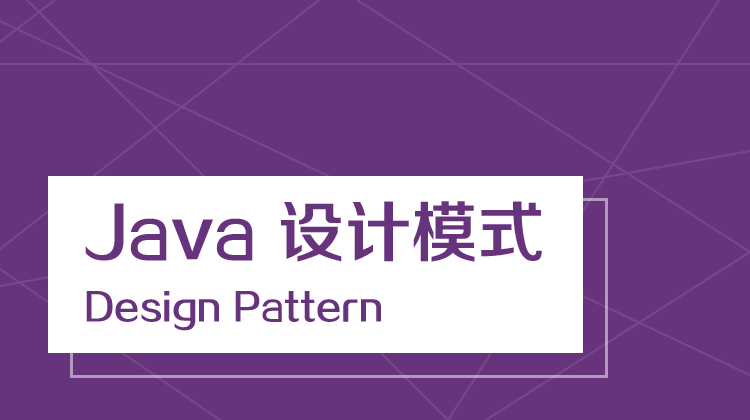

### 圆形设计模式问题:

1. 有请使用UML类图画出原形模式核心角色
2. 原型设计模式的深拷贝和浅拷贝是什么,并写出深拷贝的两种方式的源码(**重写clone方法实现深拷贝,**,使用**序列化来实现深拷贝**)
3. 在Spring框架中哪里使用到原型模式,并对源码进行分析beans.xml

    `<bean id="id01" class="com.atguigu.spring.bean.Monster" scope="prototype"/>`
    然后他就问题,要求这个spring的配置这行代码,对应的源码是哪一段儿

---

他这个就要求,你对于使用过spring过后,对于源码要了解

设计模式的七大原则:要求:
1) **七大设计原则核心思想**
2)能够以类图的说明设计原则
3)在项目实际开发中,你在哪里使用到了ocp原则

### 设计模式常用的七大原则有:

1. 单一职责原则
2. 接口隔离原则
3. 依赖倒转原则
4. 里氏替换原则
5. 开闭原则ocp
6. 迪米特法则
7. **合成复用原则**

---

比如我们在工厂模式中就使用了 

### 题目

**金融借贷平台项目**: 借贷平台的订单,有审核-发布-抢单 等等 步骤,随着操作的不同,会改变订单的状态,项目中的这个模块实现就会使用到这个状态,请你使用状态模式记性设计,并完成实际代码

**问题分析**:
这类代码难以应对变化,在添加一种状态时,我们需要手动添加if/else,在添加一种功能时,要对所有的状态进行判断.因此代码会变得越来越臃肿,并且一旦没有处理某个状态,便会发生极其严重的BUG,难以维护

### 单机射击模式有一共有8种写法,后面哦们会一起讲到

