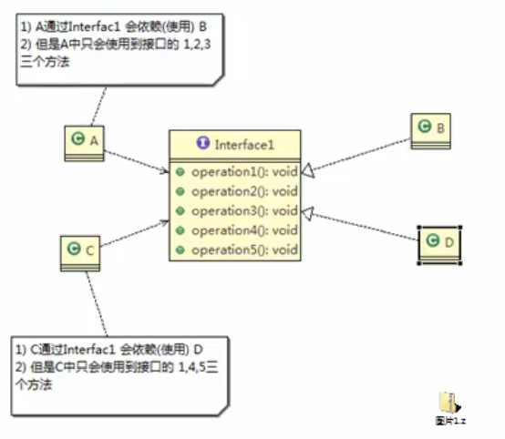

# 接口隔离原则

### 基本介绍
1. 客户端不应该依赖它不需要的接口,即一个类对另一个类的依赖应该建立在最小的接口上

2. 先看一张图:

3. 类A通过接口Interface1依赖B,类C通过接口Interface1依赖D,如果接口interface1对于类A和类C来说不是最小接口,那么类B和类D比如去实现他们不需要的方法.

4. 按隔离原则应当这样处理:
将接口Interface1拆分为独立的几个接口,类A和类C分别与他们需要的接口建立依赖关系.也就是采用接口隔离原则

