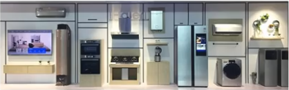
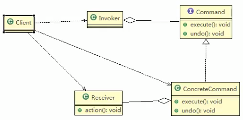

## 智能生活项目需求

看一个具体的需求

 
 
 1. 我们买了一套智能家电,有照明灯,风扇,冰箱,洗衣机,我们只要在手机上安装app就可以控制对这些家电的工作
 2. 这些智能家电来自不同的厂家,我们不想针对每一种家电都安装一个App,分别控制,我门希望只要一个app就可以控制全部智能家电.
 3. 要实现一个app控制所有智能家电的需要,则每个智能家电厂家都要提供一个统一的接口给app调用,这时就可以考虑使用命令模式.
 4. 命令模式可将"动作的请求者"从"动作的执行者"对象中解耦出来.
 5. 在我们的例子中,动作的请求者是手机app,动作的执行者是每个厂商的一个家电产品
 
 
 > 这个???外观模式
>
>
 
 
 ## 命令模式基本介绍
 
 1. 命令模式(Command Pattern):在软件设计中,我们经常需要向某些对象发送请求,但是并不知道请求的接受者是谁,也不知道被请求的操作是哪一个,我们只需要在程序运行中指定具体的请求接受者即可,此时,可以使用命令模式来进行设计
 2. 命令模式使得请求发送者与请求接收者消除彼此之间的耦合,让对象之间的调用关系更加灵活,实现解耦
 3. 在命令模式中,会将一个请求封装为一个对象,以便使用不同参数来表示不同请求(即命名),同时命令模式也支持**可撤销**的操作.
 4. 通俗易懂的理解: 将军发布命令,士兵去执行.其中有几个角色:将军(命令发布者),士兵(命令的具体执行者),命令(连接将军和士兵).
    Invoker是调用者(将军),Receiver是被调用者(士兵),MyCommand是命令,实现了Command接口,持有接收对象
    
    
 
 
 
> 有些人发命令,但是它却不知道是谁在默默无闻的执行
>
>唉!
>
>内部类啊,太累了
 
 ### 原理类图
 
 
 
 
 > Invoker 和 Receiver 通过ConcreteCommand解耦了
>

1. `Invoker` 是调用者角色
2. `Command` 是命令角色,需要执行的所有命令都在这里,可以是接口或抽象类
3. `Receiver` : 是接收者角色,知道如何实施和执行一个请求相关的操作
4. `ConcreteCommand`: 将一个接受者与一个动作,调用接收者相应的操作,实现`execute`
 
 
 
 
 
 
 
 
 
 
 
 
 
 
 
 
 
 
 
 
 
 
 
 

 
 
 
 
 
 
 
 
 
 
 
 
 
 
 
 
 
 
 
 
 
 
 
 
 
 
 
 
 
 
 
 
 
  