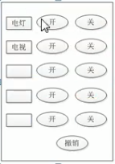
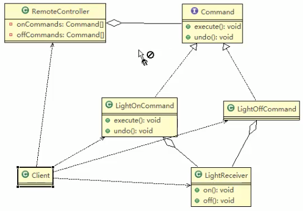
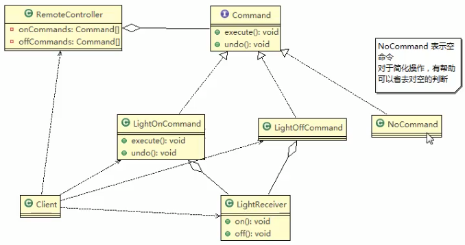

## 命令模式解决智能生活项目

命令模式应用实例

1. 应用实例要求

编写程序,使用命令模式, 完成其那面的智能家电项目

我们有一个类,这个类相当于一个遥控器,每个按钮是分别对于不同的嗯的处理
 
 
 
 
 
 ### 类图
 
 
 
 
 还要加一个空命令,简化我们的操作
 
 
 
 
 
 > 现在只是有电灯,看我写好这个在进行扩展
>
>
 
 
 ### 代码实战
 
 ```java
package com.atguigu.command;


public interface Command {
    // 执行动作(操作_)
    public void execute();

    // 撤销动作(操作
    public void undo();
}
```
 
 
 
 
 
 ```java
package com.atguigu.command;


public class LightReceiver {
    public void on() {
        System.out.println("电灯打开了");
    }

    public void off() {
        System.out.println("电灯关闭了");
    }
}

```
 
 
 
 
 
 
 ```java
package com.atguigu.command;


public class LightOnCommand implements Command {
    //聚合LightReceiver
    LightReceiver light;

    //构造器

    public LightOnCommand(LightReceiver light) {
        super();
        this.light = light;
    }

    @Override
    public void execute() {
        // 你认为它是打开
        // 调用接受者的方法
        light.on();

    }

    @Override
    public void undo() {
        // 调用接受者的方法
        light.off();
    }
}

```
 
 
 
 
 ```java
package com.atguigu.command;


public class LightOffCommand implements Command {
    LightReceiver light;

    public LightOffCommand(LightReceiver light) {
        super();
        this.light = light;
    }

    @Override
    public void execute() {
        // 调用接受者方法
        light.off();
    }

    @Override
    public void undo() {
        // 调用接受者方法
        light.on();
    }
}
```


```java
package com.atguigu.command;

/**
 * 没有任何命令,即;空执行,初始化 每个按钮,
 * 当调用空命令时,对象什么都不做
 * 其实,这是一种设计模式,可以省掉对于空的判断
 */
public class NoCommand {

}
```


```java
package com.atguigu.command;


public class RemoteController {
    // 开按钮的命令数组
    Command[] onCommands;
    Command[] offCommands;

    // 执行撤销命令
    Command undoCommand;

    // 构造器,初始化按钮


    public RemoteController() {
        onCommands = new Command[5];
        offCommands = new Command[5];
        for (int i = 0; i < 5; i++) {
            onCommands[i] = new NoCommand();
            offCommands[i] = new NoCommand();
        }
    }

    // 给我们的按钮设置你需要的命令
    public void setCommand(int no, Command onCommand, Command offCommand) {
        onCommands[no] = onCommand;
        offCommands[no] = offCommand;
    }

    // 安下开按钮
    public void onButtonWasPushed(int no) {
        // 找到你按下的开的按钮,并调用对应的方法
        onCommands[no].execute();
        // 记录你这次的操作,用于撤销
        undoCommand = onCommands[no];
    }
    
    // 安下关按钮
    public void offButtonWasPushed(int no) {
        // 找到你按下的开的按钮,并调用对应的方法
        offCommands[no].execute();
        // 记录你这次的操作,用于撤销
        undoCommand = offCommands[no];
    }
    
    // 按下撤销按钮处理
    public void undoButtonWasPushed() {
        // 执行命令
        undoCommand.undo();
        // 只能够撤销一次
        // tood 要是你想要撤销多次,就 不能用一个变量来存放了,要扩展成数组存历史记录嗯
    }
    
}
```


>这不就是吧函数作为参数传递进去执行么,然后在归拢归拢
>
>看看怎么执行
>
>万能设计模式-加一层
>
>我把一堆要调用的函数,我存放在数组里面,然后你调用哪个我拿出来哪个
>
>就是这么回事儿
>
>选择性的调用某个数组中之前存的方法,然后方便调用撤销
>
>可也实现
>
>用 go 没有这么麻烦就能实现
>
>


#### 客户端

```java
package com.atguigu.command;


public class Client {
    public static void main(String[] args) {
        // 使用命令设计模式        // 完成通过遥控器对电灯的操作

        // 创建电灯的对象,(接受者
        LightReceiver lightReceiver = new LightReceiver();
        // 创建电灯的相关的开关命令
        LightOnCommand lightOnCommand = new LightOnCommand(lightReceiver);
        // 创建电灯的开关命令
        LightOffCommand lightOffCommand = new LightOffCommand(lightReceiver);
        // 需要一个遥控器
        RemoteController remoteController = new RemoteController();
        //给我们的遥控器设置相关的命令, 比如no= 0 的是电灯的开和关的操作
        remoteController.setCommand(0, lightOnCommand, lightOffCommand);

        System.out.println("-----按下灯的开的按钮------");
        remoteController.onButtonWasPushed(0);
        System.out.println("-----按下灯的关的按钮------");
        remoteController.offButtonWasPushed(0);
        System.out.println("-----撤销-----------------");
        remoteController.undoButtonWasPushed();
        /**
         * -----按下灯的开的按钮------
         * 电灯打开了
         * -----按下灯的关的按钮------
         * 电灯关闭了
         * -----撤销-----------------
         * 电灯打开了
         *
         * Process finished with exit code 0
         */
    }
}
```

### 扩展


