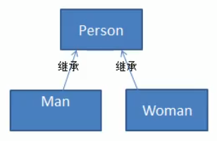

## 测评系统需求

完成测评系统需求

1. 将观众分为男人和女人,对歌手进行评测,当看完某个歌手表演后,得到他们对改歌手不同的评价(评价 有不同的种类,比如 成功 失败 等)

2. 传统方案

 
 ### 传统方式的问题分析
 
 1. 如果系统比较小,还是ok,但是考虑系统增加越来越多的新的功能时,对代码的改动较大,违反了OCP原则,不利于维护
 
 2. 扩展性不好,比如增加了新的人员类型,或者管理方法,都不好做
 
 3. 引出我们会使用的新的一种设计模式 - 访问者模式
 
 
 
 
 
 
 
 
 
 
 
 
 
 
 
 
 
 
 
 
 
 
 

 
 
 
 
 
 
 
 
 
 
 
 
 
 
 
 
 
 
 
 
 
 
 
 
 
 
 
 
 
 
 
 
 
 
  