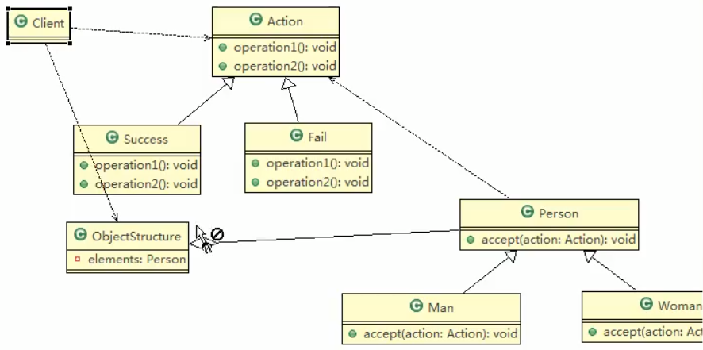
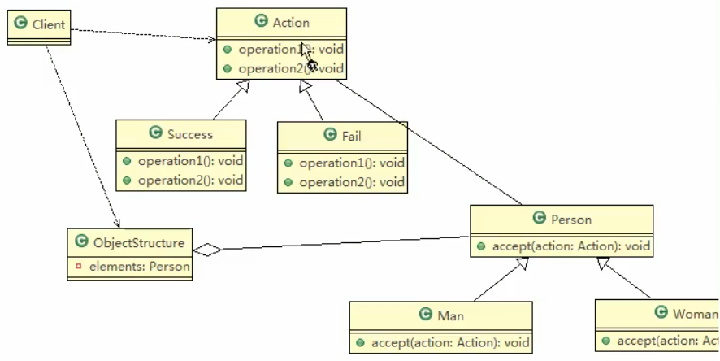

# 访问者模式


 ## 类图
 
 
 
 
 画 的不对, 重新画一下
 
  

## 代码

### Person类

```java
package com.atguigu.visitor;

/**
 * @author victor
 * @site https://victorfengming.gitee.io/
 * @project design_pattern
 * @package com.atguigu.visitor
 * @created 2021-02-08 19:01
 */
public abstract class Person {
    // 提供一个方法,让访问者可以访问
    public abstract void accept(Action action);

}

```

### 成功类


```java
package com.atguigu.visitor;

/**
 * @author victor
 * @site https://victorfengming.gitee.io/
 * @project design_pattern
 * @package com.atguigu.visitor
 * @created 2021-02-08 19:02
 */
public class Success extends Action {
    @Override
    public void getManResult(Man man) {
        System.out.println("男的给的评价是该歌手 很成功 !");
    }

    @Override
    public void getWomanResult(Woman woman) {
        System.out.println("女人给他评价很成功!");
    }
}

```
 ### 失败类

 
 ```java
package com.atguigu.visitor;

/**
 * @author victor
 * @site https://victorfengming.gitee.io/
 * @project design_pattern
 * @package com.atguigu.visitor
 * @created 2021-02-08 19:03
 */
public class Fail extends Action{
    @Override
    public void getManResult(Man man) {
        System.out.println("男人给的评价是失败");
    }

    @Override
    public void getWomanResult(Woman woman) {
        System.out.println("女的给他的评价也是失败的 ");
    }
}
```
 
 
 ### 男人类

 
 
 ```java
package com.atguigu.visitor;

/**
 * @author victor
 * @site https://victorfengming.gitee.io/
 * @project design_pattern
 * @package com.atguigu.visitor
 * @created 2021-02-08 19:01
 */
public class Man extends Person {
    @Override
    public void accept(Action action) {
        action.getManResult(this);
    }
}

```
 
 
  ### 女人类

 
 
 
 
 ```java
package com.atguigu.visitor;

/**
 * @author victor
 * @site https://victorfengming.gitee.io/
 * @project design_pattern
 * @package com.atguigu.visitor
 * @created 2021-02-08 19:01
 * 说明
 * 1. 这里我们使用到了双分派,
 *      即首先在客户端程序中,将具体的状态作为参数传递到了Woman中
 * 2. 然后Woman 类 调用了作为参数的"具体方法"中的方法 getWomanResult,
 *      同时将自己(this)作为参数传入,完成第二次分派
 *
 *      这种分派的方式能够做到一个解耦,处理能够方便一点儿
 */

public class Woman extends Person{
    @Override
    public void accept(Action action) {
        action.getWomanResult(this);
    }
}

```
 
 
 > * 说明
 > 1. 这里我们使用到了双分派,
 >      即首先在客户端程序中,将具体的状态作为参数传递到了Woman中
>
 > 2. 然后Woman 类 调用了作为参数的"具体方法"中的方法 getWomanResult,
 >      同时将自己(this)作为参数传入,完成第二次分派
 >
 
  ### 动作类

 
 
 ```java
package com.atguigu.visitor;

/**
 * @author victor
 * @site https://victorfengming.gitee.io/
 * @project design_pattern
 * @package com.atguigu.visitor
 * @created 2021-02-08 18:58
 */
public abstract class Action {
    // 得到男性的一个测评结果
    public abstract void getManResult(Man man);
    // Action依赖man ,man也要用action

    // 得到女的评测
    public abstract void getWomanResult(Woman woman);
}

```
 
 
  ### 数据结构类

 
 
 
 
 ```java
package com.atguigu.visitor;

import java.util.LinkedList;
import java.util.List;

/**
 * @author victor
 * @site https://victorfengming.gitee.io/
 * @project design_pattern
 * @package com.atguigu.visitor
 * @created 2021-02-08 19:16
 */

/**
 * 数据结构,管理很多人,有man,有woman
 */
public class ObjectStructure {
    // 维护了一个集合
    private List<Person> persons = new LinkedList<>();

    // 增加到list
    public void attach(Person p) {
        persons.add(p);
    }

    // 移除
    public void detach(Person p) {
        persons.remove(p);
    }

    // 显示测评的情况
    public void display(Action action) {
        for (Person person : persons) {
            person.accept(action);
        }
    }
}

```


### 客户端

 #### 简易
 
 ```java
package com.atguigu.visitor;


public class Client {
    public static void main(String[] args) {
        System.out.println("-----------");
        // 创建ObjectStructure
        ObjectStructure objectStructure = new ObjectStructure();
        // 1男1女
        objectStructure.attach(new Man());
        objectStructure.attach(new Woman());

        // 成功
        Success success = new Success();
        objectStructure.display(success);
        /**
         * -----------
         * 男的给的评价是该歌手 很成功 !
         * 女人给他评价很成功!
         *
         * Process finished with exit code 0
         */
    }
}

```
 
 #### 扩展
 
 
 ```java
package com.atguigu.visitor;


public class Client {
    public static void main(String[] args) {
        System.out.println("-----------");
        // 创建ObjectStructure
        ObjectStructure objectStructure = new ObjectStructure();
        // 1男1女
        objectStructure.attach(new Man());
        objectStructure.attach(new Woman());

        // 成功
        Success success = new Success();
        objectStructure.display(success);
        System.out.println("--------->");
        Fail fail = new Fail();
        objectStructure.display(fail);
        /**
         * -----------
         * 男的给的评价是该歌手 很成功 !
         * 女人给他评价很成功!
         * --------->
         * 男人给的评价是失败
         * 女的给他的评价也是失败的
         *
         * Process finished with exit code 0
         */

    }
}

```
 
 
# 一句话
 
多次一举 理解不了liao 
 
 
 