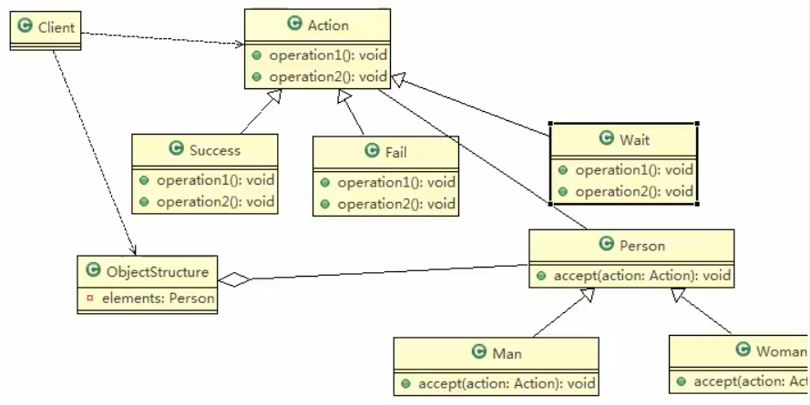

## 访问者模式应用实例
 
 ### 应用案例的小结
 
 - 上面提到了双分派,所谓双分派是值不管类怎么变化,我们都能够找到期望的方法运行双分派意味着得到执行的操作取决于请求的种类和两个接受者类型
 
 - 以上数实例为例,假设我么要添加一个`Wait`的状态类,考察Man类和Woman类的反应,由于使用了双分派,**只需要增加一个Action子类即可在客户端调用即可,不需要改动任何其他类的代码**
 
 
 
### 看类图怎么加的
 
 
 
 

 


 ### 我这个代码怎么动
 #### 在代码中加这么一个类(扩展)
 ```java
package com.atguigu.visitor;

/**
 * @author victor
 * @site https://victorfengming.gitee.io/
 * @project design_pattern
 * @package com.atguigu.visitor
 * @created 2021-02-08 19:35
 */
public class Wait extends Action {

    @Override
    public void getManResult(Man man) {
        System.out.println("男人给的评价是待定about这个歌手");
    }

    @Override
    public void getWomanResult(Woman woman) {
        System.out.println("女人给的歌手评价是待定");
    }
}

```

#### 在Client端


 ```java
package com.atguigu.visitor;


/**
 * @author victor
 * @site https://victorfengming.github.io/
 * @project design_pattern
 * @package com.atguigu.visitor
 * @created 2021-02-08 18:52
 * @function ""
 */
public class Client {
    public static void main(String[] args) {
        System.out.println("-----给成功------");
        // 创建ObjectStructure
        ObjectStructure objectStructure = new ObjectStructure();
        // 1男1女
        objectStructure.attach(new Man());
        objectStructure.attach(new Woman());

        // 成功
        Success success = new Success();
        objectStructure.display(success);
        System.out.println("####给失败####>");
        Fail fail = new Fail();
        objectStructure.display(fail);
        System.out.println(">>>>>给待定>>>>>");
        Wait wait = new Wait();
        objectStructure.display(wait);
        /**
         * -----给成功------
         * 男的给的评价是该歌手 很成功 !
         * 女人给他评价很成功!
         * ####给失败####>
         * 男人给的评价是失败
         * 女的给他的评价也是失败的
         * >>>>>给待定>>>>>
         * 男人给的评价是待定about这个歌手
         * 女人给的歌手评价是待定
         *
         * Process finished with exit code 0
         */

    }
}

```
 
 
 
 
 
 >当然你也可以扩展出这个 man和woman 的名字
>
>本案例中由于懒就不加了
>
>
 
 
 
 
 
 
 
 
 
 
 
 
 
 
 
 
 
 
 
 
 

 
 
 
 
 
 
 
 
 
 
 
 
 
 
 
 
 
 
 
 
 
 
 
 
 
 
 
 
 
 
 
 
  