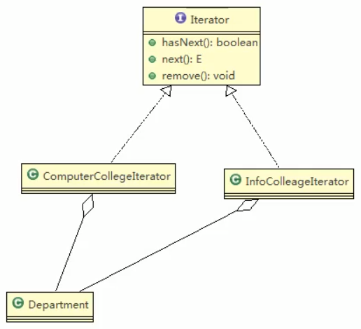
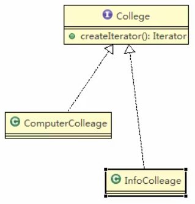
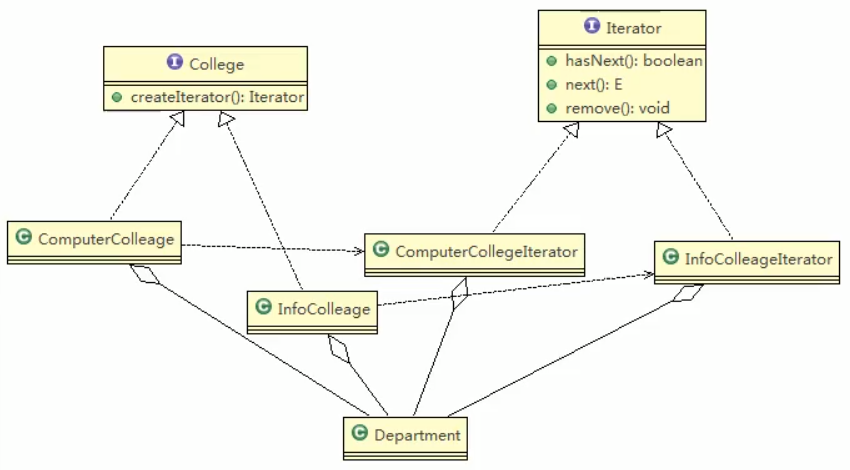
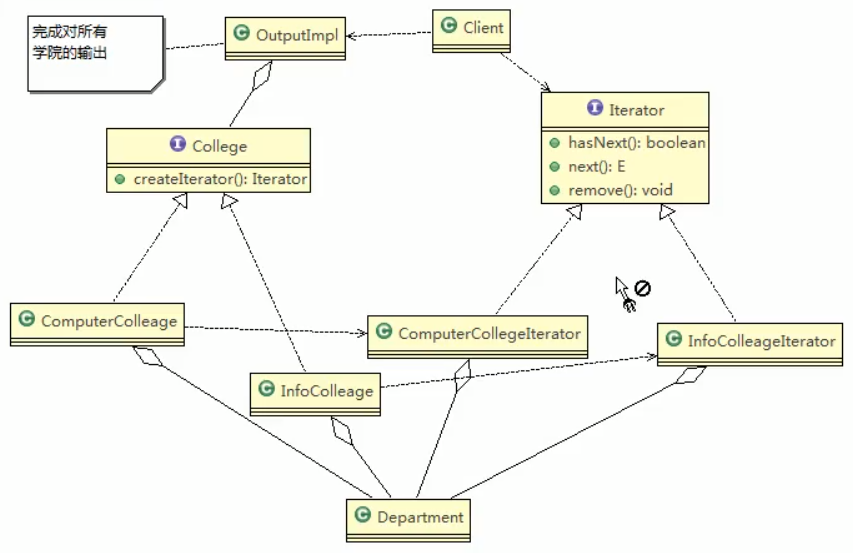
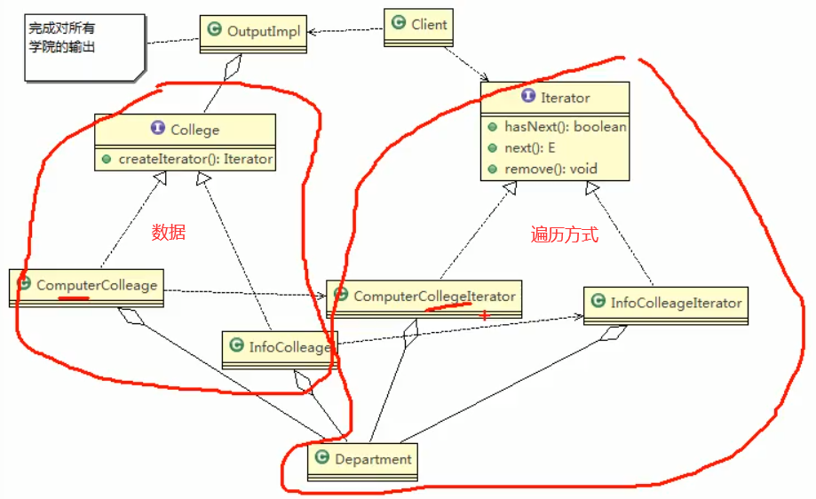
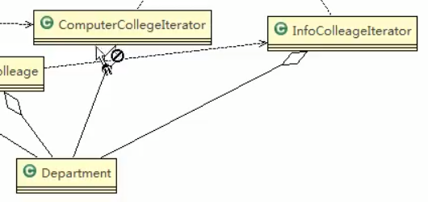

# 迭代器模式实战

## 类图
### 部分


---


 
 ### 关联
 
 

---

 
 


 ## 代码
 
 
 ### department
 ```java
package com.atguigu.iterator;

/**
 * @author victor
 * @site https://victorfengming.gitee.io/
 * @project design_pattern
 * @package com.atguigu.iterator
 * @created 2021-02-08 20:51
 */

// 系
public class Department {
    private String name;
    private String desc;

    public Department(String name, String desc) {
        this.name = name;
        this.desc = desc;
    }

    public String getName() {
        return name;
    }

    public void setName(String name) {
        this.name = name;
    }

    public String getDesc() {
        return desc;
    }

    public void setDesc(String desc) {
        this.desc = desc;
    }
}

```
 
 
 
 
 
 
 
 ### 计算机学院(生成)
 
  
 ```java
package com.atguigu.iterator;

import java.util.Iterator;

/**
 * @author victor
 * @site https://victorfengming.gitee.io/
 * @project design_pattern
 * @package com.atguigu.iterator
 * @created 2021-02-08 20:53
 */
public class ComputerCollegeIterator implements Iterator {

    // 这里我们需要知道 Department 是 以 怎样的方式 存放的

    // 我们假定这个computerCollege 计算机学院 他的存放方式是以数组的形式存放的
    
    Department[] departments;
    int position = 0;   // 遍历的位置

    // 吧department内容传进来,
    // 我要知道你是怎么存放的,你不告诉我我无法迭代
    public ComputerCollegeIterator(Department[] departments) {
        this.departments = departments;
    }

    // 判断是否还有下一个元素
    @Override
    public boolean hasNext() {
        // 判断是数组
        if (position >= departments.length || departments[position] == null) {
            // 没有下一个了
            return false;
        } else {
            // 还是有下一个
            return true;
        }
    }

    @Override
    public Object next() {
        Department department = departments[position];
        // 后移一位
        position += 1;
        return department;
    }

    // 删除的方法空实现
    @Override
    public void remove() {
        //
    }
}

```
 
 
 
 
 
 
 
 ### 信息工程学院(生成)
 
  
 ```java
package com.atguigu.iterator;

import java.util.Iterator;
import java.util.List;

/**
 * @author victor
 * @site https://victorfengming.gitee.io/
 * @project design_pattern
 * @package com.atguigu.iterator
 * @created 2021-02-08 20:59
 * 等你学了数据结构你就会对这个next()十分的敏感
 */
public class InfoCollegeIterator implements Iterator {
    // 信息工程学院是以List方式存放的系的
    List<Department> departmentList;
    int index = -1;

    public InfoCollegeIterator(List<Department> departmentList) {
        this.departmentList = departmentList;
    }

    // 判断这个list中还有没有下一个元素
    @Override
    public boolean hasNext() {
        // 对集合遍历
        if (index >= departmentList.size() - 1) {
            // 说明没有下一个了
            return false;
        } else {
            // 往后移动
            index += 1;
            return true;
        }
    }

    @Override
    public Object next() {
        // 直接返回 这个
        return departmentList.get(index);
    }


    // 空实现remove方法
    @Override
    public void remove() {

    }
}

```
 
 
 
 到现在为止我们写完了这些
 
 
 
 后面的就好写了
 
 
 
 ### College
 
  
 ```java
package com.atguigu.iterator;

import java.util.Iterator;

/**
 * @author victor
 * @site https://victorfengming.gitee.io/
 * @project design_pattern
 * @package com.atguigu.iterator
 * @created 2021-02-08 21:04
 */
// 他核心的方法是返回一个 interator
public interface College {

    // 获取名字
    public String getName();

    // 增加系的方法
    public void addDepartment(String name, String desc);

    // 返回一个迭代器.遍历
    public Iterator createIterator();
}

```
 
 
 下面我们用2个具体的子类来实现College

 
 ### 计算机学院
 
 
  
 ```java
package com.atguigu.iterator;

import java.util.Iterator;

/**
 * @author victor
 * @site https://victorfengming.gitee.io/
 * @project design_pattern
 * @package com.atguigu.iterator
 * @created 2021-02-08 21:11
 */
public class ComputerCollege implements College {

    Department[] departments;
    // 保存当前数组的对象的个数
    int numOfDepartment = 0;

    // 通过构造器


    public ComputerCollege() {
        departments = new Department[5];
        // 初始化数据
        addDepartment("java分布式专业","面向对象");
        addDepartment("php小程序专业","最好的语言");
        addDepartment("python大数据专业","数学要好");
    }

    @Override
    public String getName() {
        return "计算机学院";
    }

    @Override
    public void addDepartment(String name, String desc) {
        // 创建数组
        Department department = new Department(name, desc);
        // 真正的数据是在这里加进去的
        departments[numOfDepartment] = department;
        // 计数器更新,数量+1
        numOfDepartment += 1;

    }

    @Override
    public Iterator createIterator() {
        // 要将自己的department传进去
        return new ComputerCollegeIterator(departments);
    }
}

```
 
 
 
 
 
 
 
 ### 信息学院
 
 
 
 
 
 
  
 ```java
package com.atguigu.iterator;

import java.util.ArrayList;
import java.util.Iterator;
import java.util.List;

/**
 * @author victor
 * @site https://victorfengming.gitee.io/
 * @project design_pattern
 * @package com.atguigu.iterator
 * @created 2021-02-08 21:28
 */
public class InfoCollege implements College {
    // 不同的地方是哪里呢?
    //这个地方是list了
    List<Department> departmentList;

    //构造器
    public InfoCollege() {
        departmentList = new ArrayList<Department>();
        addDepartment("信息安全专业","IT中的一门");
        addDepartment("网络安全专业","网中的一门");
        addDepartment("服务器安全专业","机器要安全");
    }

    @Override
    public String getName() {
        return "信息工程学院";
    }

    @Override
    public void addDepartment(String name, String desc) {
        Department department = new Department(name, desc);
        // 添加到list中去
        departmentList.add(department);
    }

    @Override
    public Iterator createIterator() {
        // 这个地方直接返回我们这个list就行了
        return new InfoCollegeIterator(departmentList);
    }
}

```
 
 
 
 
 
 
 
 
 
 ### 输出类
 
 
 
 
 
  
 ```java

```
 
 
 
 
 
 
 
 
 
 
 
 
 
 
 
 
 
 
 
 
 
 
 
 
 
 
 
 
 


 
 
 
 
 
 
 
 
 
 
 
 
 
 
 
 
 
 
 
 
 
 
 
 
 
 
 
 
 
 
 
 
 
 
 
  