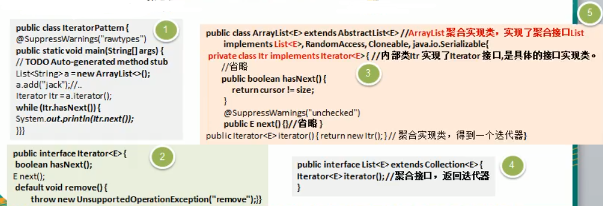
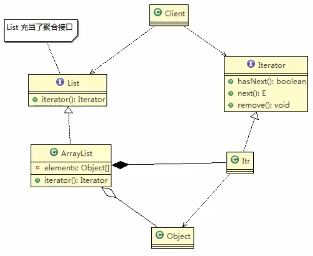
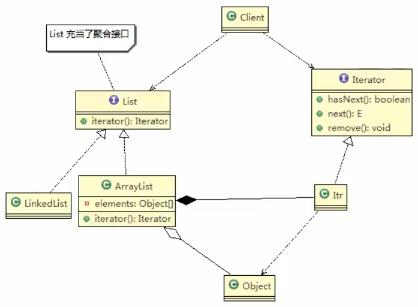
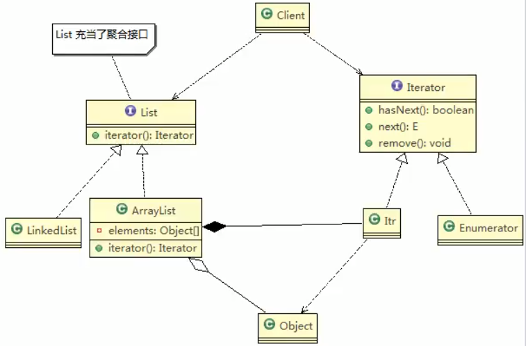
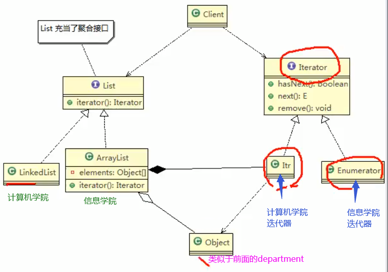

# 迭代器模式在JDK-ArrayList集合应用的源码分析

JDK中的ArrayL集合中就使用了迭代器模式

## 类图


 
 
 ## 代码
 
 ### 案例
 
 ```java
package com.atguigu.jdk;

import java.util.ArrayList;
import java.util.Iterator;
import java.util.List;

/**
 * @author victor
 * @site https://victorfengming.gitee.io/
 * @project design_pattern
 * @package com.atguigu.jdk
 * @created 2021-02-08 22:10
 */
public class IteratorDemo {
    public static void main(String[] args) {
        List<String> a = new ArrayList<>();
        a.add("jack");
        // 获取到迭代器
        Iterator Itr = a.iterator();
        while (Itr.hasNext()) {
            System.out.println(Itr.next());
        }

        /**
         * jack
         *
         * Process finished with exit code 0
         */
    }
}

```
 
 
 
 ### 我们追一下源码
 ```java
public class ArrayList<E> extends AbstractList<E>
        implements List<E>, RandomAccess, Cloneable, java.io.Serializable
{
    private static final long serialVersionUID = 8683452581122892189L;
```
 
 >他这个他实现了一个`List<E>` ,这个list充当了聚合接口的作用,我么这个ArrayList显然是他的具体的子类

 
 > 我们继续追进去
 
 ```java
public interface List<E> extends Collection<E> {
    // Query Operations
    /**
     * Returns an iterator over the elements in this list in proper sequence.
     *
     * @return an iterator over the elements in this list in proper sequence
     */
    Iterator<E> iterator();

```
 
> 在list接口里面,他有一个Iterator方法,在这个接口里面他是一个抽象方法
 
 >他有一个返回,或者说是得到迭代器对象的方法
 ---
 
 >在ArrayList中,有具体的实现
 
 
 ```java
    /**
     * Returns an iterator over the elements in this list in proper sequence.
     *
     * <p>The returned iterator is <a href="#fail-fast"><i>fail-fast</i></a>.
     *
     * @return an iterator over the elements in this list in proper sequence
     */
    public Iterator<E> iterator() {
        return new Itr();
    }

```

>这个ITr就是ArrayList里面的一个内部类

```java
    /**
     * An optimized version of AbstractList.Itr
     */
    private class Itr implements Iterator<E> {
        int cursor;       // index of next element to return
        int lastRet = -1; // index of last element returned; -1 if no such
        int expectedModCount = modCount;

        Itr() {}

        public boolean hasNext() {
            return cursor != size;
        }
```


 ### 类图1
 
 
 
 
 >他这个和标准的迭代器模式不一样
>
>因为 ITr已经是ArrayList的内部类了,
>
>所以他能够直接使用Object
>

  ### 类图2
 
 
 
 LinkList是链表,也能够迭代
 
  ### 类图3
 
  

 ## 角色分析说明
 
 - 内部类Itr充当具体实现迭代器Iterator的类,作为ArrayList 内部类
 - List就是充当了聚合接口,含有一个iterator()方法,返回一个迭代器对象
 - ArrayList是实现聚合接口List子类,实现了iterator()
 - Iterator接口系统提供
 - 迭代器模式解决了不同集合(ArrayList,LinkedList) 统一遍历问题
 
 
 
 
 
 
 
  