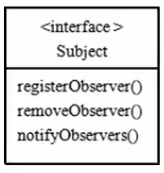
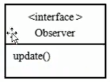

# 观察者模式(Observer)原理

>观察者模式类似订牛奶业务

1. 奶站/气象局: Subject
2. 用户/第三方网站:Observe

 
 
 
>Subject:等级注册,移除和通知

1. registerObserver注册
2. removeObsever移除
3. notifyObservers()通知所有的注册用户,根据不同的需求,可以是更新数据,让用户来取,也可能是实施推送,看具体需求定

>Observer:接收输入
>

> 观察者模式: 对象之间**多对一依赖**的一种设计方案,被依赖的对象为Subject,
>
>依赖的对象为Observer,Subject通知Observer变化,
>
>比如这里的奶站是Subject,是一的一方.
>
>用户使Observer,是多的一方.
>
>

 
 
 
 
 
 
 
 
 
 
 
 

 
  
