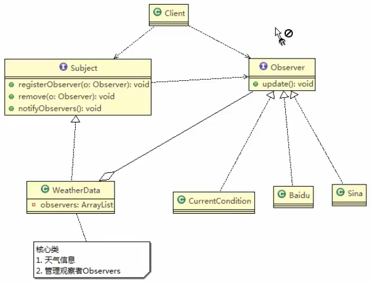

# 代码实践
## 原理类图



## code 

> 老师个大傻X,他tm起名和系统内置的Observer一样的接口,最后tm类导入乱了,傻B
>
>
>改进方案 Observer => Observer2
>
### Subject


```java
package com.atguigu.observer.improve;


// 让这个WeathreData来实现
public interface Subject {
    public void registerObserver(Observer2 o);
    public void removeObserver(Observer2 o);
    public void notifyObservers();
}
```


### Observer


```java
package com.atguigu.observer.improve;

/**
 * ClassName: 观察者接口,由观察者来实现
 *
 * @project java_mode
 * @package com.atguigu.observer.improve
 */
public interface Observer2 {
    public void update(float temperature, float pressure, float humidity);
}

```


### CurrentConditions

这个和前面的一样就行了


```java
package com.atguigu.observer.improve;

import java.util.Observable;
import java.util.Observer;

/**
 * ClassName:  <br/>
 * Description:  <br/>
 * Date: 2021-02-09 10:09 <br/>
 * <br/>
 *
 * @author victor
 * @project java_mode
 * @package com.atguigu.observer.improve
 */
public class CurrentConditions implements Observer2 {
    // 温度
    private float temperature;
    // 气压
    private float pressure;
    // 湿度
    private float humidity;

    // 更新天气情况 ,别人来调用,是由于WeatherData来调用,我使用退送模式
    public void update(float temperature, float pressure, float humidity) {
        this.temperature = temperature;
        this.pressure = pressure;
        this.humidity = humidity;
        display();
    }

    // 显示
    public void display() {
        System.out.println("---Now mTemperature"+temperature+"---");
        System.out.println("---Now mPressure"+pressure+"---");
        System.out.println("---Now mhumidity"+humidity+"---");
    }

}
```


### WeatherData


```java
package com.atguigu.observer.improve;


import java.util.ArrayList;

/**
 * 类是核心
 * 1. 包含最新的天气情况信息
 * 2. 含有观察者集合,使用ArrayList管理
 * 3. 当数据有更新时,就主动的调用ArrayList
 * 通知所有的(接入方)就看到最新的信息
 *
 * @project java_mode
 * @package com.atguigu.observer
 */
public class WeatherData implements Subject {
    private float temperature;      // 温度
    private float pressure;         // 气压
    private float humidity;         // 湿度
    // 观察者集合
    private ArrayList<Observer2> observers;

    private CurrentConditions currentConditions;


    public WeatherData() {
        observers = new ArrayList<Observer2>();
    }

    public void dataChange() {
        notifyObservers();
    }

    // 当数据由于更新的时候,就调用setData
    public void setData(float temperature, float pressure, float humidity) {
        this.temperature = temperature;
        this.pressure = pressure;
        this.humidity = humidity;
        // 调用dataChange,将最新的信息推送给接入方 currentConditions
        dataChange();
    }


    // 注册一个观察者
    @Override
    public void registerObserver(Observer2 o) {
        observers.add(o);
    }

    // 移除一个观察者
    @Override
    public void removeObserver(Observer2 o) {
        if (observers.contains(o)) {
            observers.remove(o);
        }
    }

    //遍历所有的观察者,并通知

    @Override
    public void notifyObservers() {
        for (int i = 0; i < observers.size(); i++) {
            observers.get(i).update(this.temperature, this.pressure, this.humidity);
        }
    }

    public float getTemperature() {
        return temperature;
    }

    public void setTemperature(float temperature) {
        this.temperature = temperature;
    }

    public float getPressure() {
        return pressure;
    }

    public void setPressure(float pressure) {
        this.pressure = pressure;
    }

    public float getHumidity() {
        return humidity;
    }

    public void setHumidity(float humidity) {
        this.humidity = humidity;
    }

    public ArrayList<Observer2> getObservers() {
        return observers;
    }

    public void setObservers(ArrayList<Observer2> observers) {
        this.observers = observers;
    }

    public CurrentConditions getCurrentConditions() {
        return currentConditions;
    }

    public void setCurrentConditions(CurrentConditions currentConditions) {
        this.currentConditions = currentConditions;
    }
}

```


 
 
 ### 客户端
 
 ```java
package com.atguigu.observer.improve;

/**
 * ClassName:  <br/>
 * Description:  <br/>
 * Date: 2021-02-09 10:33 <br/>
 * @author yufengming
 * @project java_mode
 * @package com.atguigu.observer.improve
 */
public class Client {
    public static void main(String[] args) {
        // 创建一个WeatherData
        WeatherData weatherData = new WeatherData();

        // 创建观察者
        CurrentConditions currentConditions = new CurrentConditions();
        // 注册到weatherData
        weatherData.registerObserver(currentConditions);

        //测试
        System.out.println("通知各个观察者,看看信息");
        weatherData.setData(10f,101f,20.3f);
        /**
         * 通知各个观察者,看看信息
         * ---Now mTemperature10.0---
         * ---Now mPressure101.0---
         * ---Now mhumidity20.3---
         *
         * Process finished with exit code 0
         */
    }
}
```
 
 
 
 >这样写的扩展性质就会十分好
>
>比如:我现在要加一个百度(新的观察者)
>
>

### 百度

```java
package com.atguigu.observer.improve;

/**
 * ClassName:  <br/>
 * Description:  <br/>
 * Date: 2021-02-09 10:36 <br/>
 * @author yufengming
 * @project java_mode
 * @package com.atguigu.observer.improve
 */
public class BaiduSite implements Observer2{
    // 温度
    private float temperature;
    // 气压
    private float pressure;
    // 湿度
    private float humidity;

    // 更新天气情况 ,别人来调用,是由于WeatherData来调用,我使用退送模式
    public void update(float temperature, float pressure, float humidity) {
        this.temperature = temperature;
        this.pressure = pressure;
        this.humidity = humidity;
        display();
    }

    // 显示
    public void display() {
        System.out.println("----baidu.com----");
        System.out.println("---百度: mTemperature"+temperature+"---");
        System.out.println("---百度: mPressure"+pressure+"---");
        System.out.println("---百度: mhumidity"+humidity+"---");
    }

}

```

### 客户端

 
 ```java
package com.atguigu.observer.improve;

/**
 * ClassName:  <br/>
 * Description:  <br/>
 * Date: 2021-02-09 10:33 <br/>
 * @author yufengming
 * @project java_mode
 * @package com.atguigu.observer.improve
 */
public class Client {
    public static void main(String[] args) {
        // 创建一个WeatherData
        WeatherData weatherData = new WeatherData();

        // 创建观察者
        CurrentConditions currentConditions = new CurrentConditions();
        BaiduSite baiduSite = new BaiduSite();
        // 注册到weatherData
        weatherData.registerObserver(currentConditions);
        weatherData.registerObserver(baiduSite);
        //测试
        System.out.println("通知各个观察者,看看信息");
        weatherData.setData(10f,101f,20.3f);
        /**
         * 通知各个观察者,看看信息
         * ---Now mTemperature10.0---
         * ---Now mPressure101.0---
         * ---Now mhumidity20.3---
         * ----baidu.com----
         * ---百度: mTemperature10.0---
         * ---百度: mPressure101.0---
         * ---百度: mhumidity20.3---
         *
         * Process finished with exit code 0
         */
    }
}

```
 
 > 这么写就很灵活,还可以去掉Current观察者,随时
>
>
 

 
  
