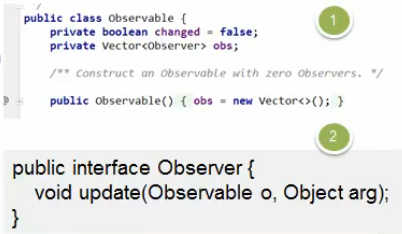

# 观察者模式在JDK的源码分析
JDK的Observable中使用了观察者模式i

## 类图

## 代码演示

```java
public class Observable {
    private boolean changed = false;
    private Vector<Observer> obs;

    /** Construct an Observable with zero Observers. */
```

>Observable里面实现了相关方法
>
>


```java
 /**
     * Adds an observer to the set of observers for this object, provided
     * that it is not the same as some observer already in the set.
     * The order in which notifications will be delivered to multiple
     * observers is not specified. See the class comment.
     *
     * @param   o   an observer to be added.
     * @throws NullPointerException   if the parameter o is null.
     */
    public synchronized void addObserver(Observer o) {
        if (o == null)
            throw new NullPointerException();
        if (!obs.contains(o)) {
            obs.addElement(o);
        }
    }

    /**
     * Deletes an observer from the set of observers of this object.
     * Passing <CODE>null</CODE> to this method will have no effect.
     * @param   o   the observer to be deleted.
     */
    public synchronized void deleteObserver(Observer o) {
        obs.removeElement(o);
    }

    /**
     * If this object has changed, as indicated by the
     * <code>hasChanged</code> method, then notify all of its observers
     * and then call the <code>clearChanged</code> method to
     * indicate that this object has no longer changed.
     * <p>
     * Each observer has its <code>update</code> method called with two
     * arguments: this observable object and <code>null</code>. In other
     * words, this method is equivalent to:
     * <blockquote><tt>
     * notifyObservers(null)</tt></blockquote>
     *
     * @see     java.util.Observable#clearChanged()
     * @see     java.util.Observable#hasChanged()
     * @see     java.util.Observer#update(java.util.Observable, java.lang.Object)
     */
    public void notifyObservers() {
        notifyObservers(null);
    }

```


>不同的是,他没有去实现接口,而是把这个类和接口放在了一起
>
>他直接就是一个类,

## 模式角色分析


- Observable的作用和地位等价于我们前面讲过Subject
- Observable是类,不是接口,类中已经实现了核心的方法,即管理Observer的方法,add.. delete.. notify...
- Observer的作用和地位等价于我们其那面讲过的Observer
- Observable和Observer的使用方法和其那面讲过的一样,只是Observable,是一个类,踏实通过继承来实现观察者模式的


 
 
 
 
 
 
 
 
 
 
 
 

 
  
