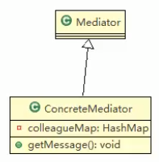
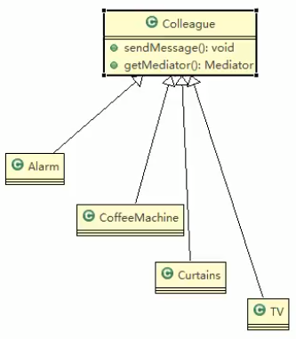
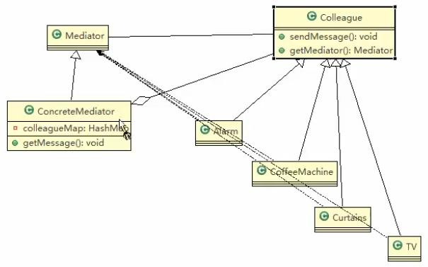
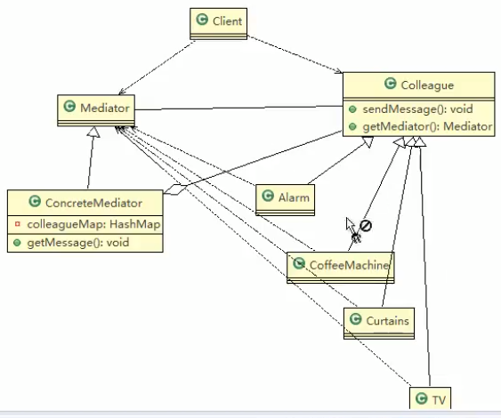
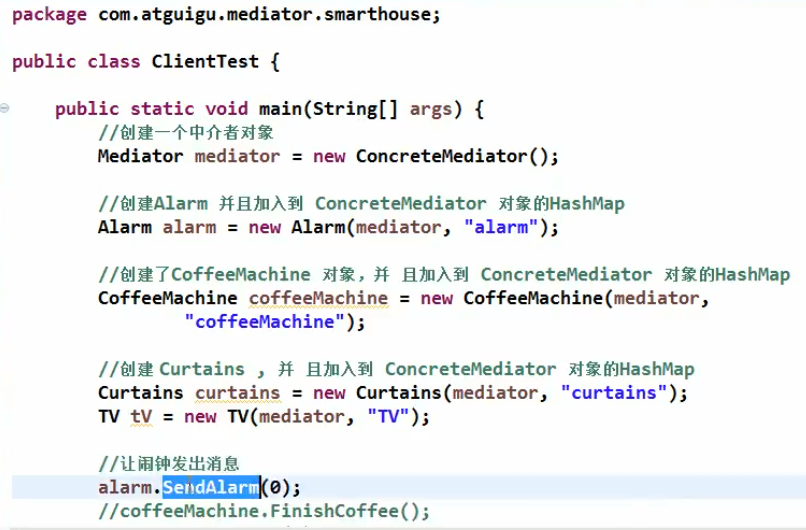
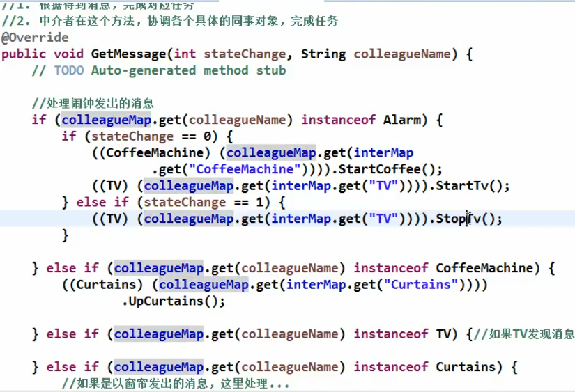

# 终结者模式应用案例

## 类图











## 终结者模式-智能家庭操作流程
1. 创建ConcreteMediator对象
2. 创建各个同事类Alarm,CoffeeMachine,TV...
3. 在创建同事类对象的时候,就直接通过构造器,加入到colleagueMap
4. 同时类对象,可以调用sendMessage,最终会去调用ConcreteMediator的getMessage()方法
5. getMessage()会根据接收到的同事对象发出来的消息来协调调用其他的同事对象,完成任务
6. 可以看到getMessage()是核心方法,完成相应的任务


> 这个案例的代码就太多了
>
>把这个思想理解就行了
>
>咱们就不写了
>
>

## 部分代码

```java
package com.atguigu.mediator;

/**
 * ClassName:  <br/>
 * Description:  <br/>
 * Date: 2021-02-09 13:59 <br/>
 * <br/>
 *
 * @author yufengming
 * @project java_mode
 * @package com.atguigu.mediator
 */
public abstract class Mediator {
    // 将一个终结者对象,加入到集合中
    public abstract void Register(String colleagueName, Colleague colleague);
    // 接收消息,具体的同事对象发出的
    public abstract void GetMessage(int stateChange, String colleague);
    
    public abstract void SendMessage();
}
```


```java
package com.atguigu.mediator;

/**
 * ClassName:  <br/>
 * Description:  <br/>
 * Date: 2021-02-09 13:57 <br/>
 * <br/>
 *
 * @author yufengming
 *
 * @project java_mode
 * @package com.atguigu.mediator
 */
public class Curtains extends Colleague{
    public Curtains(Mediator mediator, String name) {
        super(mediator, name);
        mediator.Register(name, this);
    }

    @Override
    public void SendMessage(int stateChange) {
        this.GetMediator().GetMessage(stateChange, this.name);
    }
    public void UpCurtains() {
        System.out.println("I am holding Up Curtains!");
    }
}

```







 
 
## 一句话

不要让 那些 类之间有关系


 
 

 
  