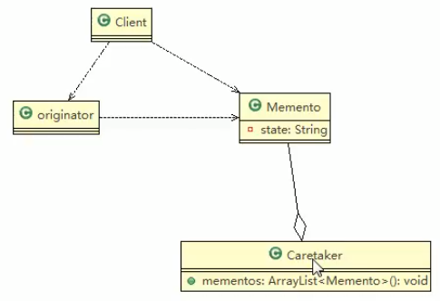

# 备忘录模式

## 基本介绍

1. 备忘录模式(Memento Pattern)在不破坏封装性的前提下,捕获一个对象的内部状态,并在该对象之外保存这个状态.这样以后就可将该对象恢复到原先保存的状态

2. 可以这里理解备忘录模式: 现实生活中的备忘录是用来记录某些要去做的事情,或者是记录已经达成的共同意见的事情,以防忘记了.而在软件层面,备忘录模式有着相同的含义,备忘录对象主要用来记录一个对象的某种状态,或者某些数据,当要丛回退时,可以从备忘录对象里获取原来的数据进行恢复操作
3. 备忘录模式术语行为型模式

### 类图





## 代码

### memento
```java

package com.atguigu.memento.theory;
public class Memento {
    private String state;

    // 构造器
    public Memento() {
    }

    public Memento(String state) {
        this.state = state;
    }

    public String getState() {
        return state;
    }

    public void setState(String state) {
        this.state = state;
    }
}
```


 
 
 
### Originator
```java
package com.atguigu.memento.theory;


public class Originator {
    private String state;// 状态信息

    public String getState() {
        return state;
    }

    public void setState(String state) {
        this.state = state;
    }


    // 编写一个方法,可以保存一个状态对象 Memento
    // 因此编写一个方法,返回Memento
    public Memento saveStateMemento() {
        return new Memento(state);
    }

    // 通过备忘录对象,恢复状态
    public void getStateFromMemento(Memento memento) {
        // 这个状态返回
        // 这接赋值给
        state = memento.getState();
    }
}

```


 
 
 
 
 
 
 
### Caretaker
```java
package com.atguigu.memento.theory;

import java.util.ArrayList;
import java.util.List;

public class Caretaker {
    // 在List集合中有很多备忘录对象
    private List<Memento> mementoList = new ArrayList<Memento>();

    public void add(Memento memento) {
        mementoList.add(memento);
    }

    /// 获取到第index个Originator的备忘录对象(即保存的状态)
    public Memento get(int index) {
        return mementoList.get(index);
    }

}
```


### 客户端

```java
package com.atguigu.memento.theory;

/**
 * ClassName:  <br/>
 * Description:  <br/>
 * Date: 2021-02-09 14:36 <br/>
 * @project java_mode
 * @package com.atguigu.memento
 */
public class Client {
    public static void main(String[] args) {
        System.out.println("----备忘录模式----");
        //
        Originator originator = new Originator();
        Caretaker caretaker = new Caretaker();

        originator.setState("状态#1~攻击力100");
        // 保存了当前的状态
        caretaker.add(originator.saveStateMemento());
        originator.setState("状态#2~攻击力80");
        caretaker.add(originator.saveStateMemento());
        originator.setState("状态#3~攻击力50");

        // 希望恢复到状态1
        System.out.println("当前的状态是="+originator.getState());
        // 得到第一个状态
        originator.getStateFromMemento(caretaker.get(0));
        // 将originator 的状态 恢复到状态1
        System.out.println("恢复到状态1\n当前的状态是="+originator.getState());
        System.out.println("------------------");
        /**
         * ----备忘录模式----
         * 当前的状态是=状态#3~攻击力50
         * 恢复到状态1
         * 当前的状态是=状态#1~攻击力100
         * ------------------
         *
         * Process finished with exit code 0
         */
    }
}

```


>这个String 的状态类型,可以扩展的更加复杂
>
>

 
 
 
 
 
 
 
  
