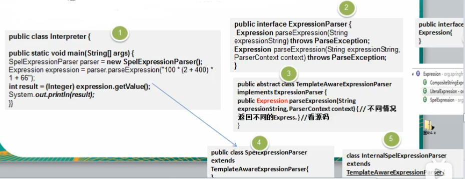
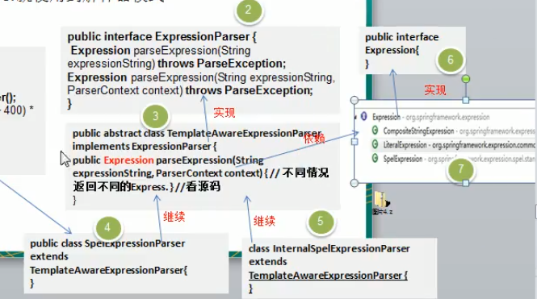
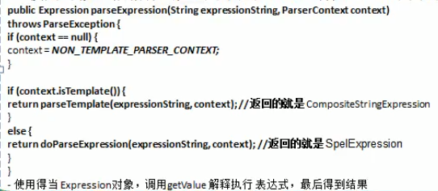

# 上代码

## 类图

## 说明
- Expression接口表达式接口
- 下面有不同的实现类,比如SpelExpression,或者CompositeStringExpression.
- 使用上海,根据你创建的不同的parse对象,返回对应的Expression表达式对象

 
 
 
 
 
 
 
 
 
 
 
 
 
 
 
 
 
 
 
 
 
 
 
 
 
 
 

 
 
 
 
 
  
 
 
 