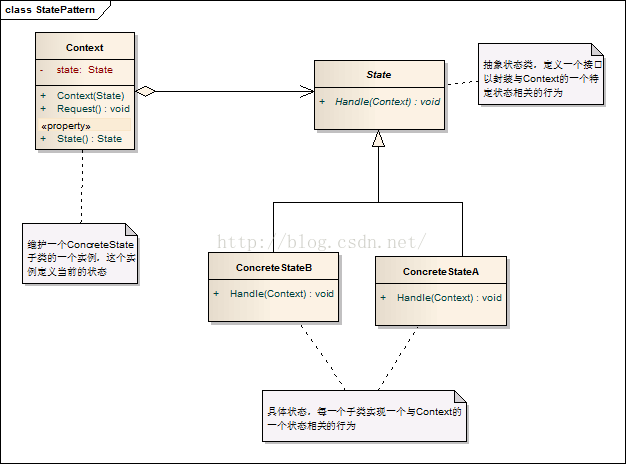
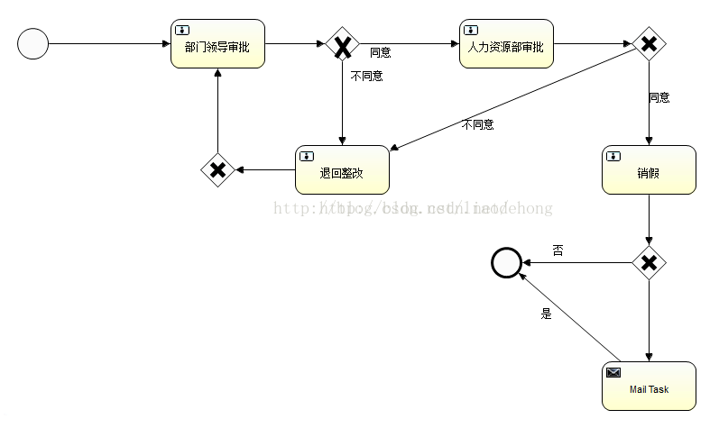

 
 
 # 模式简介

允许一个对象在其内部状态改变时改变它的行为。对象看起来似乎修改了它的类，(State Pattern)是设计模式的一种，属于行为模式。
 
 
 
 
 
 ## 定义
(源于Design Pattern)：当一个对象的内在状态改变时允许改变其行为，这个对象看起来像是改变了其类。
状态模式主要解决的是当控制一个对象状态的条件表达式过于复杂时的情况。把状态的判断逻辑转移到表示不同状态的一系列类中，可以把复杂的判断逻辑简化。
## 模式中的角色


　　1 上下文环境（Context）：它定义了客户程序需要的接口并维护一个具体状态角色的实例，将与状态相关的操作委托给当前的Concrete State对象来处理。

　　2 抽象状态（State）：定义一个接口以封装使用上下文环境的的一个特定状态相关的行为。

　　3 具体状态（Concrete State）：实现抽象状态定义的接口。

## 状态模式的类图



这里来看看状态模式的标准代码；

首先我们先定义一个State抽象状态类，里面定义了一个接口以封装 与Context的一个特定状态相关的行为；

```java
/**
 * 抽象状态类
 * @author gh
 *
 */
public abstract class State {
	
	public abstract void Handle(Context context);
}
```

接着再去声明一个ConcreteState具体状态类，每一个子类实现一个与Context的一个状态的相关的行为。


```java
public class ConcreteStateA extends State{
 
	@Override
	public void Handle(Context context) {
		context.setState(new ConcreteStateB()); //设置A的下一个状态是B
		
	}
 
}
class ConcreteStateB extends State{
 
	@Override
	public void Handle(Context context) {
		context.setState(new ConcreteStateA()); //设置B的下一个状态是A
	}
	
}
```
 
 Context类，维护一个ConcreteState子类的实例，这个实例定义当前的状态
 
 ```java
/**
 * 定义当前的状态
 * @author gh
 * 
 */
public class Context {
	State state;
 
	public Context(State state) { //定义Context的初始状态
		super();
		this.state = state;
	}
 
	public State getState() {
		return state;
	}
 
	public void setState(State state) {
		this.state = state;
		System.out.println("当前状态为"+state);
	}
	public void request(){
		state.Handle(this); //对请求做处理并且指向下一个状态
	}
}
```
 
 提到状态模式，让我想到了工作流，工作流就是控制一个一个的节点状态来实现节点的跳转，最后来控制流程。
 
 
 
 如果上面发起了一个请假流程，这个时候第一个节点就是部门领导审核，部门领导审核通过会继续往下走，如果不通过那么有两种状态，一种是直接驳回请求，领导说，项目最近很急，任何人都不能请假，还有一种是你写的请假申请单不对，要退回整改重新写。审核通过后就进入下一个节点，人力资源部门审核，当然人力资源也可以驳回请求，或者要你重新整改，人力资源审核通过之后就可以休假了，这个时候还可以选择是否发送Email。
 
 
  ```java
/**
 * 节点接口
 * @author gh
 *
 */
public abstract class Node {
	private static String name; //当前节点名称
	//节点跳转
	public abstract void nodeHandle(FlowContext context);
	public String getName() {
		return name;
	}
	public void setName(String name) {
		this.name = name;
	}
	
	
}
```
  
  相当于State类，这里维护一个节点名称。
  
  
 ```java
/**
 * 领导节点
 * 
 * @author gh
 * 
 */
public class LeadNode extends Node {
	@Override
	public void nodeHandle(FlowContext context) {
		//根据当前流程的状态，来控制流程的走向
		//先判断流程是否结束
		if(!context.isFlag()){
		System.out.println(context.getMessage()); //先读取申请的内容
		if(context!=null&&3==context.getStatus()){ //只有出于已经申请的状态才又部门领导审核
			//设置当前节点的名称
			setName("张经理");
			//加上审核意见
			context.setMessage(context.getMessage()+getName()+"审核通过;");
			//审核通过
			context.setStatus(0); //审核通过并指向下一个节点
			context.setNode(new HrNode());
			context.getNode().nodeHandle(context);
		}
	}else{
		System.err.println("流程已经结束");
		}
	}
}
```
  
  这里创建了一个领导节点，用来维护领导审核的流程，审核通过会交给HR审核；
  
  
  ```java
public class HrNode extends Node {
 
	@Override
	public void nodeHandle(FlowContext context) {
		//先判断流程是否结束
		if(!context.isFlag()){
		// 根据当前流程的状态，来控制流程的走向
		if (context != null &&
				0 == context.getStatus()) { //只有上一级审核通过后才能轮到HR审核
			// 设置当前节点的名称
			setName("HR李");
			//读取上一级的审核内容并加上自己的意见
			System.out.println(context.getMessage()+getName()+"审核通过");
			// 审核通过
			context.setStatus(0); //HR审核通过并指向下一个节点 ,如果没有下一个节点就把状态设置为终结
			context.setFlag(true);
			
		}
		}else{
			System.out.println("流程已经结束");
		}
	}
 
}
```

这里HR审核通过并把节点设置为完结状态；
  
  ```java
/**
 * 流程控制
 * 
 * @author gh
 * 
 */
public class FlowContext {
	private boolean flag; // 代表流程是否结束
	/**
	 * 流程状态 0：通过 1:驳回 2.退回整改 3.已申请
	 * 
	 */
	private int status;
 
	private String message; // 消息
	private Node node; // 节点信息
	public boolean isFlag() {
		return flag;
	}
 
	public void setFlag(boolean flag) {
		this.flag = flag;
	}
 
	public int getStatus() {
		return status;
	}
 
	public void setStatus(int status) {
		this.status = status;
	}
 
	public String getMessage() {
		return message;
	}
 
	public void setMessage(String message) {
		this.message = message;
	}
 
	public Node getNode() {
		return node;
	}
 
	public void setNode(Node node) {
		this.node = node;
	}
 
	public static boolean start(FlowContext context) {
		Node node = new LeadNode();
		context.setNode(node); // 设置初始节点
		context.setStatus(3); // 设置状态为申请中
		context.getNode().nodeHandle(context); // 发起请求
		// 最后要知道是否申请成功
		//判断当前是最后一个节点并且审核通过，而且流程结束
		if("HR李".equals(node.getName())&&0==context.getStatus()&&context.isFlag()){
			System.out.println("审核通过,流程结束");
			return true;
		}else{
			System.out.println("审核未通过，流程已经结束");
			return false;
		}
	}
 
	public FlowContext() {
		super();
	}
	
}
```

这里维护一个流程控制类，它会在HR和LEAD节点之后传递，并分别由他们去维护各自的节点。
最后写一个测试类测试一下：

```java
public static void main(String[] args) {
			FlowContext context=new FlowContext();
			context.setMessage("本人王小二，因为十一家里有事情，所以要多请三天假，希望公司能够审核通过");
			context.start(context);
			
			
		}
```


打印结果如下

```
本人王小二，因为十一家里有事情，所以要多请三天假，希望公司能够审核通过
本人王小二，因为十一家里有事情，所以要多请三天假，希望公司能够审核通过张经理审核通过;HR李审核通过
审核通过,流程结束；
```

上面这个例子只是很简单的模仿了一下工作流控制状态的跳转。状态模式最主要的好处就是把状态的判断与控制放到了其服务端的内部，使得客户端不需要去写很多代码判断，来控制自己的节点跳转，而且这样实现的话，我们可以把每个节点都分开来处理，当流程流转到某个节点的时候，可以去写自己的节点流转方法。当然状态模式的缺点也很多，比如类的耦合度比较高，基本上三个类要同时去写，而且会创建很多的节点类。

