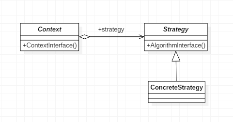
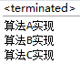
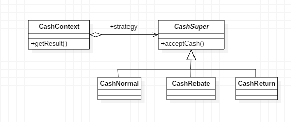
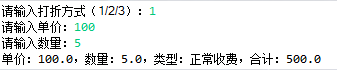
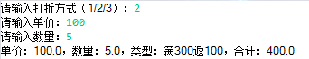
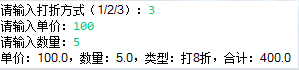

# 什么是策略模式

策略这个词应该怎么理解，打个比方说，我们出门的时候会选择不同的出行方式，比如骑自行车、坐公交、坐火车、坐飞机、坐火箭等等，这些出行方式，每一种都是一个策略。
 
 再比如我们去逛商场，商场现在正在搞活动，有打折的、有满减的、有返利的等等，其实不管商场如何进行促销，说到底都是一些算法，这些算法本身只是一种策略，并且这些算法是随时都可能互相替换的，比如针对同一件商品，今天打八折、明天满100减30，这些策略间是可以互换的。
 
 **策略模式（Strategy）**，定义了一组算法，将每个算法都封装起来，并且使它们之间可以互换。UML结构图如下：
 
 
 
 
 
 其中，Context是上下文，用一个ConcreteStrategy来配置，维护一个对Strategy对象的引用；Strategy是策略类，用于定义所有支持算法的公共接口；ConcreteStrategy是具体策略类，封装了具体的算法或行为，继承于Strategy。
 
 
 ## 1. Context上下文
　　Context上下文角色，也叫Context封装角色，起承上启下的作用，屏蔽高层模块对策略、算法的直接访问，封装可能存在的变化。
 
 ```java
public class Context {

    Strategy strategy;

    public Context(Strategy strategy) {
        this.strategy = strategy;
    }

    //上下文接口
    public void contextInterface() {
        strategy.algorithmInterface();
    }

}
```
 

## 2. 策略角色
　　抽象策略角色，是对策略、算法家族的抽象，通常为接口，定义每个策略或算法必须具有的方法和属性。algorithm是“运算法则”的意思。
 
 
 
 
 
 ```java
public abstract class Strategy {

    //算法方法

    public abstract void algorithmInterface();
}
```
 ## 3. 具体策略角色
　　用于实现抽象策略中的操作，即实现具体的算法，下方用print代替。测试类共3个ConcreteStrategy，其它两个类与ConcreteStrategyA同理，就不再赘述了。
 
 ```java
public class ConcreteStrategyA extends Strategy {

    @Override
    public void algorithmInterface() {
        System.out.println("算法A实现");
    }

}
```
 
 ## 4. Client客户端
　　下面依次更换策略，测试一下策略模式。
 
 ```java
public class Client {

    public static void main(String[] args) {
        Context context;

        context = new Context(new ConcreteStrategyA());
        context.contextInterface();

        context = new Context(new ConcreteStrategyB());
        context.contextInterface();

        context = new Context(new ConcreteStrategyC());
        context.contextInterface();
    }

}
```
 
 运行结果如下：
 


 
  
  
  #二、策略模式的应用
  

## 1. 何时使用

- 一个系统有许多类，而区分它们的只是他们直接的行为时

## 2. 方法

- 将这些算法封装成一个一个的类，任意的替换

## 3. 优点

- 算法可以自由切换
- 避免使用多重条件判断（如果不用策略模式我们可能会使用多重条件语句，不利于维护）
- 扩展性良好，增加一个策略只需实现接口即可

## 4. 缺点

- 策略类数量会增多，每个策略都是一个类，复用的可能性很小
- 所有的策略类都需要对外暴露

## 5. 使用场景
- 多个类只有算法或行为上稍有不同的场景
- 算法需要自由切换的场景
- 需要屏蔽算法规则的场景

## 6. 应用实例

- 出行方式，自行车、汽车等，每一种出行方式都是一个策略
- 商场促销方式，打折、满减等
- Java AWT中的LayoutManager，即布局管理器

## 7. 注意事项

- 如果一个系统的策略多于四个，就需要考虑使用混合模式来解决策略类膨胀的问题

# 三、策略模式的实现

　　下面就以商场促销为例使用策略模式实现商场促销算法。UML图如下：
  
  
  
  
  
### 　　1.上下文类

　　首先声明一个CashSuper对象，通过构造方法，传入具体的收费策略，getResult()方法的功能为根据收费策略的不同获得计算结果。


```
 1 public class CashContext {
 2     
 3     private CashSuper cashSuper;
 4     
 5     public CashContext(CashSuper cashSuper) {
 6         this.cashSuper = cashSuper;
 7     }
 8     
 9     public double getResult(double money) {
10         return cashSuper.acceptCash(money);
11     }
12 
13 }
```


### 　　2. 现金收费抽象类

　　策略类，为抽象类，抽象出收费的方法供子类实现。

```
1 public abstract class CashSuper {
2     
3     public abstract double acceptCash(double money);
4 
5 }
```

### 　　3. 正常收费子类

　　没有任何活动的情况，正常收费，返回原价。


```
1 public class CashNormal extends CashSuper {
2 
3     @Override
4     public double acceptCash(double money) {
5         return money;
6     }
7 
8 }
```


### 　　4. 打折收费子类

　　打折活动，根据折扣返回打折后的价格。


```
 1 public class CashRebate extends CashSuper {
 2     
 3     private double moneyRebate = 1;    //折扣
 4     
 5     public CashRebate(double moneyRebate) {
 6         this.moneyRebate = moneyRebate;
 7     }
 8 
 9     @Override
10     public double acceptCash(double money) {
11         return money * moneyRebate;
12     }
13 
14 }
```


### 　　5. 返利收费子类

　　返利活动，输入返利条件和返利值，比如满300返100，moneyCoditation为300，moneyReturn为100。

　　 result = money - Math.floor(money / moneyConditation) * moneyReturn; 的意思为，如果当前金额大于等于返利条件，则使用当前金额减去返利值。


```
 1 public class CashReturn extends CashSuper {
 2 
 3     private double moneyConditation = 0.0;    //返利条件
 4     private double moneyReturn = 0.0d;    //返利值
 5     
 6     public CashReturn(double moneyConditation, double moneyReturn) {
 7         this.moneyConditation = moneyConditation;
 8         this.moneyReturn = moneyReturn;
 9     }
10 
11     @Override
12     public double acceptCash(double money) {
13         double result = money;
14         
15         if (money >= moneyConditation) {
16             result = money - Math.floor(money / moneyConditation) * moneyReturn;
17         }
18         
19         return result;
20     }
21 
22 }
```


### 　　6. Client客户端

　　下面写一个简单的程序测试一下上方编写的代码。


```
 1 public class Client {
 2     
 3     public static void main(String[] args) {
 4         CashContext cashContext = null;
 5         
 6         Scanner scanner = new Scanner(System.in);
 7         System.out.print("请输入打折方式（1/2/3）：");
 8         int in = scanner.nextInt();
 9         String type = "";
10         
11         switch (in) {
12             case 1:
13                 cashContext = new CashContext(new CashNormal());
14                 type += "正常收费";
15                 break;
16                 
17             case 2:
18                 cashContext = new CashContext(new CashReturn(300, 100));
19                 type += "满300返100";
20                 break;
21                 
22             case 3:
23                 cashContext = new CashContext(new CashRebate(0.8));
24                 type += "打8折";
25                 break;
26     
27             default:
28                 System.out.println("请输入1/2/3");
29                 break;
30         }
31         
32         double totalPrices = 0;
33         
34         System.out.print("请输入单价：");
35         double price = scanner.nextDouble();
36         System.out.print("请输入数量：");
37         double num = scanner.nextDouble();
38         totalPrices = cashContext.getResult(price * num);
39         
40         System.out.println("单价：" + price + "，数量：" + num + "，类型：" + type + "，合计：" + totalPrices);
41         
42         scanner.close();
43     }
44 
45 }
```

  正常收费结果如下：
  
  
  
  
  
  返利收费结果如下：
  
  
  打折收费结果如下：
  
  
  源码地址：[GoF](https://gitee.com/adamjiangwh/GoF) 
  
  
  
 
 
 