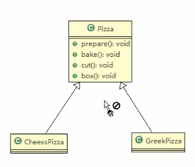
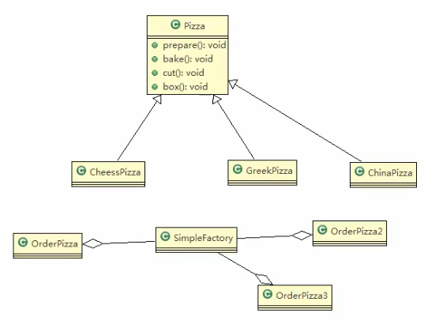

# 工厂模式
### 看一个具体的需求

看一个披萨的项目: 要便于披萨种类的扩展,要便于维护

1. 披萨的种类很多(比如, GreekPizz, CheesePizz 等)

2. 披萨的制作有 prepare,bake ,cut,box

3. 完成披萨店订购功能.

---

### 类图


使用传统的方式来完成

### 传统方式的优缺点

1. 优点是比较好理解,简单易操作

2. 缺点是违反了设计模式的 __ocp原则__ ,开放封闭原则,(即对扩展开放,对修改关闭)
即当我们给类增加新功能的时候,尽量不修改代码,或者尽可能少修改代码

3. 比如我们这个时候要新增一个Pizza种类(cheese披萨),我们需要作出如下修改

```java
// 新增 写
public class CheesePizz extends Pizza{
    @Override
    public void prepare(){
        // TODO Auto-gent
        setName("奶酪Pizza")
        System.out.println(name+"preparing");
    }
}
``` 

```java
// 增加一段代码 OrderPizza.java // 写
if(oredrType.equal("greek")){
    pizza= new GreekPizz();   
}else if(oredrType.equal("pepper")){
    pizza= new PepperPizza();
}else if(oredrType.equal("cheese")){
    pizza= new CheesePizza();
}else{
    break;
}
```

现在就是啥呢

你看奥,这个OrderPizza是客户端,可能会在不同的地方有 多个 
OrdeaPizza2  OrdeaPizza3

```java
public class OrderPizza {
    // 构造器
    public OrderPizza() {
        Pizza pizza = null;
        String orderType; // 订购披萨类型
        do {
            orderType = getType();
            if (orderType.equals("greek")) {
                pizza = new GreekPizza();
                pizza.setName("希腊披萨!");
            } else if (orderType.equals("cheese")) {
                pizza = new CheesePizza();
                pizza.setName("奶酪披萨!");
            } else {
                break;
            }
            // 输出pizza 制作过程
            pizza.prepare();
            pizza.bake();
            pizza.cut();
            pizza.box();
        } while (true);
    }
```

比如
`if (orderType.equals("greek")) {`
___这个里面的判断语句就要再改改改___

这指定是不成的(ocp开放封闭原则就 当他不存在了)
 
### 传统的方式的优缺点

4. 改进的思路分析

分析: 修改代码可以接受,到那时如果我们其他的地方也有创建Pizza的代码,就意味着也需要修改,而创建Pizza的代码,往往有多处.

思路: 把创建Pizza对象封装到一个类中,这样我们有新的Pizza种类时,只需要修改该类就可,__其他有创建到Pizza对象的代码就不需要修改了__ => 简单工厂模式 
 
 
 
 
# 简单工厂模式

### 基本介绍

1. 简单工厂模式是属于创建型模式,是工厂模式的一种. __简单工厂模式是由一个工厂对象决定创建出哪一种产品类的实例__ .简单工厂模式是工厂模式家族中最简单实用的模式

2. 简单工厂模式: 定义了一个创建对象的种类,由这个类来 __封装实例化对象的行为__ (代码)

3. 在软件开发中,当我们会用到大量的场景某种,某类或者某批对象时,就会使用到工厂模式

.
### 一句话
 把创建实例的权限交给工厂,使用者只是需要通过工厂来拿到实例
 
### 类图


