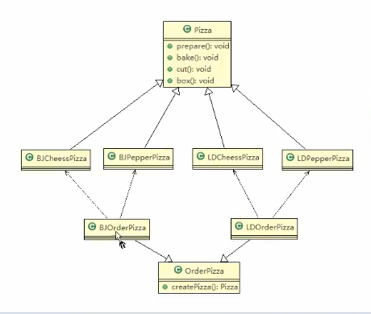

 
 
 # 工厂方法模式
 
 ### 看一个新的需求
 
 披萨项目新的需求: 客户在点披萨时,可以点不同口味的披萨,比如 北京的奶酪pizza,北京的胡椒pizza 或者 是伦敦的奶酪pizza,伦敦的胡椒pizza
 
 ### 思路1
 
 使用简单工厂模式,创建出不同的简单工厂类,比如 BJPizzaSimpleFactory、LDPizzaSimpleFactory 等等. 从当前这个案例来说,也是可以的,但是考虑到项目的规模,以及软件的可维护性,可扩展性并不是特别好
 
 ### 思路2
 
 使用工厂方法模式
 
 ### 工厂方法模式介绍
 
 _工厂方法模式设计方案_: 将披萨项目的实例化功能抽象方法,在不同的口味点餐子类中具体实现
 
 _工厂方法模式_: 定义了一个创建对象的抽象方法,由子类决定要实例化的类.工厂方法模式将 __对象的实例化推迟到子类__ .
 
  
### 工厂方法模式应用案例
  
  _披萨项目新的需求_ ; 客户在点餐的过程中,可以点不同口味的披萨,比如, 北京的奶酪披萨,北京的胡椒披萨,或者是 伦敦的奶酪披萨,伦敦的胡椒披萨
  
### 类图演示
  


### 代码演示
OrderPizza
```java
package com.atguigu.factory.factorymethod.pizzastore.order;


import com.atguigu.factory.factorymethod.pizzastore.pizza.Pizza;

import java.io.BufferedReader;
import java.io.IOException;
import java.io.InputStreamReader;

/**
 * ClassName: OrderPizza <br/>
 * Description: OrderPizza <br/>
 * Date: 2021-02-03 15:21 <br/>
 * <br/>
 *
 * @author victor
 * @version 产品版本信息 2021年02月03日15:21分 victor(victorfm@163.com) 新建<br/>
 * <p>
 * 修改记录
 * @email victorfm@163.com
 * @project java_mode
 * @package com.atguigu.factory.factorymethod.pizzastore.order
 */
public abstract class OrderPizza {

    // 定义一个抽象方法,createPizza,让各个工行子类自己实现
    abstract Pizza createPizza(String orderType);

    // 构造器
    public OrderPizza() {
        Pizza pizza = null;
        String orderType;   // 订购披萨类型
        do {
            orderType = getType();
            //我么在这里直接调用createPizza这个方法
            pizza = createPizza(orderType);
            // 这个createPizza 是由他的工厂子类去实现
            // 但是这个创建的方法在本类 他是一个抽象的方法
            //
            // 执行这个披萨的制作过程
            pizza.prepare();
            pizza.bake();
            pizza.cut();
            pizza.box();

        } while (true);

    }

    // 写一个方法,可以获取客户希望订购的披萨种类
    private String getType() {
        BufferedReader strin = new BufferedReader(new InputStreamReader(System.in));
        System.out.println("input pizza type:");
        String str = null;
        try {
            str = strin.readLine();
        } catch (IOException e) {
            e.printStackTrace();
        }
        return str;
    }
}

```


北京的奶酪披萨
```java
public class BJCheesePizza extends Pizza{

    @Override
    public void prepare() {
        setName("北京的奶酪披萨");
        System.out.println("给北京的奶酪披萨准备原材料!");
    }
}

```


执行类
```java
package com.atguigu.factory.factorymethod.pizzastore.pizza;

/**
 * ClassName: Pizza <br/>
 * Description: Pizza <br/>
 * Date: 2021-02-03 15:14 <br/>
 * <br/>
 *
 * @author victor
 * @version 产品版本信息 2021年02月03日15:14分 victor(victorfm@163.com) 新建<br/>
 * <p>
 * 修改记录
 * @email victorfm@163.com
 * @project java_mode
 * @package com.atguigu.factory.factorymethod.pizzastore
 */
public abstract class Pizza {

    protected String name;  // 披萨名字

    // 准备原材料,不同的pizza是不一样的
    // ,因此我们做成一个抽象方法
    public abstract void prepare();


    // 烘烤
    public void bake() {
        System.out.println(name+"baking;");
    }

    // 切片
    public void cut() {
        System.out.println(name+"cutting;");
    }

    //打包
    public void box() {
        System.out.println(name+"boxting;");
    }

    public String getName() {
        return name;
    }

    public void setName(String name) {
        this.name = name;
    }
}

```

主方法
```java
package com.atguigu.factory.factorymethod.pizzastore.order;

/**
 * ClassName: PizzaStore <br/>
 * Description: PizzaStore <br/>
 * Date: 2021-02-03 16:51 <br/>
 * <br/>
 *
 * @author victor
 * @version 产品版本信息 2021年02月03日16:51分 victor(victorfm@163.com) 新建<br/>
 * <p>
 * 修改记录
 * @email victorfm@163.com
 * @project java_mode
 * @package com.atguigu.factory.factorymethod.pizzastore.order
 */
public class PizzaStore {
    public static void main(String[] args) {
        // 创建北京口味 各种 Pizza
        new BJOrderPizza();
        /*
        *
        * input pizza type:
        cheese
        给北京的奶酪披萨准备原材料!
        北京的奶酪披萨baking;
        北京的奶酪披萨cutting;
        北京的奶酪披萨boxting;
        *
        * input pizza type:
        pepper
        北京的胡椒披萨准备原材料!
        北京的胡椒披萨baking;
        北京的胡椒披萨cutting;
        北京的胡椒披萨boxting;
        * */

        // todo 还可以 加上 北京or 伦敦的供用户选择的嗯
        // 比如加上location
        // 创建伦敦口额为的各种披萨
//        new LDOrderPizza();

        // 这个代码就不写了

        // 你永远无法叫醒一个装睡的人
    }
}

```