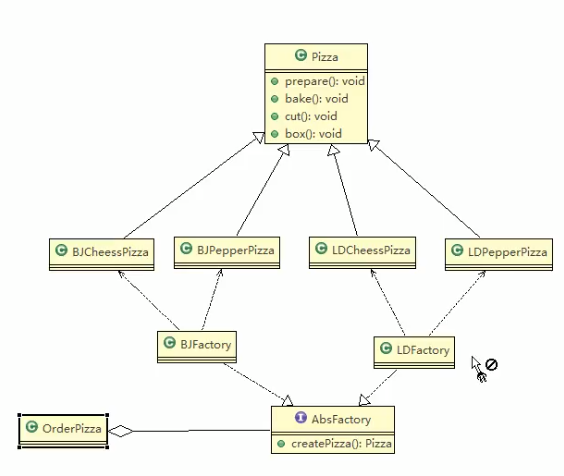
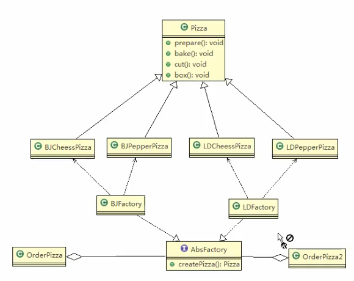

 
 
 # 抽象工厂模式
 
 ### 基本介绍
 
 1. 抽象工厂模式: 定义了一个Interface用于创建相关或有依赖关系的对象,而无需指明具体的类
 
 2. 抽象工厂模式可以将 __简单工厂模式__ 和 __工厂方法模式__ 进行整合.
 
 3. 从设计层面看,抽象工厂模式就是对简单工厂模式的改进(或者成为进一步的抽象)
 
 4. 将工厂抽象成2层,AbsFactory(抽象工厂)和具体实现的子工厂类. 程序员可以根据创建对象类型使用对应的工厂子类. 这样将单个的简单工厂编程了 __工厂簇__,
 更利于代码的维护和扩展.
 
 ### 说白了
 
 我们可以把这个要创建对象实例的方法做成一个抽象方法,放到一个接口里面,然后让下面的一个工厂子类去实现,然后我们需要哪个工厂就把他们聚合到我们的使用类/客户端 即可
 
 这样一个简单的工厂类就变成了一堆儿工厂类,这样就利于我们 代码的扩展和修改
 
 ### 看一个类图
 
 
 
 如果要扩展, 可以这样加一个类
 
 
 
 
 ### 代码演示
 
 
 