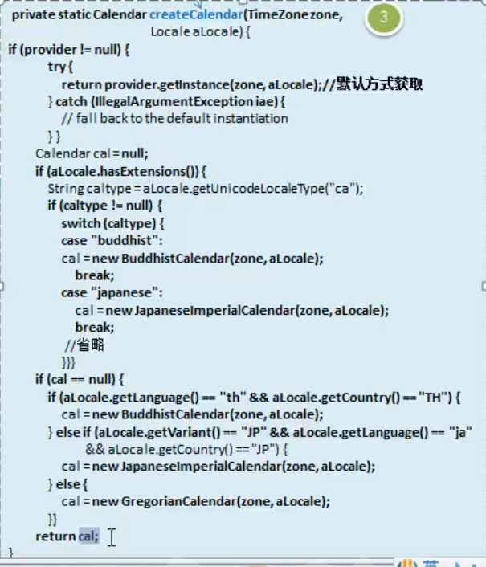

 
 
 # 工厂模式
  
  ### JDK-Calendar的源码分析
  
  1. JDK中的calendar类中,就使用了简单的工厂模式
  
  2. 源码分析+Debug源码+说明
  
如下图

 
 
 
 # 工厂模式小结
 
 1. 工厂模式的意义
    将实例化对象代码提取出来,放到一个类中统一管理和维护,达到和主项目的依赖关系的解耦.从而提高项目的扩展和维护性
    
2. 三种工厂模式

3. 设计模式的 __依赖抽象__ 原则

- 创建对象实例的时候,不要直接new类,而是把这个new类的动作放在一个工厂的方法中,并返回. 也有的书上说,变量不要直接持有具体类的引用

- 不要让类继承具体类,而是继承抽象类或者实现interface(接口)
- 不要覆盖基类中已经实现的方法

