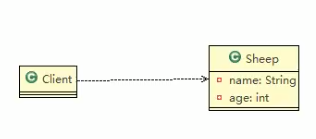
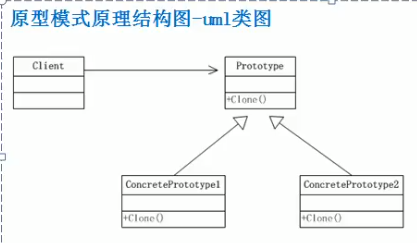

 
 
 # 原型模式
 
 ### 克隆羊问题
 
 现在有一只羊tom,姓名为: tom,年龄为1,颜色为: 白色,请编写程序创建和tom羊属性完全相同的10只羊..
 
 
 ### 实践出真知
 1.  最简单的思路
 
 
 
 
 ```java
package com.atguigu.prototype;

public class Sheep {
    private String name;
    private int age;
    private String color;

    public Sheep(String name, int age, String color) {
        this.name = name;
        this.age = age;
        this.color = color;
    }

    @Override
    public String toString() {
        return "Sheep{" +
                "name='" + name + '\'' +
                ", age=" + age +
                ", color='" + color + '\'' +
                '}';
    }

    public String getName() {
        return name;
    }

    public void setName(String name) {
        this.name = name;
    }

    public int getAge() {
        return age;
    }

    public void setAge(int age) {
        this.age = age;
    }

    public String getColor() {
        return color;
    }

    public void setColor(String color) {
        this.color = color;
    }
}

```

```java
package com.atguigu.prototype;

public class Client {
    public static void main(String[] args) {
        // 传统的方法
        Sheep sheep = new Sheep("tom", 1, "白色");
        // 用第一次的sheep 的信息去初始化 下一只羊的属性

        Sheep sheep2 = new Sheep(sheep.getName(), sheep.getAge(), sheep.getColor());
        Sheep sheep3 = new Sheep(sheep.getName(), sheep.getAge(), sheep.getColor());
        Sheep sheep4 = new Sheep(sheep.getName(), sheep.getAge(), sheep.getColor());
        Sheep sheep5 = new Sheep(sheep.getName(), sheep.getAge(), sheep.getColor());
        Sheep sheep6 = new Sheep(sheep.getName(), sheep.getAge(), sheep.getColor());
        Sheep sheep7 = new Sheep(sheep.getName(), sheep.getAge(), sheep.getColor());
        Sheep sheep8 = new Sheep(sheep.getName(), sheep.getAge(), sheep.getColor());
        Sheep sheep9 = new Sheep(sheep.getName(), sheep.getAge(), sheep.getColor());

        System.out.println(sheep);
        System.out.println(sheep2);
        System.out.println(sheep3);
        System.out.println(sheep4);
        System.out.println(sheep5);
        System.out.println(sheep6);
        System.out.println(sheep7);
        System.out.println(sheep8);
        System.out.println(sheep9);
    }
}

```


```shell script
Sheep{name='tom', age=1, color='白色'}
Sheep{name='tom', age=1, color='白色'}
Sheep{name='tom', age=1, color='白色'}
Sheep{name='tom', age=1, color='白色'}
Sheep{name='tom', age=1, color='白色'}
Sheep{name='tom', age=1, color='白色'}
Sheep{name='tom', age=1, color='白色'}
Sheep{name='tom', age=1, color='白色'}
Sheep{name='tom', age=1, color='白色'}

Process finished with exit code 0

```


### 传统方式解决克隆羊问题

传统的方式的优缺点

1. 优点是比较好理解,简单易操作.

2. 在创建新的对象的时,总是需要重新获取原始对象的属性,如果创建的对象比较复杂时,效率较低

3. 总是需要重新初始化对象,而不是动态地获得对象运行时的状态,不够灵活

4. 改进的思路分析

__思路__ : Java中Object类是所有类的根类,Object类提供了一个clone()方法,该方法可以将一个Java对象复制一份,但是需要实现clone的Java类必须要实现一个接口Cloneable,该接口表示该类能够复制且具有复制的能力 => 原型模式


# 原型模式

### 基本介绍

1. 原型模式(Prototype模式是指:用原型实例指定创建对象的种类,并且通过拷贝这些原型,创建新的对象)

2. 原型模式是一种创建型设计模式,允许一个对象再创建另外一个可定制的对象,无需知道如何创建的细节

3. 工作原理是:通过将一个原型对象传给那个要发动创建的对象,这个要发动创建的对象通过请求原型对象拷贝它们自己来实施创建,即: 对象.clone()

4. 形象的理解: 孙大圣拔出猴毛,变出其他猴子


 
 ### 原型模式 - 原理结构图(UML类图)
 
 
 #### 原理结构图说明
 
 1. Prototype:原型类,声明一个克隆自己的接口
 2. ConcretePrototype: 具体的原型类,实现一个克隆自己的操作
 3. Client 让一个原型对象克隆自己,从而创建一个新的对象(属性一样)
 
 
 # 原型模式解决克隆羊 问题
 
 原型模式解决克隆羊问题的应用实例
 
 使用 __原型模式__ 改进传统方式,让程序具有更高的效率和扩展性
 
 
 
 
 
 
 
 
      
