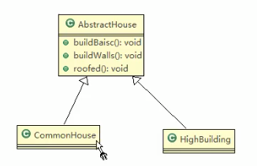
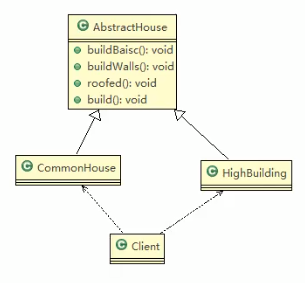

 
 
 # 建造者模式
 
 ### 盖房子项目需求
 
 1. 需要建房子: 这一个过程为打桩,砌墙,封顶
 
 2. 房子有各种各样的,比如普通房,高楼,别墅,各种房子的过程虽然一样,但是要求不要相同的
 
 3. 编写程序完成需求
 
 ---
 ### 思路图
 
 
 
 ```java
package com.atguigu.builder;

public abstract class AbstractHouse {
    // 打地基
    public abstract void buildBasic();

    // 砌墙
    public abstract void buildWalls();

    // 封顶
    public abstract void roofed();

    //我们这个盖房子是有顺序的,
    // 所以再封装一层,
    public void build() {
        buildBasic();
        buildWalls();
        roofed();
    }
}
```

 

```java
package com.atguigu.builder;

public class CommonHouse extends AbstractHouse {
    @Override
    public void buildBasic() {
        System.out.println("-----------");

        System.out.println("普通房子打地基");
    }

    @Override
    public void buildWalls() {
        System.out.println("-----------");

        System.out.println("普通房子砌墙");
    }

    @Override
    public void roofed() {
        System.out.println("-----------");
        System.out.println("普通房子封顶");
    }
}
```

好了,现在写一个主方法

```java
package com.atguigu.builder;

public class Clinet {
    public static void main(String[] args) {
        CommonHouse commonHouse = new CommonHouse();
        commonHouse.build();
        /*
        -----------
        普通房子打地基
        -----------
        普通房子砌墙
        -----------
        普通房子封顶
        * */
    }
}

```

现在房子盖好了,他有什么问题么?

### 传统方式解决盖房子需求问题分析

1. 优点是比较好理解,简单易操作

2. 设计的程序结构,过于简单,没有设计缓存层对象,程序的扩展和维护不好.也就是说,这种设计方案,把产品(即: 房子)和创建产品的过程(即: 建房子流程) 封装在了一起,耦合性质增强了

3. 解决方案: 将产品和产品的建造过程解耦 ==> 建造者模式

---

应该叫做包工头模式

---


     
