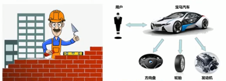
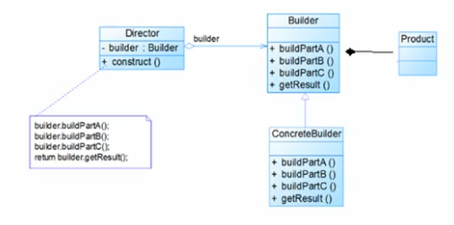

 
 
 # 建造者模式基本介绍
 
 ### 概念
 
 1. __建造者模式(Builder Pattern)__ 又叫生成器模式,是一种对象构建模式.
 它可以将复杂对象的构建过程抽象出来(抽象类别),使这个抽象过程的不同实现方法可以构造出不同表现(属性)的对象.
 
 2. __建造者模式__ 是一步一步创建一个复杂的对象,他允许用户只通过指定复杂对象的类型和内容就可以构建它们,用户不需要知道内部的具体构建细节.
 
 
 
 ---
 python 中的生成器? [菜鸟](https://www.runoob.com/python3/python3-iterator-generator.html)
 
 ---
 
 
 ### 建造者模式的4个角色
 
 1. Product(产品角色): 一个具体的产品对象
 2. Builder(抽象建造者): 创建一个Product对象的各个部件指定的接口
 3. ConcreteBuilder(具体建造者): 实现接口,构建和装配各个部件.
 4. Director(指挥者): 构建一个使用Builder接口的对象.它主要是用于创建一个复杂对象.他主要有2个作用,
 - 一是: 隔离了客户与对象的生产过程,
 - 二是: 负责控制产品对象的生产过程
 
 
 ### 建造者模式原理类图
 
 
 
 
 ### 代码实践
 
 房子
 
 ```java
package com.atguigu.builder.improve;

// 产品 => Product
public class House {
    private String baise;
    private String wall;
    private String roofed;

    public String getBaise() {
        return baise;
    }

    public void setBaise(String baise) {
        this.baise = baise;
    }

    public String getWall() {
        return wall;
    }

    public void setWall(String wall) {
        this.wall = wall;
    }

    public String getRoofed() {
        return roofed;
    }

    public void setRoofed(String roofed) {
        this.roofed = roofed;
    }
}

```

抽象建造者

```java
package com.atguigu.builder.improve;

// 抽象的建造者
public abstract class HouseBuilder {

    protected House house = new House();

    // 将建造的流程写好,抽象的方法
    public abstract void buildBasic();
    public abstract void buildWalls();
    public abstract void roofed();


    /**
     * 建造房子好,将产品(房子)返回
     * @return
     */
    public House buildHouse() {
        return house;

    }
}

```

矮楼

```java
package com.atguigu.builder.improve;

/**
 * 抽象
 */
public class CommonHouse extends HouseBuilder{
    @Override
    public void buildBasic() {
        System.out.println("普通的房子地基5米");
    }

    @Override
    public void buildWalls() {
        System.out.println("普通房子砌墙10cm");
    }

    @Override
    public void roofed() {
        System.out.println("普通房子屋顶盖上了");
    }
}

```

高楼

```java
package com.atguigu.builder.improve;


public class HighBuilding extends HouseBuilder{
    @Override
    public void buildBasic() {
        System.out.println("高楼的地基98米");
    }

    @Override
    public void buildWalls() {
        System.out.println("高楼的墙20cm");
    }

    @Override
    public void roofed() {
        System.out.println("高楼的屋顶透明的");
    }
}

```

主方法(客户端)调用

```java
package com.atguigu.builder.improve;


public class Clinet {
    public static void main(String[] args) {
        System.out.println();
        // 盖普通票房子
        CommonHouse commonHouse = new CommonHouse();
        // 准备创建房子的指挥者
        HouseDirector houseDirector = new HouseDirector(commonHouse);
        // 完成盖房子,返回产品(房子
        House house = houseDirector.constructHouse();
        System.out.println(house);
        /* out
        普通的房子地基5米
        普通房子砌墙10cm
        普通房子屋顶盖上了
        com.atguigu.builder.improve.House@1540e19d
        * */
    }
}

```