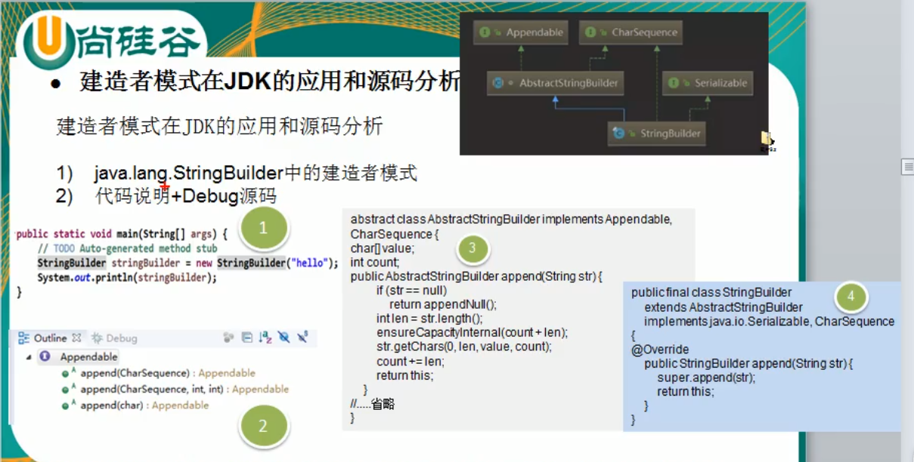

 
 
 # 建造者模式
 
 
 
 ```java
 * <p>Unless otherwise noted, passing a {@code null} argument to a constructor
 * or method in this class will cause a {@link NullPointerException} to be
 * thrown.
 *
 * @author      Michael McCloskey
 * @see         java.lang.StringBuffer
 * @see         java.lang.String
 * @since       1.5
 */
public final class StringBuilder
    extends AbstractStringBuilder
    implements java.io.Serializable, CharSequence
{

    /** use serialVersionUID for interoperability */
    static final long serialVersionUID = 4383685877147921099L;

    /**
     * Constructs a string builder with no characters in it and an
     * initial capacity of 16 characters.
     */
    public StringBuilder() {
        super(16);
    }

    /**
     * Constructs a string builder with no characters in it and an
     * initial capacity specified by the {@code capacity} argument.
     *
     * @param      capacity  the initial capacity.
     * @throws     NegativeArraySizeException  if the {@code capacity}
     *               argument is less than {@code 0}.
     */
    public StringBuilder(int capacity) {
        super(capacity);
    }
```

追进去

```java
 * thrown.
 *
 * @author      Michael McCloskey
 * @author      Martin Buchholz
 * @author      Ulf Zibis
 * @since       1.5
 */
abstract class AbstractStringBuilder implements Appendable, CharSequence {
    /**
     * The value is used for character storage.
     */
    char[] value;

    /**
     * The count is the number of characters used.
     */
    int count;

    /**
     * This no-arg constructor is necessary for serialization of subclasses.
     */
    AbstractStringBuilder() {
    }
```

---

我们在查看源码的时候,有可能他在使用的时候,设计模式的思想很相似,但是有可能不完全是一样的,不能完全符合类图中的

源码使用者并不知道他在使用这个设计模式,所以嗯

### 建造者模式在JDK的应用和源码分析

3. 源码中建造者角色分析

- Appendable接口定义了多个append方法(抽象方法),即Appendable为抽象建造者,定义了抽象方法,他其实就已经是一个抽象建造者了

- 有建造者就肯定会有具体的建造者实现类,但是->

- AbstractStringBuilder 实现了Appendable接口方法,这里的AbstractStringBuilder 已经是建造者了,只是不能实例化了

- 哈哈哈,写jdk这个哥们他太牛了,他已经在无形中写出了这种设计模式,只是他自己不知道而已,这种设计模式的总结是在以后才提出来的,所以他不已经很标准嗯
- StringBuilder即充当了指挥者角色,同时充当了建造者模式,建造方法的实现是由AbstractStringBuilder 完成,而我们StringBuilder只是继承了AbstractStringBuilder
- 人家写源码的时候,没有几个人设计模式,有可能只是你这么认为的,作者不是这么想的呢还兴许


     
