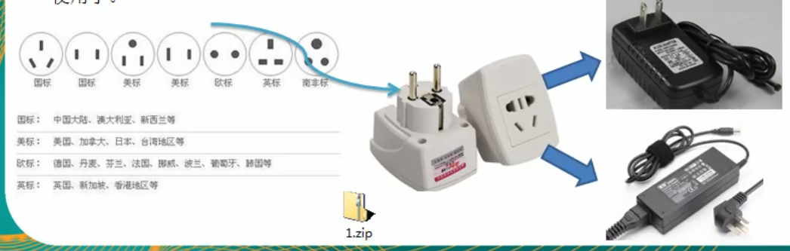
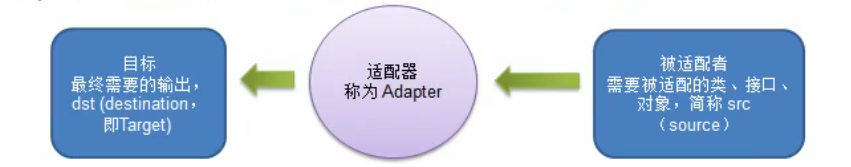

# 适配器模式

### 先看一个案例

显示生活中的适配器的例子

泰国插座用的是2孔的(欧标),可以买个 _多功能转换插头_ (适配器),这样就可以使用了

 
转接线

 ### 适配器模式基本介绍
 
 1. 适配器模式(Adapter Pattern)将某个类的接口转换成客户端期望的另一个接口表示,主要目的是兼容性,让原来因接口不匹配不能一起工作的两个类可以协同工作.其别名为 _包装器_(Wrapper)    
 2. 适配器模式属于结构型模式(并没有产生新的对象)
 3. 主要分为3类: 类适配器模式,对象适配器模式,接口适配器模式
 
 
 ### 适配器工作原理
 
 1. 适配器模式: 将一个类的接口转换成另一种接口,让 _原本接口不兼容的类可以_ 兼容
 2. 从用户的角度看不到适配者,是解耦的
 3. 用户收到反馈结果,感觉只是和目标接口交互,如图
 

 被适配者就是 泰国的插口
 适配器就是转换头
 可用的笔记本电源线就是 使用者
 