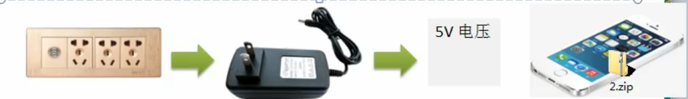
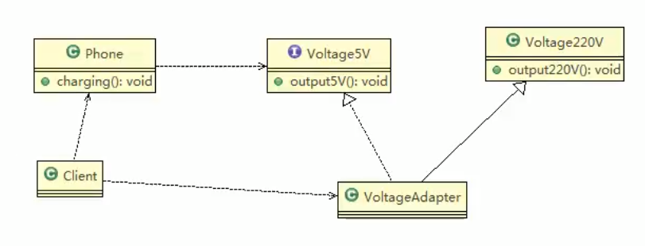

 
 ### 类适配器模式
 
 类适配器模式介绍
 基本介绍: Adapter类,通过继承src类,实现dst类接口, 完成 src->dst的适配.
 
 类适配器模式应用实例
 1. 应用实例说明
    以生活中充电器的例子来讲解适配器,充电器本身相当于Adapter, 220V交流电相当于src(即被适配者),我们的目的dst(即目标)是5V直流电
 2. 思路分析图解
 
 3. 类图
 

### 代码实践

被适配的类

```java
package com.atguigu.adapter;


// 被适配的类
public class Voltage220V {
    public int output220V() {
        int src = 220;
        System.out.println("电压"+src+"福特");
        return src;
    }
}

```

适配接口
 
 ```java
package com.atguigu.adapter;

// 适配接口
public interface IVoltage5V {
    public int output5V();
}

```

适配器
 
```java
package com.atguigu.adapter;


public class VoltageAdapter extends Voltage220V implements IVoltage5V {
    @Override
    public int output5V() {
        // 获取220V电压
        int srcV = output220V();
        // 转换成为5V
        int dstV = srcV / 44;
        return dstV;
    }
}

```

手机

```java
package com.atguigu.adapter;


public class Phone {
    // 充电
    public void charging(IVoltage5V iVoltage5V) {
        if (iVoltage5V.output5V() == 5) {
            System.out.println("电压为5V,可以充电~~~");
        } else if (iVoltage5V.output5V() > 5) {
            System.out.println("电压大于5V,白扯充电~~~");
        }
    }
}

```

客户端

```java
package com.atguigu.adapter;


public class Client {
    public static void main(String[] args) {
        System.out.println("--类适配器模式--");
        Phone phone = new Phone();
        phone.charging(new VoltageAdapter());
        /*
        --类适配器模式--
        电压220福特
        电压为5V,可以充电~~~

        Process finished with exit code 0
        * */
    }
}

```

### 类适配器模式注意事项和细节

1. Java是单继承机制,所以类适配器需要继承src类这一点算是一个缺点,因为这样求dst必须是接口,有一定的局限性(他只能继承一个,另一个不能继承,只能实现,接口)
2. src类的方法在Adapter中都会暴漏出来,也增加了使用成本
3. 由于其继承了src类,所以他可以根据需求重写src类的方法,使得Adapter的灵活性增强了