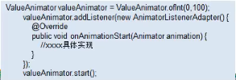
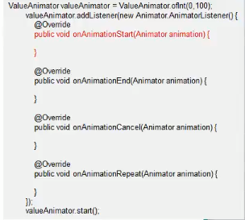
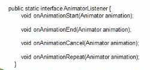
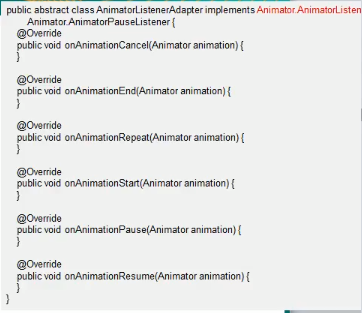
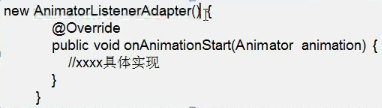
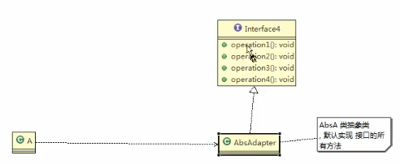

# 接口适配器模式

## 接口适配器模式介绍

1. 一些书上说: 适配器模式(Default Adapter Pattern)或缺省适配器模式
2. 当不需要全部实现接口提供的方法时,可先设计一个抽象类实现接口,并为该接口中每个方法提供一个默认实现(空方法),那么该抽象类的子类可有选择地覆盖父类的某些方法来实现需求
3. 适用于一个接口不想使用其所有的方法的情况

### 接口适配器模式应用实例

1. Android中的属性动画ValueAnimator类可以通过addListener(AnimatorListener listener)方法添加监听器,那么常规写法如右:

2. 有时候我们不想上线

    Animator.AnimatorListener接口的全部方法,我们只想监听onAnimationStart,我们会如下写
    
    
    
    
    

    我只是想要实现onAnimationStart方法
    
    其他的默认实现了,我需要关心

3. AnimatorListenerAdapter类,就是一个接口适配器,代码如右图: 它空实现了Animator.AnimatorListener类(src)的所有方法.
4. AnimatorListener是一个接口

    
    
    我现在有一个需求,就是这个适配器里面的方法,我有的想使用,有的不想使用,那么看我下一步操作
    
5. 程序里的匿名内部类就是Listener,具体实现类

    
    
### 程序类图


### 提问

都实现了还叫抽象,我学了个假设计模式



```java
package com.atguigu.adapter.interfaceadapter;


public interface Interface4 {
    public void m1();
    public void m2();
    public void m3();
    public void m4();
}

```

```java
package com.atguigu.adapter.interfaceadapter;

// 在AbsAdapter里面将Interface4的方法进行默认实现
public class AbsAdapter implements Interface4{
    // 默认实现
    public void m1(){}
    public void m2(){}
    public void m3(){}
    public void m4(){}
}

```


```java
package com.atguigu.adapter.interfaceadapter;


public class Client {
    public static void main(String[] args) {
        // 接口适配,我这里想要用哪个就用哪个
        AbsAdapter absAdapter = new AbsAdapter(){
            // 只需要去覆盖我们需要使用 接口方法

            @Override
            public void m1() {
                System.out.println("使用了m1的方法");
            }
        };

        absAdapter.m1();
        /*
        使用了m1的方法

        Process finished with exit code 0
        * */
    }
}
```


### 一句话

说白了就是,不管你实不实现,我先都进行空实现,你要是想实现,你在实现我也管不着