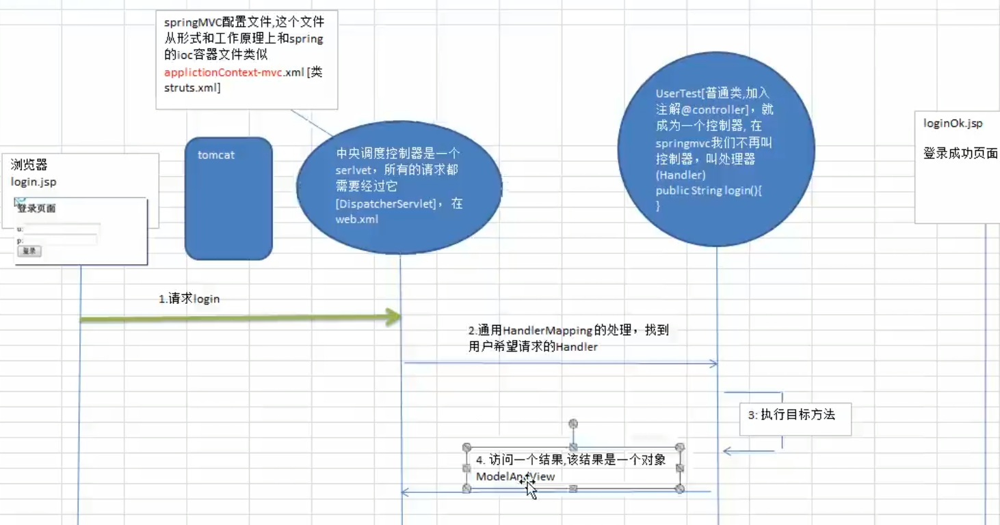
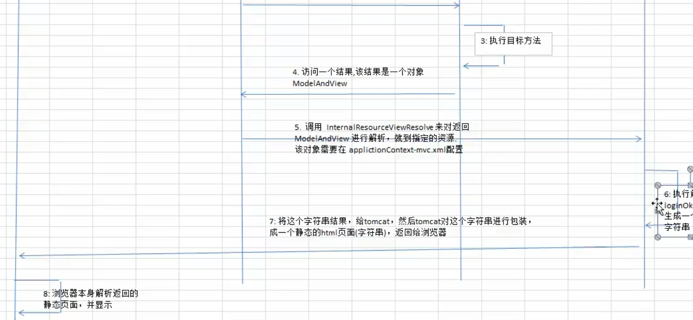
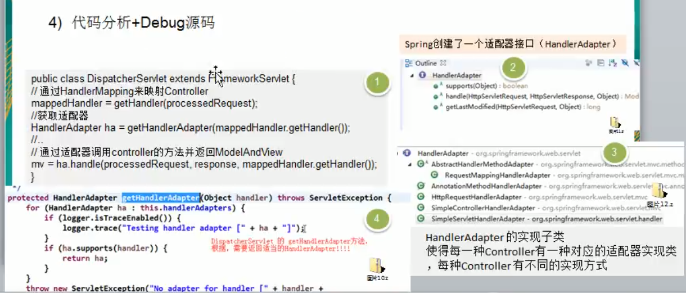
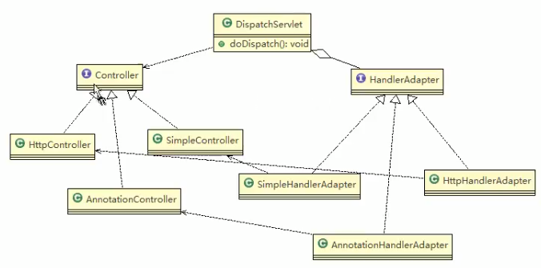
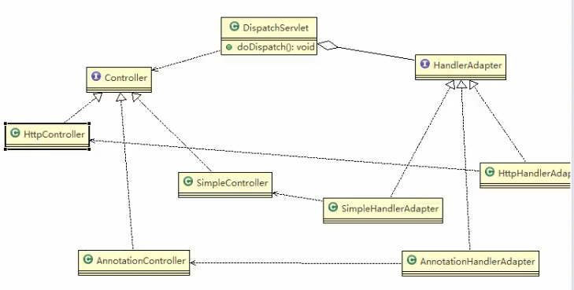
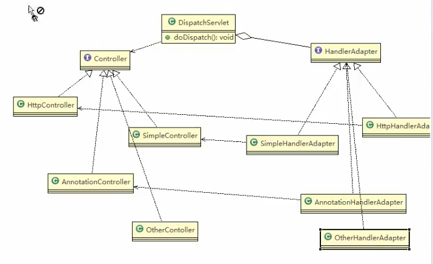

# 适配器模式_SpringMVC框架应用的源码分析

1. __SpringMVC中的HandlerAdapter__ ,就是使用了适配器模式

2. SpringMVC处理请求的流程回顾

3. 使用HandlerAdapter的原因分析: 
 可以看到处理器的类型不同,有 __多重实现方式,那么调用方式就不是确定__ 的,如果须臾奥直接调用Controller方法,需要调用的时候就得不断是使用if else 来进行判断是哪一种子类然后执行.那么如果后面要扩展Controller,就得修改原来的代码,这样违背了OCP原则.
4. 
     
     
     
 
5. 动手写SpringMVC通过 __适配器设计模式__ 获取到对应的 __Controller__的源码

说明:
- Spring定义了一个适配接口,使得每一种Controller有一种对应的适配器实现类
- 适配器代替Controller执行响应的方法
- 扩展Controller时,只需要增加一个适配器类就完成了SpringMVC的扩展了,
- __这就是设计模式的power__

### 类图

### 适配器模式的注意事项和细节

1. 三种命名方式,是根据src是以怎样的形式给到Adapter(在Adapter里的形式)来命名的

2. 
    - 类适配器: 以类给到, 在Adapter里,就是src当做类,继承
    - 对象适配器: 以对象给到, 在Adapter里,就是src当做对象,持有(聚合)
    - 接口适配器: 以接口给到, 在Adapt2er里,就是src当做接口,实现
    
3. Adapter模式最大的作用还是将原本,不兼容的接口融合在一起工作.
4. 实际开发中,实现起来不拘泥与我们讲解的三种经典形式

    
    
    
    
