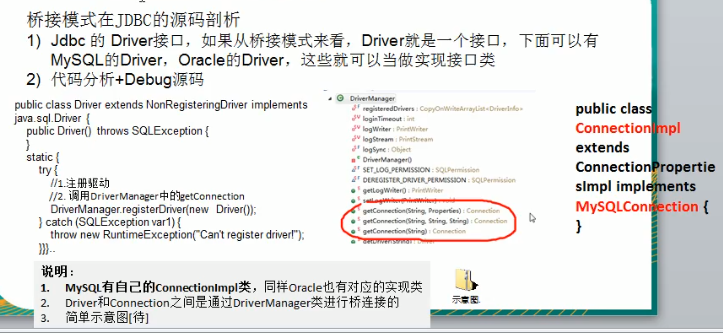
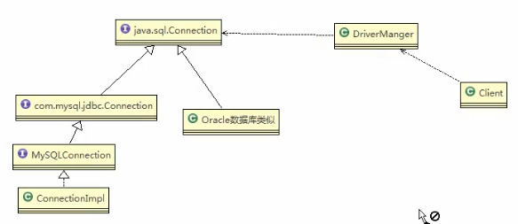

# 桥接模式在JDBC的源码剖析





画个类图



```java

    /**
     * Attempts to establish a connection to the given database URL.
     * The <code>DriverManager</code> attempts to select an appropriate driver from
     * the set of registered JDBC drivers.
     *<p>
     * <B>Note:</B> If the {@code user} or {@code password} property are
     * also specified as part of the {@code url}, it is
     * implementation-defined as to which value will take precedence.
     * For maximum portability, an application should only specify a
     * property once.
     *
     * @param url a database url of the form
     * <code>jdbc:<em>subprotocol</em>:<em>subname</em></code>
     * @param user the database user on whose behalf the connection is being
     *   made
     * @param password the user's password
     * @return a connection to the URL
     * @exception SQLException if a database access error occurs or the url is
     * {@code null}
     * @throws SQLTimeoutException  when the driver has determined that the
     * timeout value specified by the {@code setLoginTimeout} method
     * has been exceeded and has at least tried to cancel the
     * current database connection attempt
     */
    @CallerSensitive
    public static Connection getConnection(String url,
        String user, String password) throws SQLException {
        java.util.Properties info = new java.util.Properties();

        if (user != null) {
            info.put("user", user);
        }
        if (password != null) {
            info.put("password", password);
        }

        return (getConnection(url, info, Reflection.getCallerClass()));
    }
```


