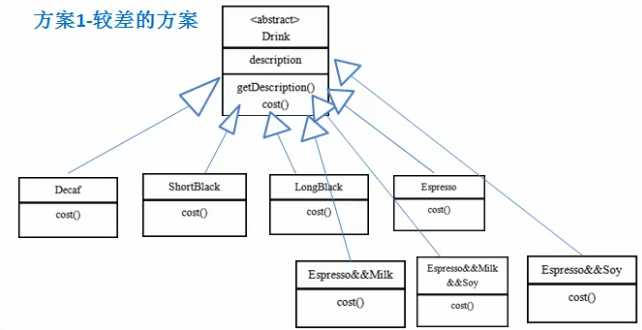

# 星巴克咖啡

星巴克咖啡订单项目(咖啡馆)

1. 咖啡种类/单品咖啡: Espresso(意大利浓咖啡),ShortBlack,LongBlack(美式咖啡),Decaf(无因咖啡)
2. 调料: milk,Soy(豆浆),Chocolate
3. 要求在扩展 __新的咖啡种类__ 时,具有良好的扩展性,改动方便,维护方便
4. 使用OO来计算不同种类的咖啡的 __费用__: 客户可以点 __单品咖啡__ ,也可以 __单品咖啡+调料组合__ .

1. 比较low的方案

 
 方案1-解决星巴克订咖啡订单问题分析
 
 1. Drink 是一个抽象类,表示饮料
 2. des就是对咖啡的描述,比如咖啡的名字
 3. cost()方法就是计算费用,Drink类中做成一个抽象方法
 4. Decaf就是单品咖啡,继承了Drink,并实现cost()方法
 5. Espress&&Milk 就是单品咖啡+调料,这个组合很多
 6. 问题: 这样设计,会有很多类,当我们增加一个单品咖啡,或者一个新的调料,类的和数量就会倍增,就会出现类爆炸,peng~
 
 
 
 
 
 
 
 
 
 
 
 