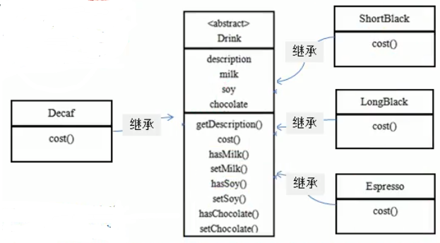
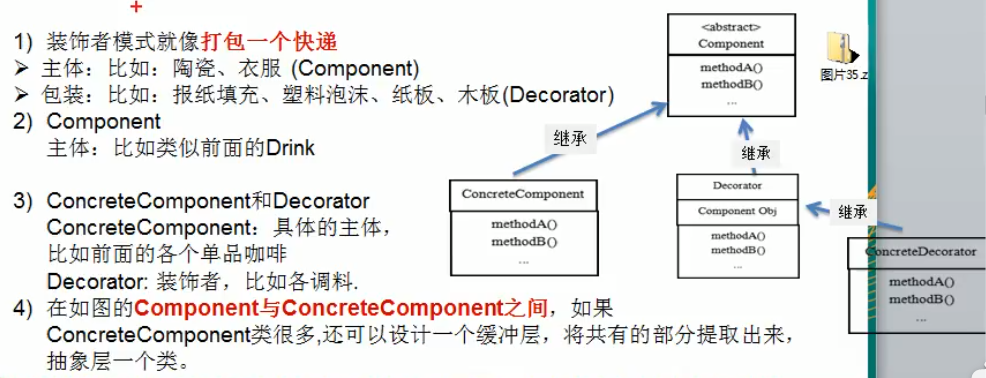
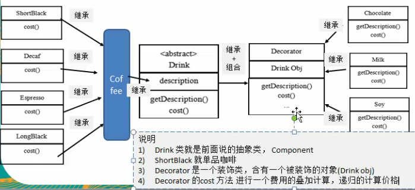
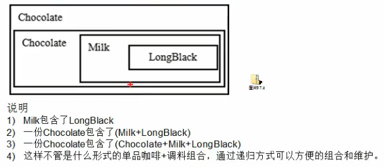

# 星巴克咖啡

星巴克咖啡订单项目(咖啡馆)

1. 咖啡种类/单品咖啡: Espresso(意大利浓咖啡),ShortBlack,LongBlack(美式咖啡),Decaf(无因咖啡)
2. 调料: milk,Soy(豆浆),Chocolate
3. 要求在扩展 __新的咖啡种类__ 时,具有良好的扩展性,改动方便,维护方便
4. 使用OO来计算不同种类的咖啡的 __费用__: 客户可以点 __单品咖啡__ ,也可以 __单品咖啡+调料组合__ .

## 1. 比较low的方案

 
 方案1-解决星巴克订咖啡订单问题分析
 
 1. Drink 是一个抽象类,表示饮料
 2. des就是对咖啡的描述,比如咖啡的名字
 3. cost()方法就是计算费用,Drink类中做成一个抽象方法
 4. Decaf就是单品咖啡,继承了Drink,并实现cost()方法
 5. Espress&&Milk 就是单品咖啡+调料,这个组合很多
 6. 问题: 这样设计,会有很多类,当我们增加一个单品咖啡,或者一个新的调料,类的和数量就会倍增,就会出现类爆炸,peng~
 
 
## 2.优化的方案

方案2- 解决星巴克咖啡订单(好点)

其那面分析到方案1因为 __咖啡单品+调料__ 组合会造成类的倍增,因此可以做改进,将调料内置到Drink类,这样就不会造成类数量过多. 从而提高项目的维护性(如图)

 说明: milk,soy,chocolate 可以设计为Boolean,表示是否要添加响应的调料
  
### 方案2 问题分析
1. 方案2可以控制类的数量,不至于你造成很多类
2. 在 __增加或者删除调料种类时__ ,代码的维护量很大
3. 考虑到用户可以添加多份调料时,可以将这个hasMilk 返回一个对应的int类型
4. 考虑使用装饰者模式(what???)

 # 装饰着模式定义
 
 1. 装饰着模式: __动态的__ 将新功能附加到对象上.在对象功能扩展方面,它比继承更加有弹性,装饰者模式也体现了开闭原则(OCP)
 2. 这里提到的 __动态的酱新功能附加到对象__ 和 __OCP原则__,在后面的应用实例上会以代码的形式体现,请同学们注意体会.
 
 # 装饰者原理图
 
 
 
 >python 的装饰器
 
 ---
 
 我艹,装饰者可以包含被装饰者
 
 反向操作
 
# 用装饰者模式设计的方案
  

#### 装饰者模式下订单: 2份巧克力+1份牛奶的LongBlack

  
  
  
  
  
  
 
 
 
 
 
 
 
 