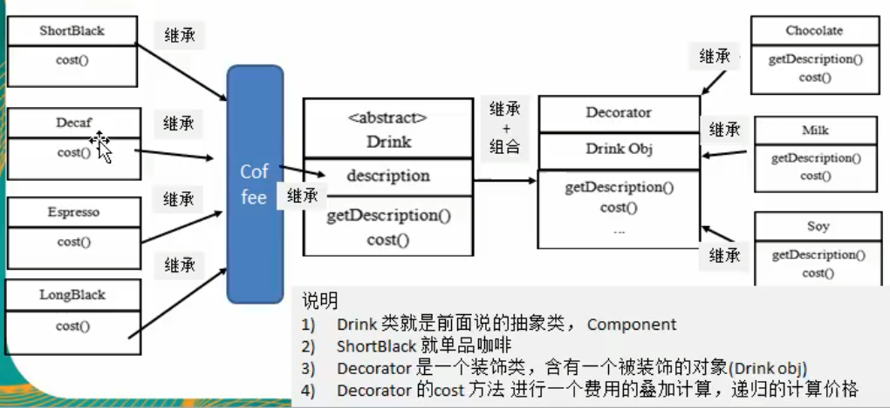

# 类图



```java
package com.atguigu.decorator;


public abstract class Drink {
    public String des; // 描述
    private float price = 0.0f;

    public String getDes() {
        return des;
    }

    public void setDes(String des) {
        this.des = des;
    }

    public float getPrice() {
        return price;
    }

    public void setPrice(float price) {
        this.price = price;
    }

    // 计算费用
    public abstract float cost();

}

```


```java
package com.atguigu.decorator;


public class Coffee extends Drink{
    @Override
    public float cost() {
        return getPrice();
    }
}


```
 
 
 
 ```java
package com.atguigu.decorator;


public class Espresso extends Coffee{
    // 构造器
    public Espresso() {
        setDes("意大利咖啡");
        // 设置价格6块钱
        setPrice(6.0f);
    }
}
```
 
```java
package com.atguigu.decorator;


public class LongBlack extends Coffee{
    public LongBlack() {
        setDes("没事咖啡");
        setPrice(5.0f)
    }
}

```
  
  ```java
package com.atguigu.decorator;


public class ShortBlack extends Coffee{
    public ShortBlack() {
        setDes("单品咖啡");
        setPrice(4.0f);
    }
}

```
  
  
```java
package com.atguigu.decorator;


public class Decorator extends Drink {
    private Drink obj;

    public Decorator(Drink obj) {
        // 组合
        this.obj = obj;
    }

    @Override
    public float cost() {
        // 自己价格getprice
        return super.getPrice() + obj.cost();
    }

    @Override
    public String getDes() {
        // 输出被装饰者信息
        return des + " " + getPrice() + "&&" + obj.getDes();
//        super不写也行
//        return super.des + " " + super.getPrice() + "&&" + obj.getDes();
    }
}
```
  
  ```java
package com.atguigu.decorator;

/**
 * 具体的Decorator,这里就是调味品
 */
public class Chocolate extends Decorator{
    public Chocolate(Drink obj) {
        super(obj);
        setDes("巧克力");
        // 调味品的价格,是3块钱
        setPrice(3.0f);
    }
}

```


```java
package com.atguigu.decorator;

/**
 * 
 */
public class Milk extends Decorator{
    public Milk(Drink obj) {
        super(obj);
        setDes("牛奶");
        setPrice(2.0f);
    }
}

```

```java
package com.atguigu.decorator;


public class Soy extends Decorator{
    public Soy(Drink obj) {
        super(obj);
        setDes("豆浆");
        setPrice(1.15f);
    }
}
```

### 执行01

```java
package com.atguigu.decorator;


public class CoffeeBar {
    public static void main(String[] args) {

        // 用装饰者模式下订单,: 2份巧克力+1份牛奶的LongBlack
        // 1. 点一份 LongBlack
        Drink order = new LongBlack();
        System.out.println("费用:"+order.cost());
        System.out.println("描述="+order.getDes());
        /*
        费用:5.0
        描述=没事咖啡
        
        Process finished with exit code 0
        * */
    }
}

```

### 执行02

```java
package com.atguigu.decorator;


public class CoffeeBar {
    public static void main(String[] args) {

        // 用装饰者模式下订单,: 2份巧克力+1份牛奶的LongBlack
        // 1. 点一份 LongBlack
        Drink order = new LongBlack();
        System.out.println("费用:"+order.cost());
        System.out.println("描述="+order.getDes());

        // 2. 加一份牛奶
        order = new Milk(order);
        // 参数就是返回值,相当于order被装饰了
        // 相当于给我们第一份订单加入了一份牛奶

        System.out.println("order加入一份牛奶 费用="+order.cost());
        System.out.println("order加入一份牛奶 描述="+order.getDes());
        /*
        费用:5.0
        描述=没事咖啡
        order加入一份牛奶 费用=7.0
        order加入一份牛奶 描述=牛奶 2.0&&没事咖啡
        
        Process finished with exit code 0
        * */
    }
}

```

### 执行03

```java
package com.atguigu.decorator;


public class CoffeeBar {
    public static void main(String[] args) {

        // 用装饰者模式下订单,: 2份巧克力+1份牛奶的LongBlack
        // 1. 点一份 LongBlack
        Drink order = new LongBlack();
        System.out.println("费用:"+order.cost());
        System.out.println("描述="+order.getDes());

        // 2. 加一份牛奶
        order = new Milk(order);
        // 参数就是返回值,相当于order被装饰了
        // 相当于给我们第一份订单加入了一份牛奶
        System.out.println("order加入一份牛奶 费用="+order.cost());
        System.out.println("order加入一份牛奶 描述="+order.getDes());
        // 3. 加入一份巧克力
        order = new Chocolate(order);

        System.out.println("order加入一份牛奶和巧克力 费用="+order.cost());
        System.out.println("order加入一份牛奶和巧克力 描述="+order.getDes());
        /*
        费用:5.0
        描述=没事咖啡
        order加入一份牛奶 费用=7.0
        order加入一份牛奶 描述=牛奶 2.0&&没事咖啡
        order加入一份牛奶和巧克力 费用=10.0
        order加入一份牛奶和巧克力 描述=巧克力 3.0&&牛奶 2.0&&没事咖啡
        * */
    }
}
```


### 执行04

```java
package com.atguigu.decorator;


public class CoffeeBar {
    public static void main(String[] args) {

        // 用装饰者模式下订单,: 2份巧克力+1份牛奶的LongBlack
        // 1. 点一份 LongBlack
        Drink order = new LongBlack();
        System.out.println("费用:"+order.cost());
        System.out.println("描述="+order.getDes());

        // 2. 加一份牛奶
        order = new Milk(order);
        // 参数就是返回值,相当于order被装饰了
        // 相当于给我们第一份订单加入了一份牛奶
        System.out.println("order加入一份牛奶 费用="+order.cost());
        System.out.println("order加入一份牛奶 描述="+order.getDes());
        // 3. 加入一份巧克力
        order = new Chocolate(order);

        System.out.println("order加入一份牛奶和巧克力 费用="+order.cost());
        System.out.println("order加入一份牛奶和巧克力 描述="+order.getDes());
        // 4. 再加入一份巧克力
        order = new Chocolate(order);

        System.out.println("order加入一份牛奶和2巧克力 费用="+order.cost());
        System.out.println("order加入一份牛奶和2巧克力 描述="+order.getDes());
        /*
        费用:5.0
        描述=没事咖啡
        order加入一份牛奶 费用=7.0
        order加入一份牛奶 描述=牛奶 2.0&&没事咖啡
        order加入一份牛奶和巧克力 费用=10.0
        order加入一份牛奶和巧克力 描述=巧克力 3.0&&牛奶 2.0&&没事咖啡
        order加入一份牛奶和2巧克力 费用=13.0
        order加入一份牛奶和2巧克力 描述=巧克力 3.0&&巧克力 3.0&&牛奶 2.0&&没事咖啡
        * */
    }
}
```


### 课堂休息
同学有没有发现,这个模式的优势,我如果想要扩展,一个新的种类的咖啡,比如 DeCaf 咖啡,我只需要新建这个类之后,他就能和各个调料进行关联了

秒啊

