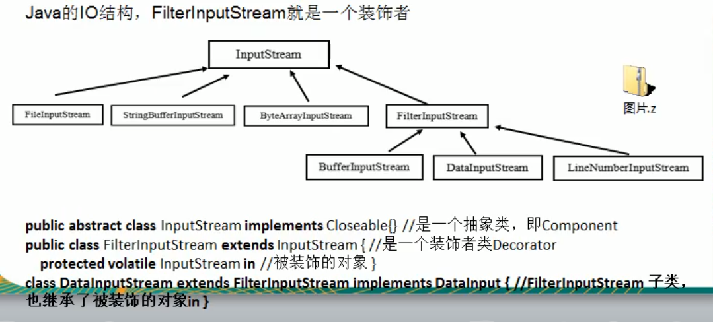
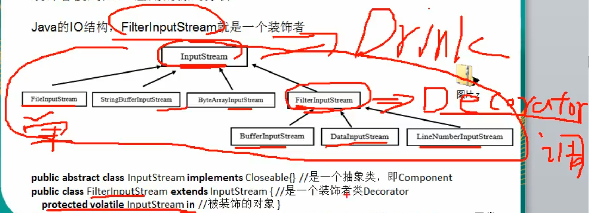

# 装死者模式在JDK应用的源码分析





### 直接上代码
```java
package com.atguigu.jdk;


import java.io.DataInputStream;
import java.io.FileInputStream;

public class Decorator {
    public static void main(String[] args) throws Exception{
        DataInputStream dis = new DataInputStream(
                new FileInputStream("E:\\Projects\\IdeaProjects\\design_pattern\\out\\demo.txt")
        );
        /*
        demo.txt 文件内容:
        o
        * */
        System.out.println(dis.read());
        dis.close();
        /*
        111
        * */
    }
}

```

```java
/**
 * A <code>FileInputStream</code> obtains input bytes
 * from a file in a file system. What files
 * are  available depends on the host environment.
 *
 * <p><code>FileInputStream</code> is meant for reading streams of raw bytes
 * such as image data. For reading streams of characters, consider using
 * <code>FileReader</code>.
 *
 * @author  Arthur van Hoff
 * @see     java.io.File
 * @see     java.io.FileDescriptor
 * @see     java.io.FileOutputStream
 * @see     java.nio.file.Files#newInputStream
 * @since   JDK1.0
 */
public
class FileInputStream extends InputStream
{
    /* File Descriptor - handle to the open file */
    private final FileDescriptor fd;

    /**
     * The path of the referenced file
     * (null if the stream is created with a file descriptor)
     */
    private final String path;

    private FileChannel channel = null;

    private final Object closeLock = new Object();
    private volatile boolean closed = false;
```

InputStream是一个抽象的


```java
/**
 * This abstract class is the superclass of all classes representing
 * an input stream of bytes.
 *
 * <p> Applications that need to define a subclass of <code>InputStream</code>
 * must always provide a method that returns the next byte of input.
 *
 * @author  Arthur van Hoff
 * @see     java.io.BufferedInputStream
 * @see     java.io.ByteArrayInputStream
 * @see     java.io.DataInputStream
 * @see     java.io.FilterInputStream
 * @see     java.io.InputStream#read()
 * @see     java.io.OutputStream
 * @see     java.io.PushbackInputStream
 * @since   JDK1.0
 */
public abstract class InputStream implements Closeable {

    // MAX_SKIP_BUFFER_SIZE is used to determine the maximum buffer size to
    // use when skipping.
    private static final int MAX_SKIP_BUFFER_SIZE = 2048;

    /**
     * Reads the next byte of data from the input stream. The value byte is
     * returned as an <code>int</code> in the range <code>0</code> to
     * <code>255</code>. If no byte is available because the end of the stream
     * has been reached, the value <code>-1</code> is returned. This method
     * blocks until input data is available, the end of the stream is detected,
     * or an exception is thrown.
     *
     * <p> A subclass must provide an implementation of this method.
     *
     * @return     the next byte of data, or <code>-1</code> if the end of the
     *             stream is reached.
     * @exception  IOException  if an I/O error occurs.
     */
    public abstract int read() throws IOException;
```


```java

/**
 * A <code>FilterInputStream</code> contains
 * some other input stream, which it uses as
 * its  basic source of data, possibly transforming
 * the data along the way or providing  additional
 * functionality. The class <code>FilterInputStream</code>
 * itself simply overrides all  methods of
 * <code>InputStream</code> with versions that
 * pass all requests to the contained  input
 * stream. Subclasses of <code>FilterInputStream</code>
 * may further override some of  these methods
 * and may also provide additional methods
 * and fields.
 *
 * @author  Jonathan Payne
 * @since   JDK1.0
 */
public
class FilterInputStream extends InputStream {
    /**
     * The input stream to be filtered.
     */
    protected volatile InputStream in;

    /**
     * Creates a <code>FilterInputStream</code>
     * by assigning the  argument <code>in</code>
     * to the field <code>this.in</code> so as
     * to remember it for later use.
     *
     * @param   in   the underlying input stream, or <code>null</code> if
     *          this instance is to be created without an underlying stream.
     */
```

### 敲黑板


```java
package com.atguigu.jdk;


import java.io.DataInputStream;
import java.io.FileInputStream;

public class Decorator {
    public static void main(String[] args) throws Exception{
        // 说明
        // 1. InputStream 是抽象类,类似我们前面的Drink
        // 2. FileInputStream 是 InputStream 子类,类似我们前面的DeCaf, LongBlack
        // 3. FilterInputStream 是 InputStream 子类: 类似我们其那面的 Decorator 修饰者
        // 4. DataInputStream 是 FilterInputStream子类, 具体的修饰者,类似其那面的 Milk,Soy 等
        // 5. FilterInputStream 类 有 protected volatile InputStream in; 即含被装饰者
        // 6. 分析得出: 在jdk的IO体系中,就是使用装饰者模式
        DataInputStream dis = new DataInputStream(
            new FileInputStream("E:\\Projects\\IdeaProjects\\design_pattern\\out\\demo.txt")
        );
        System.out.println(dis.read());
        dis.close();

    }
}
```