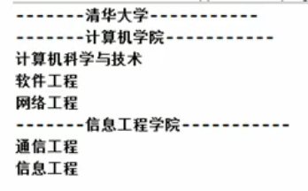
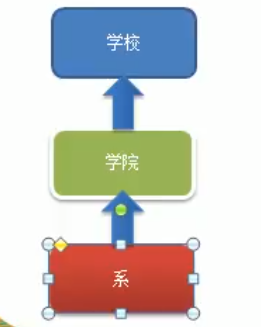
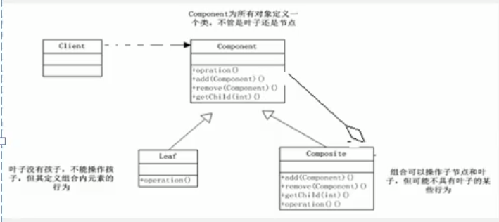
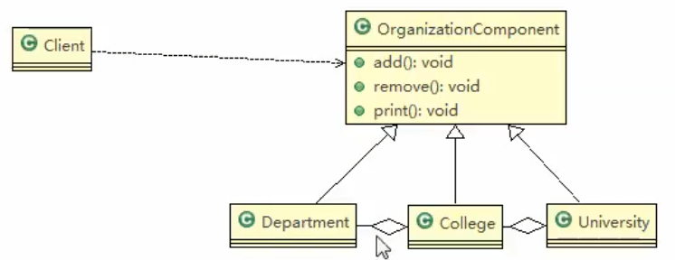

# 案例分析
## 学校院系展示需求

编程实现展示一个学校院系结构: 需求是这样,要在一个页面中展示出学校的院系组成,一个学校有多个学院,一个学院有多个系. 如图:



>我艹,这不是我的母校么

### 屌丝程序员方法



### 传统方案解决学校院系展示存在的问题分析

1. 将学院看做是学校的子类,系是学院的子类,这样实际上是站在组织大小来进行区分层次的
2. 实际上我们的要求是: 在一个页面中展示出学校的院系组成,一个学校有多个学院,一个学院有多个系,因此,这种方案,不能很好实现的管理的操作,比如,对学院,系 的 添加/删除/遍历 等等
3. 解决方案: 把学校,院,系都 看做是 组织结构,他们之间没有继承关系,而是一个树形结构,可以更好的实现管理操作. => 组合模式

# 组合模式

## 基本介绍

1. __组合模式__,(Composite Pattern),又叫 __部分整体模式__ ,它创建了对象组的树形结构,将对象组合成树状结构以表示"整体-部分"的层次关系.
2. 组合模式依据树形结构来组合对象,用来表示部分以及整体层次.
3. 这种类型的设计模式属于结构型模式.
4. 组合模式使得用户对单个对象和组合对象的访问具有一致性,__即__: 组合能让客户以一致的方式处理个别对象以及组合对象.


### 类图



对原理结构图的说明-即(组合模式的角色及职责)
1. Component: 这是组合中对象声明接口,在适当情况下,实现所有类公有的接口默认行为,用于访问和管理Component 子部件,`Component`可以是抽象类或者接口
2. leaf: 在组合模式中表示的是叶子节点(最终的节点),也就是没有子节点
3. Composite: 非叶子节点,用于存储子部件,在Component接口中,实现子部件的相关操作,比如增加(add),删除..


# 组合模式解决学校院系展示

1. 应用实例要求
编写程序展示一个学校院系结构:需求是这样的,要在一个页面中展示出学校的院系组成,一个学校有多个学院,一个学院有多个系.
2. 思路分析和图解(类图)


### 3. 代码实践

现在就是怎样一种关系呢

University中聚合的是College,College中聚合的是department


```java
package com.atguigu.composite;


public abstract class OrganizationComponent {
    private String name;
    private String des;

    protected void add(OrganizationComponent organizationComponent) {
        // 默认实现
        throw new UnsupportedOperationException();

    }
    protected void remove(OrganizationComponent organizationComponent) {
        // 默认实现
        throw new UnsupportedOperationException();

    }
    // 构造器

    public OrganizationComponent(String name, String des) {
        this.name = name;
        this.des = des;
    }

    // 方法打印,做成抽象的
    protected abstract void print();
    // 这个方法的子类都需要实现


    public String getName() {
        return name;
    }

    public void setName(String name) {
        this.name = name;
    }

    public String getDes() {
        return des;
    }

    public void setDes(String des) {
        this.des = des;
    }
}

```


```java
package com.atguigu.composite;


import java.util.ArrayList;
import java.util.List;

public class University extends OrganizationComponent{


    List<OrganizationComponent> organizationComponents = new ArrayList<>();

    // 构造器
    public University(String name, String des, List<OrganizationComponent> organizationComponents) {
        super(name, des);
        this.organizationComponents = organizationComponents;
    }

    @Override
    protected void add(OrganizationComponent organizationComponent) {
        organizationComponents.add(organizationComponent);
    }
    @Override
    protected void remove(OrganizationComponent organizationComponent) {
        organizationComponents.remove(organizationComponent);
    }

    @Override
    public String getName() {
        return super.getName();
    }

    @Override
    public String getDes() {
        return super.getDes();
    }

    // print 方法,就是输出University 包含的学院
    @Override
    protected void print() {
        System.out.println("------"+getName()+"-----");
        // 遍历organizationComponents
        for (OrganizationComponent organizationComponent : organizationComponents) {
            organizationComponent.print();
        }
    }
}

```


```java
package com.atguigu.composite;

import java.util.ArrayList;
import java.util.List;


public class College extends OrganizationComponent {

    // 这个list中存放的是 department
    List<OrganizationComponent> organizationComponents = new ArrayList<>();

    // 构造器
    public College(String name, String des, List<OrganizationComponent> organizationComponents) {
        super(name, des);
        this.organizationComponents = organizationComponents;
    }

    @Override
    protected void add(OrganizationComponent organizationComponent) {
        // 在将来,实际业务中,这个College的add和University的add方法不一定完全相同
        organizationComponents.add(organizationComponent);
    }
    @Override
    protected void remove(OrganizationComponent organizationComponent) {
        organizationComponents.remove(organizationComponent);
    }

    @Override
    public String getName() {
        return super.getName();
    }

    @Override
    public String getDes() {
        return super.getDes();
    }

    // print 方法,就是输出University 包含的学院
    @Override
    protected void print() {
        System.out.println("------"+getName()+"-----");
        // 遍历organizationComponents
        for (OrganizationComponent organizationComponent : organizationComponents) {
            organizationComponent.print();
        }
    }
}

```


```java
package com.atguigu.composite;


public class Department extends OrganizationComponent{

    //构造
    public Department(String name, String des) {
        super(name, des);
    }
    // 这个里面的add方法和 remove方法就可以不要了


    @Override
    public String getName() {
        return super.getName();
    }

    @Override
    public String getDes() {
        return super.getDes();
    }

    @Override
    protected void print() {
        System.out.println(getName());
    }
}

```
 
 ```java
package com.atguigu.composite;


public class Client {
    public static void main(String[] args) {
        // 从大到小创建对象
        OrganizationComponent uni = new University("清华大学", "中国顶级的大学");
        // 创建学院
        OrganizationComponent computerCollege = new College("计算机学院", "计算机IT技术NB");
        OrganizationComponent infoEngineerCollege = new College("信息学院", "信息与信号技术");
        computerCollege.add(new Department("软件工程", "软件工程NB"));
        computerCollege.add(new Department("计算机科学与技术", "老牌专业"));
        computerCollege.add(new Department("网络工程", "网络工程NB"));

        infoEngineerCollege.add(new Department("信息工程", "信公秤不好学"));
        infoEngineerCollege.add(new Department("通讯工程", "通公平不好学"));
        // 将学院加入到学院中
        uni.add(computerCollege);
        uni.add(infoEngineerCollege);

        uni.print();
        // 这里你用谁打印,就输出谁的下面的信息
        // 就灵活,比如你现在再有,一个级别,你可以把他聚合进来,嗯

        /*
        ------清华大学-----
        ------计算机学院-----
        软件工程
        计算机科学与技术
        网络工程
        ------信息学院-----
        信息工程
        通讯工程

        Process finished with exit code 0
        * */
    }
}

```
 
 
 
 
 
 
 
 
 
 
 
 
 
 
 
 
 
 
 
 
