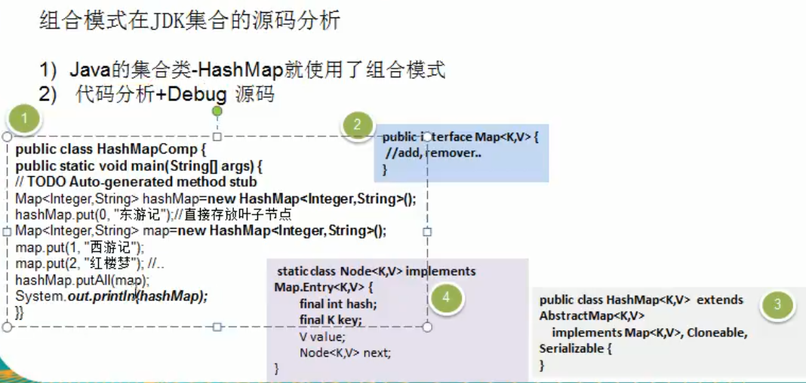

# 组合模式在JDK集合的源码分析




看一下类图


```java
package com.atguigu.jdk;

import java.util.HashMap;
import java.util.Map;


public class Composite {
    public static void main(String[] args) {

        // 说明
        // 1.Map 就是一个抽象的构建(类似我们的Component)
        // 2.HashMap是一个中间的构建(Composite),实现/继承了相关方法
        //   put,putall
        // 3.Node是 HashMap的静态累不累,类似Leaf叶子节点,这里就没有put,putall
        // static class Node<K,V> implements Map.Entry<K,V>

        Map<Integer, String> hashMap = new HashMap<Integer, String>();
        hashMap.put(0,"东游记");   // 直接存放叶子节点

        Map<Integer, String> map = new HashMap<Integer, String>();
        map.put(1, "西游记");
        map.put(2, "红楼梦");
        hashMap.putAll(map);
        System.out.println(hashMap);
    }
}

```


    

