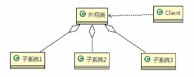
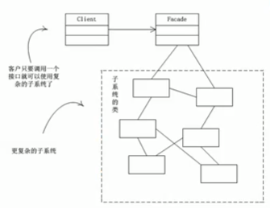
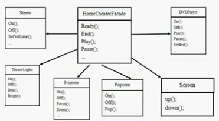

# 先来一个案例

### 影院管理

组建一个家庭影院:
DVD播放,投影仪,自动屏幕,环绕立体声,爆米花机,要求完成使用家庭影院的功能,其过程为:

- 直接用遥控器:统筹各设备开关
- 开爆米花机
- 放下屏幕
- 开投影仪
- 开音响
- 开DVD,统筹各个设备开关
- 去拿爆米花
- 调暗灯光
- 播放
- 观影结束后,关闭各种设备

 ### 传统方式解决影院管理问题分析
 
 1. 在ClientTest 的main方法中,创建各个子系统的对象,并直接去调用子系统(对象)相关方法,会造成调用过程混乱,没有清晰的过程
 
 2. 不利于在ClientTest中,去维护对子系统的操作
 
 3. 解决思路: 定义一个高层接口,给子系统中的一组接口提供一个 __一致的界面(比如在高层接口提供四个方法 ready,play,pause,end)__用来访问子系统中的一群接口
 
 4. __也就是说__ 就是通过定义一个一致的接口(界面类),用以屏蔽内部子系统的细节,使得调用端只需跟这个接口发生调用,而无需关心这个子系统的内部细节 => 外观模式 
 
 
 ### 一句话
 
 说白了就是又封装了一层,然后嗯,客户端不用关心调用细节,提供了一个封装的面板类,面板界面来调用其他的接口
 
 
 ## 外观模式基本介绍
 
 1. 外观模式(Facade), 也叫做"过程模式": 外观模式为子系统中的一组接口提供一个一致的界面,此模式定义了一个高层接口,这个接口使得这以子系统更加容易使用
 
 2. 外观模式通过定义一个一致的接口,用以屏蔽内部子系统的细节,使得调用端只需跟这个接口发生调用,而无需关心这个子系统的内部细节
 
 
 ### 外观模式原理类图
 
 
 
 原理类图的说明(外观模式的角色)
 
 1. 外观类(Facade): 为调用端提供统一的调用的接口,外观类知道哪些子系统负责处理请求,从而将调用端的请求代理给适当子系统对象
 2. 调用者(Clinet):外观接口的调用者
 3. 子系统的集合: 指模块或者子系统,处理Facade对象指派的任务,他是功能的提供者
 
 
 ### 传统观念方式解决影院管理说明
 
1. 外观模式可用理解为转换一群接口,客户只要调用一个接口,而不用调用多个接口才能达到目的.
 
    比如:在pc上安装软件的时候经常用一键安装选项(省去 选择安装目录,安装的组件等等),还有几十手机的重启功能(把关机和启动何为一个操作)
    
2.   外观模式就是解决多个复杂接口带来的使用困难,起到简化用户操作的作用
3. 示意图  
     
      

 
 
 
 ### 外观应用实例
 
 

 
 
 
 
 
 
 
 
 
 
 
 
 
 
 
 
 
 
 
 