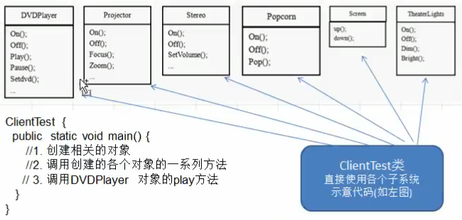

# 先来一个案例

### 影院管理

组建一个家庭影院:
DVD播放,投影仪,自动屏幕,环绕立体声,爆米花机,要求完成使用家庭影院的功能,其过程为:

- 直接用遥控器:统筹各设备开关
- 开爆米花机
- 放下屏幕
- 开投影仪
- 开音响
- 开DVD,统筹各个设备开关
- 去拿爆米花
- 调暗灯光
- 播放
- 观影结束后,关闭各种设备

 ### 传统方式解决影院管理问题分析
 
 1. 在ClientTest 的main方法中,创建各个子系统的对象,并直接去调用子系统(对象)相关方法,会造成调用过程混乱,没有清晰的过程
 
 2. 不利于在ClientTest中,去维护对子系统的操作
 
 3. 解决思路: 定义一个高层接口,给子系统中的一组接口提供一个 __一致的界面(比如在高层接口提供四个方法 ready,play,pause,end)__用来访问子系统中的一群接口
 
 4. __也就是说__ 就是通过定义一个一致的接口(界面类),用以屏蔽内部子系统的细节,使得调用端只需跟这个接口发生调用,而无需关心这个子系统的内部细节 => 外观模式 
 
 
 
 
 
 
 
 
 
 
 
 