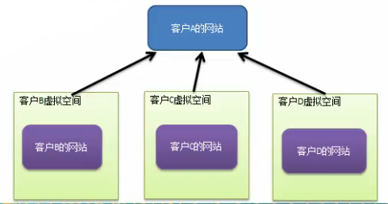
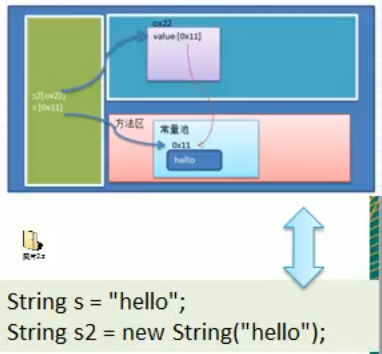

# 网站外包

## 展示网站项目需求

小型的外包项目,给客户A做一个产品展示网站,客户A的朋友感觉效果不错,也希望做这样的产品展示网站,但是要求都有些不同:

1. 有客户要求以新闻的形式发布
2. 有客户人要求以博客的形式发布
3. 有客户希望以微信公众号的形式发布

## 传统方案解决网站展现项目

1. 直接复制粘贴一份,然后根据客户不同要求,进行定制修改
2. 给每个网站租用一个空间
3. 方案设计示意图

## 传统方案解决网站展现项目问题分析

1. 需要的网站结构相似度很高,而且都不是高访问量网站,如果分成多个怩空间来处理的话,相当于一个相同网站实例对象很多,造成服务器的资源浪费
2. 解决思路: 整合到一个网站中,共享其相关代码和数据,对于硬盘,内存,CPU,数据库空间等服务器资源都可以达成共享,减少服务器资源
3. 对于代码来说,由于是一份实例,维护和扩展都更加容易
4. 上面的解决思路就可以使用 __享元模式__ 来解决

# 享元模式

## 定义

1. 享元模式(Flyweight Pattern) 也叫蝇量模式:运用 共享技术有效地支持大量细粒度的对象

2. 常用于系统底层开发,解决系统的性能问题.像 __数据库连接池__,里面都是创建好的连接对象,在这些对象中有我们需要的则直接拿来使用,避免重新创建,如果没有我们需要的,则创建一个

3. 享元模式能够解决 __重复对象的内存浪费的问题__,当系统中有大量相似对象,需要缓冲池时.不需要总是创建新对象,可以从缓冲池里拿哦.这样可以降低系统内存,同时提高效率

4. 享元模式 __经典的应用场景__ 就是池技术了, String 常量池,数据库连接池,缓冲池等等都是享元模式的应用,享元模式是池技术的重要实现方式

这两个"hello" 他就是 嗯 用的一个 

第二次new 的时候 这是在 堆空间中 创建了一个地址

## 原理类图

### 原理类图说明
 
 1. FlyWeight 是抽象的享元角色,它是产品的抽象类,同时定义出对象的外部状态和内部状态(后面介绍) 的接口或实现
 2. ConcreteFlyWeight 是具体的享元角色,是具体的产品类,实现抽象角色定义相关业务
 3. UNSharedConcreteFlyWeight 是不可共享角色,一般不会出现在享元公厂.
 4. FlyWeightFactory 享元工厂类,用于构建一个池容器(集合,同时提供从池中获取的方法)
 
 
 ## 内部状态&外部状态
 
 比如围棋,五子棋,跳棋,它们都有大量的棋子对象,围棋和五子棋只有黑白2色,跳棋颜色多一点儿,所以棋子颜色几十棋子内部状态;而各个棋子之间的差别就是位置的不同,当我们落子后,落子颜色是定的,但是位置变化的,所以棋子坐标就是棋子外部的状态
 
 1. 享元模式提出了两个要求:__细粒度__ 和 __共享对象__. 这里就涉及到内部状态和外部状态了,即 将对象的信息分为2个部分:__内部状态__ 和 __外部状态__ .
 2. __内部状态__ 指对象共享出来的信息,存储在享元对象内部且不会随环境的改变而改变
 3. __外部状态__ 指对象得以依赖的一个标记,是随环境改变而改变的,不可共享的状态.
 4. 举个例子: 围棋理论上有361个空位可以放棋子,每盘棋都有可能由两三百个棋子对象产生,因为内存空间有限,一台服务器很难支持更多的玩家玩围棋游戏,如果用**享元模式**来处理棋子,那么棋子对象就可以减少到只有2个实例,这样就很好的解决了对象的开销问题
 
 
 
 
 
 
 
 
 
 
 
 
 
 
 
 
 
 
 
 
 
 
 
 
 
 
 
 
 
 
 
 
 
 
 
 

