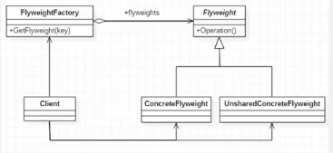

## 原理类图

### 原理类图说明
 
 1. FlyWeight 是抽象的享元角色,它是产品的抽象类,同时定义出对象的外部状态和内部状态(后面介绍) 的接口或实现
 2. ConcreteFlyWeight 是具体的享元角色,是具体的产品类,实现抽象角色定义相关业务
 3. UNSharedConcreteFlyWeight 是不可共享角色,一般不会出现在享元公厂.
 4. FlyWeightFactory 享元工厂类,用于构建一个池容器(集合,同时提供从池中获取的方法)
 
 
 ## 内部状态&外部状态
 
 比如围棋,五子棋,跳棋,它们都有大量的棋子对象,围棋和五子棋只有黑白2色,跳棋颜色多一点儿,所以棋子颜色几十棋子内部状态;而各个棋子之间的差别就是位置的不同,当我们落子后,落子颜色是定的,但是位置变化的,所以棋子坐标就是棋子外部的状态
 
 1. 享元模式提出了两个要求:__细粒度__ 和 __共享对象__. 这里就涉及到内部状态和外部状态了,即 将对象的信息分为2个部分:__内部状态__ 和 __外部状态__ .
 2. __内部状态__ 指对象共享出来的信息,存储在享元对象内部且不会随环境的改变而改变
 3. __外部状态__ 指对象得以依赖的一个标记,是随环境改变而改变的,不可共享的状态.
 4. 举个例子: 围棋理论上有361个空位可以放棋子,每盘棋都有可能由两三百个棋子对象产生,因为内存空间有限,一台服务器很难支持更多的玩家玩围棋游戏,如果用**享元模式**来处理棋子,那么棋子对象就可以减少到只有2个实例,这样就很好的解决了对象的开销问题
 
 
 
 

