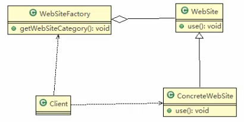
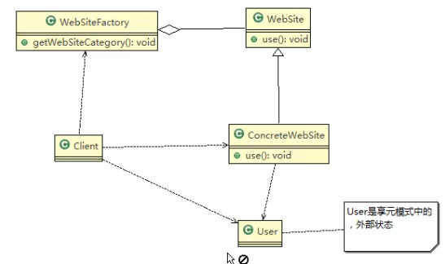

# 享元模式解决网站展现项目
 
## 1. 应用实例
 
### 类图
 
 

 
 ```java
package com.atguigu.flyweight;


public abstract class WebSite {
    public abstract void use(); // 抽象方法
}

```
 
 ```java
package com.atguigu.flyweight;

// 具体网站
public class ConcreteWebsite extends WebSite{
    // 共享的部分,内部状态
    private String type = "";//网站发布形式(类型)

    // 构造器
    public ConcreteWebsite(String type) {
        this.type = type;
    }
    
    @Override
    public void use() {
        System.out.println("网站的发布形式为: "+type+"输出");
    }
}
```
 
 
 ```java
package com.atguigu.flyweight;

import java.util.HashMap;

/**
 * 网站工厂类,根据需求返回一个网站
 */

public class WebSiteFactory {
    // 集合,充当池的作用
    private HashMap<String, ConcreteWebsite> pool = new HashMap<>();

    // 根据网站的类型,返回一个网站,如果没有就创建一个网站,并放入到池中,并返回
    public WebSite getWebSiteCategory(String type) {
        if (!pool.containsKey(type)) {
//            如果type在这个池子里面没有
//            就创建一个网站,并放入到池中
            pool.put(type, new ConcreteWebsite(type));
        }
        return (WebSite) pool.get(type);
    }

    // 获取网站分类总数(池子中有多少个网站类型)
    public int getWebSiteCount() {
        return pool.size();
    }

}

```
 
 客户端
 
 
 ```java
package com.atguigu.flyweight;


public class Clinet {
    public static void main(String[] args) {
        System.out.println();
        // 创建一个工厂类
        WebSiteFactory factory = new WebSiteFactory();
        // 现在客户要一个以新闻形式发布的网站
        WebSite webSite1 = factory.getWebSiteCategory("新闻");
        webSite1.use();
        /*
        网站的发布形式为: 新闻输出

        Process finished with exit code 0
        * */
    }
}

```

现在需求又改了


```java
package com.atguigu.flyweight;


public class Clinet {
    public static void main(String[] args) {
        System.out.println();
        // 创建一个工厂类
        WebSiteFactory factory = new WebSiteFactory();
        // 现在客户要一个以新闻形式发布的网站
        WebSite webSite1 = factory.getWebSiteCategory("新闻");
        webSite1.use();
        // 现在客户要一个以博客形式发布的网站
        WebSite webSite2 = factory.getWebSiteCategory("博客");
        webSite2.use();
        // 现在客户又要一个以博客形式发布的网站
        WebSite webSite3 = factory.getWebSiteCategory("博客");
        webSite3.use();
        /*
        网站的发布形式为: 新闻输出
        网站的发布形式为: 博客输出
        网站的发布形式为: 博客输出

        Process finished with exit code 0
        * */
    }
}

```
 
 ---
 
 > 前面的模式没有外部的状态(用户)


## 优化版本

### 类图




### 看代码


我加一个user类


```java
package com.atguigu.flyweight;


public class User {
    private String name;

    public String getName() {
        return name;
    }

    public void setName(String name) {
        this.name = name;
    }
}

```


 这个要加上参数
 
 
 ```java
package com.atguigu.flyweight;


public abstract class WebSite {
    public abstract void use(User user); // 抽象方法
}

```
 
 
 


 这个对应改一下
 
 
 ```java
package com.atguigu.flyweight;

// 具体网站
public class ConcreteWebsite extends WebSite{
    // 共享的部分,内部状态
    private String type = "";//网站发布形式(类型)

    // 构造器
    public ConcreteWebsite(String type) {
        this.type = type;
    }

    @Override
    public void use(User user) {
        System.out.println("网站的发布形式为: "+type+"在使用中"+"使用者是"+user.getName());
    }
}

```
 
 客户端调用
 
 
 
 ```java
package com.atguigu.flyweight;


public class Clinet {
    public static void main(String[] args) {
        System.out.println();
        // 创建一个工厂类
        WebSiteFactory factory = new WebSiteFactory();
        // 现在客户要一个以新闻形式发布的网站
        WebSite webSite1 = factory.getWebSiteCategory("新闻");

        webSite1.use(new User("tom"));
        // 现在客户要一个以博客形式发布的网站
        WebSite webSite2 = factory.getWebSiteCategory("博客");
        webSite2.use(new User("victor"));
        // 现在客户又要一个以博客形式发布的网站
        WebSite webSite3 = factory.getWebSiteCategory("博客");
        webSite3.use(new User("smith"));
        /*
        网站的发布形式为: 新闻在使用中使用者是tom
        网站的发布形式为: 博客在使用中使用者是victor
        网站的发布形式为: 博客在使用中使用者是smith

        Process finished with exit code 0
        * */
    }
}

```
 
 ## 一句话
 
 他能够将外部状态和内部状态分开
 
 
 
 
 
 
 

