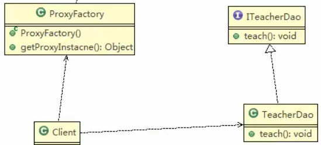

## 动态代理

### 动态代理模式的基本介绍

1. 代理对象,不需要实现接口,但是目标对象要实现接口,否则不能用动态代理
2. 代理对象的生成,是利用JDK的API,动态的在内存中构建代理对象
3. 动态代理也叫做: JDK代理,接口代理

### JDK中生成代理的对象的API

1. 代理类所在包: java.lang.reflect.Proxy
2. JDK实现代理只需要使用newProxyInstance方法,但是该方法需要接收三个参数,完整的写法是
    ```java
    Static Object newProxyInstance(ClassLoader loader,Class<?>[] interfaces,InvocationHandler h)
    ```
     
 
 
 ## 案例实践
 
动态的返回对象
 
### 类图

getProxyInstance():
1. 根据传入的对象(TeacherDao)
2. 利用返回机制,返回一个**代理对象**
3. 然后通过代理对象,调用**目标对象**方法 
 
 
 

 ### 代码演示
 
 ```java
package com.atguigu.proxy.dynamic;


public interface ITeacherDao {
    void teach();   // 授课方法

}

```
 
 
 
 
 
 
 
 ```java
package com.atguigu.proxy.dynamic;


public class TeacherDao implements ITeacherDao{

    @Override
    public void teach() {
        //
        System.out.println("老师正在授课中...");
    }
}

```
 
 重要部分来了,敲黑板
 
 
 ```java
package com.atguigu.proxy.dynamic;

import java.lang.reflect.InvocationHandler;
import java.lang.reflect.Method;
import java.lang.reflect.Proxy;

/**
 *
 */
public class ProxyFactory {
    // 维护一个目标对象
    private Object target;

    // 构造器,对target目标对象 进行初始化
    public ProxyFactory(Object target) {
        this.target = target;
    }

    // 给目标对象生成一个代理对象
    public Object getProxyInstance() {
        //
        /*
        * 说明
        *     @CallerSensitive
    public static Object newProxyInstance(ClassLoader loader,
                                          Class<?>[] interfaces,
                                          InvocationHandler h)
          参数说明                          *
        * 1. ClassLoader loader: 指定当前目标对象爱你个使用的类加载器,获取加载器的方法固定
        * 2. Class<?>[] interfaces: 目标对象实现的接口类型,使用泛型方式确认类型
        * 3. InvocationHandler h: 事件处理,执行目标对象的方法时,会触发事情处理器方法
        *                         会把当前执行的目标 对象方法作为参数传入
        * */
        return Proxy.newProxyInstance(
                // 第一个参数
                target.getClass().getClassLoader(),
                // 第二个参数
                target.getClass().getInterfaces(),
                // 第三个参数
                new InvocationHandler() {
                    @Override
                    public Object invoke(Object proxy, Method method, Object[] args) throws Throwable {
                        System.out.println("JDK代理开始~~");
                        // 反射机制调用目标对象的方法
                        Object returnVal = method.invoke(target, args);
                        System.out.println("JDK代理提交~~");
                        return returnVal;
                    }
                }
        );
    }
}
```
 
客户端
 
 
 ```java
package com.atguigu.proxy.dynamic;

/**
 * 客户端
 */
public class Client {
    public static void main(String[] args) {
        System.out.println();
        // 创建目标对象
        ITeacherDao target = new TeacherDao();
        // 给目标对象,创建代理对象
        // 用我们的代理工厂类
        Object proxyInstance = new ProxyFactory(target).getProxyInstance();
        // 可以转换成ITeacherDao
        ITeacherDao IProxyInstance = (ITeacherDao) proxyInstance;
        System.out.println("IProxyInstance="+IProxyInstance);
        System.out.println("IProxyInstance类型="+IProxyInstance.getClass());

        //IProxyInstance类型=class com.sun.proxy.$Proxy0 内存中动态生成了代理对象
        // 通过代理对象调用目标对象的方法
        IProxyInstance.teach();
        /**
         * JDK代理开始~~
         * JDK代理提交~~
         * IProxyInstance=com.atguigu.proxy.dynamic.TeacherDao@12a3a380
         * IProxyInstance类型=class com.sun.proxy.$Proxy0
         * JDK代理开始~~
         * 老师正在授课中...
         * JDK代理提交~~
         *
         * Process finished with exit code 0
         * */

    }
}
```
 

### 扩展功能


```java
package com.atguigu.proxy.dynamic;


public interface ITeacherDao {
    void teach();   // 授课方法

    void sayHello(String hello);// 在家一个方法

}

```


```java
package com.atguigu.proxy.dynamic;


public class TeacherDao implements ITeacherDao{

    @Override
    public void teach() {
        //
        System.out.println("老师正在授课中...");
    }

    @Override
    public void sayHello(String name) {
        System.out.println("hello"+name);
    }
}
```


```java
package com.atguigu.proxy.dynamic;

/**
 * 客户端
 */
public class Client {
    public static void main(String[] args) {
        System.out.println();
        // 创建目标对象
        ITeacherDao target = new TeacherDao();
        // 给目标对象,创建代理对象
        // 用我们的代理工厂类
        Object proxyInstance = new ProxyFactory(target).getProxyInstance();
        // 可以转换成ITeacherDao
        ITeacherDao IProxyInstance = (ITeacherDao) proxyInstance;
        System.out.println("IProxyInstance="+IProxyInstance);
        System.out.println("IProxyInstance类型="+IProxyInstance.getClass());

        //IProxyInstance类型=class com.sun.proxy.$Proxy0 内存中动态生成了代理对象
        // 通过代理对象调用目标对象的方法
        IProxyInstance.teach();
        IProxyInstance.sayHello("jack");
        /**
         * JDK代理开始~~
         * JDK代理提交~~
         * IProxyInstance=com.atguigu.proxy.dynamic.TeacherDao@12a3a380
         * IProxyInstance类型=class com.sun.proxy.$Proxy0
         * JDK代理开始~~
         * 老师正在授课中...
         * JDK代理提交~~
         * JDK代理开始~~
         * hellojack
         * JDK代理提交~~
         *
         * Process finished with exit code 0
         * */

    }
}
```
 
 
 
 
 
 
> 静态代理是把将要被代理的类聚合到执行代理的类中嗯
>
>动态代理是调用JDK系统的方法,来执行代理,能够带一些参数进去嗯
 
 
 
 
 
 
 


 
 
 ## 一句话 ,加了一层又