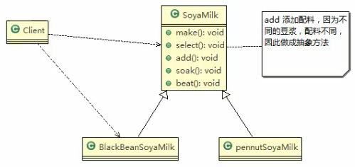

## 应用实例要求

编写制作豆浆的程序,说明如下:
- 制作豆浆的流程 选材 => 添加配料 => 浸泡 => 放到豆浆机打碎
- 通过添加不同的配料,可以制作出不同口味的豆浆
- 选材,浸泡和放到豆浆机打碎这几个步骤对于制作每种口味的豆浆都是一样的(红豆,花生豆浆..)

### 类图




### 代码

```java
package com.atguigu.template;


public abstract class SoyaMilk {
//    模板方法,make,模板方法可以做成final,不让子类去覆盖
    final void make() {
        // 第一步
        select();
        addCondiments();
        soak();
        beat();
    }

    // 选材料
    void select() {
        System.out.println("第一步: 选择好的新鲜黄豆");
    }

    // 添加不同的配料,抽象方法,子类具体实现
    abstract void addCondiments();

    // 浸泡
    void soak() {
        System.out.println("第三部,黄豆和配料开始浸泡,需要3小时");
    }

    //
    void beat() {
        System.out.println("第四部,黄豆和配料放到豆浆机去打碎!");
    }
}

```
 
 
 
 
 
 
 
 ```java
package com.atguigu.template;


public class RedBeanSoyaMilk extends SoyaMilk{
    @Override
    void addCondiments() {
        System.out.println("加入上号的红豆");
    }
}

```
 
 
 
 
 ```java
package com.atguigu.template;


public class PeanutSoyaMilk extends SoyaMilk{

    @Override
    void addCondiments() {
        System.out.println("加入上号的花生!");
    }
}
```
 
 
 
 
 
 客户端
 
 ```java
package com.atguigu.template;


public class Client {
    public static void main(String[] args) {
        System.out.println("---------");
        // 制作红豆豆浆
        System.out.println("----制作红豆豆浆----");
        SoyaMilk redBeanSoyaMilk = new RedBeanSoyaMilk();
        redBeanSoyaMilk.make();

        System.out.println("----制作花生豆浆----");
        SoyaMilk peanutSoyMilk = new PeanutSoyaMilk();
        peanutSoyMilk.make();

        /**
         * ---------
         * ----制作红豆豆浆----
         * 第一步: 选择好的新鲜黄豆
         * 加入上号的红豆
         * 第三部,黄豆和配料开始浸泡,需要3小时
         * 第四部,黄豆和配料放到豆浆机去打碎!
         * ----制作花生豆浆----
         * 第一步: 选择好的新鲜黄豆
         * 加入上号的花生!
         * 第三部,黄豆和配料开始浸泡,需要3小时
         * 第四部,黄豆和配料放到豆浆机去打碎!
         *
         * Process finished with exit code 0
         */
    }
}
```
 
 
 
 
 
 
 
 
 

