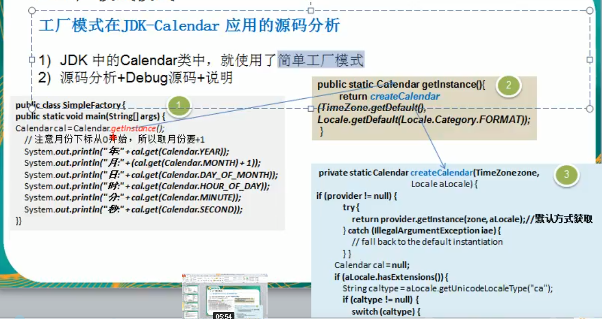

 
 
 # 工厂模式
  
  ### JDK-Calendar的源码分析
  
  1. JDK中的calendar类中,就使用了简单的工厂模式
  
  2. 源码分析+Debug源码+说明
  
如下图



 
```java
package com.atguigu.factory.JDK;

import java.util.Calendar;

public class Factory {
    public static void main(String[] args) {
        // getInstance 是Calendar 静态方法
        Calendar cal = Calendar.getInstance();
        // 注意月份下标从0开始,所以要取月份要+1
        System.out.println("年:"+cal.get(Calendar.YEAR));
        System.out.println("月:"+cal.get(Calendar.MONTH)+1);
        System.out.println("日:"+cal.get(Calendar.DAY_OF_MONTH));
        System.out.println("时:"+cal.get(Calendar.HOUR_OF_DAY));
        System.out.println("分:"+cal.get(Calendar.MINUTE));
        System.out.println("秒:"+cal.get(Calendar.SECOND));
    }
}

```
getInstance里面
```java
/**
 * Gets a calendar using the default time zone and locale. The
 * <code>Calendar</code> returned is based on the current time
 * in the default time zone with the default
 * {@link Locale.Category#FORMAT FORMAT} locale.
 *
 * @return a Calendar.
 */
public static Calendar getInstance()
{
    return createCalendar(TimeZone.getDefault(), Locale.getDefault(Locale.Category.FORMAT));
}
```
再往里走 createCalendar
```java
private static Calendar createCalendar(TimeZone zone,
                                           Locale aLocale)
    // 这个地方 根据 在创建的时候 传入的值(TimeZone Locale)的不同 来决定
    {
        CalendarProvider provider =
            LocaleProviderAdapter.getAdapter(CalendarProvider.class, aLocale)
                                 .getCalendarProvider();
        if (provider != null) {
            try {
                return provider.getInstance(zone, aLocale);
            } catch (IllegalArgumentException iae) {
                // fall back to the default instantiation
            }
        }

        Calendar cal = null;

        if (aLocale.hasExtensions()) {
            String caltype = aLocale.getUnicodeLocaleType("ca");
            if (caltype != null) {
                switch (caltype) {
                case "buddhist":
                // 这里你看吧,他判断了,他判断了
                // 根据不同的情况,来调用不同的方法
                cal = new BuddhistCalendar(zone, aLocale);
                    break;
                case "japanese":
                // 返回对应的实例
                    cal = new JapaneseImperialCalendar(zone, aLocale);
                    break;
                case "gregory":
                // 有感兴趣的同学可以再往里面追一下源码
                    cal = new GregorianCalendar(zone, aLocale);
                    break;
                }
            }
        }
        if (cal == null) {
            // If no known calendar type is explicitly specified,
            // perform the traditional way to create a Calendar:
            // create a BuddhistCalendar for th_TH locale,
            // a JapaneseImperialCalendar for ja_JP_JP locale, or
            // a GregorianCalendar for any other locales.
            // NOTE: The language, country and variant strings are interned.
            if (aLocale.getLanguage() == "th" && aLocale.getCountry() == "TH") {
                cal = new BuddhistCalendar(zone, aLocale);
            } else if (aLocale.getVariant() == "JP" && aLocale.getLanguage() == "ja"
                       && aLocale.getCountry() == "JP") {
                cal = new JapaneseImperialCalendar(zone, aLocale);
            } else {
                cal = new GregorianCalendar(zone, aLocale);
            }
        }
        return cal;
    }
```
 

# 工厂模式小结

1. 工厂模式的意义
将实例化对象代码提取出来,放到一个类中统一管理和维护,达到和主项目的依赖关系的解耦.从而提高项目的扩展和维护性

2. 三种工厂模式(简单工厂模式,工厂方法模式,抽象工厂模式)

3. 设计模式的 __依赖抽象__ 原则

- 创建对象实例的时候,不要直接new类,而是把这个new类的动作放在一个工厂的方法中,并返回. 也有的书上说,变量不要直接持有具体类的引用
- 不要让类继承具体类,而是继承抽象类或者实现interface(接口)
- 不要覆盖基类中已经实现的方法

 
 
 
 
 
 
 
 
 
 
 
 
 