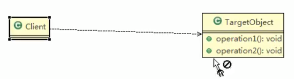
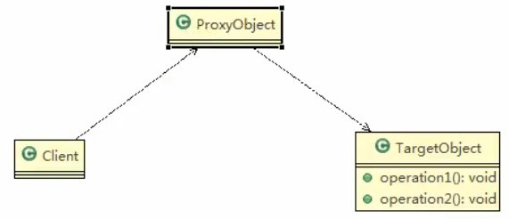

## 代理模式(Proxy)

1. 代理模式: 为一个对象**提供一个替身**,以控制对这个对象的访问. 即: 通过代理对象访问目标对象.这样做的**好处是**: 可以在目标对象实现的基础上,增强额外的功能操作,即:扩展目标对象的功能.
2. 被代理的对象可以是**远程对象**,**创建开销大的对象**或者**需要安全控制的对象**
3. 代理模式有不同的形式,主要有三种,**静态代理**,**动态代理**和**Cglib代理**(可以在内存动态的创建对象,而不需要实现接口,)
4. 上图

>Cglib代理也可以认为是动态代理
>

有些情况,这个TargetObject我不希望直接被调用到,比如有权限控制,或者安全,亦或者性能考虑

# 万能实际模式:加一层
 

 
 
 
 
 
 
 
 
 
 
 
 
 
 
 
 
 
 
 
 
 
 
 
 
 
 
 
 
 

 
 
 
 
 
 
 
 
 
 
 
 
 
 
 
 
 
 
 
 
 
 
 
 
 
 
 
 
 
 
 
 
 
 