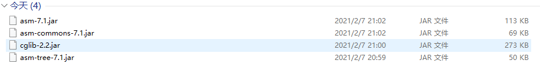
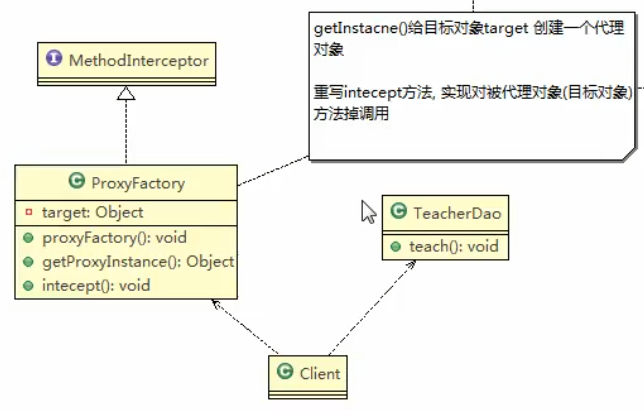

# Cglib代理
## Cglib

CGLib (Code Generation Library) 是一个强大的,高性能,高质量的Code生成类库。它可以在运行期扩展Java类与实现Java接口。

Hibernate用它来实现PO字节码的动态生成。CGLib 比 Java 的 java.lang.reflect.Proxy 类更强的在于它不仅可以接管接口类的方法，还可以接管普通类的方法。


CGLib 的底层是Java字节码操作框架 —— [ASM](http://www.oschina.net/p/asm)。

查看 cglib 的 [JavaDoc](http://cglib.sourceforge.net/apidocs/index.html) 文档。


##基本介绍
 
1. 静态代理和JDK代理模式都要求目标对象是实现一个接口,但是有时候目标对象只是一个单独的对象,并没有实现任何接口,这个时候可使用目标对象子类来实现代理,这就是Cglib代理
2. Cglib代理也叫做**子类代理**,她是在内存中 构建一个子类对象从而实现对目标对象功能扩展,有些书也将**Cglib代理归属到动态代理中**.
3. Cglib是一个强大的高性能代码生成包,他可以运行期扩展java类与实现java接口.它广泛的被许多AOP的框架使用,例如SpringAOP,实现方法拦截
4. 在AOP编程中如何选择代理模式:
    1. 目标对象需要实现接口,用**JDK代理**
    2. 目标对象不需要实现接口,用**Cglib代理**
5. Cglib包的底层是通过使用字节码处理框架[ASM](https://www.oschina.net/p/asm?hmsr=aladdin1e1)来转换字节码并生成新的类

    
>
>被代理对象要是没有实现接口,这种情况下,我们也希望能够代理他
>
>言而简直: jdk代理是用实现接口的方式,cglib是通过继承的方式 - (bili弹幕)
>
 
 ## Cglib代理
 ### Cglibdialing模式实现步骤
 
 1. 需要引入cglib的jar文件
  

 
 2. 在内存中动态构建子类,注意代理的类不能为`final`,否则报错`java.lang.illegalArgumentException`:
 
 3. 目标对象的方法如果为final/static,那么就不会被拦截,即不会执行目标对象额外的业务方法.
 
 ## 类图
 
 
  
 
 类图解析
 
 > 这个代理中 
> getInstance()给目标对象target创建一个代理对象
>
>重写intecept方法,实现对被代理对象(目标对象)方法的调用
>
 
 
 ## 代码实战
> asm-7.1.jar
>
>asm-commons-7.1.jar
>
>asm-tree-7.1.jar
>
>cglib-2.2.jar

 通过[mvn](https://mvnrepository.com/)仓库,下载依赖jar包
 
 ## 被代理
 
```java
package com.atguigu.proxy.cglib;


public class TeacherDao {
    public void teach() {
        System.out.println("我是 cglib 代理, 不需要实现接口");
        System.out.println("老师授课中...");
    }
}

```
 
 
 ## 敲黑板
 
 
 
  
 ```java
package com.atguigu.proxy.cglib;

import net.sf.cglib.proxy.Enhancer;
import net.sf.cglib.proxy.MethodInterceptor;
import net.sf.cglib.proxy.MethodProxy;

import java.lang.reflect.Method;


public class ProxyFactory implements MethodInterceptor {
    /**
     * 维护一个目标对象
     */
    private Object target;


    /**
     * 构造器,传入一个倍代理的对象
     * @param target
     */
    public ProxyFactory(Object target) {
        this.target = target;
    }

    /**
     * 返回一个代理对象,是target对象的代理对象
     * @return
     */
    public Object getProxyInstance() {
        // `1. 创建工具类
        Enhancer enhancer = new Enhancer();
        // 2. 设置父类
        enhancer.setSuperclass(target.getClass());
        ///3. 设置回调函数
        enhancer.setCallback(this);
        // 4. 创建子类对象及代理对象
        return enhancer.create();
        // 这个里面和我们的java的底层有一些关系
        // 我们这里是代理模式,需要再说就讲到java底层了
        // 这里就记住我们要返回一个目标对象的代理对象就可以了
    }

    /**
     * 重写Intercept方法,这里面会调用目标对象的方法
     * @param o
     * @param method
     * @param args
     * @param methodProxy
     * @return
     * @throws Throwable
     */
    @Override
    public Object intercept(Object o, Method method, Object[] args, MethodProxy methodProxy) throws Throwable {
        // 这个方法里面将会实现对我们被代理(目标方法)的调用
        System.out.println("Cglib代理模式~~开始");
        Object returnVal = method.invoke(target, args);
        System.out.println("Cglib代理~~提交~~");
        return returnVal;
    }

    /*
    * 很绕吧,也是就是你调用这个 getProxyInstance() 方法的时候,然后在你调用方法的时候
    * 会触发intercept()这个方法,儿这个方法的里面就会去调用目标对象的某一个方法
    * 完事儿,其实和其那面的模式像,只是他不用实现这个接口了,而被代理的类也不需要实现接口
    * */
}

```
 
 
 
 ## 客户端
 
 
 
  
 ```java
package com.atguigu.proxy.cglib;


public class Client {
    public static void main(String[] args) {
        System.out.println("-------------");
        // 创建目标对象
        TeacherDao target = new TeacherDao();
        // 获取代理对象,并且将目标对象传递给代理对象
        // 转换类型还要
        TeacherDao proxyInstance = (TeacherDao) new ProxyFactory(target).getProxyInstance();
        // 执行代理对象的方法,触发intercept方法,从而实现对目标对象的调用
        proxyInstance.teach();

    }
}
```
 
 加一个返回值
 
 
 ```java
package com.atguigu.proxy.cglib;


public class TeacherDao {
    public String teach() {
        System.out.println("我是 cglib 代理, 不需要实现接口");
        System.out.println("老师授课中...");
        return "hello";
    }
}
```


```java
package com.atguigu.proxy.cglib;


public class Client {
    public static void main(String[] args) {
        System.out.println("-------------");
        // 创建目标对象
        TeacherDao target = new TeacherDao();
        // 获取代理对象,并且将目标对象传递给代理对象
        // 转换类型还要
        TeacherDao proxyInstance = (TeacherDao) new ProxyFactory(target).getProxyInstance();
        // 执行代理对象的方法,触发intercept方法,从而实现对目标对象的调用
        String res = proxyInstance.teach();
        System.out.println(res);
        /**
         * hello
         * */
    }
}

```
 
 
 
 
 
 
 

