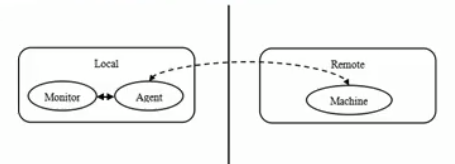

# 代理模式(proxy)的变体

### 几种常见的代理模式介绍-几种变体
 
 
1. 防火墙代理
    内网通过代理穿透防火墙,实现对公网的访问.
2. 缓存代理
    比如: 当请求图片文件等资源的时候,先到缓存代理取,如果取到资源则ok,如果取不到资源,再导公网或者数据库中取,然后缓存
3. 远程代理
    远程对象的本地代表,通过它可以吧远程对象当本地对象来调用.远程代理通过网络和真正的远程对象沟通信息.
         
    

4. 同步代理: 主要使用在多线程编程中,完成多线程间的同步工作

 

>
>这里面说的几种方式,只是代理的具体应用场景
>
>核心还是其那面的那几种,静态代理,动态代理...

 
 
 
 
 
 
 
 
 
 
 
 
 
 
 
 

 
 
 