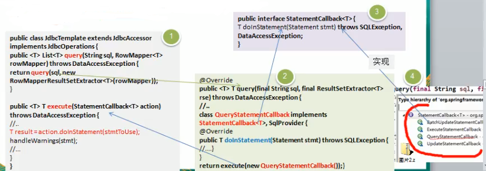
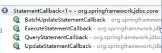

## 命令模式在Spring框架Jdbc Template应用的源码分析

 
 模式角色分析
 
 - `StatementCallback` 接口,类似命令接口
 - class **QueryStatementCallback** implements StatementCallback<T>,SQLProvider,匿名累不累,实现了命令接口,同时也充当命令接受者
 - 命令调用者是JdbcTemplate,其中execute(StatementCallback<T> action)方法中,调用action.doInStatement方法. 不同的实现(StatementCallback接口的对象,对应不同的doInStatement实现逻辑)
 - 另外实现 StatementCallback命令接口的子类还有QueryStatementCallback,
 
 
  
 
 
 >
>
>我们将的模式是一种标准的写法,而在这种实际的源码中,
>
>他可能有用到这种模式,但是它不标准,因为开发他的人,
>
>他在无意间写出的这种模式,他自己不知道啊
>
>这个只是我们后人归纳好的一种一厢情愿
>
>这个设计模式它是一种思想,他只要是满足这种思想就算!
>
>
 
 
 
 
 
 
 
 
 
 
 
 
 
 
 
 
 
 
 
 
 
 
 
 
 
 
 

 
 
 
 
 
 
 
 
 
 
 
 
 
 
 
 
 
 
 
 
 
 
 
 
 
 
 
 
 
 
 
 
 
 
 
  