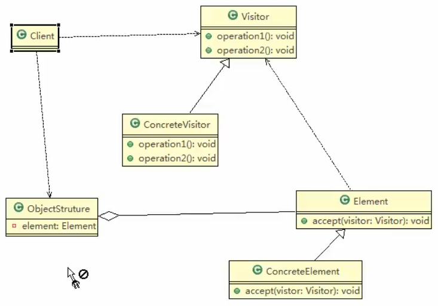

 ## 访问者模式基本介绍
 
 1. 访问者模式(visitor Pattern),封装一些作用域某种数据结构的各元素的操作,它可以在不改变数据结构的前提下定义作用于这些元素的新的操作
 
 2. 主要讲数据结构与数据操作分离,解决 **数据结构**和**操作耦合性**问题
 
 3. 访问者模式的基本工作原理是: 在被访问的类里面加一个对外提供接待访问者的接口
 
 4. 访问者模式主要应用场景是: 需要对一个对象结构中的对象进行很多不同操作(这些操作彼此没有关联),同时需要避免让这些操作污染这些对象的类,可以选用访问者模式解决
 
 
 ### 类图
 
  
  
  
  对原理类图的说明
  
  即(访问者模式的角色及职责)
  
  1. Visitor是抽象访问者,为该对象结构中的`ConcreteElement`的每一个类声明一个`visitor`操作
 
 2. `ConcreteVisitor`: 是一个具体的访问值 实现每个有Visitor声明的操作,是每个操作实现的部分
 
 3. `ObjectStructure`能枚举他的元素,可提供一个高层的接口,用来允许访问者访问他的元素.
 
 4. `Element`定义了一个`accept`方法,可以接收一个访问者对象
 
 5. `ConcreteElement`为具体的元素,实现了`accept`方法
 
 >这个...太抽象了
>
>我完全不知道你在说什么
>
>学设计模式有这个过程,就是有可能吧这个原理类图和文字都说了,你还是不知道老师在说啥
>
>这些地方都太理论化了
 
 
 
 
 
 
 
 
 
 
  